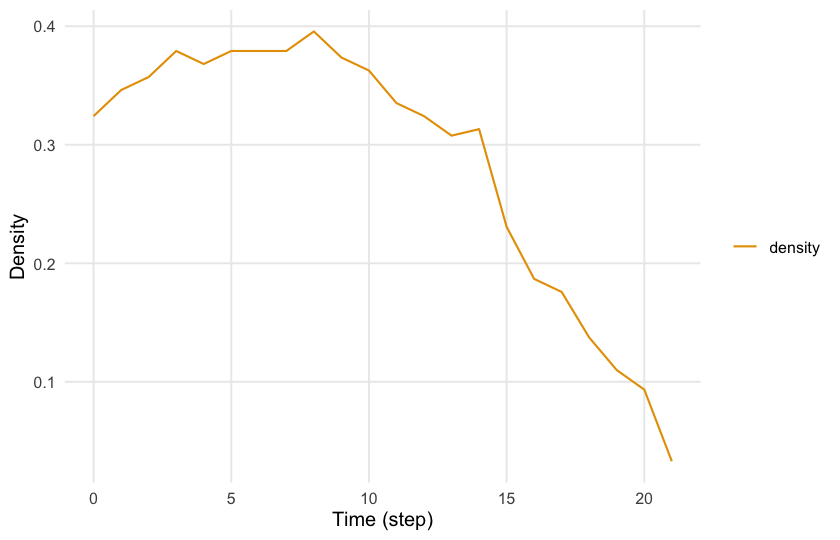
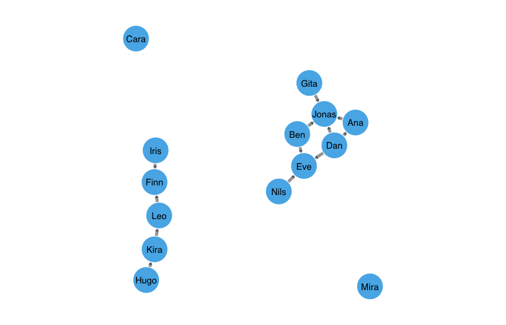
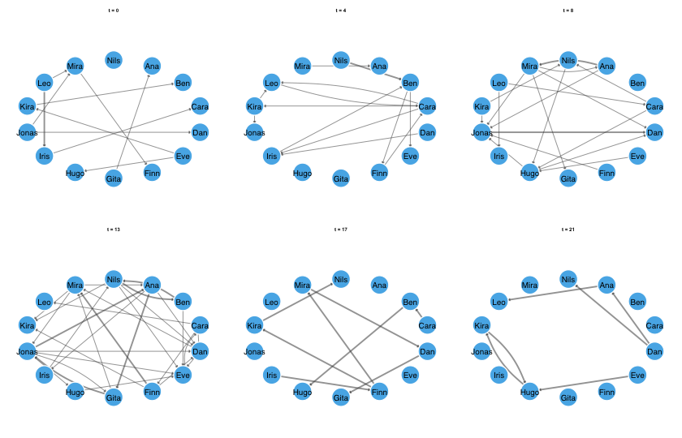
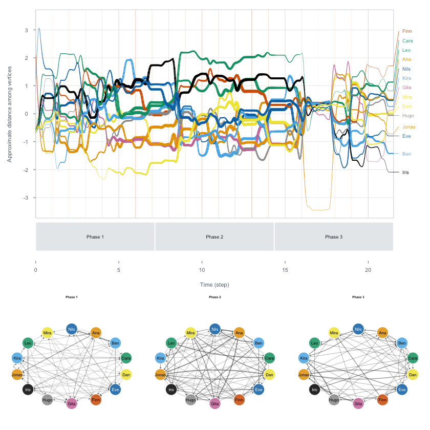

# Dynet

Dynet provides functions for constructing, analysing, and visualising
temporal networks in R. The constructor accepts interval, contact,
threaded, and co-presence data. Analyses include graph-level structure,
vertex-level centrality, relational spell onsets and terminations,
duration, burstiness, group mixing, and time-respecting paths.
Measurement functions return tidy data frames identified by vertex
names, temporal intervals, and measures, as applicable. Core
calculations are implemented in base R.

## Temporal networks

Temporal networks map the dynamics of relationships as they occur over
time, preserving when interactions occur, their duration, and their
temporal order. Two common representations are contact sequences and
interval networks (Holme and Saramäki, 2012). In a contact sequence,
interactions are recorded as timestamps and treated as instantaneous
because their duration is negligible for the analysis. In an interval
network, relationships are represented as relational spells with onset
and termination times. Both representations accommodate repeated
interactions between the same vertices.

In temporal networks, interactions unfold as time progresses, and paths
must follow their chronological order. For example, if A shares
information with B on Monday and B interacts with C on Tuesday, the
information can potentially reach C through B. If B’s interaction with C
occurred on Sunday, that interaction could not carry information
received on Monday. A sequence that follows this temporal order is
called a *time-respecting path*. Unlike static networks, which connect
interactions regardless of when they occurred, temporal networks permit
only paths that follow the order and availability of interactions. [Saqr
and Peeters (2022)](https://doi.org/10.1111/bjet.13187).

Temporal networks also account for when relationships begin and end. A
connection may be active during one period and absent during another,
changing the network’s structure and the paths available between
vertices. Combining all interactions into a static network obscures
these changes: the resulting network may appear densely connected even
when few connections were active at the same time. [Saqr and Peeters
(2022)](https://doi.org/10.1111/bjet.13187).

Temporal networks can be analysed at the graph, vertex, and edge levels.
Graph-level measures, such as density and reciprocity, describe the
overall network structure. Vertex-level measures, such as degree,
closeness, and betweenness, describe the positions of individual
vertices. Edge-level measures describe relationships between pairs of
vertices, including their onset, termination, duration, and recurrence.
Examining these measures over time reveals changes in the network, its
vertices, and their relationships. Time-respecting paths provide
additional information about reachability, the time required to reach
other vertices, and the intermediate vertices involved.

The construction of a temporal network depends on how relationships and
their timing are recorded. Dynet supports four data formats. **Interval
data** explicitly record when each relationship begins and ends; a
duration may be supplied instead of a termination time. **Contact data**
record interactions at specific timestamps, with their duration treated
as negligible. **Threaded data**, such as discussion replies, include
timestamps and discussion identifiers. For these data, the constructor
assigns each reply relationship an onset at its posting time and a
termination at the last recorded event in its discussion. **Co-presence
data** record participation in shared events, such as meetings or
seminars; relationships between participants are derived from their
attendance at the same event.

## Installation

The development version can be installed from the author’s R-universe
repository, which also provides the `cograph` dependency, or from
GitHub. The installation commands are not evaluated when this page is
rendered.

``` r
install.packages("Dynet",
                 repos = c("https://mohsaqr.r-universe.dev",
                           "https://cloud.r-project.org"))

# or from GitHub
remotes::install_github("mohsaqr/Dynet")
```

## Data

The examples use bundled datasets in tidy format. `school_contacts` is a
simulated interval dataset containing 240 face-to-face contacts among
fourteen students over approximately 21.5 arbitrary time units.
`forum_posts` contains 241 simulated posts by twenty participants over
eight weeks; `forum_people` supplies participant attributes, including
role. `seminar_attendance` records simulated attendance at weekly
seminars. The package also includes `mooc_posts`, containing 2,529 posts
from the MOOC forum analysed by Saqr (2024), and `thought_chains`, a
synthetic reply dataset based on the study by Saqr, López-Pernas, and
Törmänen (2026).

``` r
library(Dynet)
head(school_contacts)
#>    from   to start  end
#> 1 Jonas  Dan  0.00 1.10
#> 2  Gita  Ana  0.14 0.98
#> 3   Leo Mira  0.15 0.42
#> 4   Leo Iris  0.15 0.96
#> 5  Kira  Ben  0.33 0.69
#> 6   Leo Iris  0.38 0.50
```

In `school_contacts`, `from` and `to` identify the relational endpoints,
while `start` and `end` specify contact onset and termination.

## Building a network

`dynet()` recognises common column names automatically, using
case-insensitive matching. Relational endpoints may be named
`from`/`to`, `sender`/`receiver`, or `source`/`target`; interval
boundaries may be named `start`/`end` or `onset`/`terminus`. For contact
data, recognised timestamp names include `time`, `timestamp`, `date`,
and `datetime`. Explicit column specification is needed only when names
do not match recognised aliases or when their intended interpretation is
ambiguous. The `format` argument can explicitly select the input format;
for example, `format = "contact"` specifies instantaneous interactions.

`dynet()` represents relational data in tidy format, retaining the
endpoints and recording the onset, termination, duration, and
multiplicity of each relational spell. For interval data, termination is
supplied through `end` or calculated as `start + duration`. Duration is
recorded as `duration = end - start`. Instantaneous contacts have equal
onset and termination times and therefore zero duration. Multiplicity is
recorded in `weight`, which defaults to 1 when no multiplicity variable
is supplied or recognised.

The following example constructs a temporal network from
`school_contacts`, a simulated dataset of 240 contacts among fourteen
students. The supplied variables `from` and `to` identify the relational
endpoints, while `start` and `end` record contact onset and termination
in arbitrary time units. These names are recognised automatically, so no
column arguments are required.

``` r
library(Dynet)
dn <- dynet(school_contacts)
dn
#> # Temporal network (interval format, directed) | a cograph netobject
#> # 14 vertices | 240 edge spells | 110 distinct pairs
#> # observed from 0 to 21.52 step, binned every 1
#> 
#>   from   to start  end duration weight
#>  Jonas  Dan  0.00 1.10     1.10      1
#>   Gita  Ana  0.14 0.98     0.84      1
#>    Leo Mira  0.15 0.42     0.27      1
#>    Leo Iris  0.15 0.96     0.81      1
#>   Kira  Ben  0.33 0.69     0.36      1
#>    Leo Iris  0.38 0.50     0.12      1
#> # 234 more spells. summary() describes the network; plot() draws it.
```

`summary()` describes the network over its observation period, including
the number of vertices, relational spells, and distinct pairs of
connected vertices. It also reports mean snapshot density: the average
proportion of possible vertex pairs connected within each measurement
interval. This distinguishes the relationships accumulated over the full
observation period from the connectivity observed within individual
intervals.

``` r
summary(dn)
#>                 property        value
#> 1                 format     interval
#> 2               directed          yes
#> 3               vertices           14
#> 4            edge spells          240
#> 5         distinct pairs          110
#> 6              time unit         step
#> 7          observed from            0
#> 8            observed to        21.52
#> 9                   span        21.52
#> 10             bin width            1
#> 11             time bins           22
#> 12 mean snapshot density       0.0829
#> 13      temporal density not computed
#> 14              sessions         none
#> 15     vertex attributes         none
```

The same constructor can represent timestamped replies as either
instantaneous contacts or relationships that remain active within a
discussion. In the first call, `time` explicitly identifies the
timestamp column, and the constructor infers contact data. In the
second, `thread` selects threaded construction: each reply relationship
remains active until the last recorded event in its discussion. The
`nodes` argument supplies participant attributes from `forum_people`.

``` r
contacts <- dynet(forum_posts, time = "timestamp")
forum <- dynet(forum_posts, thread = "thread", nodes = forum_people)
```

Co-presence data record participation in shared events rather than
direct interactions between participants. The `actor` argument
identifies the participant column, and `group` identifies the shared
event. The constructor derives an undirected relationship between each
pair of participants attending the same event, with onset and
termination determined by the event’s recorded temporal extent.

``` r
seminars <- dynet(seminar_attendance, actor = "student", group = "seminar")
```

These ties represent shared attendance; they do not establish that
participants interacted directly.

Dynet accepts numeric times, dates, and date-times. Numeric times retain
their supplied scale. Dates and date-times are converted to elapsed
time, with the unit selected automatically when `time_unit = "auto"`,
the default. The unit can also be specified explicitly through
`time_unit`, for example as `"hours"` or `"days"`. In the threaded
example, time is expressed in days.

The timeline plot displays when each pair of vertices is connected
during the observation period. For interval data, colour indicates the
proportion of each time bin during which at least one relational spell
is active. Overlapping spells between the same endpoints are counted
once, so the plot represents the duration of connectivity rather than
the number of interactions.

``` r
plot(dn)
```


## Measuring in windows

Window-based analyses use four arguments to define when measurements are
taken and which interactions they include. `start` and `end` delimit the
measurement period. `step` specifies the interval between measurements,
while `window` specifies the duration covered by each measurement.
Setting `window` equal to `step` produces non-overlapping intervals; a
larger `window` produces overlapping intervals. For snapshot measures,
`window = 0` evaluates the network at individual time points.

`metrics()` computes graph-level measures within the specified temporal
windows. These measures describe the structure of the network as a
whole. For example, density is the proportion of possible ties present
within a window, while reciprocity describes the extent to which
directed ties are reciprocated. Other measures characterise connected
components, local configurations of ties, and the distribution of
centrality across vertices.

The following call computes density at one-unit intervals, using a
seven-unit window for each measurement. Because `window` exceeds `step`,
successive measurements include overlapping periods.

``` r
density <- metrics(dn, measure = "density", step = 1, window = 7)
density
#> # Density (graph-level)
#> # 22 time points, step 1, window 7 (rolling) | time in step
#>  time measure     value
#>     0 density 0.3241758
#>     1 density 0.3461538
#>     2 density 0.3571429
#>     3 density 0.3791209
#>     4 density 0.3681319
#>     5 density 0.3791209
#>     6 density 0.3791209
#>     7 density 0.3791209
#>     8 density 0.3956044
#>     9 density 0.3736264
#>    10 density 0.3626374
#>    11 density 0.3351648
#> # 10 more rows. summary() aggregates them; plot() draws them.
```

The result is a tidy data frame identifying the measurement time,
measure, and value. Multiple statistics can be requested through
`measure`; their results are distinguished by the `measure` column.
Available measures include density, reciprocity, transitivity, dyad and
triad censuses, component counts, centralisation, and Krackhardt’s
indices. Their definitions and calculation conventions are documented in
`?metrics`.

`summary()` summarises the resulting time series, including its mean,
dispersion, range, and peak time. `plot()` displays how the measure
changes over the observation period.

``` r
summary(density)
#>   measure  n     mean       sd        min       max peak_time
#> 1 density 22 0.285964 0.111584 0.03296703 0.3956044         8
plot(density)
```



## Vertex measures

`centrality_series()` computes measures that describe how a vertex is
connected to the rest of the network. Each centrality captures a
different aspect of structural position. **Degree** counts direct
connections, indicating the extent of a vertex’s immediate
neighbourhood. In directed networks, indegree counts incoming
connections and outdegree counts outgoing connections. **Strength**
accounts for the weights of those connections, distinguishing the number
of connected neighbours from the multiplicity of their relationships.

**Closeness centrality** is based on the shortest-path distances from a
vertex to other vertices. Higher closeness indicates shorter average
distances, meaning that fewer steps are required to reach other
vertices. In a directed network, these paths follow tie direction.

**Betweenness** measures the extent to which a vertex lies on shortest
paths between other vertices. It therefore identifies potential
intermediary positions, although occupying such a position does not
establish that information actually passed through that vertex.

Other measures incorporate the positions of a vertex’s neighbours.
**Eigenvector centrality** assigns higher scores to vertices connected
to other highly central vertices. **PageRank** and **hub and authority
scores** also use neighbouring vertices’ scores but apply different
rules for directed relationships. **Prestige** measures characterise a
vertex through its incoming connections, including, for some variants,
the vertices that can reach it indirectly. The choice of measure should
therefore follow the substantive question and the meaning assigned to
tie direction.

By default, these measures are calculated within successive temporal
windows. This produces a centrality trajectory for each vertex, showing
when it becomes more or less connected, accessible, or prominent as an
intermediary. The following call computes degree using the default
measurement intervals:

``` r
degree <- centrality_series(dn, measure = "degree")
degree
#> # Degree (node-level)
#> # 14 vertices | 22 time points, 1 per bin | time in step
#>  time  node measure value
#>     0   Ana  degree     1
#>     0   Ben  degree     1
#>     0  Cara  degree     1
#>     0   Dan  degree     1
#>     0   Eve  degree     2
#>     0  Finn  degree     1
#>     0  Gita  degree     1
#>     0  Hugo  degree     1
#>     0  Iris  degree     2
#>     0 Jonas  degree     2
#>     0  Kira  degree     2
#>     0   Leo  degree     2
#> # 296 more rows. summary() aggregates them; plot() draws them.
```

The result is a tidy data frame containing vertex names, measurement
times, measures, and values. `summary()` summarises each trajectory;
`peak_time` identifies when the corresponding centrality attained its
maximum.

``` r
summary(degree)
#>     node measure  n     mean       sd min max peak_time
#> 1    Ana  degree 22 2.181818 2.015095   0   7         6
#> 2    Ben  degree 22 2.000000 1.234427   0   4         4
#> 3   Cara  degree 22 2.227273 1.342770   0   5         4
#> 4    Dan  degree 22 2.090909 1.444500   1   5        13
#> 5    Eve  degree 22 2.272727 2.051290   0   8        14
#> 6   Finn  degree 22 2.000000 1.661898   0   6        12
#> 7   Gita  degree 22 1.727273 1.777688   0   7         6
#> 8   Hugo  degree 22 2.318182 1.861550   0   6         6
#> 9   Iris  degree 22 1.772727 1.066004   0   4        11
#> 10 Jonas  degree 22 2.863636 2.076982   0   7        13
#> 11  Kira  degree 22 2.636364 1.255292   1   6         6
#> 12   Leo  degree 22 1.636364 1.432462   0   5         6
#> 13  Mira  degree 22 2.272727 1.695423   0   6        13
#> 14  Nils  degree 22 2.181818 2.174229   0   7        14
```

`path_centrality()` instead computes centrality from time-respecting
paths across the specified observation period. **Temporal closeness**
measures how quickly a vertex can reach other reachable vertices, using
the inverse of their mean arrival latency. **Temporal betweenness**
measures a vertex’s contribution as an intermediary on optimal temporal
paths between other vertices. These measures account for the order and
availability of interactions, whereas window-based centralities describe
the connections present within each window.

``` r
closeness <- path_centrality(dn, measure = "closeness")
closeness
#> # Closeness (node-level)
#> # 14 vertices | time in step
#> # computed on time-respecting paths across the whole window
#>   node   measure     value
#>    Ana closeness 0.1313662
#>    Ben closeness 0.1815896
#>   Cara closeness 0.1931075
#>    Dan closeness 0.2230994
#>    Eve closeness 0.2616221
#>   Finn closeness 0.1644945
#>   Gita closeness 0.1404950
#>   Hugo closeness 0.1878341
#>   Iris closeness 0.2398082
#>  Jonas closeness 0.3674392
#>   Kira closeness 0.2107994
#>    Leo closeness 0.3747478
#> # 2 more rows. summary() aggregates them; plot() draws them.
```

## Time-respecting paths

`paths()` examines how a source vertex can reach other vertices through
a sequence of interactions over time. A path may involve a direct
interaction or several intermediate vertices. Each interaction must
occur when its tie is available, and a vertex cannot pass something
onward before receiving it. Waiting between interactions is permitted:
if A contacts B on Monday and B next contacts C on Wednesday, a path
from A to C can include the intervening wait.

The timing of these interactions determines which path arrives earliest.
Suppose A can contact C directly on Friday, but can reach C through B on
Wednesday. The two-hop path through B arrives earlier than the direct
path. `paths()` therefore minimises arrival time first, rather than the
number of hops. If several paths arrive equally early, it retains those
with the fewest hops.

The following call searches from `Ana`, beginning at the start of the
observation period in this example:

``` r
from_ana <- paths(dn, from = "Ana")
from_ana
#> # Time-respecting paths from 'Ana', from t = 0
#> # reaches 13 of 13 other vertices | time in step
#>   node reachable arrival_time attained latency n_hops n_paths
#>    Ana      TRUE         0.00     TRUE    0.00      0       1
#>    Ben      TRUE         9.59     TRUE    9.59      3       3
#>   Cara      TRUE         6.67     TRUE    6.67      1       1
#>    Dan      TRUE         7.98     TRUE    7.98      4       1
#>    Eve      TRUE        11.66     TRUE   11.66      4       3
#>   Finn      TRUE         6.96     TRUE    6.96      2       1
#>   Gita      TRUE         6.36     TRUE    6.36      2       1
#>   Hugo      TRUE         7.98     TRUE    7.98      3       1
#>   Iris      TRUE        10.00     TRUE   10.00      3       1
#>  Jonas      TRUE         2.12     TRUE    2.12      1       1
#>   Kira      TRUE         6.12     TRUE    6.12      2       2
#>    Leo      TRUE         9.65     TRUE    9.65      3       1
#> # 2 more rows. summary() aggregates them; plot() draws the tree.
```

The result describes the optimal paths to each destination.
`arrival_time` records the earliest time at which the destination can be
reached. `latency` is the elapsed time between the search origin and
arrival, including any waiting for subsequent interactions. `n_hops`
records how many ties the path traverses, while `n_paths` records how
many distinct paths achieve both the earliest arrival and the minimum
hop count. A destination with `n_paths = 0` is unreachable under the
specified temporal constraints.

By default, traversing a tie takes zero time, although a path may still
require waiting for a later interaction. A positive `traversal_time`
assigns a duration to each traversal, expressed in the network’s time
unit. This is an analytical assumption that affects arrival times and
potentially reachability; it should be selected according to the process
being represented.

``` r
summary(from_ana)
#>          property   value
#> 1          source     Ana
#> 2       direction forward
#> 3       reachable      13
#> 4 reachable share       1
#> 5  median latency    7.51
#> 6     max latency   11.66
#> 7     median hops       2
#> 8        max hops       4
```

The summary describes the reachable set and its path characteristics.
These results concern possible routes through the recorded
relationships. They do not establish that information, resources, or
other content actually travelled along those routes.

Reachability also depends on when the search begins. Starting later
excludes earlier contacts that may have connected the source to other
vertices. The following call starts at time 18:

``` r
from_ana_late <- paths(dn, from = "Ana", start = 18)
summary(from_ana_late)
#>          property   value
#> 1          source     Ana
#> 2       direction forward
#> 3       reachable       5
#> 4 reachable share   0.385
#> 5  median latency    2.43
#> 6     max latency    2.68
#> 7     median hops       2
#> 8        max hops       3
```

Comparing the two results shows how the timing of participation changes
the destinations Ana can reach and the routes available to her. This
distinction is lost in a static network, where all recorded connections
are available without regard to their timing.

`pathways()` provides the corresponding vertex sequences, such as A → B
→ C, and counts the optimal paths following each sequence. The path plot
displays the routes and their temporal progression.

``` r
pathways(dn, from = "Ana")
#> # Time-respecting pathways (5 distinct routes)
#> # 7 optimal routes counted
#>                               route endpoint count     share n_hops
#>  Ana -> Jonas -> Kira -> Ben -> Eve      Eve     3 0.4285714      4
#>                 Ana -> Mira -> Gita     Gita     1 0.1428571      2
#>         Ana -> Cara -> Finn -> Iris     Iris     1 0.1428571      3
#>          Ana -> Cara -> Finn -> Leo      Leo     1 0.1428571      3
#>  Ana -> Cara -> Nils -> Hugo -> Dan      Dan     1 0.1428571      4
#>  arrival_time
#>         11.66
#>          6.36
#>         10.00
#>          9.65
#>          7.98
plot(from_ana)
```


## Temporal reachability

`reachability()` summarises which vertices can be connected through
time-respecting paths. **Forward reachability** identifies the vertices
that a source can reach during the specified observation period.
**Backward reachability** identifies the vertices from which a focal
vertex can be reached by the end of that period. These sets need not be
identical: the order of interactions may permit a path from A to B
without permitting a return path from B to A.

The `direction` argument selects `"forward"`, `"backward"`, or `"both"`.
Setting `measure = "reach_count"` returns the number of reachable
vertices other than the focal vertex. Setting `measure = "reach"`
expresses this count as a proportion of all other vertices in the
network.

``` r
reach <- reachability(
  dn,
  direction = "both",
  measure = c("reach", "reach_count")
)
reach
#> # Reachability (node-level)
#> # 14 vertices | time in step
#> # measures: forward_reach, forward_reach_count, backward_reach, backward_reach_count
#> # count and share of other vertices joined by a time-respecting path
#>   node       measure value
#>    Ana forward_reach     1
#>    Ben forward_reach     1
#>   Cara forward_reach     1
#>    Dan forward_reach     1
#>    Eve forward_reach     1
#>   Finn forward_reach     1
#>   Gita forward_reach     1
#>   Hugo forward_reach     1
#>   Iris forward_reach     1
#>  Jonas forward_reach     1
#>   Kira forward_reach     1
#>    Leo forward_reach     1
#> # 44 more rows. summary() aggregates them; plot() draws them.
```

A forward reach of 1 indicates that the source can reach every other
vertex within the specified period. A value of 0 indicates that it
cannot reach any other vertex. Intermediate values describe partial
reachability. These measures include indirect connections through
intermediate vertices, so they capture more than the immediate
neighbourhood measured by degree.

Reachability describes whether a temporal connection is possible; it
does not describe how quickly the destination can be reached. Two
vertices can therefore have equal reachability but different temporal
closeness because their arrival latencies differ. Examining reachability
alongside path timing distinguishes the extent of possible contact from
the time required to achieve it.

## Tie dynamics and duration

Relational spells have an onset, a termination, and a duration.
Examining these properties describes when relationships become active,
when they cease, and how long they persist. In datasets with repeated
interactions, several spells may connect the same pair of vertices.
Counts of spell onsets and terminations therefore differ from counts of
distinct connected pairs.

`events()` summarises spell onsets and terminations within temporal
windows through the measures `"formation"` and `"dissolution"`, which
are requested by default. The following call uses the network’s default
measurement intervals:

``` r
turnover <- events(dn)
summary(turnover)
#>       measure  n     mean       sd min max peak_time
#> 1 dissolution 22 10.90909 6.132731   3  27        14
#> 2   formation 22 10.90909 6.689787   0  29        13
```

These counts describe changes in relational activity. A spell onset does
not necessarily introduce a previously unconnected pair: it may
represent another interaction between endpoints that already have an
active spell. Similarly, the termination of one spell does not
necessarily disconnect its endpoints if another spell remains active.

`durations()` summarises the duration of relationships. By default,
results are grouped by endpoint pair. Setting `measure = "mean"` returns
the mean spell duration for each pair:

``` r
lengths <- durations(dn, measure = "mean")
lengths
#> # Relationship duration (edge-level)
#> # time in step
#> # durations in step
#>  from    to measure     value
#>   Ana  Cara    mean 0.1000000
#>   Ana   Dan    mean 0.3400000
#>   Ana  Gita    mean 0.4220000
#>   Ana  Iris    mean 0.5000000
#>   Ana Jonas    mean 0.5850000
#>   Ana  Kira    mean 0.1100000
#>   Ana   Leo    mean 1.1900000
#>   Ana  Mira    mean 0.3466667
#>   Ben   Eve    mean 0.6100000
#>   Ben  Finn    mean 0.2300000
#>   Ben  Gita    mean 0.3400000
#>   Ben  Hugo    mean 0.1475000
#> # 98 more rows. summary() aggregates them; plot() draws them.
```

Different duration summaries answer different questions. **Summed
duration** adds the durations of individual spells, including
overlapping spells separately. **Union duration** measures the total
time during which at least one spell connects the endpoints, counting
overlap once. For example, if two spells connect the same pair during
hours 1–3 and 2–4, their summed duration is four hours, while their
union duration is three hours. Mean duration describes the average
length of an individual spell.

The `unit` argument determines whether durations are summarised for
endpoint pairs, individual spells, vertex activity, or ties incident to
a vertex. Vertex activity describes when a vertex is present or eligible
to participate; incident-tie duration describes its recorded
relationships. These quantities should be interpreted separately.

## Burstiness and memory

`burstiness()` describes how interactions are distributed over time
using the intervals between successive events. Regular activity produces
intervals of similar length, whereas clustered activity produces short
intervals within bursts and longer intervals between them. The
burstiness coefficient summarises this variation: −1 corresponds to
equal intervals, 0 to the exponential inter-event distribution
associated with a Poisson process, and values approaching 1 indicate
increasingly heterogeneous intervals (Goh and Barabási, 2008).

``` r
rhythm <- burstiness(dn)
summary(rhythm)
#>     node    measure n        mean sd         min         max
#> 1    Ana burstiness 1  0.24575324 NA  0.24575324  0.24575324
#> 2    Ana     events 1 36.00000000 NA 36.00000000 36.00000000
#> 3    Ana     memory 1 -0.03128243 NA -0.03128243 -0.03128243
#> 4    Ben burstiness 1  0.03288611 NA  0.03288611  0.03288611
#> 5    Ben     events 1 34.00000000 NA 34.00000000 34.00000000
#> 6    Ben     memory 1 -0.19926343 NA -0.19926343 -0.19926343
#> 7   Cara burstiness 1 -0.05610924 NA -0.05610924 -0.05610924
#> 8   Cara     events 1 35.00000000 NA 35.00000000 35.00000000
#> 9   Cara     memory 1  0.07458054 NA  0.07458054  0.07458054
#> 10   Dan burstiness 1 -0.05061772 NA -0.05061772 -0.05061772
#> 11   Dan     events 1 35.00000000 NA 35.00000000 35.00000000
#> 12   Dan     memory 1  0.21654310 NA  0.21654310  0.21654310
#> 13   Eve burstiness 1  0.09217906 NA  0.09217906  0.09217906
#> 14   Eve     events 1 34.00000000 NA 34.00000000 34.00000000
#> 15   Eve     memory 1  0.25882509 NA  0.25882509  0.25882509
#> 16  Finn burstiness 1  0.02938507 NA  0.02938507  0.02938507
#> 17  Finn     events 1 29.00000000 NA 29.00000000 29.00000000
#> 18  Finn     memory 1 -0.22653754 NA -0.22653754 -0.22653754
#> 19  Gita burstiness 1  0.06104200 NA  0.06104200  0.06104200
#> 20  Gita     events 1 31.00000000 NA 31.00000000 31.00000000
#> 21  Gita     memory 1  0.21165690 NA  0.21165690  0.21165690
#> 22  Hugo burstiness 1  0.09885443 NA  0.09885443  0.09885443
#> 23  Hugo     events 1 34.00000000 NA 34.00000000 34.00000000
#> 24  Hugo     memory 1  0.11283700 NA  0.11283700  0.11283700
#> 25  Iris burstiness 1 -0.05968068 NA -0.05968068 -0.05968068
#> 26  Iris     events 1 30.00000000 NA 30.00000000 30.00000000
#> 27  Iris     memory 1 -0.09356972 NA -0.09356972 -0.09356972
#> 28 Jonas burstiness 1 -0.02750549 NA -0.02750549 -0.02750549
#> 29 Jonas     events 1 46.00000000 NA 46.00000000 46.00000000
#> 30 Jonas     memory 1  0.23391957 NA  0.23391957  0.23391957
#> 31  Kira burstiness 1 -0.07048265 NA -0.07048265 -0.07048265
#> 32  Kira     events 1 38.00000000 NA 38.00000000 38.00000000
#> 33  Kira     memory 1 -0.14972726 NA -0.14972726 -0.14972726
#> 34   Leo burstiness 1 -0.01020265 NA -0.01020265 -0.01020265
#> 35   Leo     events 1 28.00000000 NA 28.00000000 28.00000000
#> 36   Leo     memory 1  0.48001912 NA  0.48001912  0.48001912
#> 37  Mira burstiness 1  0.09968547 NA  0.09968547  0.09968547
#> 38  Mira     events 1 36.00000000 NA 36.00000000 36.00000000
#> 39  Mira     memory 1  0.18691159 NA  0.18691159  0.18691159
#> 40  Nils burstiness 1  0.08408761 NA  0.08408761  0.08408761
#> 41  Nils     events 1 34.00000000 NA 34.00000000 34.00000000
#> 42  Nils     memory 1  0.22784733 NA  0.22784733  0.22784733
```

Burstiness and memory describe different properties of event timing.
**Burstiness** measures variation in interval lengths, without
considering their order. **Memory** measures the correlation between
consecutive intervals. Positive memory indicates that short intervals
tend to follow short intervals and long intervals tend to follow long
intervals. Negative memory indicates a tendency for short and long
intervals to alternate. A value near zero indicates little linear
association between successive intervals.

A vertex can therefore exhibit bursty activity without substantial
memory: its inter-event intervals may vary considerably while
consecutive interval lengths remain weakly correlated. Interpreting both
measures helps distinguish variability in activity timing from
dependence between successive intervals.

## Mixing between groups

`mixing()` counts distinct active vertex pairs within and between groups
defined by a vertex attribute. Repeated spells and their weights do not
multiply these binary-dyad counts. The forum network inherits `role`
from `forum_people`. Setting `step = 60`, which exceeds this network’s
observation period, produces a single interval for the comparison.

``` r
mixing(forum, attribute = "role", step = 60)
#> # Mixing by role (graph-level)
#> # 1 time points, 60 per bin | time in days
#> # measures: Facilitator -> Facilitator, Student -> Facilitator, Teacher -> Facilitator, Facilitator -> Student, Student -> Student, Teacher -> Student, Facilitator -> Teacher, Student -> Teacher, Teacher -> Teacher
#> # active binary-dyad counts between vertex groups per time bin
#>  time                    measure value  from_group    to_group
#>     0 Facilitator -> Facilitator     0 Facilitator Facilitator
#>     0     Student -> Facilitator     3     Student Facilitator
#>     0     Teacher -> Facilitator     0     Teacher Facilitator
#>     0     Facilitator -> Student     4 Facilitator     Student
#>     0         Student -> Student   136     Student     Student
#>     0         Teacher -> Student    12     Teacher     Student
#>     0     Facilitator -> Teacher     1 Facilitator     Teacher
#>     0         Student -> Teacher    16     Student     Teacher
#>     0         Teacher -> Teacher     0     Teacher     Teacher
```

## Network aggregation, subsetting, and snapshots

`collapse_network()` summarises a temporal network as a weighted static
network. Each edge represents a pair of vertices connected during the
observation period, and its weight summarises their relational spells
according to the selected rule. This provides an overall description of
relationships while removing their temporal order.

Setting `weight = "union_duration"` assigns each edge the total time
during which at least one spell connects its endpoints. Overlapping
spells are counted once. For example, spells spanning hours 1–3 and 2–4
produce an edge weight of three hours.

``` r
flat <- collapse_network(dn, weight = "union_duration")
flat
#> # Collapsed temporal network | 14 vertices | 110 edges | weight: union_duration
#> # 0 to 21.52 step
#>  from    to binary union_duration total_duration duration_fraction spell_count
#>   Ana  Cara      1           0.10           0.10       0.004646840           1
#>   Ana   Dan      1           1.02           1.02       0.047397770           3
#>   Ana  Gita      1           1.99           2.11       0.092472119           5
#>   Ana  Iris      1           0.50           0.50       0.023234201           1
#>   Ana Jonas      1           2.34           2.34       0.108736059           4
#>   Ana  Kira      1           0.11           0.11       0.005111524           1
#>  weight_sum weighted_duration latest_weight first  last activity.duration
#>           1              0.10             1  6.67  6.77              0.10
#>           3              1.02             1 12.04 20.10              1.02
#>           5              2.11             1  6.57 14.16              1.99
#>           1              0.50             1 13.80 14.30              0.50
#>           4              2.34             1  2.12  9.13              2.34
#>           1              0.11             1 11.60 11.71              0.11
#>  activity.count
#>               1
#>               3
#>               5
#>               1
#>               4
#>               1
```

`induce_subgraph()` selects part of the network for further analysis.
Selection may be based on vertex attributes or structural measures. In
the following example, degree is calculated over the full observation
period, and vertices with degree greater than 16 are retained together
with the relational spells connecting them.

``` r
core <- induce_subgraph(dn, degree > 16)
core
#> # Temporal network (interval format, directed) | a cograph netobject
#> # 5 vertices | 31 edge spells | 14 distinct pairs
#> # observed from 0 to 20.46 step, binned every 1
#> 
#>   from    to start  end duration weight
#>  Jonas   Dan  0.00 1.10     1.10      1
#>    Eve  Kira  0.77 1.42     0.65      1
#>   Kira   Eve  1.95 2.47     0.52      1
#>  Jonas  Kira  2.05 2.09     0.04      1
#>    Dan Jonas  3.14 3.49     0.35      1
#>    Dan   Eve  3.20 3.33     0.13      1
#> # 25 more spells. summary() describes the network; plot() draws it.
```

`snapshots()` extracts connections within specified temporal windows.
The following call returns the connections in the default measurement
window containing time 3:

``` r
snapshots(dn, at = 3)
#> # Snapshot edges | 1 bin | 12 tie rows | time in step
#>    time from    to weight n_spells
#> 1     3  Ana Jonas      1        1
#> 2     3 Kira   Leo      1        1
#> 3     3  Leo  Finn      1        1
#> 4     3 Nils   Eve      1        1
#> 5     3  Ben Jonas      1        1
#> 6     3  Ben   Eve      1        1
#> 7     3  Dan   Ana      1        1
#> 8     3  Dan Jonas      1        1
#> 9     3  Dan   Eve      1        1
#> 10    3 Gita Jonas      1        1
#> # 2 more rows. summary() counts them by bin.
```

A snapshot summarises connectivity within its window; it does not retain
the ordering of interactions within that interval.

## Editing a temporal network

Dynet provides functions for modifying vertices, relational spells, and
observation settings. Each editing function returns a modified network
without changing the input object. This allows alternative network
specifications to be constructed while retaining the original for
comparison.

`add_nodes()` adds vertices and their attributes. `add_ties()` adds
relational spells using their endpoints, onset, and termination. The
following example adds a vertex named `Omar`, then adds a directed
relationship from `Ana` to `Omar`, active from time 4 to time 6:

``` r
dn2 <- add_nodes(dn, data.frame(name = "Omar"))
dn2 <- add_ties(dn2, data.frame(from = "Ana", to = "Omar", start = 4, end = 6))
dn2
#> # Temporal network (interval format, directed) | a cograph netobject
#> # 15 vertices | 241 edge spells | 111 distinct pairs
#> # observed from 0 to 21.52 step, binned every 1
#> 
#>   from   to start  end duration weight
#>  Jonas  Dan  0.00 1.10     1.10      1
#>   Gita  Ana  0.14 0.98     0.84      1
#>    Leo Mira  0.15 0.42     0.27      1
#>    Leo Iris  0.15 0.96     0.81      1
#>   Kira  Ben  0.33 0.69     0.36      1
#>    Leo Iris  0.38 0.50     0.12      1
#> # 235 more spells. summary() describes the network; plot() draws it.
```

Related functions support removal, revision, and relabelling.
`remove_nodes()` and `remove_ties()` remove selected vertices or spells;
`update_nodes()` and `update_ties()` revise their attributes or values;
and `rename_nodes()` changes vertex names while maintaining their
references in the network.

`set_vertex_spells()` specifies periods during which vertices are
present or eligible to participate. `set_observations()` specifies the
periods over which the network is observed. These declarations serve
different purposes: vertex activity constrains participation, whereas
observation periods constrain measurement. Changing observation settings
does not alter the original relational spell endpoints.

## Visualising temporal networks

Temporal network visualisations describe both the structure of
relationships and their development over time. Different views address
different questions: which vertices are connected during a particular
period, how connectivity changes between periods, and when individual
relationships are active.

Setting `type = "network"` displays connections within a selected
measurement window. The `at` argument identifies the time of interest.
Setting `type = "snapshots"` displays several temporal slices using a
shared layout, making changes in connections easier to compare.

``` r
plot(dn, type = "network", at = 3)
```



``` r
plot(dn, type = "snapshots", panels = 6)
#> Drawing 6 of 22 bins, evenly spaced across the window.
```



A timeline places relational activity along a time axis. For interval
data, colour represents the proportion of each time bin during which an
endpoint pair is connected. This view shows periods of activity and
inactivity that may be difficult to distinguish in successive network
diagrams.

``` r
plot(dn, type = "timeline")
```


A proximity timeline follows the changing relationships among vertices.
Network distances are calculated within temporal slices and represented
as positions along a single axis. Lines connect each vertex’s positions
across slices, showing how its proximity to other vertices changes.
Nearby lines indicate shorter network distances in the corresponding
slice; they do not necessarily indicate a direct tie.

``` r
plot(dn, type = "proximity")
```



These views complement one another: network diagrams show connections,
activity timelines show their timing, and proximity timelines summarise
changes in network distances.

## Animating temporal networks

`animate()` displays a sequence of network snapshots over the
observation period. Vertices retain a shared layout across frames,
allowing changes in connections to be followed without changes in
position obscuring the comparison.

The temporal settings follow the same conventions as window-based
measurement. `start` and `end` delimit the period, `step` determines the
time between successive frames, and `window` determines the period
represented in each frame. A positive window displays connections active
within that interval; it does not imply that all displayed connections
were active simultaneously.

The output filename determines the format. GIF output requires the
`gifski` package, while MP4 and WebM output require `av`. The animation
tutorial provides examples of temporal settings, visual options, and
export procedures.

## Further documentation

The package documentation provides additional examples and
methodological details:

- `vignette("dynet")` presents an analysis from network construction
  through measurement and interpretation.
- `vignette("building-networks")` explains input formats, column
  recognition, vertex attributes, observation periods, sessions, and
  censoring.
- `vignette("ch17-temporal-networks")` reproduces the temporal network
  analysis chapter of *Learning Analytics Methods and Tutorials* using
  the bundled MOOC data.
- The [package website](https://pak.dynasite.org/Dynet/) provides a
  function catalogue, animation examples, dataset tutorials, and a case
  study using `thought_chains`.

Function help pages document arguments, defaults, return values, and
calculation conventions. For example, `?dynet`, `?metrics`, and `?paths`
describe network construction, graph-level measurement, and temporal
path analysis, respectively.

## References

Butts, C. T. (2008). A relational event framework for social action.
*Sociological Methodology*, 38(1), 155–200.

Goh, K.-I., & Barabási, A.-L. (2008). Burstiness and memory in complex
systems. *EPL (Europhysics Letters)*, 81(4), 48002.

Holme, P., & Saramäki, J. (2012). Temporal networks. *Physics Reports*,
519(3), 97–125.

Kempe, D., Kleinberg, J., & Kumar, A. (2002). Connectivity and inference
problems for temporal networks. *Journal of Computer and System
Sciences*, 64(4), 820–842.

Masuda, N., & Lambiotte, R. (2016). *A guide to temporal networks*.
World Scientific.

Moody, J. (2002). The importance of relationship timing for diffusion.
*Social Forces*, 81(1), 25–56.

Nicosia, V., Tang, J., Mascolo, C., Musolesi, M., Russo, G., & Latora,
V. (2013). Graph metrics for temporal networks. In P. Holme & J.
Saramäki (Eds.), *Temporal networks* (pp. 15–40). Springer.

Pan, R. K., & Saramäki, J. (2011). Path lengths, correlations, and
centrality in temporal networks. *Physical Review E*, 84(1), 016105.

Saqr, M. (2024). Temporal network analysis: Introduction, methods and
analysis with R. In M. Saqr & S. López-Pernas (Eds.), *Learning
analytics methods and tutorials: A practical guide using R*. Springer.

Saqr, M., López-Pernas, S., & Törmänen, T. (2026). A temporal network
approach to reveal the longitudinal dynamics of CSCL group regulation
and productive collaboration. *International Journal of
Computer-Supported Collaborative Learning*, 21, 237–270.
<https://doi.org/10.1007/s11412-025-09464-5>

Saqr, M., & Nouri, J. (2020). High resolution temporal network analysis
to understand and improve collaborative learning. In *Proceedings of the
Tenth International Conference on Learning Analytics & Knowledge*
(pp. 314–319). ACM.

Saqr, M., & Peeters, W. (2022). Temporal networks in collaborative
learning: A case study. *British Journal of Educational Technology*,
53(5), 1283–1303. <https://doi.org/10.1111/bjet.13187>
