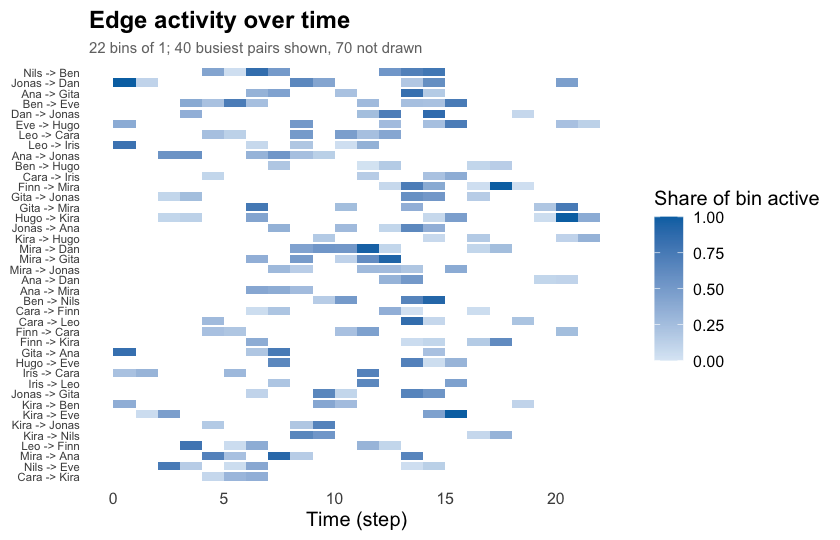
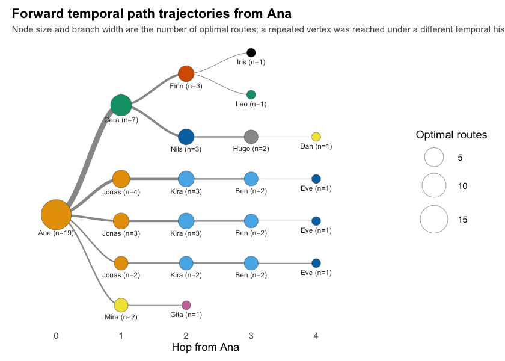

# Dynet

The Dynet R package provides functions for constructing, measuring and
visualising temporal networks, that is, networks whose ties are located
in time. A network is built with one constructor from any of four kinds
of relational log: interval logs with a start and an end per tie,
contact logs of instantaneous events, threaded logs such as forum or
chat data, and co-presence logs where actors sharing a group become
connected. Measurement covers time-varying centrality, graph-level
structure, tie formation and dissolution, tie duration, burstiness,
group mixing, time-respecting paths, reachability and temporal
centrality. Every function returns a data frame with one row per
observation, addressed by vertex name, so results are read, plotted and
modelled without further manipulation. The implementation is base R; the
values are checked against the `igraph`, `sna` and `tsna` packages in
the test suite. Drawing is delegated to `cograph`, of which every Dynet
network is an instance.

## Temporal networks

A social network is usually recorded as a set of ties between actors,
and the ties are then analysed as if they had all existed at once. Most
relational data are not like that. Conversations, messages, meetings and
collaborations happen at particular moments and last for particular
lengths of time. A temporal network keeps this information: each tie is
a *spell*, a pair of actors together with the time at which the tie
began and the time at which it ended, or a single instant when the tie
has no duration (Holme and Saramäki, 2012). The same pair of actors may
have many spells.

Aggregating the spells into one static network loses two things. The
first is duration and intensity: a pair that spoke once for a minute and
a pair that worked together every day become the same edge. The second,
and more consequential, is order. In a static network, a tie from A to B
and a tie from B to C imply a path from A to C. In a temporal network
they imply a path only if the tie from B to C is still active at, or
begins after, the moment the tie from A to B delivered something to B. A
path that respects this constraint is called a *time-respecting path*
(Kempe, Kleinberg and Kumar, 2002). Because the constraint is
one-directional, temporal reachability is not symmetric even in an
undirected network, and a static network systematically overstates how
many actors can reach one another (Moody, 2002). Measures built on
time-respecting paths, such as temporal closeness and temporal
betweenness, describe the network as a medium through which something
can travel (Pan and Saramäki, 2011; Nicosia et al., 2013). Measures
built on the timing of a single actor’s events, such as burstiness and
memory, describe the rhythm of activity itself (Goh and Barabási, 2008).

Measures of a temporal network are computed in one of two ways. Density,
reciprocity, transitivity, centrality and the counts of ties formed and
dissolved are computed within windows of time: the observation period is
divided into windows, which may tile it or overlap, each window is
measured as a static network, and the result is a time series whose
resolution is set by the width of the window. Reachability, latency,
temporal closeness and temporal betweenness are computed on the spells
directly, along time-respecting paths, and have no static counterpart:
they report the earliest time at which one actor can reach another, how
many distinct routes achieve it, and how much of the network is
reachable from a given moment. In educational research these methods
have been used to study how collaboration unfolds within a course and
which students act as bridges over time (Saqr and Nouri, 2020; Saqr,
2024).

Relational logs arrive in different shapes, and the shape determines how
spells are defined. An *interval* log records a start and an end for
every row. A *contact* log records only a timestamp, so every spell is a
point. A *threaded* log, typical of discussion forums, records a
timestamp and the thread a message belongs to; following Saqr and Nouri
(2020), a message is taken to be active from the moment it is posted
until the thread falls silent, so a message that provoked a long
discussion stays live longer than one that did not. A *co-presence* log
records which actors attended which occasion; every pair of attendees is
connected for the span of the occasion. Dynet reads all four with one
function and infers the shape from the arguments given to it.

## Installation

Dynet is not on CRAN. The development version is installed from the
author’s R-universe repository, which also resolves its `cograph`
dependency, or from GitHub. These commands are not evaluated when this
page is rendered.

``` r
install.packages("Dynet",
                 repos = c("https://mohsaqr.r-universe.dev",
                           "https://cloud.r-project.org"))

# or from GitHub
remotes::install_github("mohsaqr/Dynet")
```

## Data

Four bundled logs are used below. `school_contacts` is a simulated
interval log of 240 face-to-face contacts among fourteen named students,
with time in arbitrary units over about 21.5 units. `forum_posts` is a
simulated threaded log of 241 posts by twenty participants over eight
weeks, with a companion table `forum_people` that gives each participant
a role. `seminar_attendance` is a simulated co-presence log of which
students attended which weekly seminar. The package also ships
`mooc_posts`, the 2,529 posts of a real MOOC discussion forum analysed
in Saqr (2024), and `thought_chains`, the reply table of the *Trees of
Thought* study.

``` r
library(Dynet)
head(school_contacts)
#>    from   to start  end
#> 1 Jonas  Dan  0.00 1.10
#> 2  Gita  Ana  0.14 0.98
#> 3   Leo Mira  0.15 0.42
#> 4   Leo Iris  0.15 0.96
#> 5  Kira  Ben  0.33 0.69
#> 6   Leo Iris  0.38 0.50
```

Each row is one contact from one student to another, with the time it
began and the time it ended.

## Building a network

To build a temporal network from an interval log, we call `dynet()` with
the log. The columns `from`, `to`, `start` and `end` are recognised by
name; `sender` and `receiver`, `source` and `target`, `onset` and
`terminus`, and several other spellings are accepted as well, and times
may be numeric, dates or date-times. Printing the network describes its
format and shows the first spells.

``` r
dn <- dynet(school_contacts)
dn
#> # Temporal network (interval format, directed) | a cograph netobject
#> # 14 vertices | 240 edge spells | 110 distinct pairs
#> # observed from 0 to 21.52 step, binned every 1
#> 
#>   from   to start  end duration weight
#>  Jonas  Dan  0.00 1.10     1.10      1
#>   Gita  Ana  0.14 0.98     0.84      1
#>    Leo Mira  0.15 0.42     0.27      1
#>    Leo Iris  0.15 0.96     0.81      1
#>   Kira  Ben  0.33 0.69     0.36      1
#>    Leo Iris  0.38 0.50     0.12      1
#> # 234 more spells. summary() describes the network; plot() draws it.
```

To see the network’s dimensions in one table, we call `summary()`. The
mean snapshot density is the average over one-unit bins of the share of
pairs that are connected in the bin.

``` r
summary(dn)
#>                 property        value
#> 1                 format     interval
#> 2               directed          yes
#> 3               vertices           14
#> 4            edge spells          240
#> 5         distinct pairs          110
#> 6              time unit         step
#> 7          observed from            0
#> 8            observed to        21.52
#> 9                   span        21.52
#> 10             bin width            1
#> 11             time bins           22
#> 12 mean snapshot density       0.0829
#> 13      temporal density not computed
#> 14              sessions         none
#> 15     vertex attributes         none
```

The other three log shapes are built with the same function. For a
contact log, we name the timestamp column in `time`. For a threaded log,
we name the thread column in `thread`, and pass the participant table to
`nodes` so that its attributes travel with the network. For a
co-presence log, we name the actor column in `actor` and the occasion
column in `group`.

``` r
contacts <- dynet(forum_posts, time = "timestamp")
forum <- dynet(forum_posts, thread = "thread", nodes = forum_people)
seminars <- dynet(seminar_attendance, actor = "student", group = "seminar")
forum
#> # Temporal network (threaded format, directed) | a cograph netobject
#> # 20 vertices | 241 edge spells | 172 distinct pairs
#> # observed from 0 to 54.96387 days, binned every 1
#> # vertex attributes: role, achievement
#> 
#>        from         to     start      end duration weight    thread
#>  student_14 student_05 0.0000000 2.296969 2.296969      1 thread_47
#>  student_10 student_05 0.7257216 2.296969 1.571247      1 thread_47
#>   teacher_A student_09 0.8559934 3.235993 2.380000      1 thread_11
#>  student_04 student_05 1.1715344 2.296969 1.125435      1 thread_47
#>  student_02 student_09 1.2382611 3.235993 1.997732      1 thread_11
#>  student_06  teacher_A 1.9797595 3.235993 1.256234      1 thread_11
#> # 235 more spells. summary() describes the network; plot() draws it.
```

The threaded network reports its time in days, because the log carried
date-times; the unit is chosen to suit the span and is stated in every
result.

To draw the spells over time, we call `plot()` on the network. Each
horizontal segment is one spell.

``` r
plot(dn)
```



## Measuring in windows

Every measuring function that returns a time series takes the same four
arguments. `start` and `end` bound the period, `step` is the interval
between measurements, and `window` is the length of time each
measurement covers. When `window` equals `step`, the windows tile the
period; when `window` is larger, they overlap and the series is a
rolling one; when `window` is zero, the network is sampled at each
instant. The defaults tile the observed period into unit bins.

To obtain a graph-level measure in each window, we call `metrics()` with
the network and `measure` for the statistic. Here density is measured
every unit over a rolling window of seven units.

``` r
density <- metrics(dn, measure = "density", step = 1, window = 7)
density
#> # Density (graph-level)
#> # 22 time points, step 1, window 7 (rolling) | time in step
#>  time measure     value
#>     0 density 0.3241758
#>     1 density 0.3461538
#>     2 density 0.3571429
#>     3 density 0.3791209
#>     4 density 0.3681319
#>     5 density 0.3791209
#>     6 density 0.3791209
#>     7 density 0.3791209
#>     8 density 0.3956044
#>     9 density 0.3736264
#>    10 density 0.3626374
#>    11 density 0.3351648
#> # 10 more rows. summary() aggregates them; plot() draws them.
```

To summarise a series, we call `summary()` on it. The table reports one
row per measure with its mean, spread, range and the time at which it
peaked.

``` r
summary(density)
#>   measure  n     mean       sd        min       max peak_time
#> 1 density 22 0.285964 0.111584 0.03296703 0.3956044         8
```

To draw the series, we call `plot()` on it.

``` r
plot(density)
```


Several measures may be requested in one call; they arrive stacked in
one data frame with a `measure` column. The graph-level catalogue
includes density, reciprocity, transitivity, the dyad and triad
censuses, component counts, centralisation and the Krackhardt indices,
and is listed in `?metrics`.

## Vertex measures

To obtain a centrality for every vertex in every window, we call
`dyn_centrality()` with the network and `measure` for the index. The
result has one row per vertex per time point.

``` r
degree <- dyn_centrality(dn, measure = "degree")
degree
#> # Degree (node-level)
#> # 14 vertices | 22 time points, 1 per bin | time in step
#>  time  node measure value
#>     0   Ana  degree     1
#>     0   Ben  degree     1
#>     0  Cara  degree     1
#>     0   Dan  degree     1
#>     0   Eve  degree     2
#>     0  Finn  degree     1
#>     0  Gita  degree     1
#>     0  Hugo  degree     1
#>     0  Iris  degree     2
#>     0 Jonas  degree     2
#>     0  Kira  degree     2
#>     0   Leo  degree     2
#> # 296 more rows. summary() aggregates them; plot() draws them.
```

To reduce the series to one row per vertex, we call `summary()` on it.
The `peak_time` column gives the time at which each vertex was most
central.

``` r
summary(degree)
#>     node measure  n     mean       sd min max peak_time
#> 1    Ana  degree 22 2.181818 2.015095   0   7         6
#> 2    Ben  degree 22 2.000000 1.234427   0   4         4
#> 3   Cara  degree 22 2.227273 1.342770   0   5         4
#> 4    Dan  degree 22 2.090909 1.444500   1   5        13
#> 5    Eve  degree 22 2.272727 2.051290   0   8        14
#> 6   Finn  degree 22 2.000000 1.661898   0   6        12
#> 7   Gita  degree 22 1.727273 1.777688   0   7         6
#> 8   Hugo  degree 22 2.318182 1.861550   0   6         6
#> 9   Iris  degree 22 1.772727 1.066004   0   4        11
#> 10 Jonas  degree 22 2.863636 2.076982   0   7        13
#> 11  Kira  degree 22 2.636364 1.255292   1   6         6
#> 12   Leo  degree 22 1.636364 1.432462   0   5         6
#> 13  Mira  degree 22 2.272727 1.695423   0   6        13
#> 14  Nils  degree 22 2.181818 2.174229   0   7        14
```

The measures above are computed on the network as it stands in each
window. To compute a centrality on time-respecting paths across the
whole period instead, we set `scope` to `"temporal"`. Temporal closeness
is the inverse of the mean time a vertex needs to reach the others; it
has one value per vertex, not one per window.

``` r
closeness <- dyn_centrality(dn, measure = "closeness", scope = "temporal")
closeness
#> # Closeness (node-level)
#> # 14 vertices | time in step
#> # computed on time-respecting paths across the whole window
#>   node   measure     value
#>    Ana closeness 0.1313662
#>    Ben closeness 0.1815896
#>   Cara closeness 0.1931075
#>    Dan closeness 0.2230994
#>    Eve closeness 0.2616221
#>   Finn closeness 0.1644945
#>   Gita closeness 0.1404950
#>   Hugo closeness 0.1878341
#>   Iris closeness 0.2398082
#>  Jonas closeness 0.3674392
#>   Kira closeness 0.2107994
#>    Leo closeness 0.3747478
#> # 2 more rows. summary() aggregates them; plot() draws them.
```

On a directed network, `mode` selects whether incoming, outgoing or all
ties are counted. The vertex-level catalogue includes degree, strength,
closeness, betweenness, eigenvector centrality, PageRank, hub and
authority scores, coreness, Burt’s constraint and several prestige
indices, and is listed in `?dyn_centrality`.

## Time-respecting paths

To find the earliest time-respecting path from one vertex to every
other, we call `paths()` with the network and `from` for the source. The
result has one row per vertex. `arrival_time` is the earliest moment the
vertex can be reached, `latency` is that moment minus the time the
source started, `n_hops` is the number of ties the earliest route uses,
and `n_paths` is the number of distinct routes that arrive equally
early.

``` r
from_ana <- paths(dn, from = "Ana")
from_ana
#> # Time-respecting paths from 'Ana', from t = 0
#> # reaches 13 of 13 other vertices | time in step
#>   node reachable arrival_time attained latency n_hops n_paths
#>    Ana      TRUE         0.00     TRUE    0.00      0       1
#>    Ben      TRUE         9.59     TRUE    9.59      3       3
#>   Cara      TRUE         6.67     TRUE    6.67      1       1
#>    Dan      TRUE         7.98     TRUE    7.98      4       1
#>    Eve      TRUE        11.66     TRUE   11.66      4       3
#>   Finn      TRUE         6.96     TRUE    6.96      2       1
#>   Gita      TRUE         6.36     TRUE    6.36      2       1
#>   Hugo      TRUE         7.98     TRUE    7.98      3       1
#>   Iris      TRUE        10.00     TRUE   10.00      3       1
#>  Jonas      TRUE         2.12     TRUE    2.12      1       1
#>   Kira      TRUE         6.12     TRUE    6.12      2       2
#>    Leo      TRUE         9.65     TRUE    9.65      3       1
#> # 2 more rows. summary() aggregates them; plot() draws the tree.
```

To summarise the reachable set, we call `summary()` on the result.

``` r
summary(from_ana)
#>          property   value
#> 1          source     Ana
#> 2       direction forward
#> 3       reachable      13
#> 4 reachable share       1
#> 5  median latency    7.51
#> 6     max latency   11.66
#> 7     median hops       2
#> 8        max hops       4
```

Ana reaches every other student within four hops. Three of them, Ben,
Eve and Finn, never meet her directly and are joined to her only through
intermediaries whose contacts happened in the right order. The same
question asked from a later starting point has a different answer,
because the contacts that carried the earlier routes have already
passed. To start the search later, we set `start`.

``` r
from_ana_late <- paths(dn, from = "Ana", start = 18)
summary(from_ana_late)
#>          property   value
#> 1          source     Ana
#> 2       direction forward
#> 3       reachable       5
#> 4 reachable share   0.385
#> 5  median latency    2.43
#> 6     max latency    2.68
#> 7     median hops       2
#> 8        max hops       3
```

To list the routes themselves, we call `pathways()` with the network and
`from` for the source. Each row is one distinct sequence of vertices,
with the number of earliest routes that follow it.

``` r
pathways(dn, from = "Ana")
#> # Time-respecting pathways (5 distinct routes)
#> # 7 optimal routes counted
#>                               route endpoint count     share n_hops
#>  Ana -> Jonas -> Kira -> Ben -> Eve      Eve     3 0.4285714      4
#>                 Ana -> Mira -> Gita     Gita     1 0.1428571      2
#>         Ana -> Cara -> Finn -> Iris     Iris     1 0.1428571      3
#>          Ana -> Cara -> Finn -> Leo      Leo     1 0.1428571      3
#>  Ana -> Cara -> Nils -> Hugo -> Dan      Dan     1 0.1428571      4
#>  arrival_time
#>         11.66
#>          6.36
#>         10.00
#>          9.65
#>          7.98
```

To draw the routes as a tree, we call `plot()` on the paths result. A
vertex appears more than once when it is entered at different times,
because each entry time leaves a different set of onward contacts
available.

``` r
plot(from_ana)
```



To obtain the share of the network each vertex can reach, or be reached
from, we call `dyn_reachability()` with the network; `direction` selects
forward, backward or both.

## Tie dynamics and timing

To count the ties that form and dissolve in each window, we call
`events()` with the network. The default measures are formation and
dissolution.

``` r
turnover <- events(dn)
summary(turnover)
#>       measure  n     mean       sd min max peak_time
#> 1 dissolution 22 10.90909 6.132731   3  27        14
#> 2   formation 22 10.90909 6.689787   0  29        13
```

To measure how long ties last, we call `durations()` with the network
and `measure` for the statistic. With `measure = "mean"` the result is
the mean spell length of each pair; `unit` moves the question from pairs
to individual spells or to vertex activity.

``` r
lengths <- durations(dn, measure = "mean")
lengths
#> # Relationship duration (edge-level)
#> # time in step
#> # durations in step
#>  from    to measure     value
#>   Ana  Cara    mean 0.1000000
#>   Ana   Dan    mean 0.3400000
#>   Ana  Gita    mean 0.4220000
#>   Ana  Iris    mean 0.5000000
#>   Ana Jonas    mean 0.5850000
#>   Ana  Kira    mean 0.1100000
#>   Ana   Leo    mean 1.1900000
#>   Ana  Mira    mean 0.3466667
#>   Ben   Eve    mean 0.6100000
#>   Ben  Finn    mean 0.2300000
#>   Ben  Gita    mean 0.3400000
#>   Ben  Hugo    mean 0.1475000
#> # 98 more rows. summary() aggregates them; plot() draws them.
```

To measure whether a vertex’s contacts are regular or clustered in time,
we call `burstiness()` with the network. Burstiness compares the
dispersion of the gaps between a vertex’s events with the exponential
reference: 1 is the bursty limit, 0 the Poisson reference and -1
perfectly regular activity. Memory is the correlation between
consecutive gaps.

``` r
rhythm <- burstiness(dn)
summary(rhythm)
#>     node    measure n        mean sd         min         max
#> 1    Ana burstiness 1  0.24575324 NA  0.24575324  0.24575324
#> 2    Ana     events 1 36.00000000 NA 36.00000000 36.00000000
#> 3    Ana     memory 1 -0.03128243 NA -0.03128243 -0.03128243
#> 4    Ben burstiness 1  0.03288611 NA  0.03288611  0.03288611
#> 5    Ben     events 1 34.00000000 NA 34.00000000 34.00000000
#> 6    Ben     memory 1 -0.19926343 NA -0.19926343 -0.19926343
#> 7   Cara burstiness 1 -0.05610924 NA -0.05610924 -0.05610924
#> 8   Cara     events 1 35.00000000 NA 35.00000000 35.00000000
#> 9   Cara     memory 1  0.07458054 NA  0.07458054  0.07458054
#> 10   Dan burstiness 1 -0.05061772 NA -0.05061772 -0.05061772
#> 11   Dan     events 1 35.00000000 NA 35.00000000 35.00000000
#> 12   Dan     memory 1  0.21654310 NA  0.21654310  0.21654310
#> 13   Eve burstiness 1  0.09217906 NA  0.09217906  0.09217906
#> 14   Eve     events 1 34.00000000 NA 34.00000000 34.00000000
#> 15   Eve     memory 1  0.25882509 NA  0.25882509  0.25882509
#> 16  Finn burstiness 1  0.02938507 NA  0.02938507  0.02938507
#> 17  Finn     events 1 29.00000000 NA 29.00000000 29.00000000
#> 18  Finn     memory 1 -0.22653754 NA -0.22653754 -0.22653754
#> 19  Gita burstiness 1  0.06104200 NA  0.06104200  0.06104200
#> 20  Gita     events 1 31.00000000 NA 31.00000000 31.00000000
#> 21  Gita     memory 1  0.21165690 NA  0.21165690  0.21165690
#> 22  Hugo burstiness 1  0.09885443 NA  0.09885443  0.09885443
#> 23  Hugo     events 1 34.00000000 NA 34.00000000 34.00000000
#> 24  Hugo     memory 1  0.11283700 NA  0.11283700  0.11283700
#> 25  Iris burstiness 1 -0.05968068 NA -0.05968068 -0.05968068
#> 26  Iris     events 1 30.00000000 NA 30.00000000 30.00000000
#> 27  Iris     memory 1 -0.09356972 NA -0.09356972 -0.09356972
#> 28 Jonas burstiness 1 -0.02750549 NA -0.02750549 -0.02750549
#> 29 Jonas     events 1 46.00000000 NA 46.00000000 46.00000000
#> 30 Jonas     memory 1  0.23391957 NA  0.23391957  0.23391957
#> 31  Kira burstiness 1 -0.07048265 NA -0.07048265 -0.07048265
#> 32  Kira     events 1 38.00000000 NA 38.00000000 38.00000000
#> 33  Kira     memory 1 -0.14972726 NA -0.14972726 -0.14972726
#> 34   Leo burstiness 1 -0.01020265 NA -0.01020265 -0.01020265
#> 35   Leo     events 1 28.00000000 NA 28.00000000 28.00000000
#> 36   Leo     memory 1  0.48001912 NA  0.48001912  0.48001912
#> 37  Mira burstiness 1  0.09968547 NA  0.09968547  0.09968547
#> 38  Mira     events 1 36.00000000 NA 36.00000000 36.00000000
#> 39  Mira     memory 1  0.18691159 NA  0.18691159  0.18691159
#> 40  Nils burstiness 1  0.08408761 NA  0.08408761  0.08408761
#> 41  Nils     events 1 34.00000000 NA 34.00000000 34.00000000
#> 42  Nils     memory 1  0.22784733 NA  0.22784733  0.22784733
```

## Mixing between groups

To count ties within and between groups of vertices, we call `mixing()`
with the network and `attribute` for the vertex attribute that defines
the groups. The forum network carries a `role` attribute from
`forum_people`. A `step` wider than the observation period collapses the
counts into one table; the default reports them per window.

``` r
mixing(forum, attribute = "role", step = 60)
#> # Mixing by role (graph-level)
#> # 1 time points, 60 per bin | time in days
#> # measures: Facilitator -> Facilitator, Student -> Facilitator, Teacher -> Facilitator, Facilitator -> Student, Student -> Student, Teacher -> Student, Facilitator -> Teacher, Student -> Teacher, Teacher -> Teacher
#> # active binary-dyad counts between vertex groups per time bin
#>  time                    measure value  from_group    to_group
#>     0 Facilitator -> Facilitator     0 Facilitator Facilitator
#>     0     Student -> Facilitator     3     Student Facilitator
#>     0     Teacher -> Facilitator     0     Teacher Facilitator
#>     0     Facilitator -> Student     4 Facilitator     Student
#>     0         Student -> Student   136     Student     Student
#>     0         Teacher -> Student    12     Teacher     Student
#>     0     Facilitator -> Teacher     1 Facilitator     Teacher
#>     0         Student -> Teacher    16     Student     Teacher
#>     0         Teacher -> Teacher     0     Teacher     Teacher
```

## Static views of a temporal network

To reduce a temporal network to a weighted static network, we call
`collapse_network()` with the network and `weight` for the aggregation
rule. The result is a `cograph` network and can be drawn and measured as
one.

``` r
flat <- collapse_network(dn, weight = "union_duration")
flat
#> # Collapsed temporal network | 14 vertices | 110 edges | weight: union_duration
#> # 0 to 21.52 step
#>  from    to binary union_duration total_duration duration_fraction spell_count
#>   Ana  Cara      1           0.10           0.10       0.004646840           1
#>   Ana   Dan      1           1.02           1.02       0.047397770           3
#>   Ana  Gita      1           1.99           2.11       0.092472119           5
#>   Ana  Iris      1           0.50           0.50       0.023234201           1
#>   Ana Jonas      1           2.34           2.34       0.108736059           4
#>   Ana  Kira      1           0.11           0.11       0.005111524           1
#>  weight_sum weighted_duration latest_weight first  last activity.duration
#>           1              0.10             1  6.67  6.77              0.10
#>           3              1.02             1 12.04 20.10              1.02
#>           5              2.11             1  6.57 14.16              1.99
#>           1              0.50             1 13.80 14.30              0.50
#>           4              2.34             1  2.12  9.13              2.34
#>           1              0.11             1 11.60 11.71              0.11
#>  activity.count
#>               1
#>               3
#>               5
#>               1
#>               4
#>               1
```

To restrict a network to some of its vertices, we call
`induce_subgraph()` with the network and a condition on the vertex table
in `nodes`. A centrality named in the condition is computed over the
whole observed period.

``` r
core <- induce_subgraph(dn, degree > 16)
core
#> # Temporal network (interval format, directed) | a cograph netobject
#> # 5 vertices | 31 edge spells | 14 distinct pairs
#> # observed from 0 to 20.46 step, binned every 1
#> 
#>   from    to start  end duration weight
#>  Jonas   Dan  0.00 1.10     1.10      1
#>    Eve  Kira  0.77 1.42     0.65      1
#>   Kira   Eve  1.95 2.47     0.52      1
#>  Jonas  Kira  2.05 2.09     0.04      1
#>    Dan Jonas  3.14 3.49     0.35      1
#>    Dan   Eve  3.20 3.33     0.13      1
#> # 25 more spells. summary() describes the network; plot() draws it.
```

To list the ties active in one window, we call `snapshots()` with the
network and `at` for the time.

``` r
snapshots(dn, at = 3)
#> # Snapshot edges | 1 bin | 12 tie rows | time in step
#>    time from    to weight n_spells
#> 1     3  Ana Jonas      1        1
#> 2     3 Kira   Leo      1        1
#> 3     3  Leo  Finn      1        1
#> 4     3 Nils   Eve      1        1
#> 5     3  Ben Jonas      1        1
#> 6     3  Ben   Eve      1        1
#> 7     3  Dan   Ana      1        1
#> 8     3  Dan Jonas      1        1
#> 9     3  Dan   Eve      1        1
#> 10    3 Gita Jonas      1        1
#> # 2 more rows. summary() counts them by bin.
```

## Editing a network

Editing functions return a new network and leave the input unchanged. To
add a vertex, we call `add_nodes()` with a table of names and
attributes. To add a tie, we call `add_ties()` with a table of spells.
`remove_nodes()`, `remove_ties()`, `update_nodes()`, `update_ties()`,
`rename_nodes()`, `set_vertex_spells()` and `set_observations()`
complete the set.

``` r
dn2 <- add_nodes(dn, data.frame(name = "Omar"))
dn2 <- add_ties(dn2, data.frame(from = "Ana", to = "Omar", start = 4, end = 6))
dn2
#> # Temporal network (interval format, directed) | a cograph netobject
#> # 15 vertices | 241 edge spells | 111 distinct pairs
#> # observed from 0 to 21.52 step, binned every 1
#> 
#>   from   to start  end duration weight
#>  Jonas  Dan  0.00 1.10     1.10      1
#>   Gita  Ana  0.14 0.98     0.84      1
#>    Leo Mira  0.15 0.42     0.27      1
#>    Leo Iris  0.15 0.96     0.81      1
#>   Kira  Ben  0.33 0.69     0.36      1
#>    Leo Iris  0.38 0.50     0.12      1
#> # 235 more spells. summary() describes the network; plot() draws it.
```

## Drawing and animating

A Dynet network is a `cograph` network, so every `cograph` drawing
function applies to it directly. `plot()` adds the views that concern
time. To draw the network as it stands in one window, we set `type` to
`"network"` and give the time in `at`. To draw a sequence of windows as
small multiples with a shared layout, we set `type` to `"snapshots"`. To
draw the proximity timeline, in which vertices that interact are placed
near each other and their positions are followed through time, we set
`type` to `"proximity"`. The proximity timeline is described in the
article on drawing.

To animate the measurement windows, we call `animate()` with the same
four grid arguments as the measuring functions and a file name whose
extension selects the encoder; `.gif` needs the `gifski` package and
`.mp4` or `.webm` the `av` package. The article on animating shows the
result.

## Documentation

- `vignette("dynet")` walks through one analysis from log to result.
- `vignette("building-networks")` covers the four log shapes, vertex
  attributes, observation windows, sessions and censoring.
- `vignette("ch17-temporal-networks")` re-runs the temporal network
  chapter of *Learning Analytics Methods and Tutorials* on the bundled
  MOOC forum.
- The package website at <https://pak.dynasite.org/Dynet/> adds a
  function catalogue, tutorials on animation and on the MOOC data, and a
  full reproduction of the *Trees of Thought* study.

## References

Butts, C. T. (2008). A relational event framework for social action.
*Sociological Methodology*, 38(1), 155–200.

Goh, K.-I., & Barabási, A.-L. (2008). Burstiness and memory in complex
systems. *EPL (Europhysics Letters)*, 81(4), 48002.

Holme, P., & Saramäki, J. (2012). Temporal networks. *Physics Reports*,
519(3), 97–125.

Kempe, D., Kleinberg, J., & Kumar, A. (2002). Connectivity and inference
problems for temporal networks. *Journal of Computer and System
Sciences*, 64(4), 820–842.

Masuda, N., & Lambiotte, R. (2016). *A guide to temporal networks*.
World Scientific.

Moody, J. (2002). The importance of relationship timing for diffusion.
*Social Forces*, 81(1), 25–56.

Nicosia, V., Tang, J., Mascolo, C., Musolesi, M., Russo, G., & Latora,
V. (2013). Graph metrics for temporal networks. In P. Holme & J.
Saramäki (Eds.), *Temporal networks* (pp. 15–40). Springer.

Pan, R. K., & Saramäki, J. (2011). Path lengths, correlations, and
centrality in temporal networks. *Physical Review E*, 84(1), 016105.

Saqr, M. (2024). Temporal network analysis: Introduction, methods and
analysis with R. In M. Saqr & S. López-Pernas (Eds.), *Learning
analytics methods and tutorials: A practical guide using R*. Springer.

Saqr, M., & Nouri, J. (2020). High resolution temporal network analysis
to understand and improve collaborative learning. In *Proceedings of the
Tenth International Conference on Learning Analytics & Knowledge*
(pp. 314–319). ACM.
