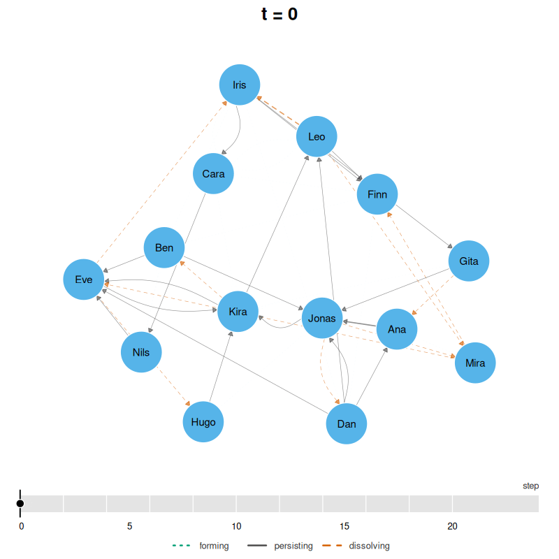
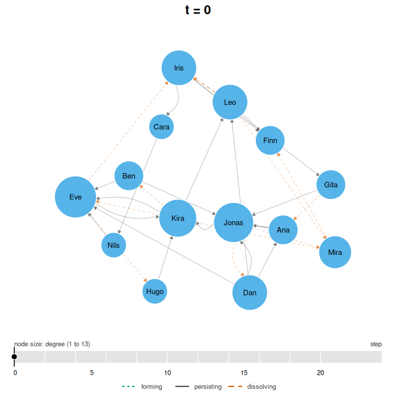
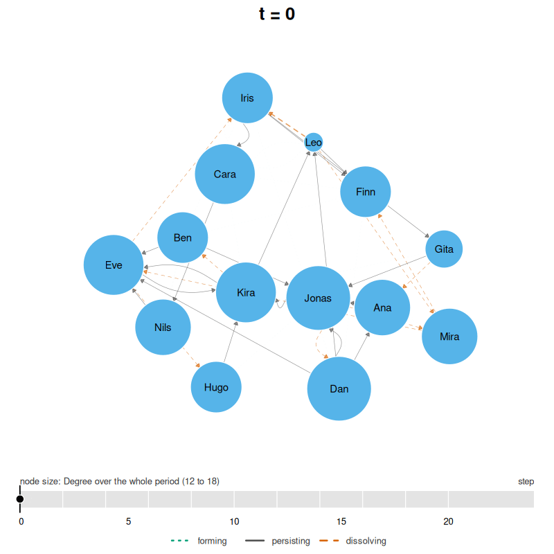

# Animating a temporal network

[`animate()`](https://pak.dynasite.org/Dynet/reference/animate.md)
displays changes in a temporal network across successive measurement
windows. This article illustrates its use with simulated classroom
contacts and a MOOC discussion forum. The arguments `start`, `end`,
`step`, and `window` define the measurement grid. GIF output requires
`gifski`; MP4 and WebM output require `av`.

## Data

`school_contacts` contains 240 simulated face-to-face contacts among
fourteen students, with onset and termination times. The constructor
recognises its endpoint and interval columns automatically.

``` r

library(Dynet)
dn <- dynet(school_contacts)
dn
#> # Temporal network (interval format, directed) | a cograph netobject
#> # 14 vertices | 240 edge spells | 110 distinct pairs
#> # observed from 0 to 21.52 step, binned every 1
#> 
#>   from   to start  end duration weight
#>  Jonas  Dan  0.00 1.10     1.10      1
#>   Gita  Ana  0.14 0.98     0.84      1
#>    Leo Mira  0.15 0.42     0.27      1
#>    Leo Iris  0.15 0.96     0.81      1
#>   Kira  Ben  0.33 0.69     0.36      1
#>    Leo Iris  0.38 0.50     0.12      1
#> # 234 more spells. summary() describes the network; plot() draws it.
```

## The bins

[`snapshots()`](https://pak.dynasite.org/Dynet/reference/snapshots.md)
lists the connections represented in each animation window. Here,
`step = 2` places measurements two time units apart, and `window = 4`
includes connections active at any point within each four-unit interval.

``` r

bins <- snapshots(dn, step = 2, window = 4)
summary(bins)
#>    time ties nodes weight
#> 1     0   29    14     31
#> 2     2   33    14     39
#> 3     4   50    14     61
#> 4     6   54    14     69
#> 5     8   45    14     59
#> 6    10   54    14     76
#> 7    12   51    14     70
#> 8    14   40    14     50
#> 9    16   24    14     25
#> 10   18   25    14     25
#> 11   20   17    14     17
```

The grid contains eleven overlapping windows. Connected-pair counts
increase from 29 in the first window to 54 in the windows beginning at
times 6 and 10, then decrease to seventeen in the final window.
Connections displayed together within a window need not be active
simultaneously.

## The animation

`file` specifies the output path, and its extension selects the encoder:
`.gif`, `.mp4`, or `.webm`. The returned tidy table describes each
measurement bin.

``` r

film <- animate(dn, step = 2, window = 4, file = "animating_files/classroom.gif")
film
#> # Animation of 11 bins in 66 frames at 12 fps | spring layout | gif | time in step
#> # animating_files/classroom.gif
#>  bin frame time window_start window_end nodes idle ties forming dissolving
#>    1     1    0            0          4    14    0   29      NA         10
#>    2     7    2            2          6    14    0   33      14          9
#>    3    13    4            4          8    14    0   50      26          9
#>    4    19    6            6         10    14    0   54      13         20
#>    5    25    8            8         12    14    0   45      11         11
#>    6    31   10           10         14    14    0   54      20         12
#>    7    37   12           12         16    14    0   51       9         15
#>    8    43   14           14         18    14    0   40       4         25
#>    9    49   16           16         20    14    0   24       9          9
#>   10    55   18           18         22    14    0   25      10          8
#>   11    61   20           20         24    14    0   17       0         NA
```



`ties` records the connected-pair count, matching the corresponding
snapshot. `forming` counts pairs present in the current bin but absent
from the preceding bin. `dissolving` counts pairs present in the current
bin but absent from the next. The first bin has no predecessor and the
last has no successor, so these comparisons are `NA` at the respective
boundaries. The bin beginning at time 4 contains fifty pairs, of which
26 were absent from the preceding bin and nine are absent from the next.

Forming ties are dotted and green, persisting ties are solid and grey,
and dissolving ties are dashed and vermilion. Line type therefore
distinguishes states as well as colour. Tie width represents weight on a
common scale across frames. These states describe changes between
snapshots, rather than individual spell onsets and terminations.

By default, each bin contributes six frames through `tween = 6`. Forming
ties fade in and dissolving ties fade out during transitions, while a
timeline marks the current interval.

``` r

summary(film)
#>   bins frames fps seconds tween  ease layout format measure first_time
#> 1   11     66  12     5.5     6 dwell spring    gif    <NA>          0
#>   last_time min_ties max_ties  turnover                          file
#> 1        20       17       54 0.3074074 animating_files/classroom.gif
```

Eleven bins produce 66 frames, lasting 5.5 seconds at twelve frames per
second. `turnover` is the median proportion of a bin’s connections that
were absent from the preceding bin; it is 0.31 here.

## Vertex size

Setting `measure` to a snapshot centrality name scales vertex area by
the value computed within each bin. A common scale is used throughout
the animation.

``` r

per_bin <- animate(dn, step = 2, window = 4, measure = "degree",
                   file = "animating_files/classroom-degree.gif")
summary(per_bin)
#>   bins frames fps seconds tween  ease layout format measure first_time
#> 1   11     66  12     5.5     6 dwell spring    gif  degree          0
#>   last_time min_ties max_ties  turnover                                 file
#> 1        20       17       54 0.3074074 animating_files/classroom-degree.gif
```



With `measure = "degree"`, changing vertex sizes show changes in direct
connectivity. Alternatively, supply a whole-period centrality result to
keep vertex sizes constant while ties change.

``` r

whole <- centrality_series(dn, measure = "degree", window = "all")
print(whole, n = 14)
#> # Degree (node-level)
#> # 14 vertices | 1 time points, 21.52 per bin | time in step
#>  time  node measure value
#>     0   Ana  degree    16
#>     0   Ben  degree    15
#>     0  Cara  degree    17
#>     0   Dan  degree    18
#>     0   Eve  degree    17
#>     0  Finn  degree    15
#>     0  Gita  degree    13
#>     0  Hugo  degree    15
#>     0  Iris  degree    15
#>     0 Jonas  degree    18
#>     0  Kira  degree    17
#>     0   Leo  degree    12
#>     0  Mira  degree    16
#>     0  Nils  degree    16
```

``` r

fixed <- animate(dn, step = 2, window = 4, measure = whole,
                 file = "animating_files/classroom-whole.gif")
summary(fixed)
#>   bins frames fps seconds tween  ease layout format
#> 1   11     66  12     5.5     6 dwell spring    gif
#>                        measure first_time last_time min_ties max_ties  turnover
#> 1 Degree over the whole period          0        20       17       54 0.3074074
#>                                  file
#> 1 animating_files/classroom-whole.gif
```



Dan and Jonas have whole-period total degree eighteen, compared with
twelve for Leo, so they appear larger in every frame. Because the
network is directed and degree sums incoming and outgoing connections by
default, these values do not necessarily equal the number of distinct
partners.

## Layout

The default `layout = "spring"` computes positions from the union of
connections across bins and reuses them in every frame. Fixed positions
make changes in connections easier to compare.

With `layout = "relaxed"`, positions are recalculated for each bin using
the preceding layout as a starting point and a positional constraint.
`max_displacement`, which defaults to 0.08 layout units, limits movement
between bins.

``` r

drift <- animate(dn, step = 2, window = 4, measure = "degree",
                 layout = "relaxed",
                 file = "animating_files/classroom-relaxed.mp4")
summary(drift)
#>   bins frames fps seconds tween  ease  layout format measure first_time
#> 1   11     66  12     5.5     6 dwell relaxed    mp4  degree          0
#>   last_time min_ties max_ties  turnover                                  file
#> 1        20       17       54 0.3074074 animating_files/classroom-relaxed.mp4
```

A relaxed layout can display changes in local grouping, although
movement itself is part of the visualisation rather than an observed
participant trajectory. A fixed layout provides stable reference
positions across time.

## Presence

The MOOC forum data contain reply timestamps and discussion identifiers.
Threaded construction represents each reply relationship as active from
its posting time until the last retained interaction in its discussion.

The following call supplies participant attributes through `nodes` and
uses experience level for vertex colours through `groups`.
`min_thread_posts = 2` excludes discussions with fewer than two retained
posts after self-reply removal.
[`induce_subgraph()`](https://pak.dynasite.org/Dynet/reference/induce_subgraph.md)
then selects participants with whole-period total degree greater than
twenty.

``` r

dn_full <- dynet(mooc_posts, from = "sender", to = "receiver",
                 time = "timestamp", thread = "discussion",
                 nodes = mooc_people, time_unit = "days",
                 groups = "expert_level", min_thread_posts = 2)
forum <- induce_subgraph(dn_full, degree > 20)
forum
#> # Temporal network (threaded format, directed) | a cograph netobject
#> # 45 vertices | 686 edge spells | 428 distinct pairs
#> # observed from 0.1138889 to 72.01111 days, binned every 1
#> # vertex attributes: experience, expert_level, groups
#> 
#>  from  to     start      end duration weight
#>   219 444 0.1138889 69.47778 69.36389      1
#>   310 444 0.1680556 68.38681 68.21875      1
#>    19 310 0.2784722 14.10486 13.82639      1
#>    19 444 0.2909722 69.47778 69.18681      1
#>    30 444 0.8791667 69.47778 68.59861      1
#>    30 444 0.8819444 68.38681 67.50486      1
#>                                                                     thread
#>                         Most important change for your school or district?
#>                                  Submitting Questions for the Expert Panel
#>  How important is teacher training in a digital learning transition phase?
#>                         Most important change for your school or district?
#>                         Most important change for your school or district?
#>                                  Submitting Questions for the Expert Panel
#> # 680 more spells. summary() describes the network; plot() draws it.
```

The subgraph contains 45 vertices, 686 spells, and 428 distinct ordered
pairs, spanning days 0.11–72.01. The data do not directly record
enrolment or departure, so vertices are initially treated as eligible
throughout observation.

`set_vertex_spells(..., "ties")` derives an activity period from each
participant’s first spell onset to their last spell termination. This is
an inferred participation period, not a recorded arrival or departure
time.

``` r

forum <- set_vertex_spells(forum, "ties")
spans <- as.data.frame(forum, what = "vertex_spells")
head(spans)
#>   vertex_spell node     start      end duration instant session onset_censored
#> 1            1    1  4.120139 71.40625 67.28611   FALSE    <NA>          FALSE
#> 2            2  100 12.842361 70.53958 57.69722   FALSE    <NA>          FALSE
#> 3            3   11  4.061806 71.43819 67.37639   FALSE    <NA>          FALSE
#> 4            4  116  3.164583 70.53958 67.37500   FALSE    <NA>          FALSE
#> 5            5   13 18.147222 72.01111 53.86389   FALSE    <NA>          FALSE
#> 6            6  137 11.107639 69.47778 58.37014   FALSE    <NA>          FALSE
#>   terminus_censored
#> 1             FALSE
#> 2             FALSE
#> 3             FALSE
#> 4             FALSE
#> 5             FALSE
#> 6             FALSE
```

The derived activity periods extend from day 4.12 to 71.41 for
participant 1 and from day 18.15 to 72.01 for participant 13.

`absent` controls the display of vertices outside their declared
activity periods. The default `"fade"` retains their positions at
quarter opacity. `"away"` moves them out of view while absent, with
animated transitions at arrival and departure.

The following animation uses seven-day windows beginning every two days.
`labels = FALSE` omits participant identifiers, and `palette` supplies
colours for the three experience levels.

``` r

arrivals <- animate(forum, start = 0, end = 70, step = 2, window = 7,
                    measure = "degree", absent = "away", labels = FALSE,
                    palette = c("#E69F00", "#56B4E9", "#CC79A7"),
                    file = "animating_files/forum.mp4")
print(arrivals, n = 36)
#> # Animation of 36 bins in 216 frames at 12 fps | spring layout | mp4 | time in days
#> # node size follows degree
#> # animating_files/forum.mp4
#>  bin frame time window_start window_end nodes idle ties forming dissolving
#>    1     1    0            0          7    29    0   53      NA          0
#>    2     7    2            2          9    29    0   59       6          0
#>    3    13    4            4         11    29    0   66       7          0
#>    4    19    6            6         13    37    0   81      15          4
#>    5    25    8            8         15    38    0   95      18          0
#>    6    31   10           10         17    39    0  101       6          6
#>    7    37   12           12         19    41    0  113      18          0
#>    8    43   14           14         21    41    0  131      18          9
#>    9    49   16           16         23    41    0  140      18         13
#>   10    55   18           18         25    42    0  134       7          3
#>   11    61   20           20         27    43    1  143      12          3
#>   12    67   22           22         29    45    1  154      14         13
#>   13    73   24           24         31    45    1  158      17          1
#>   14    79   26           26         33    45    1  180      23          5
#>   15    85   28           28         35    45    2  195      20         10
#>   16    91   30           30         37    45    2  201      16         21
#>   17    97   32           32         39    45    2  193      13         13
#>   18   103   34           34         41    44    3  186       6          6
#>   19   109   36           36         43    44    3  195      15          2
#>   20   115   38           38         45    44    3  196       3          5
#>   21   121   40           40         47    44    2  229      38         12
#>   22   127   42           42         49    44    2  242      25          6
#>   23   133   44           44         51    44    0  275      39          4
#>   24   139   46           46         53    44    0  276       5          4
#>   25   145   48           48         55    44    0  276       4         27
#>   26   151   50           50         57    44    0  251       2         34
#>   27   157   52           52         59    44    0  220       3         18
#>   28   163   54           54         61    44    0  208       6          9
#>   29   169   56           56         63    44    0  207       8          3
#>   30   175   58           58         65    44    0  204       0         25
#>   31   181   60           60         67    44    0  181       2         22
#>   32   187   62           62         69    44    0  160       1          7
#>   33   193   64           64         71    44    0  160       7          1
#>   34   199   66           66         73    44    0  164       5          7
#>   35   205   68           68         75    44    0  157       0         87
#>   36   211   70           70         77    34    0   70       0         NA
```

`nodes` counts participants eligible within each window: 29 in the first
window, 45 in the window beginning on day 22, and 44 in the window
beginning on day 34. `idle` counts eligible participants without a
connection in the window and ranges from zero to three. Connected-pair
counts rise from 53 in the first window to 276 in the windows beginning
on days 46 and 48, then decrease to seventy in the last.

``` r

summary(arrivals)
#>   bins frames fps seconds tween  ease layout format measure first_time
#> 1   36    216  12      18     6 dwell spring    mp4  degree          0
#>   last_time min_ties max_ties   turnover                      file
#> 1        70       53      276 0.06735751 animating_files/forum.mp4
```

The 36 bins produce 216 frames and an eighteen-second animation. Median
turnover is 0.07.

## Smoothing

Both the measurement grid and the transition settings affect continuity
between frames. Non-overlapping windows (`window = step`) represent
successive intervals. Overlapping windows (`window > step`) share
observations, which can make changes appear more gradual. Changing the
window alters the underlying snapshots, not just their presentation.

The following call uses non-overlapping two-day windows.

``` r

tiled <- animate(forum, start = 0, end = 70, step = 2, window = 2,
                 measure = "degree", absent = "away", labels = FALSE,
                 palette = c("#E69F00", "#56B4E9", "#CC79A7"),
                 file = "animating_files/forum-tiled.mp4")
print(tiled, n = 6)
#> # Animation of 36 bins in 216 frames at 12 fps | spring layout | mp4 | time in days
#> # node size follows degree
#> # animating_files/forum-tiled.mp4
#>  bin frame time window_start window_end nodes idle ties forming dissolving
#>    1     1    0            0          2     7    0   10      NA          0
#>    2     7    2            2          4    14    0   22      12          0
#>    3    13    4            4          6    29    0   44      22          0
#>    4    19    6            6          8    29    0   58      14          4
#>    5    25    8            8         10    29    1   56       2          0
#>    6    31   10           10         12    34    1   71      15          6
#> # 30 more bins.
summary(tiled)
#>   bins frames fps seconds tween  ease layout format measure first_time
#> 1   36    216  12      18     6 dwell spring    mp4  degree          0
#>   last_time min_ties max_ties   turnover                            file
#> 1        70       10      242 0.09504132 animating_files/forum-tiled.mp4
```

The first two-day window contains seven eligible participants and ten
connected pairs, compared with 29 participants and 53 pairs in the first
seven-day window. Median turnover increases from 0.07 to 0.10. The
classroom example has turnover 0.31, but the datasets and grids differ,
so these values are descriptive rather than a controlled comparison.

`ease` controls transitions between the selected snapshots. The default
`"dwell"` holds each bin before transitioning. `"continuous"`
interpolates positions using a spline (Catmull and Rom, 1974) and uses
linear fades without a stationary interval.

``` r

flowing <- animate(forum, start = 0, end = 70, step = 2, window = 7,
                   measure = "degree", absent = "away", labels = FALSE,
                   layout = "relaxed", ease = "continuous",
                   palette = c("#E69F00", "#56B4E9", "#CC79A7"),
                   file = "animating_files/forum-continuous.mp4")
summary(flowing)
#>   bins frames fps seconds tween       ease  layout format measure first_time
#> 1   36    216  12      18     6 continuous relaxed    mp4  degree          0
#>   last_time min_ties max_ties   turnover                                 file
#> 1        70       53      276 0.06735751 animating_files/forum-continuous.mp4
```

Combining a relaxed layout with continuous easing produces gradual
movement. Intermediate frames interpolate between snapshots and should
not be interpreted as separately measured network states.

## Choosing the arguments

| Argument | Value | Interpretation |
|----|----|----|
| `layout` | `"spring"` | Fixed vertex positions across bins |
|  | `"relaxed"` | Positions adapt to each snapshot with constrained movement |
| `measure` | A snapshot measure name | Vertex area represents centrality within each bin |
|  | A whole-period result | Vertex area remains fixed at the supplied value |
| `absent` | `"fade"` | Absent vertices remain visible at reduced opacity |
|  | `"away"` | Absent vertices move out of view |
| `window` | Equal to `step` | Non-overlapping measurement intervals |
|  | Larger than `step` | Overlapping measurement intervals |
| `ease` | `"dwell"` | Each snapshot is held before transition |
|  | `"continuous"` | Continuous interpolation between snapshots |
| `file` | `.gif` | GIF output using `gifski` |
|  | `.mp4` or `.webm` | Video output using `av` |

## References

Catmull, E., & Rom, R. (1974). A class of local interpolating splines.
In R. E. Barnhill & R. F. Riesenfeld (Eds.), *Computer aided geometric
design* (pp. 317–326). Academic Press.
