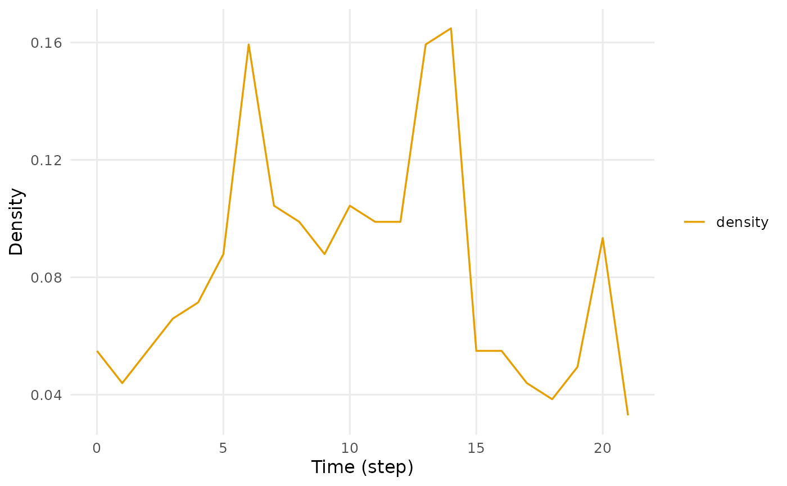

# Building and inspecting a temporal network

``` r

library(Dynet)
```

In this vignette we build temporal networks from the four kinds of
relational log that
[`dynet()`](https://pak.dynasite.org/Dynet/reference/dynet.md) reads,
inspect the objects, and qualify their clock with sessions, observation
windows and vertex activity spells.
[`vignette("dynet")`](https://pak.dynasite.org/Dynet/articles/dynet.md)
follows one network from construction through measurement.

## The four log formats

`Dynet` provides a single constructor,
[`dynet()`](https://pak.dynasite.org/Dynet/reference/dynet.md), for
interval, contact, threaded, and co-presence logs. These formats
represent different ways of observing interactions and their timing.
Format selection depends on the constructor arguments and the
identification of timing variables, as described below.

### Interval logs

An interval log records the onset and termination of each observed
relation. Each row defines a relational spell whose duration is the time
for which the tie is active.

`school_contacts` is a simulated interval log of face-to-face
interactions among fourteen named students over approximately three
weeks. The supplied variables `from` and `to` identify the initiating
and receiving students, respectively, and thus define directed
relational endpoints. The supplied variables `start` and `end` record
onset and termination in days elapsed since the beginning of the
observation period. Time is continuous on this scale, so an interaction
may begin and end within the same day.

``` r

head(school_contacts, 4)
#>    from   to start  end
#> 1 Jonas  Dan  0.00 1.10
#> 2  Gita  Ana  0.14 0.98
#> 3   Leo Mira  0.15 0.42
#> 4   Leo Iris  0.15 0.96
```

The network is constructed by passing the log to
[`dynet()`](https://pak.dynasite.org/Dynet/reference/dynet.md). The
print method reports the format and direction of the network, the
numbers of vertices, spells and distinct pairs, the observed range and
the measurement grid, followed by the first spells.

``` r

school <- dynet(school_contacts)
school
#> # Temporal network (interval format, directed) | a cograph netobject
#> # 14 vertices | 240 edge spells | 110 distinct pairs
#> # observed from 0 to 21.52 step, binned every 1
#> 
#>   from   to start  end duration weight
#>  Jonas  Dan  0.00 1.10     1.10      1
#>   Gita  Ana  0.14 0.98     0.84      1
#>    Leo Mira  0.15 0.42     0.27      1
#>    Leo Iris  0.15 0.96     0.81      1
#>   Kira  Ben  0.33 0.69     0.36      1
#>    Leo Iris  0.38 0.50     0.12      1
#> # 234 more spells. summary() describes the network; plot() draws it.
```

Column names need not be specified explicitly unless they differ from
the recognized aliases or are otherwise ambiguous. By default,
[`dynet()`](https://pak.dynasite.org/Dynet/reference/dynet.md) matches
column names against a predefined alias table using case-insensitive
comparison. Thus, `from` and `to`, `sender` and `receiver`, and `source`
and `target` are interpreted equivalently as the two relational
endpoints, while `start` and `end` may likewise be supplied as `onset`
and `terminus`. A `duration` column can be provided in place of `end`.

During construction,
[`dynet()`](https://pak.dynasite.org/Dynet/reference/dynet.md)
standardizes these inputs and derives additional variables where
necessary. For the present data, `duration` is computed as
`end - start`. The constructor also assigns a `weight` of 1 to every
spell because the input log contains no variable representing
multiplicity or repeated occurrence.

The 240 spells fall on 110 distinct ordered pairs. With $`n = 14`$
vertices there are $`n(n - 1) = 182`$ ordered pairs, so approximately
60% of the possible ties were realised at least once during the
three-week observation period. The aggregated graph is therefore dense;
the remainder of this vignette addresses how much of that connectivity
is present at any given time.

### Contact logs

A contact log records a single timestamp per relation and no termination
time. Each relation is an instantaneous event, so the network is a
contact sequence in which every spell has zero duration. `forum_posts`
is a simulated log of posts in a course forum. Each row records a
sender, a receiver, a `POSIXct` timestamp and the thread to which the
post belongs.

``` r

head(forum_posts, 3)
#>       sender   receiver           timestamp    thread
#> 1 student_14 student_05 2024-09-02 19:59:20 thread_47
#> 2 student_10 student_05 2024-09-03 13:24:23 thread_47
#> 3  teacher_A student_09 2024-09-03 16:31:58 thread_11
```

To read the log as a contact sequence,
[`dynet()`](https://pak.dynasite.org/Dynet/reference/dynet.md) is called
with `time` naming the timestamp column.

``` r

clicks <- dynet(forum_posts, time = "timestamp")
clicks
#> # Temporal network (contact format, directed) | a cograph netobject
#> # 20 vertices | 241 edge spells | 172 distinct pairs
#> # observed from 0 to 54.96387 days, binned every 1
#> 
#>        from         to     start       end duration weight
#>  student_14 student_05 0.0000000 0.0000000        0      1
#>  student_10 student_05 0.7257216 0.7257216        0      1
#>   teacher_A student_09 0.8559934 0.8559934        0      1
#>  student_04 student_05 1.1715344 1.1715344        0      1
#>  student_02 student_09 1.2382611 1.2382611        0      1
#>  student_06  teacher_A 1.9797595 1.9797595        0      1
#> # 235 more spells. summary() describes the network; plot() draws it.
```

The 241 posts become 241 instantaneous spells among 20 vertices on 172
of the 380 possible ordered pairs. Calendar times are converted to
elapsed time from the first event, in a unit chosen automatically to
suit the span; here the span is approximately 55 days, so the unit is
days and the default bin width is one day. Numeric input is left
unchanged and reported in the unit `step`.

### Threaded logs

Forum, chat and email logs likewise carry a timestamp and no termination
time. Reading them as contact sequences discards the fact that a post
remains part of the conversation for as long as the conversation
continues. Saqr and Nouri (2020) proposed a rule for deriving a
duration: a post is active from the moment it is written until the last
post in its thread. Formally, a post at time $`t_i`$ in thread $`T`$
becomes the spell $`[t_i, \max_{j \in T} t_j)`$. A post that provoked a
long exchange therefore remains active longer than one that did not, and
the last post of a thread has zero duration. This rule is applied by
calling [`dynet()`](https://pak.dynasite.org/Dynet/reference/dynet.md)
with `thread` naming the thread column; `nodes` optionally supplies a
table of vertex attributes.

``` r

forum <- dynet(forum_posts, thread = "thread", nodes = forum_people)
forum
#> # Temporal network (threaded format, directed) | a cograph netobject
#> # 20 vertices | 241 edge spells | 172 distinct pairs
#> # observed from 0 to 54.96387 days, binned every 1
#> # vertex attributes: role, achievement
#> 
#>        from         to     start      end duration weight    thread
#>  student_14 student_05 0.0000000 2.296969 2.296969      1 thread_47
#>  student_10 student_05 0.7257216 2.296969 1.571247      1 thread_47
#>   teacher_A student_09 0.8559934 3.235993 2.380000      1 thread_11
#>  student_04 student_05 1.1715344 2.296969 1.125435      1 thread_47
#>  student_02 student_09 1.2382611 3.235993 1.997732      1 thread_11
#>  student_06  teacher_A 1.9797595 3.235993 1.256234      1 thread_11
#> # 235 more spells. summary() describes the network; plot() draws it.
```

The network has the same 241 spells, 20 vertices and 172 pairs as the
contact reading, but each spell now has a positive duration, except for
the 62 spells that close their 62 threads, and each carries its thread
label. The two readings differ in the share of the observation period
that ties occupy. To compare them,
[`summary()`](https://rdrr.io/r/base/summary.html) is called on both
networks with `temporal_density` set to `TRUE`. This row is opt-in
because it integrates over every ordered pair and its cost is quadratic
in the number of vertices.

``` r

summary(clicks, temporal_density = TRUE)
#>                 property    value
#> 1                 format  contact
#> 2               directed      yes
#> 3               vertices       20
#> 4            edge spells      241
#> 5         distinct pairs      172
#> 6              time unit     days
#> 7          observed from        0
#> 8            observed to 54.96387
#> 9                   span 54.96387
#> 10             bin width        1
#> 11             time bins       55
#> 12 mean snapshot density   0.0112
#> 13      temporal density        0
#> 14              sessions     none
#> 15     vertex attributes     none
```

``` r

summary(forum, temporal_density = TRUE)
#>                 property             value
#> 1                 format          threaded
#> 2               directed               yes
#> 3               vertices                20
#> 4            edge spells               241
#> 5         distinct pairs               172
#> 6              time unit              days
#> 7          observed from                 0
#> 8            observed to          54.96387
#> 9                   span          54.96387
#> 10             bin width                 1
#> 11             time bins                55
#> 12 mean snapshot density            0.0248
#> 13      temporal density            0.0139
#> 14              sessions              none
#> 15     vertex attributes role, achievement
```

The two density rows measure different quantities. **Mean snapshot
density** is the average, over bins, of the share of ordered pairs with
at least one spell active at some time within the bin. **Temporal
density** integrates over time: if $`U_r`$ denotes the total time during
which ordered pair $`r`$ has at least one active spell, $`n(n - 1)`$ the
number of ordered pairs and $`\tau`$ the observed span,

``` math
D_T = \frac{\sum_r U_r}{n(n - 1)\,\tau}.
```

Under the contact reading the mean snapshot density is 0.0112 and the
temporal density is 0: an instantaneous tie is present in a bin but
occupies no time. Under the threaded reading the mean snapshot density
rises to 0.0248, because a post now spans every bin between its writing
and the end of its thread, and the temporal density is 0.0139: summed
over the 172 pairs, ties are active for 290.8 pair-days out of the 380
pairs times 54.96 days available. The thread rule is a modelling
decision. It is the rule under which a forum can be analysed as a
network of spells with positive duration, and it is applied only when
`thread` is named.

### Co-presence logs

A co-presence log is two-mode. It records actors against the occasions
they attended rather than against one another, so ties between actors
must be projected. `seminar_attendance` records which student attended
which weekly seminar over one term.

``` r

head(seminar_attendance, 3)
#>   student seminar       date
#> 1     s12 week_01 2024-09-03
#> 2     s22 week_01 2024-09-03
#> 3     s23 week_01 2024-09-03
```

To project the log onto ties between actors,
[`dynet()`](https://pak.dynasite.org/Dynet/reference/dynet.md) is called
with `actor` naming the actor column and `group` naming the occasion
column.

``` r

seminars <- dynet(seminar_attendance, actor = "student", group = "seminar")
seminars
#> # Temporal network (copresence format, undirected) | a cograph netobject
#> # 24 vertices | 417 edge spells | 224 distinct pairs
#> # observed from 0 to 77 days, binned every 1
#> 
#>  from  to start end duration weight   group
#>   s03 s10     0   0        0      1 week_01
#>   s03 s12     0   0        0      1 week_01
#>   s03 s21     0   0        0      1 week_01
#>   s03 s22     0   0        0      1 week_01
#>   s03 s23     0   0        0      1 week_01
#>   s10 s12     0   0        0      1 week_01
#> # 411 more spells. summary() describes the network; plot() draws it.
```

Every pair of students attending the same seminar becomes one spell,
tagged with the seminar that produced it. An occasion with $`k`$
attendees contributes $`\binom{k}{2}`$ spells, and the 417 spells here
are the sum of that quantity over the term’s seminars. Co-presence is
symmetric, so the network is undirected and `directed = TRUE` is
overridden; the 224 distinct pairs are 224 of the
$`\binom{24}{2} = 276`$ unordered pairs, or 81%. The log carries a date
and no termination time, so each seminar contributes instantaneous
spells on its day.

### Choosing the format

The default `format = "auto"` selects the threaded reading when `thread`
is named, the co-presence reading when `actor` and `group` are named,
the interval reading when a termination or duration column is present,
and the contact reading otherwise. The inference follows the arguments
supplied, not the columns present in the data. `forum_posts` contains a
`thread` column, but a call that does not name it yields a contact
sequence.

``` r

auto <- dynet(forum_posts)
auto
#> # Temporal network (contact format, directed) | a cograph netobject
#> # 20 vertices | 241 edge spells | 172 distinct pairs
#> # observed from 0 to 54.96387 days, binned every 1
#> 
#>        from         to     start       end duration weight
#>  student_14 student_05 0.0000000 0.0000000        0      1
#>  student_10 student_05 0.7257216 0.7257216        0      1
#>   teacher_A student_09 0.8559934 0.8559934        0      1
#>  student_04 student_05 1.1715344 1.1715344        0      1
#>  student_02 student_09 1.2382611 1.2382611        0      1
#>  student_06  teacher_A 1.9797595 1.9797595        0      1
#> # 235 more spells. summary() describes the network; plot() draws it.
```

To fix the reading explicitly rather than infer it, `format` is set to
one of `"interval"`, `"contact"`, `"threaded"` or `"copresence"`.

## Inspecting the network

To describe a network in a single table,
[`summary()`](https://rdrr.io/r/base/summary.html) is called on it. The
result has one row per property.

``` r

summary(school)
#>                 property        value
#> 1                 format     interval
#> 2               directed          yes
#> 3               vertices           14
#> 4            edge spells          240
#> 5         distinct pairs          110
#> 6              time unit         step
#> 7          observed from            0
#> 8            observed to        21.52
#> 9                   span        21.52
#> 10             bin width            1
#> 11             time bins           22
#> 12 mean snapshot density       0.0829
#> 13      temporal density not computed
#> 14              sessions         none
#> 15     vertex attributes         none
```

`vertices` is the fixed vertex set. Every result retains a row for every
vertex, so a vertex with no ties in a window appears with a value of
zero rather than being omitted. `edge spells` counts the derived spells,
one per row of an interval log, and `distinct pairs` the ordered pairs
on which they fall; 240 spells on 110 pairs indicates that most pairs
met more than once. `time unit` is `step` for numeric input and seconds,
minutes, hours or days for calendar input. The observed range defaults
to the first and last event. `bin width` is the measurement grid, set by
the `interval` argument, and `time bins` is the number of bins covering
the observed range: 22 bins of width 1 cover a span of 21.52.
`mean snapshot density` is the average, over those 22 bins, of the share
of the 182 ordered pairs in contact within the bin; at 0.0829,
approximately one pair in twelve is in contact on an average day,
compared with 60% over the whole period. `temporal density` is computed
only on request.

To obtain the spell table,
[`as.data.frame()`](https://rdrr.io/r/base/as.data.frame.html) is called
on the network. It returns the spells as constructed, together with the
derived `duration` and `weight` columns.

``` r

spells <- as.data.frame(school)
head(spells, 4)
#>    from   to start  end duration weight
#> 1 Jonas  Dan  0.00 1.10     1.10      1
#> 2  Gita  Ana  0.14 0.98     0.84      1
#> 3   Leo Mira  0.15 0.42     0.27      1
#> 4   Leo Iris  0.15 0.96     0.81      1
```

To obtain the vertex table,
[`as.data.frame()`](https://rdrr.io/r/base/as.data.frame.html) is called
with `what` set to `"nodes"`. For the forum network, this table carries
the attributes supplied through `nodes`.

``` r

forum_nodes <- as.data.frame(forum, what = "nodes")
head(forum_nodes, 4)
#>          name        role achievement
#> 1 facilitator Facilitator        <NA>
#> 2  student_01     Student      Middle
#> 3  student_02     Student         Low
#> 4  student_03     Student        High
```

`what` also accepts `"bins"` for the measurement grid, `"network"` for
the aggregated edge list, `"observations"` for the observation calendar,
`"observed_edges"` for the spells clipped to that calendar, and
`"vertex_spells"` for declared vertex activity.

``` r

bins <- as.data.frame(school, what = "bins")
head(bins, 4)
#>   bin lo hi time closed
#> 1   1  0  1    0  FALSE
#> 2   2  1  2    1  FALSE
#> 3   3  2  3    2  FALSE
#> 4   4  3  4    3  FALSE
```

Each bin extends from `lo` to `hi` and is labelled by its start `time`.
Bins are half-open, as spells are, with the exception of the last bin,
whose `closed` flag is `TRUE` so that an event at the final observed
instant is counted rather than dropped.

``` r

pairs <- as.data.frame(school, what = "network")
head(pairs, 4)
#>   from  to weight
#> 1 Cara Ana      1
#> 2  Dan Ana      2
#> 3 Gita Ana      3
#> 4 Hugo Ana      2
```

The aggregated edge list has one row per ordered pair that was ever in
contact, and its `weight` is the number of spells on that pair: Dan
contacted Ana twice and Gita contacted Ana three times. This is the
static graph on which a non-temporal analysis would operate.

## Direction, loops, weights and attributes

A small hand-constructed log illustrates the remaining constructor
arguments. It has five rows among three vertices, and its fifth row is a
self-tie from `A` to `A`. The `posts` column records the number of
messages each row represents.

``` r

tiny <- data.frame(
  from  = c("A", "B", "A", "C", "A"),
  to    = c("B", "A", "C", "A", "A"),
  start = c(0, 1, 2, 3, 4),
  end   = c(2, 3, 5, 4, 6),
  posts = c(3, 1, 2, 5, 1)
)
```

To build an undirected network with a weight per event,
[`dynet()`](https://pak.dynasite.org/Dynet/reference/dynet.md) is called
with `directed` set to `FALSE` and `weight` naming the multiplicity
column. A column named `weight`, `weights` or `strength` is detected
without being named, and a message reports the choice.

``` r

undirected <- dynet(tiny, directed = FALSE, weight = "posts")
#> Dropped 1 self-loop event(s). Use loops = TRUE to keep them.
undirected
#> # Temporal network (interval format, undirected) | a cograph netobject
#> # 3 vertices | 4 edge spells | 2 distinct pairs
#> # observed from 0 to 5 step, binned every 1
#> 
#>  from to start end duration weight
#>     A  B     0   2        2      3
#>     A  B     1   3        2      1
#>     A  C     2   5        3      2
#>     A  C     3   4        1      5
```

The five rows become four spells on two pairs. In an undirected network
the pair is unordered, so `B -> A` is folded onto `A -> B` while
retaining its own onset and termination, and the two spells on that pair
overlap in $`[1, 2)`$. The self-tie is dropped with a message, because a
loop is not a relation between two actors. The `weight` column now
carries the value of `posts`. To retain self-ties, `loops` is set to
`TRUE`; a retained loop adds two to the degree of its vertex, once as
sender and once as receiver.

``` r

with_loops <- dynet(tiny, loops = TRUE)
#> Keeping 1 self-loop event(s); each adds two to its vertex's degree.
with_loops
#> # Temporal network (interval format, directed) | a cograph netobject
#> # 3 vertices | 5 edge spells | 5 distinct pairs
#> # observed from 0 to 6 step, binned every 1
#> 
#>  from to start end duration weight posts
#>     A  B     0   2        2      1     3
#>     B  A     1   3        2      1     1
#>     A  C     2   5        3      1     2
#>     C  A     3   4        1      1     5
#>     A  A     4   6        2      1     1
```

With direction retained and the loop kept, the same five rows are five
spells on five distinct ordered pairs, and `posts` is carried as a spell
attribute because no weight was named.

Every measurement function tiles the observation period into bins of a
default width. To set that width, `interval` is specified in the
network’s time unit.

``` r

tiny_dn <- dynet(tiny, interval = 2)
#> Dropped 1 self-loop event(s). Use loops = TRUE to keep them.
summary(tiny_dn)
#>                 property        value
#> 1                 format     interval
#> 2               directed          yes
#> 3               vertices            3
#> 4            edge spells            4
#> 5         distinct pairs            4
#> 6              time unit         step
#> 7          observed from            0
#> 8            observed to            5
#> 9                   span            5
#> 10             bin width            2
#> 11             time bins            3
#> 12 mean snapshot density       0.3333
#> 13      temporal density not computed
#> 14              sessions         none
#> 15     vertex attributes         none
```

The span of 5 is covered by three bins of width 2. The mean snapshot
density of 0.3333 can be verified directly: the three bins contain two,
three and one active ordered pairs out of the $`3 \times 2 = 6`$
possible, and the mean of $`2/6`$, $`3/6`$ and $`1/6`$ is $`1/3`$.

To attach vertex attributes, a table is passed to `nodes`; the key
column is detected by name. To designate one attribute as the vertex
partition, it is named in `groups`. The partition is stored as a
`groups` column, and
[`cograph::splot()`](https://sonsoles.me/cograph/reference/splot.html)
colours by it without a further argument.

``` r

roles <- dynet(forum_posts, thread = "thread",
               nodes = forum_people, groups = "role")
role_nodes <- as.data.frame(roles, what = "nodes")
head(role_nodes, 4)
#>          name        role achievement      groups
#> 1 facilitator Facilitator        <NA> Facilitator
#> 2  student_01     Student      Middle     Student
#> 3  student_02     Student         Low     Student
#> 4  student_03     Student        High     Student
```

An attribute is what makes group-level questions possible. To count ties
within and between the groups defined by an attribute,
[`mixing()`](https://pak.dynasite.org/Dynet/reference/mixing.md) is
called with `attribute` naming the attribute. The result has one row per
ordered pair of groups per bin, and its `value` is the number of ordered
pairs of vertices in those two groups with an active tie in the bin.

``` r

role_mixing <- mixing(roles, attribute = "role")
head(role_mixing, 4)
#> # Mixing by role (graph-level)
#> # 55 time points, 1 per bin | time in days
#> # measures: Facilitator -> Facilitator, Student -> Facilitator, Teacher -> Facilitator, Facilitator -> Student
#> # first 4 of 495 rows
#> # active binary-dyad counts between vertex groups per time bin
#>  time                    measure value  from_group    to_group
#>     0 Facilitator -> Facilitator     0 Facilitator Facilitator
#>     0     Student -> Facilitator     0     Student Facilitator
#>     0     Teacher -> Facilitator     0     Teacher Facilitator
#>     0     Facilitator -> Student     0 Facilitator     Student
```

Three roles give nine ordered group pairs, and 55 daily bins give the
495 rows reported in the header. In the first bin no facilitator was yet
involved.

## Sessions

A session is a segment of the observation period that a time-respecting
path may not cross, although the clock runs continuously through it: a
course, a term, a class period, a day of a conference. Contacts in
different sessions remain ordered in time, but a chain of contacts
spanning two sessions is not treated as a path, because whatever passed
along it would have had to persist across the break. To declare
sessions, a column is named with `session`. When the log has no such
column, we cut the time axis instead: to assign each contact to the week
in which it started, we call
[`set_tie_sessions()`](https://pak.dynasite.org/Dynet/reference/set_tie_sessions.md)
with `breaks` at days 7 and 14 and `labels` for the three weeks.

``` r

sessioned <- set_tie_sessions(school, breaks = c(7, 14),
                              labels = c("week_1", "week_2", "week_3"))
summary(sessioned)
#>                 property        value
#> 1                 format     interval
#> 2               directed          yes
#> 3               vertices           14
#> 4            edge spells          240
#> 5         distinct pairs          110
#> 6              time unit         step
#> 7          observed from            0
#> 8            observed to        21.52
#> 9                   span        21.52
#> 10             bin width            1
#> 11             time bins           22
#> 12 mean snapshot density       0.0829
#> 13      temporal density not computed
#> 14              sessions            3
#> 15     vertex attributes         none
```

The network is otherwise unchanged; the summary now reports three
sessions. Every function that takes time also takes `sessions`, with
three settings that change what is computed rather than how the result
is laid out. To find the earliest time-respecting path from one student
to every other (Kempe, Kleinberg and Kumar, 2002),
[`paths()`](https://pak.dynasite.org/Dynet/reference/paths.md) is called
with `from` for the source and `sessions` for the setting, and the
result is summarised.

``` r

collapsed <- paths(sessioned, from = "Ana", sessions = "collapse")
summary(collapsed)
#>          property   value
#> 1          source     Ana
#> 2       direction forward
#> 3       reachable      13
#> 4 reachable share       1
#> 5  median latency    7.51
#> 6     max latency   11.66
#> 7     median hops       2
#> 8        max hops       4
```

With `"collapse"` the session labels are ignored and the period is
treated as a single stream, which is equivalent to an unsessioned
network. Ana reaches all thirteen other students, at a median latency of
7.51 days and within four hops.

``` r

inside <- paths(sessioned, from = "Ana", sessions = "bounded")
summary(inside)
#>          property   value
#> 1          source     Ana
#> 2       direction forward
#> 3       reachable      13
#> 4 reachable share       1
#> 5  median latency    8.21
#> 6     max latency   13.21
#> 7     median hops       2
#> 8        max hops       5
```

With `"bounded"` every path must remain within one session: the search
is run within each session and, for every destination, the best result
across sessions is retained. Ana still reaches every student, but by
routes that never cross a week boundary: the median latency rises from
7.51 to 8.21 days, the maximum from 11.66 to 13.21 days, and the longest
route from four hops to five. Some of the earliest routes in the
collapsed search used contacts on both sides of a week boundary and are
no longer admissible.

``` r

per_session <- paths(sessioned, from = "Ana", sessions = "separate")
summary(per_session)
#>    session        property   value
#> 1   week_1          source     Ana
#> 2   week_1       direction forward
#> 3   week_1       reachable       6
#> 4   week_1 reachable share   0.462
#> 5   week_1  median latency    6.36
#> 6   week_1     max latency    6.96
#> 7   week_1     median hops     1.5
#> 8   week_1        max hops       2
#> 9   week_2          source     Ana
#> 10  week_2       direction forward
#> 11  week_2       reachable      13
#> 12  week_2 reachable share       1
#> 13  week_2  median latency    3.36
#> 14  week_2     max latency    6.19
#> 15  week_2     median hops       3
#> 16  week_2        max hops       6
#> 17  week_3          source     Ana
#> 18  week_3       direction forward
#> 19  week_3       reachable       5
#> 20  week_3 reachable share   0.385
#> 21  week_3  median latency    6.42
#> 22  week_3     max latency    6.67
#> 23  week_3     median hops       2
#> 24  week_3        max hops       3
```

With `"separate"` each session is searched and reported on its own rows.
Within week 1 Ana reaches 6 of the 13 other students (share 0.462),
within week 2 all 13, and within week 3 only 5 (share 0.385). Week 2 is
the week in which the class is most connected: two of the three densest
days of the daily density series in
[`vignette("dynet")`](https://pak.dynasite.org/Dynet/articles/dynet.md),
days 13 and 14, fall within it, and its routes are also the longest, up
to six hops. `"bounded"` is the default. On a network without sessions
there is nothing to bound, so `"bounded"` and `"collapse"` coincide and
the default incurs no cost. `"separate"` requires a session column and
raises an error of class `dynet_bad_input` when none is present.

## Observation windows

The observed range defaults to the first and last event in the log. This
default treats the data as if observation began with the first contact
and ended with the last, which rarely corresponds to how a study was
conducted. The observed range matters because it is the denominator of
every rate and the horizon of every path search: a density is a share of
pair-time, and a path search terminates at the end of observation. When
the study period is known, it should be declared by setting
`observation_start` and `observation_end`.

``` r

bounded <- dynet(school_contacts, observation_start = 0, observation_end = 14)
summary(bounded)
#>                 property        value
#> 1                 format     interval
#> 2               directed          yes
#> 3               vertices           14
#> 4            edge spells          240
#> 5         distinct pairs          110
#> 6              time unit         step
#> 7          observed from            0
#> 8            observed to           14
#> 9                   span           14
#> 10             bin width            1
#> 11             time bins           14
#> 12 mean snapshot density       0.0922
#> 13      temporal density not computed
#> 14              sessions         none
#> 15     vertex attributes         none
```

The span is 14 rather than 21.52, giving 14 bins rather than 22, and the
mean snapshot density is 0.0922 rather than 0.0829. The spells are
unchanged; the first two weeks are simply denser than the third, and
averaging over them alone yields a higher value. The bounds clip
exposure and do not filter the data:
[`as.data.frame()`](https://rdrr.io/r/base/as.data.frame.html) still
returns every spell as supplied. A spell of positive duration
contributes its half-open intersection with the window, and an
instantaneous event on either limit is retained.

Observation is often interrupted: a holiday, a system outage, a gap
between data exports. To declare the observed periods, a table of their
starts and ends is passed to `observation_spells`; overlapping and
adjacent periods are merged. To read the calendar back,
[`as.data.frame()`](https://rdrr.io/r/base/as.data.frame.html) is called
with `what` set to `"observations"`.

``` r

gapped <- dynet(
  school_contacts,
  observation_spells = data.frame(start = c(0, 12), end = c(8, 21))
)
as.data.frame(gapped, what = "observations")
#>   observation start end duration instant
#> 1           1     0   8        8   FALSE
#> 2           2    12  21        9   FALSE
```

``` r

summary(gapped)
#>                 property        value
#> 1                 format     interval
#> 2               directed          yes
#> 3               vertices           14
#> 4            edge spells          240
#> 5         distinct pairs          110
#> 6              time unit         step
#> 7          observed from            0
#> 8            observed to           21
#> 9                   span           21
#> 10             bin width            1
#> 11             time bins           17
#> 12 mean snapshot density       0.0824
#> 13      temporal density not computed
#> 14              sessions         none
#> 15     vertex attributes         none
```

The two periods cover 8 and 9 days and give 17 bins rather than the 21
that a hull from 0 to 21 would give: the grid restarts within each
period and never places a bin in the gap. Exposure is the sum of the two
durations rather than their hull, so the four unobserved days do not
inflate any denominator, and an event falling in the gap is not counted.

The calendar can be modified after construction. To replace it,
[`set_observations()`](https://pak.dynasite.org/Dynet/reference/set_observations.md)
is called with `start` and `end`. To restore the implicit continuous
window,
[`clear_observations()`](https://pak.dynasite.org/Dynet/reference/clear_observations.md)
is called.

``` r

narrowed <- set_observations(school, start = 2, end = 10)
as.data.frame(narrowed, what = "observations")
#>   observation start end duration instant
#> 1           1     2  10        8   FALSE
```

``` r

continuous <- clear_observations(gapped)
as.data.frame(continuous, what = "observations")
#>   observation start   end duration instant
#> 1           1     0 21.52    21.52   FALSE
```

## Vertex activity spells

Observation windows state when the study was in progress. Vertex
activity spells state when a vertex was eligible to have ties at all: a
student who enrolled late, a participant who left, a member present only
in some terms. The distinction matters for every per-vertex measure,
because a vertex with no contacts in a bin should score zero only if it
could have had contacts. To declare activity, a table with `node`,
`start` and `end` is passed to `vertex_spells`. A vertex with no row in
the table is eligible throughout.

``` r

arrivals <- data.frame(
  node  = c("Ana", "Ben"),
  start = c(0, 7),
  end   = c(21.52, 21.52)
)
scheduled <- dynet(school_contacts, vertex_spells = arrivals)
as.data.frame(scheduled, what = "vertex_spells")
#>   vertex_spell node start   end duration instant session onset_censored
#> 1            1  Ana     0 21.52    21.52   FALSE    <NA>          FALSE
#> 2            2  Ben     7 21.52    14.52   FALSE    <NA>          FALSE
#>   terminus_censored
#> 1             FALSE
#> 2             FALSE
```

Ben is now eligible from day 7. He retains a row in every bin, but the
bins before his arrival report `NA` rather than zero, which
distinguishes having had no contacts from not having been present. To
observe this,
[`dyn_centrality()`](https://pak.dynasite.org/Dynet/reference/dyn_centrality.md)
is called with `measure` set to `"degree"` on the two networks.

``` r

school_degree <- dyn_centrality(school, measure = "degree")
head(school_degree, 4)
#> # Degree (node-level)
#> # 14 vertices | 22 time points, 1 per bin | time in step
#> # first 4 of 308 rows
#>  time node measure value
#>     0  Ana  degree     1
#>     0  Ben  degree     1
#>     0 Cara  degree     1
#>     0  Dan  degree     1
```

``` r

scheduled_degree <- dyn_centrality(scheduled, measure = "degree")
head(scheduled_degree, 4)
#> # Degree (node-level)
#> # 14 vertices | 22 time points, 1 per bin | time in step
#> # first 4 of 308 rows
#>  time node measure value
#>     0  Ana  degree     1
#>     0  Ben  degree    NA
#>     0 Cara  degree     1
#>     0  Dan  degree     1
```

The distinction affects every per-vertex summary, because the bins
before arrival are no longer averaged in as zeros. To reduce each series
to one row per vertex,
[`summary()`](https://rdrr.io/r/base/summary.html) is called on it.

``` r

school_degree_summary <- summary(school_degree)
head(school_degree_summary, 3)
#>   node measure  n     mean       sd min max peak_time
#> 1  Ana  degree 22 2.181818 2.015095   0   7         6
#> 2  Ben  degree 22 2.000000 1.234427   0   4         4
#> 3 Cara  degree 22 2.227273 1.342770   0   5         4
```

``` r

scheduled_degree_summary <- summary(scheduled_degree)
head(scheduled_degree_summary, 3)
#>   node measure  n     mean       sd min max peak_time
#> 1  Ana  degree 22 2.181818 2.015095   0   7         6
#> 2  Ben  degree 15 2.133333 1.125463   0   4        11
#> 3 Cara  degree 22 2.227273 1.342770   0   5         4
```

Ana is unchanged at a mean degree of 2.18 over 22 bins. Ben’s mean rises
from 2.00 over 22 bins to 2.13 over the 15 bins in which he was
eligible, his standard deviation falls from 1.23 to 1.13, and his peak
moves from day 4, which now precedes his arrival, to day 11. The eleven
contacts recorded for Ben before day 7 remain in the spell table; the
declaration states only that the days before his arrival were not
opportunities for him.

The declaration can be edited. To replace the table,
[`set_vertex_spells()`](https://pak.dynasite.org/Dynet/reference/set_vertex_spells.md)
is called; to extend it,
[`add_vertex_spells()`](https://pak.dynasite.org/Dynet/reference/add_vertex_spells.md)
is called.

``` r

activity <- set_vertex_spells(school, arrivals)
extended <- add_vertex_spells(activity,
                              data.frame(node = "Cara", start = 3, end = 12))
as.data.frame(extended, what = "vertex_spells")
#>   vertex_spell node start   end duration instant session onset_censored
#> 1            1  Ana     0 21.52    21.52   FALSE    <NA>          FALSE
#> 2            2  Ben     7 21.52    14.52   FALSE    <NA>          FALSE
#> 3            3 Cara     3 12.00     9.00   FALSE    <NA>          FALSE
#>   terminus_censored
#> 1             FALSE
#> 2             FALSE
#> 3             FALSE
```

## Editing a network

Every editing function returns a new network and leaves its input
unchanged. Each edit rebuilds the spell table and the `cograph`
projection together, so a temporal network is edited through these
functions and not through `cograph`’s static setters, which carry no
temporal information.

To add a vertex,
[`add_nodes()`](https://pak.dynasite.org/Dynet/reference/add_nodes.md)
is called with a table of names and attributes. To add a tie,
[`add_ties()`](https://pak.dynasite.org/Dynet/reference/add_ties.md) is
called with a table of spells; each tie endpoint must already exist as a
vertex.

``` r

step1 <- add_nodes(school, data.frame(name = "Nova", role = "exchange"))
step2 <- add_ties(step1, data.frame(
  from = "Ana", to = "Nova", start = 4, end = 6
))
summary(step2)
#>                 property        value
#> 1                 format     interval
#> 2               directed          yes
#> 3               vertices           15
#> 4            edge spells          241
#> 5         distinct pairs          111
#> 6              time unit         step
#> 7          observed from            0
#> 8            observed to        21.52
#> 9                   span        21.52
#> 10             bin width            1
#> 11             time bins           22
#> 12 mean snapshot density       0.0723
#> 13      temporal density not computed
#> 14              sessions         none
#> 15     vertex attributes         role
```

The edited network has 15 vertices, 241 spells, 111 distinct pairs and a
`role` attribute, which every original vertex holds as `NA`. Its mean
snapshot density is 0.0723, lower than the 0.0829 of the original
although a tie was added: the number of ordered pairs rose from 182 to
$`15 \times 14 =
210`$, so the same ties are shares of a larger denominator. Adding a
vertex changes every density in the network, which is why the vertex set
is fixed at construction and edited deliberately. The original is
unchanged.

``` r

summary(school)
#>                 property        value
#> 1                 format     interval
#> 2               directed          yes
#> 3               vertices           14
#> 4            edge spells          240
#> 5         distinct pairs          110
#> 6              time unit         step
#> 7          observed from            0
#> 8            observed to        21.52
#> 9                   span        21.52
#> 10             bin width            1
#> 11             time bins           22
#> 12 mean snapshot density       0.0829
#> 13      temporal density not computed
#> 14              sessions         none
#> 15     vertex attributes         none
```

To remove a tie,
[`remove_ties()`](https://pak.dynasite.org/Dynet/reference/remove_ties.md)
is called with the endpoints and the onset time. To rename vertices,
[`rename_nodes()`](https://pak.dynasite.org/Dynet/reference/rename_nodes.md)
is called with a named vector mapping old names to new.

``` r

step3 <- remove_ties(step2, from = "Ana", to = "Nova", start = 4)
summary(step3)
#>                 property        value
#> 1                 format     interval
#> 2               directed          yes
#> 3               vertices           15
#> 4            edge spells          240
#> 5         distinct pairs          110
#> 6              time unit         step
#> 7          observed from            0
#> 8            observed to        21.52
#> 9                   span        21.52
#> 10             bin width            1
#> 11             time bins           22
#> 12 mean snapshot density       0.0719
#> 13      temporal density not computed
#> 14              sessions         none
#> 15     vertex attributes         role
```

``` r

renamed <- rename_nodes(step2, c(Nova = "Nova B."))
renamed_nodes <- as.data.frame(renamed, what = "nodes")
tail(renamed_nodes, 3)
#>       name     role
#> 13    Mira     <NA>
#> 14    Nils     <NA>
#> 15 Nova B. exchange
```

Removing the tie returns the spell and pair counts to 240 and 110 while
Nova remains as a vertex with no ties, and the density settles at
0.0719, the original 15.09 mean edges per bin over 210 pairs. To
restrict a network to a subset of its vertices,
[`induce_subgraph()`](https://pak.dynasite.org/Dynet/reference/induce_subgraph.md)
is called with `nodes` for the vertex names; `ties` instead accepts a
condition on the spell table.

``` r

five <- induce_subgraph(school, nodes = c("Ana", "Ben", "Cara", "Dan", "Eve"))
summary(five)
#>                 property        value
#> 1                 format     interval
#> 2               directed          yes
#> 3               vertices            5
#> 4            edge spells           18
#> 5         distinct pairs           11
#> 6              time unit         step
#> 7          observed from         3.17
#> 8            observed to        21.33
#> 9                   span        18.16
#> 10             bin width            1
#> 11             time bins           19
#> 12 mean snapshot density       0.0684
#> 13      temporal density not computed
#> 14              sessions         none
#> 15     vertex attributes         none
```

The five students share 18 spells on 11 of their 20 ordered pairs. The
observed range narrows from 0 to 21.52 to 3.17 to 21.33, because the
subgraph’s range defaults to its own first and last contact; to retain
the original study period, it must be declared with `observation_start`
and `observation_end`.

## Descriptive measures

A temporal network is measured in windows. The observation period is
divided into bins, the spells active in each bin are aggregated into a
static snapshot, a static measure is computed on every snapshot, and the
result is a time series. To measure graph-level structure in each bin,
[`metrics()`](https://pak.dynasite.org/Dynet/reference/metrics.md) is
called with `measure` naming the statistics. Several measures are
returned stacked in one data frame with a `measure` column.

``` r

basics <- metrics(school, measure = c("density", "edges", "active_nodes"))
head(basics, 6)
#> # Graph structure (graph-level)
#> # 22 time points, 1 per bin | time in step
#> # measures: density, edges, active_nodes
#> # first 6 of 66 rows
#>  time      measure       value
#>     0      density  0.05494505
#>     0        edges 10.00000000
#>     0 active_nodes 13.00000000
#>     1      density  0.04395604
#>     1        edges  8.00000000
#>     1 active_nodes  8.00000000
```

`edges` is the number of ordered pairs with at least one active spell in
the bin, `density` divides it by the 182 possible pairs, and
`active_nodes` is the number of vertices with at least one tie. On day
0, 10 ties among 13 of the 14 students give a density of 0.055; on day
1, 8 ties among 8 students give 0.044.

To reduce each series to one row,
[`summary()`](https://rdrr.io/r/base/summary.html) is called on the
result. The table reports the mean, standard deviation, range and peak
time of each measure.

``` r

six <- metrics(school, measure = c("density", "edges", "active_nodes",
                                   "components", "transitivity",
                                   "reciprocity"))
summary(six)
#>        measure  n        mean         sd        min        max peak_time
#> 1 active_nodes 22 12.13636364 2.07698166 7.00000000 14.0000000         5
#> 2   components 22  3.59090909 2.38365647 1.00000000  9.0000000        21
#> 3      density 22  0.08291708 0.03929021 0.03296703  0.1648352        14
#> 4        edges 22 15.09090909 7.15081807 6.00000000 30.0000000        14
#> 5  reciprocity 22  0.14503815 0.13886108 0.00000000  0.4666667        14
#> 6 transitivity 22  0.11496262 0.12515367 0.00000000  0.4000000        11
```

Density averages 0.083 over the 22 daily bins and peaks at 0.165 on day
14, the day with the most ties (30). On an average day 12.1 of the 14
students have at least one contact, and on every day at least 7 do.
`components` counts the weakly connected components of the snapshot,
ignoring direction and counting isolates as components of size one. It
averages 3.6, equals 1 on day 14, when the 30 ties join the whole class
into one connected snapshot, and peaks at 9 on day 21, the truncated
final half-day, when 6 ties leave 7 students isolated. `reciprocity` is
the edgewise measure, the share of arcs $`i \to j`$ in the bin for which
$`j \to i`$ is also present; it averages 0.145 and reaches 0.467 on day
14, so even on the busiest day fewer than half the contacts were
returned within the day. `transitivity` is the share of two-paths
$`i \to j \to k`$ closed by an arc $`i \to k`$, the weak convention of
[`sna::gtrans()`](https://rdrr.io/pkg/sna/man/gtrans.html); it averages
0.115 and peaks at 0.4 on day 11. Both cohesion measures are low because
a daily snapshot of a classroom is sparse, and both are computed on the
snapshot as a static graph.

`step` and `window` are separate arguments. `step` is the interval
between measurements and `window` the length of time each measurement
covers, counted forward from the measurement time. Equal values tile the
period into disjoint bins, which is the default. A `window` wider than
`step` yields a rolling series in which successive windows overlap.

``` r

rolling <- metrics(school, measure = "density", step = 1, window = 7)
head(rolling, 4)
#> # Density (graph-level)
#> # 22 time points, step 1, window 7 (rolling) | time in step
#> # first 4 of 22 rows
#>  time measure     value
#>     0 density 0.3241758
#>     1 density 0.3461538
#>     2 density 0.3571429
#>     3 density 0.3791209
```

The first rolling value, 0.324, is the share of the 182 ordered pairs in
contact at any time during the seven days from day 0, namely 59 pairs,
compared with 10 pairs and 0.055 in the first day alone. A rolling
window trades temporal resolution for a denser, less noisy snapshot. To
plot a series, [`plot()`](https://rdrr.io/r/graphics/plot.default.html)
is called on it.

``` r

school_density <- metrics(school, measure = "density")
plot(school_density)
```



The measures above record presence within a bin: a pair counts once
regardless of how briefly or how often it was in contact. Two measures
integrate over time instead. `temporal_density` is the occupied share of
pair-time within the window, the quantity $`D_T`$ defined above but
computed per window. `onset_intensity` is the number of spells starting
in the window divided by the eligible pair-time, $`n(n-1)`$ times the
window length, and is therefore a rate of tie formation per unit of
opportunity.

``` r

integrated <- metrics(school, measure = c("temporal_density", "onset_intensity"),
                      step = 7, window = 7)
integrated
#> # Graph structure (graph-level)
#> # 4 time points, 7 per bin | time in step
#> # measures: temporal_density, onset_intensity
#>  time          measure       value
#>     0 temporal_density 0.024285714
#>     0  onset_intensity 0.060439560
#>     7 temporal_density 0.038602826
#>     7  onset_intensity 0.083987441
#>    14 temporal_density 0.023524333
#>    14  onset_intensity 0.043956044
#>    21 temporal_density 0.001342229
#>    21  onset_intensity 0.000000000
```

In each full week the eligible pair-time is $`182 \times 7 = 1274`$
pair-days. The onset intensities of 0.0604, 0.0840 and 0.0440 therefore
correspond to 77, 107 and 56 spells starting in the three weeks, which
sum to the 240 spells of the log; the final bin, from day 21 to 21.52,
contains no new spell. Occupied pair-time is highest in the second week,
at 0.0386, or 49.2 pair-days of contact out of 1274 available, and falls
to 0.0013 in the final partial bin. Compared with the mean snapshot
density of 0.083, the temporal density of approximately 0.03 indicates
that a pair in contact at some time on a given day is, on average, in
contact for only a fraction of that day.

To list the ties present in one bin rather than a statistic summarising
them,
[`snapshots()`](https://pak.dynasite.org/Dynet/reference/snapshots.md)
is called with `at` for the time. Without `at` the whole grid is
returned, one row per tie per bin.

``` r

at_five <- snapshots(school, at = 5)
at_five
#> # Snapshot edges | 1 bin | 16 tie rows | time in step
#>    time from   to weight n_spells
#> 1     5 Kira  Leo      1        1
#> 2     5 Kira Gita      1        1
#> 3     5  Leo Cara      1        1
#> 4     5  Leo Finn      1        1
#> 5     5 Mira  Ana      1        1
#> 6     5 Nils  Ben      1        1
#> 7     5 Nils  Eve      1        1
#> 8     5  Ben  Eve      1        1
#> 9     5  Ben Finn      1        1
#> 10    5 Cara Kira      1        1
#> # 6 more rows. summary() counts them by bin.
```

The 16 rows are the 16 ties counted by `edges` on day 5, each with its
weight and the number of spells that produced it.

To count the ties that formed and dissolved in each bin,
[`events()`](https://pak.dynasite.org/Dynet/reference/events.md) is
called on the network. A formation is a spell onset and a dissolution a
spell termination.

``` r

changes <- events(school)
head(changes, 6)
#> # Edge dynamics (graph-level)
#> # 22 time points, 1 per bin | time in step
#> # measures: formation, dissolution
#> # first 6 of 44 rows
#>  time     measure value
#>     0   formation    11
#>     0 dissolution     7
#>     1   formation     4
#>     1 dissolution     6
#>     2   formation     8
#>     2 dissolution     6
```

In the first bin 11 ties formed and 7 dissolved, so contact was
accumulating; in the second, 4 formed and 6 dissolved.

Duration is what distinguishes an interval log from a contact sequence.
To measure how long ties lasted,
[`durations()`](https://pak.dynasite.org/Dynet/reference/durations.md)
is called. The default `measure` reports, for each ordered pair, the
number of spells (`events`), their summed duration (`total`) and their
mean duration (`mean`). `unit` selects the entity to which a duration
belongs: `"pair"` for a dyad’s whole history, `"spell"` for the
individual episodes, `"vertex_activity"` and `"vertex_spell"` for vertex
presence, and `"node_ties"` for the tie time incident to each vertex.

``` r

tie_durations <- durations(school)
head(tie_durations, 6)
#> # Relationship duration (edge-level)
#> # time in step
#> # first 6 of 330 rows
#> # durations in step
#>  from    to measure value
#>   Ana  Cara  events     1
#>   Ana   Dan  events     3
#>   Ana  Gita  events     5
#>   Ana  Iris  events     1
#>   Ana Jonas  events     4
#>   Ana  Kira  events     1
```

Ana contacted Gita five times and Jonas four times over the three weeks,
and Cara, Iris and Kira once each. The 110 pairs times three measures
give the 330 rows reported in the header.

``` r

spell_durations <- durations(school, unit = "spell")
head(spell_durations, 4)
#> # Relationship duration (edge-level)
#> # time in step
#> # first 4 of 240 rows
#> # durations in step
#>  from   to raw_spell  measure value
#>   Ana Cara        71 duration  0.10
#>   Ana  Dan       143 duration  0.32
#>   Ana  Dan       168 duration  0.51
#>   Ana  Dan       228 duration  0.19
```

At the spell level there is one row per episode, 240 in all, each
identified by its row in the source log. Ana’s three contacts with Dan
lasted 0.32, 0.51 and 0.19 days.

``` r

node_durations <- durations(school, unit = "node_ties", mode = "all")
head(node_durations, 4)
#> # Incident tie duration (node-level)
#> # 14 vertices | mode all | time in step
#> # first 4 of 28 rows
#> # durations in step
#>  node measure value
#>   Ana  events    36
#>   Ben  events    34
#>  Cara  events    35
#>   Dan  events    35
```

At the vertex level `events` counts the spells incident to each student
in either direction: Ana took part in 36 contacts, Ben in 34.

## Collapsing to a static network

To reduce a period of the temporal network to a static weighted network,
[`collapse_network()`](https://pak.dynasite.org/Dynet/reference/collapse_network.md)
is called with `start` and `end` delimiting the period. The result is a
`cograph` network with one row per pair that was in contact during the
period, carrying every weighting the package can compute, so the
weighting is selected by name rather than recomputed.

``` r

flat <- collapse_network(school, start = 0, end = 7)
flat
#> # Collapsed temporal network | 14 vertices | 59 edges | weight: binary
#> # 0 to 7 step
#>  from    to binary union_duration total_duration duration_fraction spell_count
#>   Ana  Cara      1           0.10           0.10        0.01428571           1
#>   Ana  Gita      1           0.33           0.33        0.04714286           1
#>   Ana Jonas      1           1.44           1.44        0.20571429           3
#>   Ana  Mira      1           0.41           0.41        0.05857143           1
#>   Ben   Eve      1           1.58           1.58        0.22571429           2
#>   Ben  Finn      1           0.23           0.23        0.03285714           1
#>  weight_sum weighted_duration latest_weight first last activity.duration
#>           1              0.10             1  6.67 6.77              0.10
#>           1              0.33             1  6.57 6.90              0.33
#>           3              1.44             1  2.12 7.00              1.44
#>           1              0.41             1  6.36 6.77              0.41
#>           2              1.58             1  3.61 6.24              1.58
#>           1              0.23             1  4.91 5.14              0.23
#>  activity.count
#>               1
#>               1
#>               3
#>               1
#>               2
#>               1
```

The first week contains 59 pairs, the same 59 that gave the first
rolling density of 0.324. For each pair the table gives the presence
indicator (`binary`), the calendar time with at least one active spell
(`union_duration`), the summed spell time (`total_duration`), the share
of the seven days occupied (`duration_fraction`), the number of spells
and the weight sums, and the times of the first and last contact. Ana
and Jonas were in contact three times during the week, for 1.44 days in
total, or 21% of the week, between days 2.12 and 7.00; the two durations
coincide because their spells do not overlap. To select the weighting
that `cograph` draws and measures, `weight` is set.

``` r

first_week <- collapse_network(school, start = 0, end = 7,
                               weight = "union_duration")
first_week
#> # Collapsed temporal network | 14 vertices | 59 edges | weight: union_duration
#> # 0 to 7 step
#>  from    to binary union_duration total_duration duration_fraction spell_count
#>   Ana  Cara      1           0.10           0.10        0.01428571           1
#>   Ana  Gita      1           0.33           0.33        0.04714286           1
#>   Ana Jonas      1           1.44           1.44        0.20571429           3
#>   Ana  Mira      1           0.41           0.41        0.05857143           1
#>   Ben   Eve      1           1.58           1.58        0.22571429           2
#>   Ben  Finn      1           0.23           0.23        0.03285714           1
#>  weight_sum weighted_duration latest_weight first last activity.duration
#>           1              0.10             1  6.67 6.77              0.10
#>           1              0.33             1  6.57 6.90              0.33
#>           3              1.44             1  2.12 7.00              1.44
#>           1              0.41             1  6.36 6.77              0.41
#>           2              1.58             1  3.61 6.24              1.58
#>           1              0.23             1  4.91 5.14              0.23
#>  activity.count
#>               1
#>               1
#>               3
#>               1
#>               2
#>               1
```

A collapsed network is the appropriate object for a static method: a
layout, a community detection, a comparison with a static reference.
What it no longer retains is the order of events, the duration of each
episode and the existence of a time-respecting path, which are available
only in the temporal object.

## References

Holme, P., & Saramäki, J. (2012). Temporal networks. *Physics Reports*,
519(3), 97–125.

Kempe, D., Kleinberg, J., & Kumar, A. (2002). Connectivity and inference
problems for temporal networks. *Journal of Computer and System
Sciences*, 64(4), 820–842.

Saqr, M., & Nouri, J. (2020). High resolution temporal network analysis
to understand and improve collaborative learning. In *Proceedings of the
Tenth International Conference on Learning Analytics & Knowledge*
(pp. 314–319). ACM.
