# Chapter 17 from the published data files

## What this is

Chapter 17 of *Learning Analytics Methods and Tutorials* builds a
temporal network from a MOOC discussion forum using `networkDynamic`,
`tsna` and `ndtv`. This is the same analysis in **Dynet**.

[`vignette("ch17-temporal-networks")`](https://pak.dynasite.org/Dynet/articles/ch17-temporal-networks.md)
is the version that ships with the package. This one is a pkgdown
**article** rather than a vignette, and it differs in two ways that are
the reason it is kept: it downloads the two published CSV files at
render time instead of reading the bundled `mooc_posts` and
`mooc_people`, and it does its data preparation with `dplyr`, `rio` and
`janitor` — the way a reader following the chapter would write it —
rather than in base R. Both make it unshippable and neither changes a
number.

It is not a line-by-line transcription. Two things in the chapter’s code
are defects, and reproducing them would mean writing worse code to get
worse numbers; both are named and measured in [what
differs](#what-differs).

``` r

# Prefer the working tree, fall back to the installed package, so the article
# builds whether or not it is rendered from inside the repository.
package_root <- normalizePath(file.path(dirname(knitr::current_input(dir = TRUE)),
                                        "../.."), mustWork = FALSE)
if (dir.exists(package_root) && requireNamespace("devtools", quietly = TRUE)) {
  devtools::load_all(package_root, quiet = TRUE)
} else {
  library(Dynet)
}
library(dplyr)
library(rio)
```

## 1. Data

``` r

net_edges <- import("https://raw.githubusercontent.com/lamethods/data/main/6_snaMOOC/DLT1%20Edgelist.csv") |>
  janitor::clean_names()
net_nodes <- import("https://raw.githubusercontent.com/lamethods/data/main/6_snaMOOC/DLT1%20Nodes.csv")
```

Recode expertise and name the vertex key.

``` r

net_nodes <- net_nodes |>
  rename(name = UID) |>
  mutate(name = as.character(name),
         expert_level = case_match(experience,
                                   1 ~ "Expert", 2 ~ "Student", 3 ~ "Teacher"))
```

Drop self-loops and keep only discussions that had an exchange.
Timestamps stay as they are:
[`dynet()`](https://pak.dynasite.org/Dynet/reference/dynet.md) converts
them.

``` r

posts <- net_edges |>
  filter(sender != receiver) |>
  mutate(sender = as.character(sender), receiver = as.character(receiver)) |>
  group_by(discussion_title) |>
  filter(n() > 1) |>
  ungroup()

nrow(posts)
#> [1] 2406
n_distinct(posts$discussion_title)
#> [1] 299
```

## 2. The temporal network

Forum data is threaded: a tie is live from its own post until the thread
falls silent (Saqr & Nouri, 2020). Naming `thread` selects that.

``` r

dn_full <- dynet(posts, from = "sender", to = "receiver", time = "timestamp",
                 thread = "discussion_title", nodes = net_nodes,
                 time_unit = "days", directed = TRUE, loops = FALSE)

summary(dn_full)
#>                 property
#> 1                 format
#> 2               directed
#> 3               vertices
#> 4            edge spells
#> 5         distinct pairs
#> 6              time unit
#> 7          observed from
#> 8            observed to
#> 9                   span
#> 10             bin width
#> 11             time bins
#> 12 mean snapshot density
#> 13      temporal density
#> 14              sessions
#> 15     vertex attributes
#>                                                                                                                           value
#> 1                                                                                                                      threaded
#> 2                                                                                                                           yes
#> 3                                                                                                                           441
#> 4                                                                                                                          2406
#> 5                                                                                                                          1907
#> 6                                                                                                                          days
#> 7                                                                                                                             0
#> 8                                                                                                                      72.01111
#> 9                                                                                                                      72.01111
#> 10                                                                                                                            1
#> 11                                                                                                                           73
#> 12                                                                                                                       0.0035
#> 13                                                                                                                 not computed
#> 14                                                                                                                         none
#> 15 Facilitator, role1, experience, experience2, grades, location, region, country, group, gender, expert, connect, expert_level
```

## 3. The active subnetwork

The chapter keeps vertices with more than 20 ties.

``` r

dn <- induce_subgraph(dn_full, degree > 20)
dn
#> # Temporal network (threaded format, directed) | a cograph netobject
#> # 45 vertices | 686 edge spells | 428 distinct pairs
#> # observed from 0.1138889 to 72.01111 days, binned every 1
#> # vertex attributes: Facilitator, role1, experience, experience2, grades, location, region, country, group, gender, expert, connect, expert_level
#> 
#>  from  to     start      end duration weight
#>   219 444 0.1138889 69.47778 69.36389      1
#>   310 444 0.1680556 68.38681 68.21875      1
#>    19 310 0.2784722 14.10486 13.82639      1
#>    19 444 0.2909722 69.47778 69.18681      1
#>    30 444 0.8791667 69.47778 68.59861      1
#>    30 444 0.8819444 68.38681 67.50486      1
#>                                                                     thread
#>                         Most important change for your school or district?
#>                                  Submitting Questions for the Expert Panel
#>  How important is teacher training in a digital learning transition phase?
#>                         Most important change for your school or district?
#>                         Most important change for your school or district?
#>                                  Submitting Questions for the Expert Panel
#>  discussion_category                   parent_category category_text
#>              Group M       Units 1-3 Discussion Groups              
#>  Unit 1 Expert Panel Unit 1-3 Expert Panel Discussions              
#>            Group A-C       Units 1-3 Discussion Groups              
#>              Group M       Units 1-3 Discussion Groups              
#>              Group N       Units 1-3 Discussion Groups              
#>  Unit 1 Expert Panel Unit 1-3 Expert Panel Discussions              
#>                                                                                          discussion_identifier
#>                           Most important change for your school or district?Group MUnits 1-3 Discussion Groups
#>                  Submitting Questions for the Expert PanelUnit 1 Expert PanelUnit 1-3 Expert Panel Discussions
#>  How important is teacher training in a digital learning transition phase?Group A-CUnits 1-3 Discussion Groups
#>                           Most important change for your school or district?Group MUnits 1-3 Discussion Groups
#>                           Most important change for your school or district?Group NUnits 1-3 Discussion Groups
#>                  Submitting Questions for the Expert PanelUnit 1 Expert PanelUnit 1-3 Expert Panel Discussions
#>  comment_id discussion_id
#>           7             6
#>          13             8
#>          16             9
#>          18             6
#>          32             2
#>          33             8
#> # 680 more spells. summary() describes the network; plot() draws it.
```

## 4. Visualisation

``` r

plot(dn, type = "network")
```

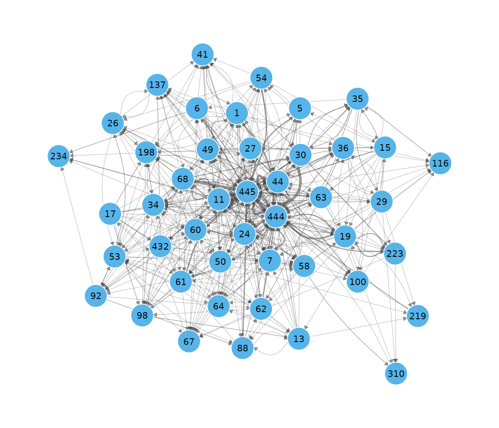

Weeks 1 to 4 — the chapter’s four
[`network.extract()`](https://rdrr.io/pkg/networkDynamic/man/network.extract.html)
panels.

``` r

plot(dn, type = "snapshots", panels = 4)
```

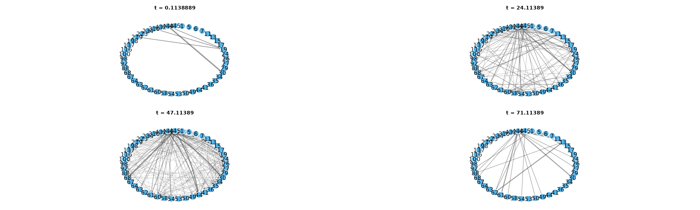

What those panels hold:

``` r

weekly <- snapshots(dn, start = 1, end = 22, step = 7, window = 7)
summary(weekly)
#>   time ties nodes weight
#> 1    1   58    29     75
#> 2    8   95    38    128
#> 3   15  137    41    193
#> 4   22  154    44    210
```

Activity over time.

``` r

plot(dn, type = "timeline", top = 25)
```

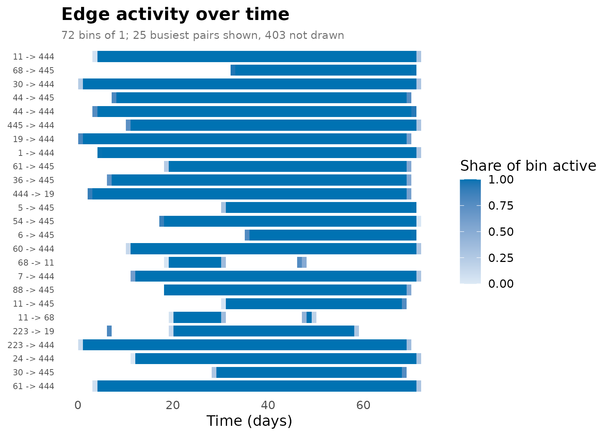

Tie formation and dissolution.

``` r

turnover <- events(dn, measure = c("formation", "dissolution"),
                   start = 0, end = 72, step = 1, window = 1)
plot(turnover)
```

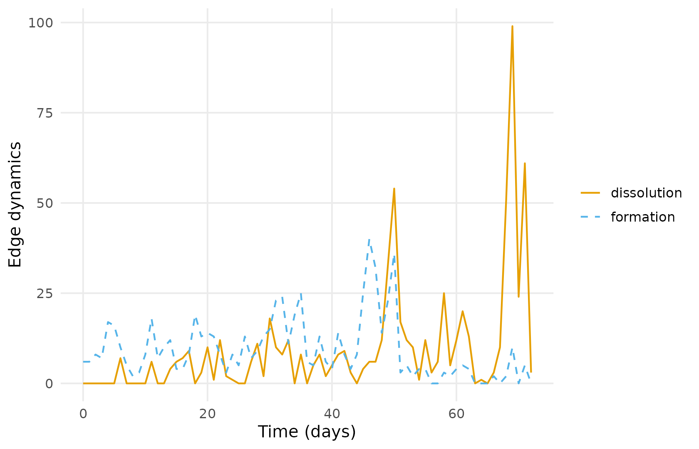

Proximity timeline.

``` r

plot(dn, type = "proximity", slices = 20)
```

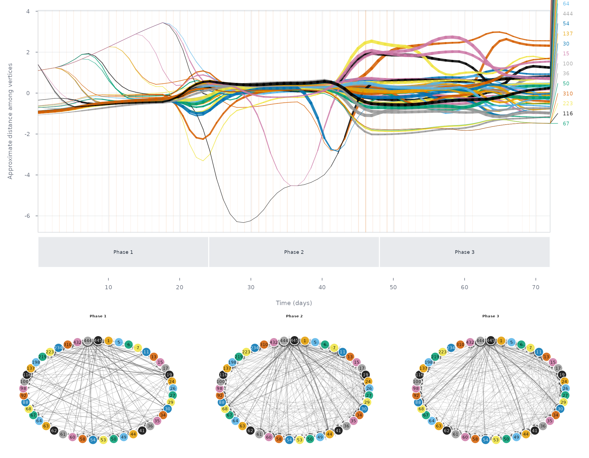

## 5. Graph-level measures

A seven-day rolling density.

``` r

weekly_density <- metrics(dn, measure = "density", start = 14, end = 60, step = 1, window = 7)
plot(weekly_density)
```

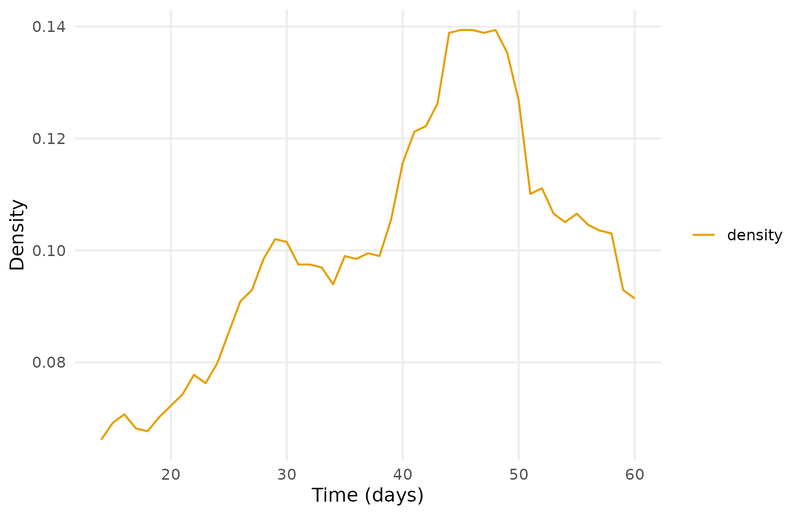

Density over the whole period, and the time-integrated density.

``` r

metrics(dn, measure = c("density", "temporal_density", "edges"), window = "all")
#> # Graph structure (graph-level)
#> # 1 time points, 71.89722 per bin | time in days
#> # measures: density, temporal_density, edges
#>       time          measure        value
#>  0.1138889          density   0.21616162
#>  0.1138889 temporal_density   0.06348315
#>  0.1138889            edges 428.00000000
```

Reciprocity, on the full network as in the chapter.

``` r

reciprocity <- metrics(dn_full, measure = "reciprocity",
                       start = 1, end = 73, step = 1, window = 1)
plot(reciprocity)
```

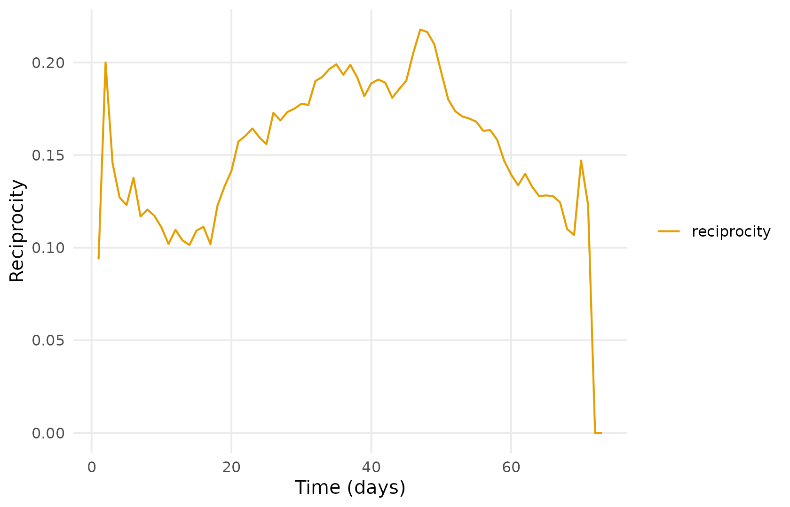

The dyad census. `window = 0` samples at each instant, which is what
[`tSnaStats()`](https://rdrr.io/pkg/tsna/man/tSnaStats.html) does by
default.

``` r

dyad_census <- metrics(dn, measure = c("mutual", "asymmetric", "null"),
                       start = 0, end = 72, step = 1, window = 0)
plot(dyad_census)
```

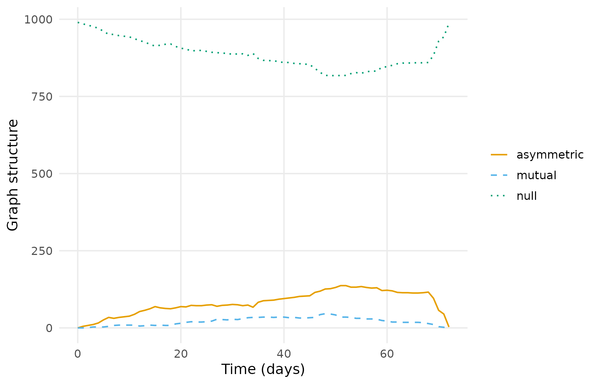

Degree centralization.

``` r

centralization <- metrics(dn, measure = "centralization_degree",
                          start = 1, end = 73, step = 1, window = 1)
plot(centralization)
```

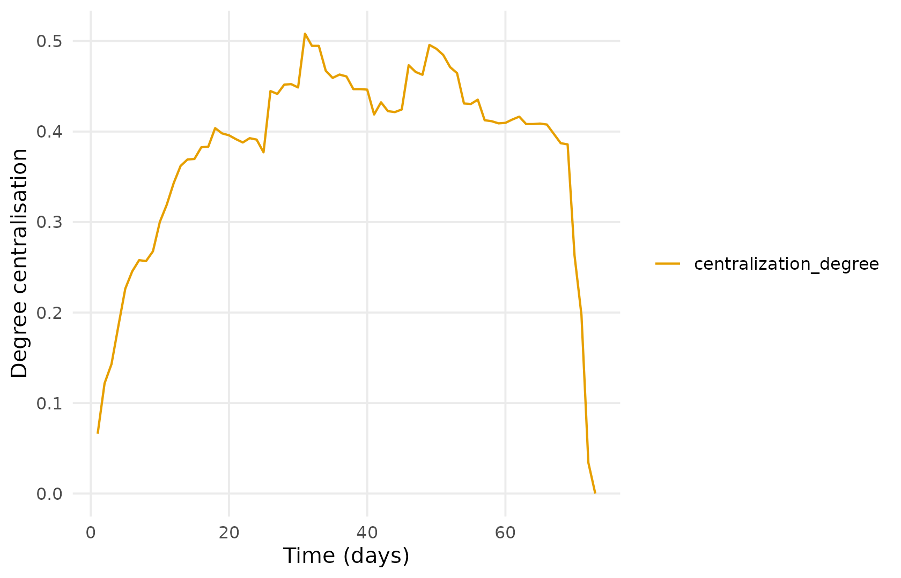

## 6. Node-level measures

Degree, in-degree and out-degree in one call.

``` r

degree_series <- dyn_centrality(dn, measure = "degree",
                                mode = c("all", "in", "out"),
                                start = 1, end = 73, step = 1, window = 1)
summary(degree_series)
#>     node    measure  n        mean         sd min max peak_time
#> 1      1     degree 73  8.39726027  3.6732506   0  14        41
#> 2      1  degree_in 73  3.08219178  1.5069600   0   7        41
#> 3      1 degree_out 73  5.31506849  2.4713734   0  10        48
#> 4    100     degree 73  6.57534247  3.3949219   0   9        35
#> 5    100  degree_in 73  4.91780822  2.7220980   0   7        35
#> 6    100 degree_out 73  1.65753425  1.0030395   0   4        14
#> 7     11     degree 73 11.72602740  7.6779994   0  26        47
#> 8     11  degree_in 73  5.50684932  4.5768842   0  13        60
#> 9     11 degree_out 73  6.21917808  3.5716732   0  15        49
#> 10   116     degree 73  1.50684932  1.7726572   0   9        15
#> 11   116  degree_in 73  0.67123288  1.7244548   0   8        15
#> 12   116 degree_out 73  0.83561644  0.3731882   0   1        10
#> 13    13     degree 73  2.39726027  3.3530240   0  12        50
#> 14    13  degree_in 73  0.87671233  0.9566319   0   3        69
#> 15    13 degree_out 73  1.52054795  2.5986620   0  10        50
#> 16   137     degree 73  3.82191781  2.9455355   0  13        49
#> 17   137  degree_in 73  2.00000000  1.8333333   0   9        49
#> 18   137 degree_out 73  1.82191781  1.2946736   0   4        42
#> 19    15     degree 73  4.69863014  2.0995035   0  10        48
#> 20    15  degree_in 73  1.57534247  0.8150973   0   4        48
#> 21    15 degree_out 73  3.12328767  1.4136753   0   7        58
#> 22    17     degree 73  2.45205479  1.1431085   0   6        69
#> 23    17  degree_in 73  0.09589041  0.2964786   0   1        17
#> 24    17 degree_out 73  2.35616438  1.0848690   0   6        69
#> 25    19     degree 73  9.87671233  3.7894048   0  15        51
#> 26    19  degree_in 73  5.05479452  2.3681358   0   8        51
#> 27    19 degree_out 73  4.82191781  1.6015831   0   7        48
#> 28   198     degree 73  4.73972603  3.1092487   0  11        50
#> 29   198  degree_in 73  2.82191781  2.1943264   0   8        58
#> 30   198 degree_out 73  1.91780822  1.3617128   0   5        40
#> 31   219     degree 73  3.80821918  1.5956324   0   6        50
#> 32   219  degree_in 73  1.91780822  1.3819614   0   4        50
#> 33   219 degree_out 73  1.89041096  0.4583074   0   2         1
#> 34   223     degree 73  3.89041096  1.9759783   0   8        20
#> 35   223  degree_in 73  1.30136986  1.4012389   0   4        11
#> 36   223 degree_out 73  2.58904110  1.0908154   0   4        20
#> 37   234     degree 73  1.89041096  2.2642244   0   6        33
#> 38   234  degree_in 73  1.89041096  2.2642244   0   6        33
#> 39   234 degree_out 73  0.00000000  0.0000000   0   0         1
#> 40    24     degree 73  6.36986301  4.9986299   0  16        47
#> 41    24  degree_in 73  1.97260274  2.5710601   0   9        50
#> 42    24 degree_out 73  4.39726027  2.8951095   0   9        38
#> 43    26     degree 73  3.73972603  4.1734192   0  12        49
#> 44    26  degree_in 73  1.87671233  2.3448834   0   7        49
#> 45    26 degree_out 73  1.86301370  2.0091117   0   5        35
#> 46    27     degree 73  2.61643836  1.8305292   0   6        27
#> 47    27  degree_in 73  0.95890411  1.5132595   0   5        58
#> 48    27 degree_out 73  1.65753425  0.9161995   0   4        66
#> 49    29     degree 73  3.91780822  3.0810957   0  10        47
#> 50    29  degree_in 73  0.89041096  0.9938931   0   4        31
#> 51    29 degree_out 73  3.02739726  2.4150719   0   8        47
#> 52    30     degree 73  8.12328767  3.2742480   0  14        46
#> 53    30  degree_in 73  3.13698630  1.8952797   0   7        46
#> 54    30 degree_out 73  4.98630137  1.5942009   0   7         6
#> 55   310     degree 73  1.78082192  1.5022814   0   5         4
#> 56   310  degree_in 73  0.84931507  1.4402086   0   4         4
#> 57   310 degree_out 73  0.93150685  0.2543383   0   1         1
#> 58    34     degree 73  3.97260274  3.2530866   0  14        50
#> 59    34  degree_in 73  1.32876712  1.5005073   0   6        50
#> 60    34 degree_out 73  2.64383562  2.2630477   0   8        49
#> 61    35     degree 73  4.83561644  2.8964236   0  12        48
#> 62    35  degree_in 73  1.93150685  1.6101136   0   6        48
#> 63    35 degree_out 73  2.90410959  1.3860855   0   6        48
#> 64    36     degree 73  5.23287671  2.2330880   0   9        13
#> 65    36  degree_in 73  1.38356164  1.2091105   0   5        22
#> 66    36 degree_out 73  3.84931507  1.5426459   0   5        13
#> 67    41     degree 73  5.27397260  4.9223421   0  13        50
#> 68    41  degree_in 73  4.15068493  3.9884250   0  11        50
#> 69    41 degree_out 73  1.12328767  0.9992387   0   2        29
#> 70   432     degree 73  3.61643836  4.0982047   0  11        46
#> 71   432  degree_in 73  0.83561644  1.1427756   0   3        46
#> 72   432 degree_out 73  2.78082192  3.0333634   0   8        45
#> 73    44     degree 73 11.61643836  6.1703371   0  25        50
#> 74    44  degree_in 73  4.41095890  3.5230811   0  12        50
#> 75    44 degree_out 73  7.20547945  3.4679441   0  14        46
#> 76   444     degree 73 37.58904110 11.7813832   0  52        49
#> 77   444  degree_in 73 27.90410959  8.0141617   0  35        50
#> 78   444 degree_out 73  9.68493151  4.8501910   0  19        31
#> 79   445     degree 73 22.94520548 12.0909636   0  37        50
#> 80   445  degree_in 73 19.61643836 10.4318291   0  31        50
#> 81   445 degree_out 73  3.32876712  1.8488344   0   6        46
#> 82    49     degree 73  4.47945205  3.0005073   0   9        38
#> 83    49  degree_in 73  1.64383562  1.5126307   0   5        41
#> 84    49 degree_out 73  2.83561644  1.6584271   0   6        49
#> 85     5     degree 73  3.26027397  2.4722201   0   7        59
#> 86     5  degree_in 73  1.72602740  1.9878819   0   5        59
#> 87     5 degree_out 73  1.53424658  0.7280528   0   4        30
#> 88    50     degree 73  3.60273973  2.6391272   0  10        41
#> 89    50  degree_in 73  0.83561644  1.1305566   0   3        35
#> 90    50 degree_out 73  2.76712329  1.9827068   0   7        41
#> 91    53     degree 73  2.19178082  2.6281464   0  12        50
#> 92    53  degree_in 73  1.04109589  1.1718736   0   7        50
#> 93    53 degree_out 73  1.15068493  1.6130650   0   6        46
#> 94    54     degree 73  5.52054795  2.1991765   0   9        49
#> 95    54  degree_in 73  2.42465753  1.5978963   0   4        30
#> 96    54 degree_out 73  3.09589041  1.0160433   0   5        49
#> 97    58     degree 73  4.08219178  2.6497035   0  10        28
#> 98    58  degree_in 73  1.23287671  1.1489192   0   5        28
#> 99    58 degree_out 73  2.84931507  1.7533399   0   5        22
#> 100    6     degree 73  4.36986301  3.8748005   0  10        49
#> 101    6  degree_in 73  1.30136986  1.8157102   0   4        49
#> 102    6 degree_out 73  3.06849315  2.4851155   0   7        35
#> 103   60     degree 73  7.71232877  5.0290253   0  21        49
#> 104   60  degree_in 73  1.69863014  2.0390966   0   8        49
#> 105   60 degree_out 73  6.01369863  3.4257730   0  13        47
#> 106   61     degree 73  4.43835616  2.9106428   0  12        49
#> 107   61  degree_in 73  1.41095890  1.4223964   0   5        45
#> 108   61 degree_out 73  3.02739726  1.8406868   0   7        47
#> 109   62     degree 73  2.79452055  4.1364199   0  11        62
#> 110   62  degree_in 73  1.06849315  1.9953332   0   6        62
#> 111   62 degree_out 73  1.72602740  2.4167257   0   9        50
#> 112   63     degree 73  3.31506849  2.1400721   0   9        52
#> 113   63  degree_in 73  0.50684932  0.8838566   0   3        41
#> 114   63 degree_out 73  2.80821918  1.5244082   0   7        52
#> 115   64     degree 73  2.82191781  1.7106080   0   7        24
#> 116   64  degree_in 73  1.26027397  1.0277726   0   3        24
#> 117   64 degree_out 73  1.56164384  0.9277557   0   4        24
#> 118   67     degree 73  2.27397260  2.6784131   0   9        21
#> 119   67  degree_in 73  1.21917808  2.4565478   0   8        30
#> 120   67 degree_out 73  1.05479452  0.7243850   0   2        17
#> 121   68     degree 73  5.87671233  3.7525740   0  15        46
#> 122   68  degree_in 73  2.23287671  1.4674292   0   6        48
#> 123   68 degree_out 73  3.64383562  2.4572447   0  11        46
#> 124    7     degree 73  5.86301370  4.3182914   0  17        47
#> 125    7  degree_in 73  1.93150685  2.0838584   0   9        49
#> 126    7 degree_out 73  3.93150685  2.5891267   0  10        45
#> 127   88     degree 73  3.23287671  2.0311501   0   7        48
#> 128   88  degree_in 73  1.01369863  1.3175435   0   5        48
#> 129   88 degree_out 73  2.21917808  1.2275379   0   4        50
#> 130   92     degree 73  3.67123288  2.1347313   0   8        60
#> 131   92  degree_in 73  2.04109589  1.7984434   0   6        62
#> 132   92 degree_out 73  1.63013699  0.9355160   0   3        18
#> 133   98     degree 73  2.53424658  3.3211535   0  10        54
#> 134   98  degree_in 73  2.17808219  2.8005082   0   7        54
#> 135   98 degree_out 73  0.35616438  0.8227640   0   3        54
```

``` r

degree <- dyn_centrality(dn, measure = "degree", start = 1, end = 73,
                         step = 1, window = 1)
plot(degree)
```

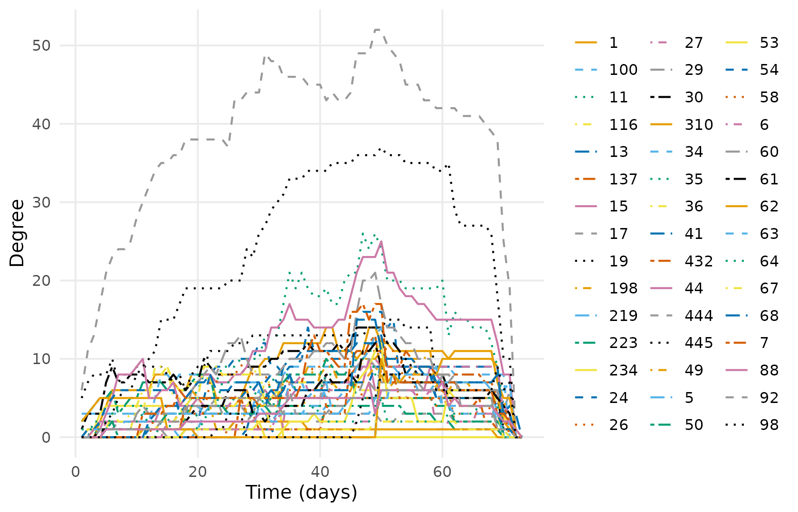

Closeness, betweenness and eigenvector.

``` r

other_centrality <- dyn_centrality(dn, measure = c("closeness", "betweenness", "eigenvector"),
                                   start = 1, end = 73, step = 1, window = 1)
summary(other_centrality)
#>     node     measure  n         mean           sd min         max peak_time
#> 1      1 betweenness 73  96.91938330  69.33642795   0 298.7333333        19
#> 2      1   closeness 73   0.48490309   0.13635671   0   0.5774648        48
#> 3      1 eigenvector 73   0.31610043   0.11954994   0   0.4825081        48
#> 4    100 betweenness 73   7.94096740  17.30686617   0  73.6666667        16
#> 5    100   closeness 73   0.42239989   0.20768862   0   0.5479452        39
#> 6    100 eigenvector 73   0.29449965   0.14865458   0   0.4537850        70
#> 7     11 betweenness 73  97.07955095  74.79012702   0 234.6880952        44
#> 8     11   closeness 73   0.51016959   0.15221433   0   0.6515152        50
#> 9     11 eigenvector 73   0.38181011   0.18416367   0   0.6651413        49
#> 10   116 betweenness 73   0.74657534   2.41971544   0  15.0000000        15
#> 11   116   closeness 73   0.41821632   0.12988210   0   0.5441176        15
#> 12   116 eigenvector 73   0.11846432   0.09976393   0   0.4662058        15
#> 13    13 betweenness 73   9.96422673  18.31491276   0  58.6666667        69
#> 14    13   closeness 73   0.29565144   0.33873489   0   1.0000000        18
#> 15    13 eigenvector 73   0.08043078   0.14962646   0   1.0000000        72
#> 16   137 betweenness 73  16.32489945  24.17644597   0  71.0000000        37
#> 17   137   closeness 73   0.40139578   0.19834649   0   0.5694444        49
#> 18   137 eigenvector 73   0.17491742   0.11035562   0   0.4581681        49
#> 19    15 betweenness 73   4.55420159  11.24714793   0  89.6222222        59
#> 20    15   closeness 73   0.48002067   0.10515892   0   0.5540541        48
#> 21    15 eigenvector 73   0.28653931   0.07399211   0   0.4158732        58
#> 22    17 betweenness 73   1.76484018   6.50568576   0  45.3333333        23
#> 23    17   closeness 73   0.45258489   0.13086774   0   0.6666667         5
#> 24    17 eigenvector 73   0.19367601   0.09077682   0   0.5773503        72
#> 25    19 betweenness 73  77.51883279  55.93166969   0 234.4021978        54
#> 26    19   closeness 73   0.51412061   0.10026288   0   0.7500000         1
#> 27    19 eigenvector 73   0.36314964   0.13628720   0   0.8517952         1
#> 28   198 betweenness 73  15.66641133  19.02485546   0  60.9028563        50
#> 29   198   closeness 73   0.43535925   0.14018242   0   0.5584416        50
#> 30   198 eigenvector 73   0.21579519   0.11455919   0   0.4476033        71
#> 31   219 betweenness 73   2.40793561   3.56870762   0  12.1221989        57
#> 32   219   closeness 73   0.45689619   0.11397598   0   0.6000000         1
#> 33   219 eigenvector 73   0.18219026   0.08455548   0   0.5773503         1
#> 34   223 betweenness 73   4.98516179  10.42443510   0  58.7333333        20
#> 35   223   closeness 73   0.46998480   0.11719128   0   0.6000000         1
#> 36   223 eigenvector 73   0.26546167   0.13966398   0   0.6662759         3
#> 37   234 betweenness 73   0.00000000   0.00000000   0   0.0000000         1
#> 38   234   closeness 73   0.21475260   0.24517824   0   0.5294118         2
#> 39   234 eigenvector 73   0.09892679   0.11435861   0   0.2906634         5
#> 40    24 betweenness 73  13.15650951  18.81084139   0  98.4464986        52
#> 41    24   closeness 73   0.42228913   0.20064343   0   0.5810811        50
#> 42    24 eigenvector 73   0.25923676   0.15680085   0   0.5159381        38
#> 43    26 betweenness 73  16.90805407  28.10019647   0  77.9023810        41
#> 44    26   closeness 73   0.29352371   0.22820204   0   0.5694444        49
#> 45    26 eigenvector 73   0.11836505   0.12536672   0   0.4106377        49
#> 46    27 betweenness 73   3.29836633   7.80128892   0  45.1261905        55
#> 47    27   closeness 73   0.43901737   0.13409775   0   0.5180723        55
#> 48    27 eigenvector 73   0.15158348   0.06617717   0   0.2641248        27
#> 49    29 betweenness 73  11.26374869  18.63465776   0  74.5000000        30
#> 50    29   closeness 73   0.46015808   0.24473770   0   1.0000000        18
#> 51    29 eigenvector 73   0.14465612   0.11242667   0   0.3717904        49
#> 52    30 betweenness 73  26.62973865  25.68313182   0 161.3333333        21
#> 53    30   closeness 73   0.50580320   0.09051292   0   0.6000000         2
#> 54    30 eigenvector 73   0.34915769   0.11695371   0   0.6102290         2
#> 55   310 betweenness 73   1.94520548   4.85023027   0  18.0000000        14
#> 56   310   closeness 73   0.44029241   0.12296748   0   0.6000000         1
#> 57   310 eigenvector 73   0.14713145   0.12123738   0   0.5773503         1
#> 58    34 betweenness 73   9.54125926  15.37264679   0  55.1250788        50
#> 59    34   closeness 73   0.33224519   0.17736873   0   0.5128205        40
#> 60    34 eigenvector 73   0.12018815   0.08547113   0   0.3075382        50
#> 61    35 betweenness 73  18.56748607  28.04834645   0 100.1998168        48
#> 62    35   closeness 73   0.43289895   0.14060627   0   0.5394737        48
#> 63    35 eigenvector 73   0.17970718   0.07904621   0   0.3241561        48
#> 64    36 betweenness 73  13.64890787  20.62112201   0  62.0734848        36
#> 65    36   closeness 73   0.45460376   0.13254436   0   0.5441176        15
#> 66    36 eigenvector 73   0.25945738   0.09950851   0   0.4759273        15
#> 67    41 betweenness 73  14.64250454  16.45010427   0  52.8000000        68
#> 68    41   closeness 73   0.25417404   0.22165067   0   0.5058824        50
#> 69    41 eigenvector 73   0.14385070   0.14030869   0   0.3543881        47
#> 70   432 betweenness 73  34.85458355  51.94780990   0 162.5531136        54
#> 71   432   closeness 73   0.26212059   0.21418470   0   0.5180723        54
#> 72   432 eigenvector 73   0.09955532   0.11176956   0   0.3126517        47
#> 73    44 betweenness 73 112.25053815 115.16809150   0 362.0257703        56
#> 74    44   closeness 73   0.51667536   0.13266922   0   0.6417910        50
#> 75    44 eigenvector 73   0.43538452   0.14502478   0   0.6798242        48
#> 76   444 betweenness 73 556.92470949 259.89038393   0 974.0571429        31
#> 77   444   closeness 73   0.81012598   0.14727103   0   1.0000000         1
#> 78   444 eigenvector 73   0.97260274   0.16436771   0   1.0000000         1
#> 79   445 betweenness 73 129.38475856  78.52459941   0 270.8285714        59
#> 80   445   closeness 73   0.62727721   0.22066617   0   1.0000000         5
#> 81   445 eigenvector 73   0.70779310   0.30164794   0   0.9830725        42
#> 82    49 betweenness 73  15.21886839  26.78797987   0  91.7754329        62
#> 83    49   closeness 73   0.46135099   0.13127673   0   0.5540541        49
#> 84    49 eigenvector 73   0.23564992   0.11145280   0   0.4483502        41
#> 85     5 betweenness 73   1.15387696   2.56946750   0  13.8333333        70
#> 86     5   closeness 73   0.45157199   0.14042048   0   0.5375000        59
#> 87     5 eigenvector 73   0.20327821   0.10411011   0   0.5768775        71
#> 88    50 betweenness 73   6.99542984  10.02296375   0  32.9928571        37
#> 89    50   closeness 73   0.40744581   0.19459772   0   0.5555556        41
#> 90    50 eigenvector 73   0.19965756   0.11531811   0   0.4022259        41
#> 91    53 betweenness 73   9.10275460  16.71896509   0  76.5242424        62
#> 92    53   closeness 73   0.24496131   0.18343933   0   0.5180723        50
#> 93    53 eigenvector 73   0.04738179   0.07204915   0   0.2916880        50
#> 94    54 betweenness 73  39.85400453  28.90149372   0 124.1500000        59
#> 95    54   closeness 73   0.48236616   0.10583613   0   0.5540541        49
#> 96    54 eigenvector 73   0.28013424   0.07758426   0   0.4367380         9
#> 97    58 betweenness 73  24.51697173  21.84378144   0  80.6666667        23
#> 98    58   closeness 73   0.39601122   0.20320421   0   0.5466667        46
#> 99    58 eigenvector 73   0.19410551   0.10908136   0   0.3372337        27
#> 100    6 betweenness 73  11.55659268  18.81302646   0  50.2000000        57
#> 101    6   closeness 73   0.36952466   0.21486681   0   0.5616438        49
#> 102    6 eigenvector 73   0.19987806   0.17406001   0   0.4143465        47
#> 103   60 betweenness 73  31.58092775  38.34611569   0 144.9992063        27
#> 104   60   closeness 73   0.47560298   0.15895486   0   0.6666667         5
#> 105   60 eigenvector 73   0.32595661   0.14897207   0   0.5919692        49
#> 106   61 betweenness 73   6.65071604   8.73009757   0  35.8428571        68
#> 107   61   closeness 73   0.46677297   0.13182005   0   0.5540541        47
#> 108   61 eigenvector 73   0.26302613   0.10171191   0   0.4074832        45
#> 109   62 betweenness 73  16.38315079  33.23762156   0 111.4178571        61
#> 110   62   closeness 73   0.24077701   0.29919602   0   1.0000000        11
#> 111   62 eigenvector 73   0.12746990   0.19043517   0   0.5773503        72
#> 112   63 betweenness 73   6.13022411  19.12423090   0 113.1055556        59
#> 113   63   closeness 73   0.45370750   0.13916220   0   0.5443038        52
#> 114   63 eigenvector 73   0.22315901   0.07357178   0   0.3427619        41
#> 115   64 betweenness 73   3.12314698   6.26018893   0  29.3000000        23
#> 116   64   closeness 73   0.45236269   0.11166410   0   0.5454545         1
#> 117   64 eigenvector 73   0.15688217   0.06825338   0   0.3117787         1
#> 118   67 betweenness 73   6.56344166  14.94437172   0  81.6333333        23
#> 119   67   closeness 73   0.39100769   0.22137505   0   1.0000000        11
#> 120   67 eigenvector 73   0.12694611   0.10611194   0   0.3524230        30
#> 121   68 betweenness 73  32.99128998  32.34537632   0 147.3448052        46
#> 122   68   closeness 73   0.42854542   0.20267420   0   0.5942029        46
#> 123   68 eigenvector 73   0.22857390   0.12820812   0   0.5211194        48
#> 124    7 betweenness 73  18.71532495  17.41859639   0  74.2376124        45
#> 125    7   closeness 73   0.43035201   0.19448041   0   0.5942029        49
#> 126    7 eigenvector 73   0.26277112   0.14175728   0   0.5654737        45
#> 127   88 betweenness 73  11.28800430  21.72017895   0  85.3888889        51
#> 128   88   closeness 73   0.45962093   0.12971592   0   0.6000000        72
#> 129   88 eigenvector 73   0.22006958   0.08646639   0   0.5773503        72
#> 130   92 betweenness 73  11.90129022  20.74690873   0 116.3666667        60
#> 131   92   closeness 73   0.39401505   0.13452579   0   0.5466667        47
#> 132   92 eigenvector 73   0.14255324   0.11237722   0   0.4137454        62
#> 133   98 betweenness 73   3.11065520  13.66000847   0 102.9285714        69
#> 134   98   closeness 73   0.18283387   0.21653820   0   0.5250000        69
#> 135   98 eigenvector 73   0.08580220   0.11434280   0   0.4122499        71
```

``` r

betweenness <- dyn_centrality(dn, measure = "betweenness",
                              start = 1, end = 73, step = 1, window = 1)
plot(betweenness)
```

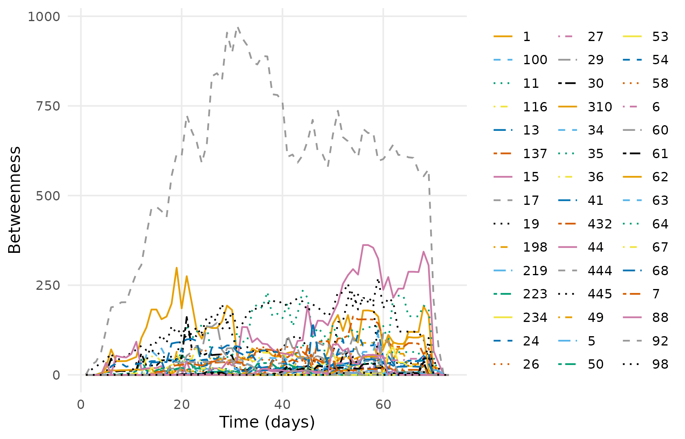

Aggregate centrality sits on the vertex table, so it can be read or
filtered without a second call.

``` r

head(as.data.frame(dn, what = "nodes",
                   measure = c("degree", "betweenness", "eigenvector")))
#>   name Facilitator             role1 experience experience2     grades location
#> 1    1           0          libmedia          1     6 to 10  secondary       VA
#> 2    5           0       otheredprof          3         20+ generalist       AL
#> 3    6           0     classteaching          1      4 to 5 generalist       AL
#> 4    7           0 instructionaltech          2    11 to 20 generalist       SD
#> 5   11           0             other          3         20+ generalist       KG
#> 6   13           0     classteaching          2    11 to 20     middle       CA
#>          region country group gender expert connect expert_level degree
#> 1         South      US    UZ female      0       1       Expert     20
#> 2         South      US    AC female      0       0      Teacher     10
#> 3         South      US    AC female      0       1       Expert     13
#> 4       Midwest      US    OT female      0       0      Student     26
#> 5 International      KG    DL female      0       1      Teacher     47
#> 6          West      US    AC female      0       0      Student     15
#>   betweenness eigenvector
#> 1   37.308745   0.4188396
#> 2    4.222691   0.3152262
#> 3    4.759524   0.3337165
#> 4   34.113923   0.5748078
#> 5  180.530502   0.8963590
#> 6   16.629447   0.4051050
```

## 7. Reachability

The chapter seeds on the 44th vertex of its induced subgraph, which is
participant 444. Dynet addresses vertices by name.

``` r

fwd <- paths(dn, from = "444", direction = "forward")
fwd
#> # Time-respecting paths from '444', from t = 0.1138889
#> # reaches 44 of 44 other vertices | time in days
#>  node reachable arrival_time attained   latency n_hops n_paths
#>     1      TRUE     5.484028     TRUE  5.370139      2       1
#>     5      TRUE    33.213194     TRUE 33.099306      2       1
#>     6      TRUE    37.055556     TRUE 36.941667      2       1
#>     7      TRUE    11.863889     TRUE 11.750000      3       1
#>    11      TRUE    12.383333     TRUE 12.269444      1       1
#>    13      TRUE    26.195139     TRUE 26.081250      2       1
#>    15      TRUE     6.135417     TRUE  6.021528      5       1
#>    17      TRUE    20.250694     TRUE 20.136806      4       3
#>    19      TRUE     2.222222     TRUE  2.108333      1       1
#>    24      TRUE    21.067361     TRUE 20.953472      2       1
#>    26      TRUE    25.313889     TRUE 25.200000      2       1
#>    27      TRUE    21.071528     TRUE 20.957639      3       1
#> # 33 more rows. summary() aggregates them; plot() draws the tree.
```

``` r

plot(fwd)
```

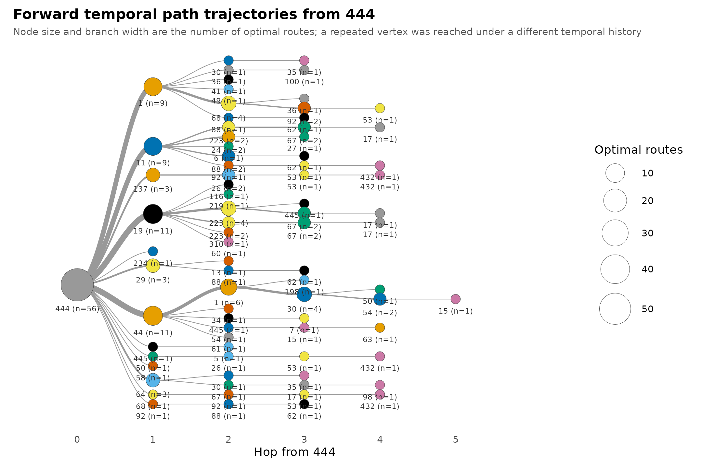

The chapter’s `transmissionTimeline()` becomes a trajectory tree, which
carries route counts and branching probabilities the original does not.

``` r

plot_path_trajectories(path_trajectories(fwd), measure = "time")
```

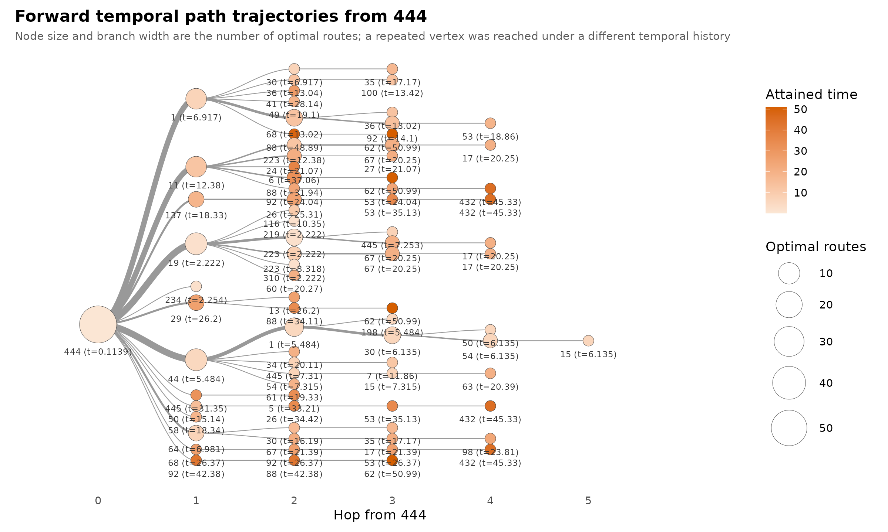

## 8. Mixing between expertise levels

``` r

mix <- mixing(dn, attribute = "expert_level",
              start = 1, end = 73, step = 1, window = 1)
summary(mix)
#>              measure  n      mean        sd min max peak_time
#> 1   Expert -> Expert 73  2.890411  3.138301   0   8        54
#> 2  Expert -> Student 73  5.849315  3.703119   0  14        50
#> 3  Expert -> Teacher 73 14.315068  6.220211   0  24        55
#> 4  Student -> Expert 73  4.315068  3.620454   0  12        50
#> 5 Student -> Student 73 10.000000  4.725816   0  22        50
#> 6 Student -> Teacher 73 33.493151 14.732922   0  56        50
#> 7  Teacher -> Expert 73  5.808219  3.984893   0  14        48
#> 8 Teacher -> Student 73 16.232877  8.280701   0  35        47
#> 9 Teacher -> Teacher 73 36.821918 15.738614   0  67        49
```

``` r

plot(mix)
```

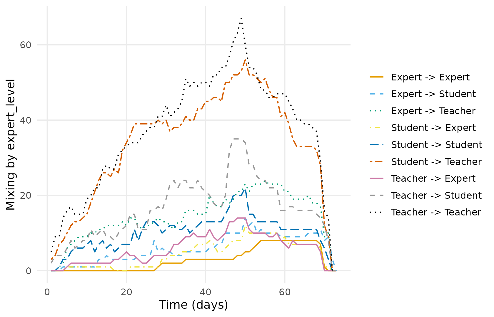

`nodemix` drops one cell as the `ergm` base category, so the chapter
plots eight of the nine group pairs.
[`mixing()`](https://pak.dynasite.org/Dynet/reference/mixing.md) reports
all nine.

## What differs

Two differences from the published figures, both deliberate.

**The spell rule.** The chapter sets every tie in a discussion to start
at the discussion’s *first* post. Saqr and Nouri (2020), which
`thread =` implements, starts each tie at *its own* post. Only 302 of
the surviving posts are opening posts, so the chapter’s spells are about
a quarter longer on average, and its time-integrated density is
correspondingly higher.

**29 ties that never happened.** The chapter builds its static edge list
before dropping single-post discussions, so 29 pairs enter the network
with no activity at all.
[`networkDynamic()`](https://rdrr.io/pkg/networkDynamic/man/networkDynamic.html)
then gives each of them activity across the entire observation window,
flagged censored at both ends — permanently-on ties that no message ever
created. Five of them fall inside the active subnetwork, which is why
the chapter reports 433 ties where this reports 428, and why its day-73
statistics are non-empty for a day past the end of observation.

``` r

metrics(dn, measure = c("edges", "temporal_density"), window = "all")
#> # Graph structure (graph-level)
#> # 1 time points, 71.89722 per bin | time in days
#> # measures: edges, temporal_density
#>       time          measure        value
#>  0.1138889            edges 428.00000000
#>  0.1138889 temporal_density   0.06348315
```

## Do the two implementations agree?

The differences above are definitional, not numerical. Given the *same*
network, Dynet and `tsna`/`sna` return the same values. The check below
rebuilds the chapter’s own construction and compares; the bracket
indexing is there because `tsna` returns `mts` matrices.

``` r

library(tsna); library(networkDynamic); library(sna)

chapter_spells <- posts |>
  mutate(day = round(as.numeric(difftime(
    lubridate::parse_date_time(timestamp, "mdy HM"),
    min(lubridate::parse_date_time(timestamp, "mdy HM")), units = "days")), 2)) |>
  group_by(discussion_title) |>
  mutate(onset = min(day), terminus = max(day)) |>
  ungroup()

nd <- networkDynamic(edge.spells = data.frame(
  onset = chapter_spells$onset, terminus = chapter_spells$terminus,
  tail = as.integer(chapter_spells$sender),
  head = as.integer(chapter_spells$receiver)))
#> Initializing base.net of size 445 imputed from maximum vertex id in edge records
#> Created net.obs.period to describe network
#>  Network observation period info:
#>   Number of observation spells: 1 
#>   Maximal time range observed: 0 until 72.01 
#>   Temporal mode: continuous 
#>   Time unit: unknown 
#>   Suggested time increment: NA
same <- dynet(data.frame(from = chapter_spells$sender, to = chapter_spells$receiver,
                         start = chapter_spells$onset, end = chapter_spells$terminus),
              directed = TRUE, loops = FALSE)

active_nd <- get.inducedSubgraph(nd, v = which(sna::degree(nd) > 20))
active_dn <- induce_subgraph(same, degree > 20)

active_density <- metrics(active_dn, "density", window = "all")
active_density_table <- as.data.frame(active_density)
density_diff <- abs(active_density_table$value - gden(active_nd))

active_mutual <- metrics(active_dn, "mutual", start = 1, end = 73,
                         step = 1, window = 1)
active_mutual_table <- as.data.frame(active_mutual)
tsna_mutual <- tSnaStats(active_nd, "mutuality", start = 1, end = 73,
                         time.interval = 1, aggregate.dur = 1)
mutual_diff <- max(abs(active_mutual_table$value - as.numeric(tsna_mutual)))

ref <- tSnaStats(active_nd, "degree", start = 1, end = 73,
                 time.interval = 1, aggregate.dur = 1, cmode = "freeman")
active_degree <- dyn_centrality(active_dn, "degree", start = 1,
                                end = 73, step = 1, window = 1)
got <- as.data.frame(active_degree)
m <- matrix(NA_real_, 73, ncol(ref), dimnames = list(NULL, colnames(ref)))
m[cbind(match(got$time, sort(unique(got$time))),
        match(got$node, colnames(ref)))] <- got$value
degree_diff <- max(abs(m[seq_len(72), ] - as.matrix(ref)[seq_len(72), ]))

tp <- tPath(active_nd, v = 44, direction = "fwd")
active_paths <- paths(active_dn, from = "444")
dp <- as.data.frame(active_paths)
a <- setNames(tp$tdist, as.character(network.vertex.names(active_nd)))
b <- setNames(dp$latency, dp$node)[names(a)]
ok <- is.finite(a) & is.finite(b)
arrival_diff <- max(abs(a[ok] - b[ok]))

data.frame(
  quantity = c("aggregate density", "mutual dyads per day",
               "degree per node per day", "earliest arrival time"),
  max_abs_diff = c(density_diff, mutual_diff, degree_diff, arrival_diff))
#>                  quantity max_abs_diff
#> 1       aggregate density            0
#> 2    mutual dyads per day            0
#> 3 degree per node per day            0
#> 4   earliest arrival time            0
```

``` r

sessionInfo()
#> R version 4.6.1 (2026-06-24)
#> Platform: x86_64-pc-linux-gnu
#> Running under: Ubuntu 24.04.5 LTS
#> 
#> Matrix products: default
#> BLAS:   /usr/lib/x86_64-linux-gnu/openblas-pthread/libblas.so.3 
#> LAPACK: /usr/lib/x86_64-linux-gnu/openblas-pthread/libopenblasp-r0.3.26.so;  LAPACK version 3.12.0
#> 
#> locale:
#>  [1] LC_CTYPE=C.UTF-8       LC_NUMERIC=C           LC_TIME=C.UTF-8       
#>  [4] LC_COLLATE=C.UTF-8     LC_MONETARY=C.UTF-8    LC_MESSAGES=C.UTF-8   
#>  [7] LC_PAPER=C.UTF-8       LC_NAME=C              LC_ADDRESS=C          
#> [10] LC_TELEPHONE=C         LC_MEASUREMENT=C.UTF-8 LC_IDENTIFICATION=C   
#> 
#> time zone: UTC
#> tzcode source: system (glibc)
#> 
#> attached base packages:
#> [1] stats     graphics  grDevices utils     datasets  methods   base     
#> 
#> other attached packages:
#> [1] sna_2.8               statnet.common_4.13.0 tsna_0.3.6           
#> [4] networkDynamic_0.12.0 network_1.20.0        rio_1.3.0            
#> [7] dplyr_1.2.1           Dynet_0.4.10         
#> 
#> loaded via a namespace (and not attached):
#>  [1] sass_0.4.10         generics_0.1.4      stringi_1.8.9      
#>  [4] lattice_0.22-9      digest_0.6.39       magrittr_2.0.5     
#>  [7] timechange_0.4.0    evaluate_1.0.5      grid_4.6.1         
#> [10] RColorBrewer_1.1-3  networkLite_1.1.0   fastmap_1.2.0      
#> [13] R.oo_1.27.1         jsonlite_2.0.0      R.utils_2.13.0     
#> [16] scales_1.4.0        textshaping_1.0.5   jquerylib_0.1.4    
#> [19] cli_3.6.6           rlang_1.3.0         R.methodsS3_1.8.2  
#> [22] withr_3.0.3         cachem_1.1.0        yaml_2.3.12        
#> [25] otel_0.2.0          tools_4.6.1         coda_0.19-4.1      
#> [28] ggplot2_4.0.3       curl_8.0.0          vctrs_0.7.3        
#> [31] R6_2.6.1            lubridate_1.9.5     lifecycle_1.0.5    
#> [34] stringr_1.6.0       snakecase_0.11.1    fs_2.1.0           
#> [37] ragg_1.5.2          janitor_2.2.1       pkgconfig_2.0.3    
#> [40] desc_1.4.3          pkgdown_2.2.1       pillar_1.11.1      
#> [43] bslib_0.12.0        cograph_2.6.12      gtable_0.3.6       
#> [46] data.table_1.18.6.1 glue_1.8.1          systemfonts_1.3.2  
#> [49] xfun_0.61           tibble_3.3.1        tidyselect_1.2.1   
#> [52] knitr_1.52          farver_2.1.2        htmltools_0.5.9    
#> [55] igraph_2.3.3        labeling_0.4.3      rmarkdown_2.32     
#> [58] compiler_4.6.1      S7_0.2.2
```
