# Case study: A MOOC discussion forum as a temporal network

This vignette demonstrates temporal network analysis of participant
interactions in a massive open online course (MOOC) discussion forum.
Following the analytical framework presented by Saqr (2024) in *Learning
Analytics Methods and Tutorials*, it examines changes in network
structure, participants’ structural positions, reachability through
time-respecting paths, and interaction patterns between participants
with different experience levels.

## Data

This vignette uses the MOOC discussion-forum dataset analysed in Saqr
(2024). It records timestamped interactions between participants and
includes their experience levels. The data are available in Dynet as
`mooc_posts`, containing the interactions, and `mooc_people`, containing
participant attributes.

In `mooc_posts`, `sender` and `receiver` identify the relational
endpoints, `timestamp` records when the message was posted, and
`discussion` identifies its thread. In `mooc_people`, experience is
coded as 1 for expert, 2 for student, and 3 for teacher, with
corresponding labels in `expert_level`.

``` r

library(Dynet)
head(mooc_posts)
#>   sender receiver           timestamp
#> 1    360      444 2013-04-04 16:32:00
#> 2    356      444 2013-04-04 18:45:00
#> 3    356      444 2013-04-04 18:47:00
#> 4    344      444 2013-04-04 18:55:00
#> 5    392      444 2013-04-04 19:13:00
#> 6    219      444 2013-04-04 19:16:00
#>                                           discussion
#> 1 Most important change for your school or district?
#> 2 Most important change for your school or district?
#> 3             DLT Resources—Comments and Suggestions
#> 4 Most important change for your school or district?
#> 5 Most important change for your school or district?
#> 6 Most important change for your school or district?
head(mooc_people)
#>   name experience expert_level
#> 1    1          1       Expert
#> 2    2          1       Expert
#> 3    3          2      Student
#> 4    4          2      Student
#> 5    5          3      Teacher
#> 6    6          1       Expert
```

## Constructing the temporal network

[`dynet()`](https://pak.dynasite.org/Dynet/reference/dynet.md)
constructs a temporal network from the MOOC reply data. The supplied
variables `sender` and `receiver` identify the relational endpoints,
while `timestamp` records when each reply was posted. Setting
`thread = "discussion"` represents each reply relationship as a
relational spell.

The duration of a relational spell represents the period during which
the discussion remained active through replies and further interactions.
Each spell begins when a reply is posted and ends with the last recorded
interaction in the same discussion. This models the reply relationship
as part of an ongoing discussion in which contributions continued to be
addressed and responded to, following Saqr and Nouri (2020).

The constructor derives `start` from the reply timestamp, `end` from the
last recorded timestamp in its discussion, and calculates
`duration = end - start`. These variables are created during
construction rather than supplied in `mooc_posts`. The `nodes` argument
adds participant attributes from `mooc_people`, including
`expert_level`, while `time_unit = "days"` expresses elapsed time in
days.

``` r

dn_full <- dynet(mooc_posts, from = "sender", to = "receiver",
                 time = "timestamp", thread = "discussion",
                 nodes = mooc_people, time_unit = "days",
                 min_thread_posts = 2)
#> Dropped 86 self-loop event(s). Use loops = TRUE to keep them.
#> Dropped 37 thread(s) with fewer than 2 post(s), 37 post(s) in all.
summary(dn_full)
#>                 property                    value
#> 1                 format                 threaded
#> 2               directed                      yes
#> 3               vertices                      441
#> 4            edge spells                     2406
#> 5         distinct pairs                     1907
#> 6              time unit                     days
#> 7          observed from                        0
#> 8            observed to                 72.01111
#> 9                   span                 72.01111
#> 10             bin width                        1
#> 11             time bins                       73
#> 12 mean snapshot density                   0.0035
#> 13      temporal density             not computed
#> 14              sessions                     none
#> 15     vertex attributes experience, expert_level
```

The call explicitly identifies the sender, receiver, and timestamp
columns. Because `sender`, `receiver`, and `timestamp` are recognised
aliases, the `from`, `to`, and `time` arguments could be omitted here.
Alias matching is case-insensitive. Explicit column specification is
needed only when names do not match recognised aliases or their intended
interpretation is ambiguous.

The analysis focuses on exchanges between different participants within
discussions containing more than one post. Self-replies connect a
participant to themselves and are excluded by the default
`loops = FALSE`. Setting `min_thread_posts = 2` also excludes
discussions with fewer than two posts remaining after self-replies have
been removed. These filtering choices follow the chapter’s preparation
of the interaction data; they are not requirements for constructing a
temporal network. Here, they remove 86 self-replies and 37 single-post
discussions, leaving 2,406 posts across 299 discussions.

The resulting temporal network contains 441 vertices and 2,406
relational spells connecting 1,907 distinct ordered pairs of
participants. The number of spells exceeds the number of pairs because
participants may reply to the same person more than once. The
observation period extends from day 0 to day 72.01. Mean snapshot
density is 0.0035 across 73 one-day intervals, indicating that
approximately 0.35% of possible directed connections are present in an
average interval.

Following the chapter, the subsequent analysis uses a smaller subnetwork
to make the visualisations easier to interpret.
[`induce_subgraph()`](https://pak.dynasite.org/Dynet/reference/induce_subgraph.md)
retains participants whose degree exceeds 20 in the network aggregated
over the observation period, together with the relational spells
connecting those participants.

``` r

dn <- induce_subgraph(dn_full, degree > 20)
dn
#> # Temporal network (threaded format, directed) | a cograph netobject
#> # 45 vertices | 686 edge spells | 428 distinct pairs
#> # observed from 0.1138889 to 72.01111 days, binned every 1
#> # vertex attributes: experience, expert_level
#> 
#>  from  to     start      end duration weight
#>   219 444 0.1138889 69.47778 69.36389      1
#>   310 444 0.1680556 68.38681 68.21875      1
#>    19 310 0.2784722 14.10486 13.82639      1
#>    19 444 0.2909722 69.47778 69.18681      1
#>    30 444 0.8791667 69.47778 68.59861      1
#>    30 444 0.8819444 68.38681 67.50486      1
#>                                                                     thread
#>                         Most important change for your school or district?
#>                                  Submitting Questions for the Expert Panel
#>  How important is teacher training in a digital learning transition phase?
#>                         Most important change for your school or district?
#>                         Most important change for your school or district?
#>                                  Submitting Questions for the Expert Panel
#> # 680 more spells. summary() describes the network; plot() draws it.
```

The selected subnetwork contains 45 vertices, 686 relational spells, and
428 distinct ordered pairs, spanning day 0.11 to day 72.01. The first
spell illustrates the discussion-based duration: participant `219`
replied to participant `444` on day 0.11, and the spell continues until
day 69.48, when the last interaction in that discussion was recorded.

The analyses below describe this selected subnetwork. Their results
therefore characterise relationships among the retained participants
rather than the full MOOC forum.

## Visualisation

The aggregate network displays all participant pairs connected during
the observation period. It provides an overview of the relationships
among the selected participants, but does not show when those
relationships were active. Setting `type = "network"` produces this
view.

``` r

plot(dn, type = "network")
```

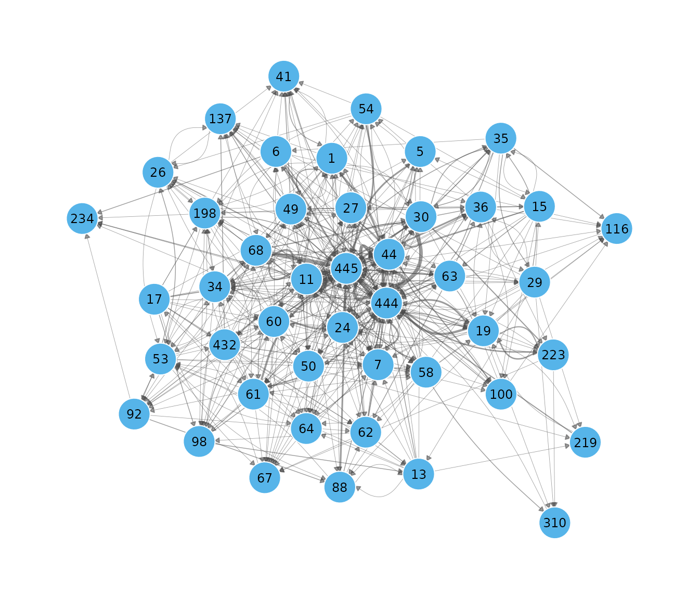

Snapshots show how connectivity changes over time. The following call
displays four one-day intervals spaced across the observation period. A
shared layout keeps participants in the same positions, making changes
in their connections easier to compare.

``` r

plot(dn, type = "snapshots", panels = 4)
#> Drawing 4 of 72 bins, evenly spaced across the window.
```

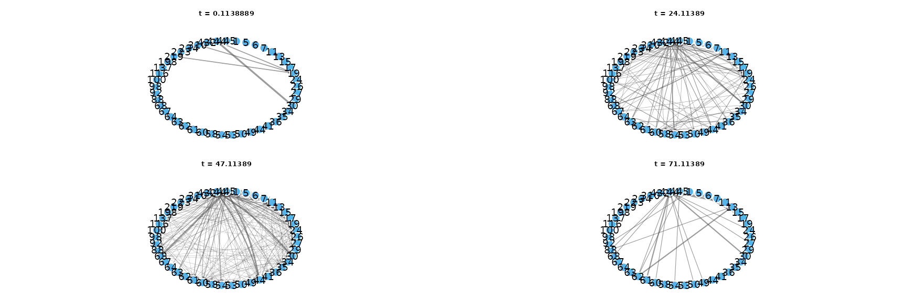

[`snapshots()`](https://pak.dynasite.org/Dynet/reference/snapshots.md)
also returns the connections within specified intervals in tidy format.
The following call requests weekly windows beginning on days 1, 8, 15,
and 22. Setting both `step` and `window` to 7 produces non-overlapping
seven-day intervals.

``` r

weekly <- snapshots(dn, start = 1, end = 22, step = 7, window = 7)
summary(weekly)
#>   time ties nodes weight
#> 1    1   58    29     75
#> 2    8   95    38    128
#> 3   15  137    41    193
#> 4   22  154    44    210
```

The summary reports `ties`, the number of distinct connected pairs;
`nodes`, the number of participants with at least one active tie; and
`weight`, the summed weights of active spells. Because the reply data
have unit weights, the latter counts active spells.

The window beginning on day 1 contains 58 connected pairs among 29
participants, compared with 154 pairs among 44 participants in the
window beginning on day 22. These counts include relationships initiated
earlier that remain active because their discussions continue to receive
interactions. They therefore describe connectivity within each window,
rather than only replies posted during that week.

The activity timeline shows when relationships between participant pairs
are active. Setting `top = 25` displays the 25 pairs with the most
relational spells. For each pair, colour represents the proportion of a
time bin during which at least one spell is active, counting overlapping
spells once.

``` r

plot(dn, type = "timeline", top = 25)
```

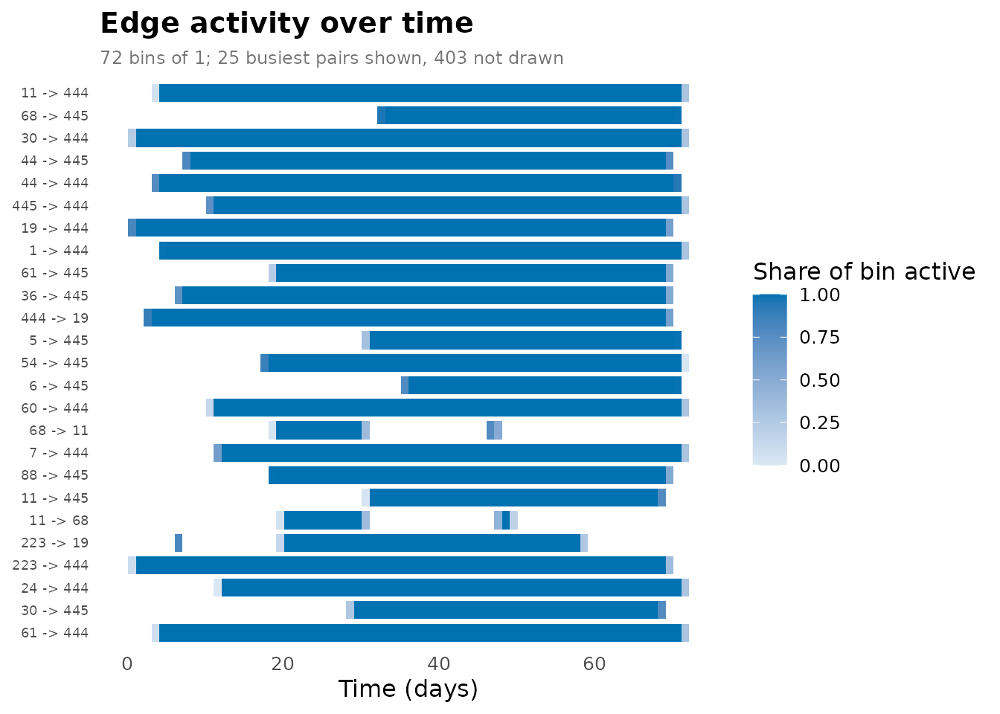

[`events()`](https://pak.dynasite.org/Dynet/reference/events.md) counts
relational spell onsets and terminations within successive intervals.
The following call requests daily counts through `"formation"` and
`"dissolution"`. In this threaded network, formation corresponds to a
reply being posted, while termination occurs at the last recorded
interaction in its discussion.

``` r

turnover <- events(dn, measure = c("formation", "dissolution"),
                   start = 0, end = 72, step = 1, window = 1)
summary(turnover)
#>       measure  n    mean       sd min max peak_time
#> 1 dissolution 73 9.39726 15.96414   0  99        69
#> 2   formation 73 9.39726  8.60029   0  40        46
plot(turnover)
```

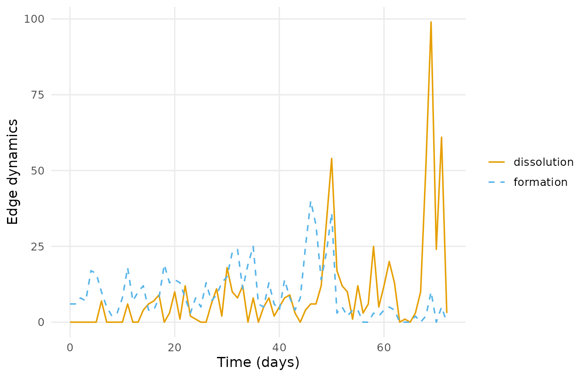

On average, 9.4 spells begin and 9.4 terminate per day. Formation peaks
at 40 spells on day 46, while termination peaks at 99 on day 69.
Multiple spells can terminate together because replies belonging to the
same discussion share its termination time. These counts describe
relational spells, so the termination of one spell does not necessarily
disconnect a participant pair if another spell remains active.

The proximity timeline summarises changes in participants’ network
positions. Within each temporal slice, shortest-path distances are
calculated and represented along a single axis. Lines connect each
participant’s positions across slices. Participants separated by shorter
network distances are positioned closer together, allowing changes in
clusters and relationships to be followed over time.

``` r

plot(dn, type = "proximity", slices = 20)
```

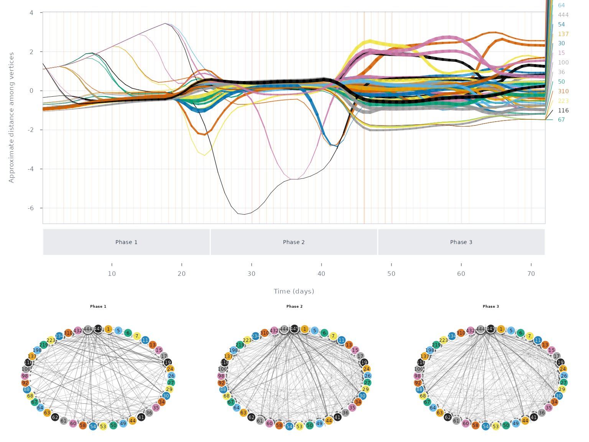

Here, `slices = 20` specifies the number of temporal slices. Proximity
reflects network distance within a slice; it does not necessarily
indicate a direct interaction between two participants.

## Structure over time

Graph-level measures describe how the network’s overall structure
changes during the observation period. Density measures the proportion
of possible directed connections that are present. Calculating density
over successive windows shows whether relationships become more
widespread or more restricted over time.

The temporal settings determine which relationships contribute to each
measurement. `start` and `end` specify the measurement range, `step`
determines the interval between measurements, and `window` determines
the period covered by each value. The following call calculates density
daily, using a seven-day window beginning at each measurement time:

``` r

weekly_density <- metrics(dn, measure = "density",
                          start = 14, end = 60, step = 1, window = 7)
summary(weekly_density)
#>   measure  n      mean         sd        min       max peak_time
#> 1 density 47 0.1006233 0.02149729 0.06616162 0.1393939        45
plot(weekly_density)
```

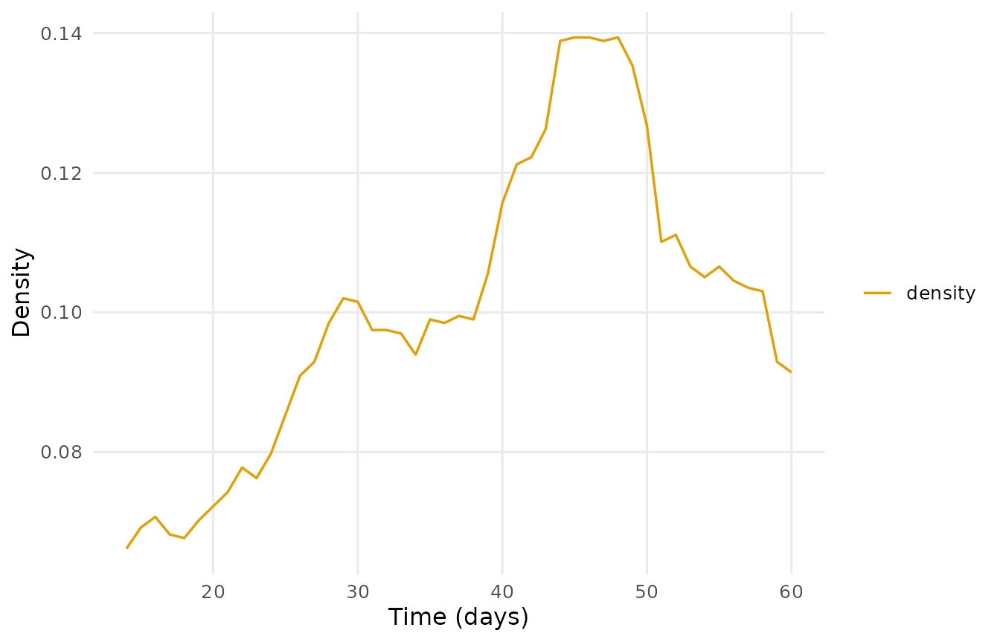

Because `window = 7` exceeds `step = 1`, successive windows overlap.
Across the 47 windows, density averages 0.101 and ranges from 0.066 to
0.139. The maximum occurs in the window beginning on day 45. These
values describe connections active during each seven-day period,
including spells that began earlier and remained active.

Aggregate density and temporal density summarise different aspects of
connectivity. **Aggregate density** records whether each pair was
connected at any time during the observation period, regardless of
duration. **Temporal density** accounts for how long pairs were
connected, expressing total connected-pair duration relative to the
maximum possible over the period. Overlapping spells between the same
endpoints contribute once to their connected duration.

``` r

scalars <- metrics(dn, measure = c("edges", "density", "temporal_density"),
                   window = "all")
scalars
#> # Graph structure (graph-level)
#> # 1 time points, 71.89722 per bin | time in days
#> # measures: edges, density, temporal_density
#>       time          measure        value
#>  0.1138889            edges 428.00000000
#>  0.1138889          density   0.21616162
#>  0.1138889 temporal_density   0.06348315
```

The 428 connected pairs yield an aggregate density of 0.216. Temporal
density is 0.063, indicating that these connections were active for only
part of the observation period. The difference illustrates how
aggregating all relationships can obscure periods when connectivity was
lower.

Reciprocity describes the extent to which directed relationships are
returned. A connection from A to B is reciprocated when the reverse
connection from B to A is also present in the measurement window. With
`measure = "reciprocity"`,
[`metrics()`](https://pak.dynasite.org/Dynet/reference/metrics.md)
returns the proportion of directed ties that have a corresponding
reverse tie.

The following calculation uses the full network, `dn_full`, rather than
the selected subnetwork. It measures reciprocity within successive
one-day intervals.

``` r

reciprocity <- metrics(dn_full, measure = "reciprocity",
                       start = 1, end = 73, step = 1, window = 1)
summary(reciprocity)
#>       measure  n      mean         sd min       max peak_time
#> 1 reciprocity 73 0.1509793 0.04198243   0 0.2178218        47
plot(reciprocity)
```

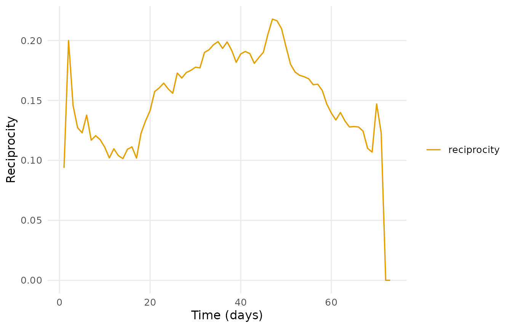

Reciprocity averages 0.151 across the 73 intervals and reaches 0.218 in
the interval beginning on day 47. Thus, approximately 15.1% of active
directed ties are reciprocated in an average daily interval. These
values describe the presence of relationships in both directions, rather
than whether individual messages received a reply.

The dyad census provides a complementary description by classifying each
unordered pair of distinct participants. A **mutual** dyad contains ties
in both directions, an **asymmetric** dyad contains a tie in only one
direction, and a **null** dyad contains neither. Unlike reciprocity,
which reports a proportion of directed ties, the census counts
participant pairs in each category.

``` r

dyad_census <- metrics(dn, measure = c("mutual", "asymmetric", "null"),
                       start = 0, end = 72, step = 1, window = 0)
summary(dyad_census)
#>      measure  n      mean       sd min max peak_time
#> 1 asymmetric 73  81.49315 37.31366   0 137        51
#> 2     mutual 73  20.97260 12.66225   0  46        48
#> 3       null 73 887.53425 47.64833 817 990         0
plot(dyad_census)
```

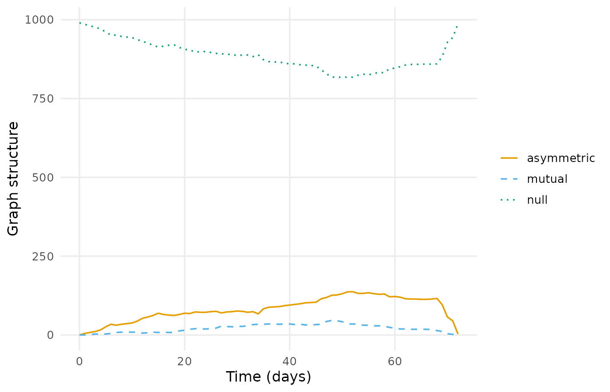

Here, `window = 0` evaluates connections at individual time points,
sampled one day apart. The 45 participants in `dn` form 990 unordered
pairs, all classified as null at time 0. Across the 73 sampled instants,
an average of 21.0 pairs are mutual and 81.5 are asymmetric. The number
of mutual pairs peaks at 46 on day 48.

Degree centralisation describes how unevenly connections are distributed
across the network (Freeman, 1979). It compares each participant’s
degree with the highest degree in the network and summarises these
differences relative to a theoretical maximum. Centralisation is zero
when all participants have equal degree; higher values indicate that
connections are concentrated around participants with higher degree.
Unlike degree centrality, which describes an individual participant,
centralisation describes the network as a whole.

``` r

centralisation <- metrics(dn, measure = "centralization_degree",
                          start = 1, end = 73, step = 1, window = 1)
summary(centralisation)
#>                 measure  n      mean        sd min       max peak_time
#> 1 centralization_degree 73 0.3789387 0.1104169   0 0.5081924        31
plot(centralisation)
```

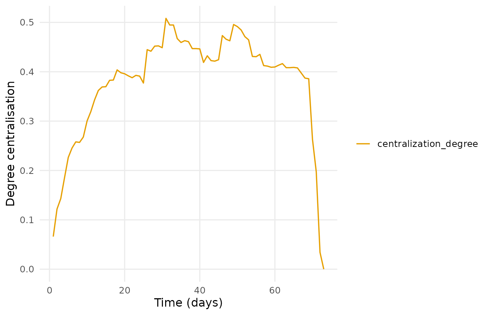

Daily degree centralisation averages 0.379 and peaks at 0.508 in the
interval beginning on day 31. This peak identifies the interval with the
greatest concentration of degree under the specified calculation.

## Participants

Vertex-level centrality measures describe participants’ positions within
the discussion network. Degree counts direct connections. Because ties
run from the sender of a reply to its receiver, **indegree** counts the
participants from whom a person has incoming connections, while
**outdegree** counts the participants to whom they have outgoing
connections. **Total degree** adds indegree and outdegree; a
reciprocated relationship therefore contributes to both.

The following call computes all three measures within successive daily
intervals. Setting `by = "measure"` summarises each measure across
participants and measurement times.

``` r

degree_series <- centrality_series(dn, measure = "degree",
                                   mode = c("all", "in", "out"),
                                   start = 1, end = 73, step = 1, window = 1)
summary(degree_series, by = "measure")
#>      measure    n     mean       sd min max peak_time
#> 1     degree 3285 5.765601 7.273446   0  52        49
#> 2  degree_in 3285 2.882801 5.477055   0  35        50
#> 3 degree_out 3285 2.882801 2.706619   0  19        31
```

Mean total degree is 5.77 per participant per daily interval, with a
maximum of 52 on day 49. Indegree and outdegree both average 2.88, as
every directed tie contributes once to each. Their maxima differ:
indegree reaches 35 on day 50, whereas outdegree reaches 19 on day 31.
The highest incoming degree therefore involves more distinct replying
participants than the highest outgoing degree involves distinct
recipients.

The following plot displays the degree trajectories of the ten
participants selected by `top = 10`:

``` r

degree <- centrality_series(dn, measure = "degree",
                            start = 1, end = 73, step = 1, window = 1)
plot(degree, top = 10)
```

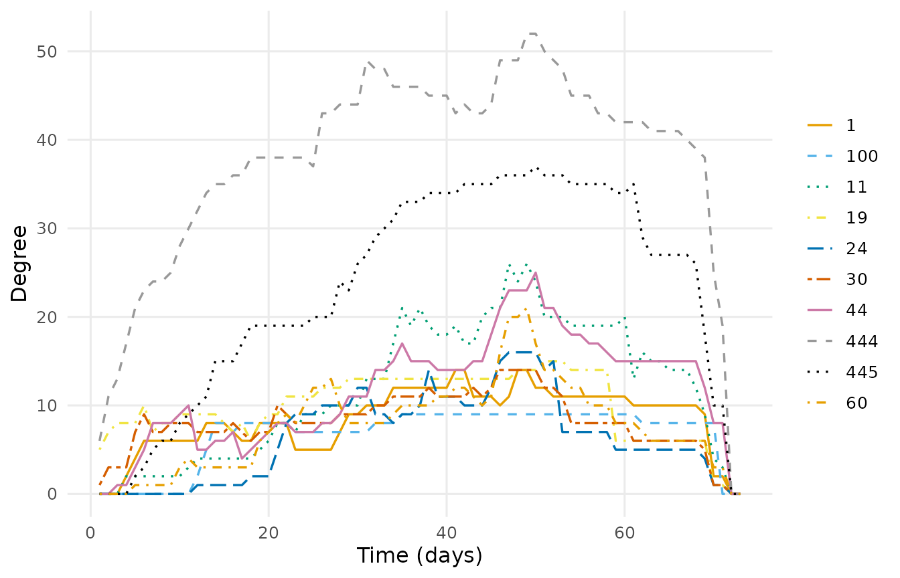

Closeness, betweenness, and eigenvector centrality describe different
aspects of participants’ positions in the network (Freeman, 1979;
Bonacich, 1987). **Closeness centrality** is based on shortest-path
distances to other participants. Higher values indicate shorter average
distances, meaning that fewer steps are required to reach others.
**Betweenness centrality** measures the extent to which a participant
lies on shortest paths between other participants, identifying potential
intermediary positions. **Eigenvector centrality** accounts for the
centrality of a participant’s neighbours, assigning higher scores to
connections with other highly central participants.

The following call computes all three measures within successive one-day
intervals. These calculations use the connections present within each
interval; they do not trace time-respecting paths across intervals.

``` r

other_centrality <- centrality_series(dn,
                                      measure = c("closeness", "betweenness",
                                                  "eigenvector"),
                                      start = 1, end = 73, step = 1, window = 1)
summary(other_centrality, by = "measure")
#>       measure    n       mean         sd min      max peak_time
#> 1 betweenness 3285 34.5716895 98.4872310   0 974.0571        31
#> 2   closeness 3285  0.4221442  0.2069263   0   1.0000         1
#> 3 eigenvector 3285  0.2351984  0.2028102   0   1.0000         1
```

Across participants and daily intervals, betweenness averages 34.6 and
reaches a maximum of 974.1 on day 31. Mean closeness is 0.42, and mean
eigenvector centrality is 0.24; their reported maxima are both 1 on
day 1. These measures have different scales and interpretations, so
their numerical magnitudes should not be compared directly.

Plotting betweenness trajectories shows when participants occupy
intermediary positions and how those positions change during the course.

``` r

betweenness <- centrality_series(dn, measure = "betweenness",
                                 start = 1, end = 73, step = 1, window = 1)
plot(betweenness, top = 10)
```

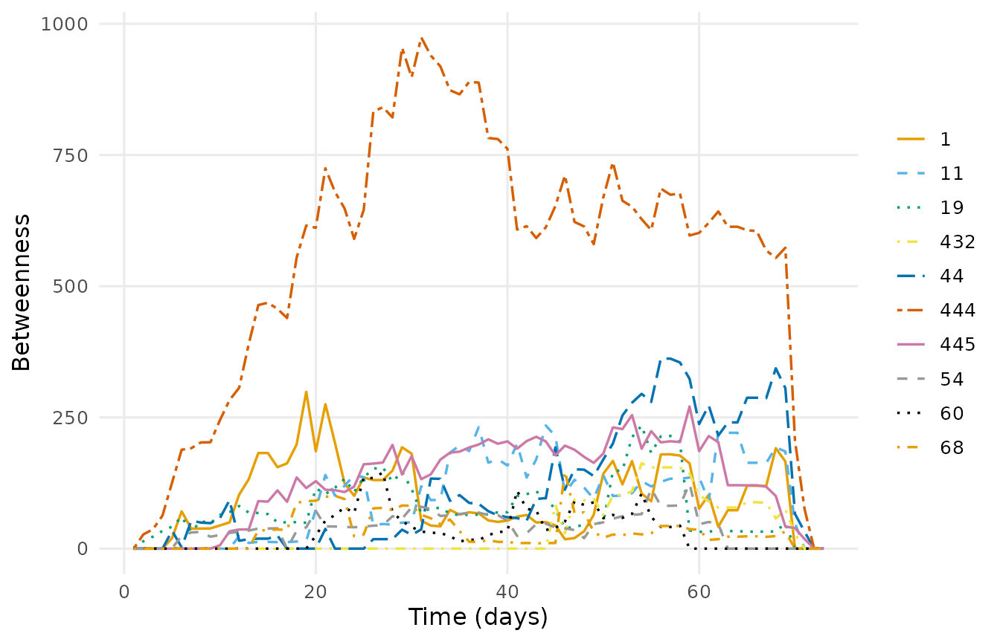

Centrality can also be calculated on the network aggregated over the
full observation period. The following call returns a tidy participant
table containing vertex attributes and the requested aggregate
centralities:

``` r

ranked <- as.data.frame(dn, what = "nodes",
                        measure = c("degree", "betweenness", "eigenvector"))
head(ranked)
#>   name experience expert_level degree betweenness eigenvector
#> 1    1          1       Expert     20   37.308745   0.4188396
#> 2    5          3      Teacher     10    4.222691   0.3152262
#> 3    6          1       Expert     13    4.759524   0.3337165
#> 4    7          2      Student     26   34.113923   0.5748078
#> 5   11          3      Teacher     47  180.530502   0.8963590
#> 6   13          2      Student     15   16.629447   0.4051050
```

Among the first six participants displayed, participant `11`, a teacher,
has the highest degree (47), betweenness (180.5), and eigenvector
centrality (0.896). These comparisons concern only the displayed
participants. Aggregate centralities summarise positions across the full
period, whereas the daily trajectories show when those positions emerge
or change.

## Reachability

Temporal reachability describes whether one participant can reach
another through a sequence of interactions that follows temporal order.
For example, a path from A through B to C requires the connection from B
to C to be available after arrival at B. Waiting between interactions is
permitted, but an earlier interaction cannot be used to continue a path
that reaches B later.

[`paths()`](https://pak.dynasite.org/Dynet/reference/paths.md)
identifies the earliest-arrival paths from a specified participant. It
first minimises arrival time and then, among paths arriving equally
early, minimises the number of hops. A path through several
intermediaries may therefore reach its destination before a direct
connection becomes available.

The following call searches forward from participant `444`:

``` r

forward <- paths(dn, from = "444", direction = "forward")
forward
#> # Time-respecting paths from '444', from t = 0.1138889
#> # reaches 44 of 44 other vertices | time in days
#>  node reachable arrival_time attained   latency n_hops n_paths
#>     1      TRUE     5.484028     TRUE  5.370139      2       1
#>     5      TRUE    33.213194     TRUE 33.099306      2       1
#>     6      TRUE    37.055556     TRUE 36.941667      2       1
#>     7      TRUE    11.863889     TRUE 11.750000      3       1
#>    11      TRUE    12.383333     TRUE 12.269444      1       1
#>    13      TRUE    26.195139     TRUE 26.081250      2       1
#>    15      TRUE     6.135417     TRUE  6.021528      5       1
#>    17      TRUE    20.250694     TRUE 20.136806      4       3
#>    19      TRUE     2.222222     TRUE  2.108333      1       1
#>    24      TRUE    21.067361     TRUE 20.953472      2       1
#>    26      TRUE    25.313889     TRUE 25.200000      2       1
#>    27      TRUE    21.071528     TRUE 20.957639      3       1
#> # 33 more rows. summary() aggregates them; plot() draws the tree.
summary(forward)
#>          property    value
#> 1          source      444
#> 2       direction  forward
#> 3       reachable       44
#> 4 reachable share        1
#> 5  median latency 17.63819
#> 6     max latency 50.87431
#> 7     median hops        2
#> 8        max hops        5
```

The result reports the earliest arrival at each participant in
`arrival_time`. The `latency` column measures elapsed time from the
search origin to arrival, including waiting between interactions.
`n_hops` records the number of traversed ties, and `n_paths` records the
number of optimal paths. By default, traversal itself takes zero time;
arrival times are determined by when the required connections become
available.

Participant `444` can reach all 44 other participants. Participant `19`
is reached in one hop after 2.11 days, while participant `11` is reached
in one hop after 12.27 days. Participant `15` requires five hops but is
reached after 6.02 days, illustrating why fewer hops do not necessarily
imply earlier arrival. Median latency is 17.6 days, and the maximum is
50.9 days. The median path contains two hops, and the longest contains
five.

These paths follow the network’s reply direction, from the replying
participant to the participant addressed. They therefore describe
reachability through the specified reply relationships. Interpreting
them as the forward transmission of information requires this direction
to match the process being modelled.

The path plot displays the routes connecting the source to reachable
participants:

``` r

plot(forward, base_size = 9)
```

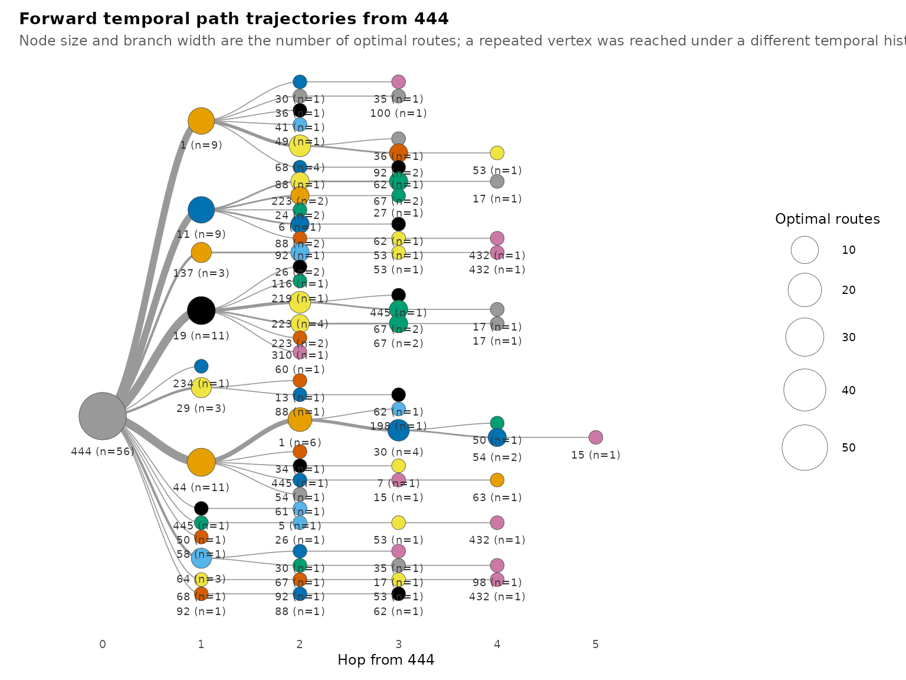

The temporal progression of these paths can be displayed using
[`path_trajectories()`](https://pak.dynasite.org/Dynet/reference/path_trajectories.md)
and
[`plot_path_trajectories()`](https://pak.dynasite.org/Dynet/reference/plot_path_trajectories.md).
The first function organises the path result into a tree of
trajectories. Setting `measure = "time"` then positions the trajectory
steps according to their temporal values, showing when participants are
reached along each route.

``` r

tree <- path_trajectories(forward)
plot_path_trajectories(tree, measure = "time", base_size = 9)
```

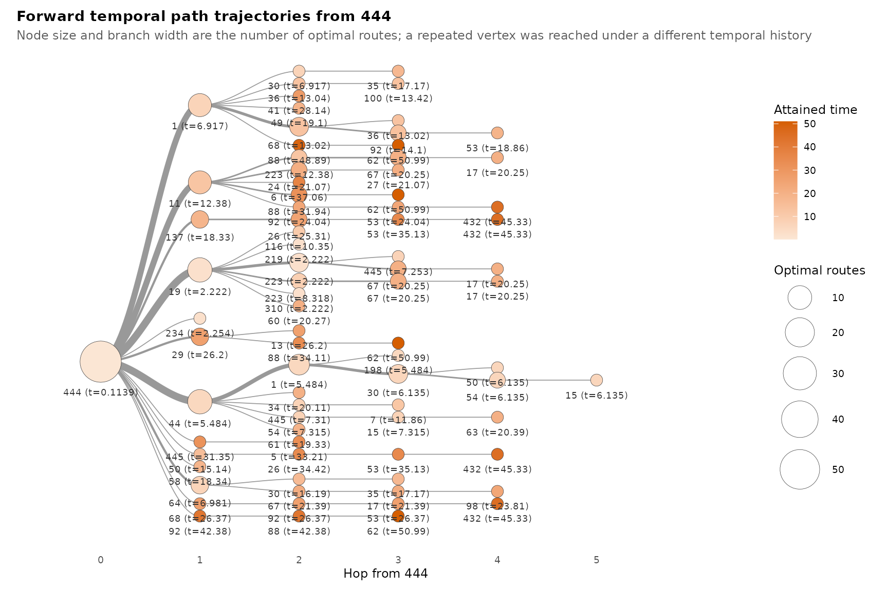

This complements the path diagram by making timing explicit. Routes with
similar numbers of hops may have different arrival times because their
constituent interactions become available at different points in the
observation period.

## Mixing between experience levels

Mixing describes the pattern of relationships within and between
categories of participants (Newman, 2003). Here, the categories are
teachers, students, and experts, recorded in `expert_level`. The
analysis examines how connections among these categories change over the
course—for example, student-to-student connections compared with
student-to-teacher connections.

[`mixing()`](https://pak.dynasite.org/Dynet/reference/mixing.md) groups
active connections according to the experience levels of their senders
and receivers. The following call computes these counts within
successive one-day intervals:

``` r

mix <- mixing(dn, attribute = "expert_level",
              start = 1, end = 73, step = 1, window = 1)
summary(mix)
#>              measure  n      mean        sd min max peak_time
#> 1   Expert -> Expert 73  2.890411  3.138301   0   8        54
#> 2  Expert -> Student 73  5.849315  3.703119   0  14        50
#> 3  Expert -> Teacher 73 14.315068  6.220211   0  24        55
#> 4  Student -> Expert 73  4.315068  3.620454   0  12        50
#> 5 Student -> Student 73 10.000000  4.725816   0  22        50
#> 6 Student -> Teacher 73 33.493151 14.732922   0  56        50
#> 7  Teacher -> Expert 73  5.808219  3.984893   0  14        48
#> 8 Teacher -> Student 73 16.232877  8.280701   0  35        47
#> 9 Teacher -> Teacher 73 36.821918 15.738614   0  67        49
plot(mix)
```

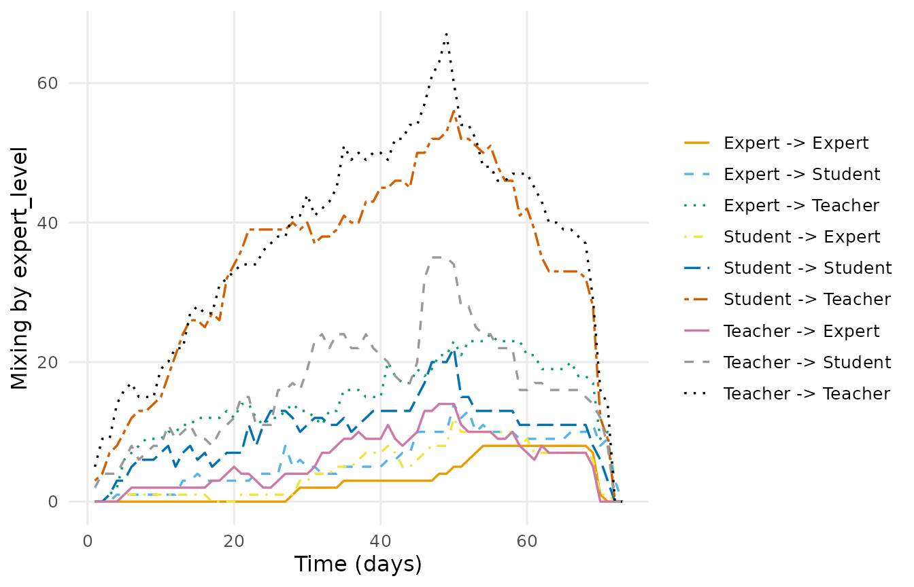

Each value counts distinct connected participant pairs within the
corresponding category combination. Several active spells from the same
student to the same teacher contribute one student-to-teacher connection
in that interval. The counts therefore describe active relationships,
rather than the number of replies posted that day. Connections included
in a daily window need not all be active at the same instant.

Teacher-to-teacher connections are the most frequent, averaging 36.8 per
daily interval and reaching a maximum of 67. Student-to-teacher
connections average 33.5, while expert-to-expert connections average
2.9. The pattern also differs by direction: expert-to-teacher
connections average 14.3, compared with 5.8 for teacher-to-expert
connections. These are unnormalised counts and should be interpreted in
relation to the number of participants in each category.

## Interpretation

The analysis shows how the timing of relationships changes the
description of the forum. In the selected subnetwork, aggregate density
is 0.216, whereas temporal density is 0.063. The aggregate network
therefore contains substantially more connectivity than is sustained
throughout the observation period: many participant pairs are connected,
but only for part of that period.

Participants’ positions also vary over time. Indegree reaches a higher
maximum than outdegree, indicating that some participants receive
connections from more distinct participants than any participant
addresses within a daily interval. Mixing counts show frequent
teacher-to-teacher and student-to-teacher relationships, although
differences in category size must be considered when interpreting these
counts.

Participant `444` can reach every other participant in the selected
subnetwork through time-respecting paths. However, median latency is
17.6 days, and the maximum is 50.9 days. Complete reachability therefore
coexists with substantial waiting before some destinations become
accessible. These values describe possible traversal of the modelled
reply relationships; they do not measure the observed transmission speed
of information.

## Limitations

Relational duration is defined by continued activity within a
discussion: each reply relationship remains active until the
discussion’s last recorded interaction. This assumption affects network
density, centrality, and temporal paths. Shorter spell durations could
produce fewer active connections, longer waiting times, or unreachable
destinations. The assigned duration should therefore be interpreted as a
model of discussion activity rather than continuous interpersonal
contact.

Most analyses concern the 45 participants whose aggregate degree exceeds
20. Their results describe relationships among these selected
participants and cannot be generalised directly to the full forum. The
reciprocity analysis explicitly uses `dn_full` and consequently
describes a different participant population.

Daily and weekly windows combine relationships active during the same
interval. Such relationships need not overlap at an instant, whereas
calculations with `window = 0` evaluate connectivity at specific time
points. The observation period is determined from the supplied
interaction data rather than independently specified course dates.

Finally, ties run from the replying participant to the participant
addressed. Temporal paths follow this direction. Interpreting those
paths as information dissemination requires a substantive justification
for how the direction of reply relationships represents the process of
interest.

## References

Bonacich, P. (1987). Power and centrality: A family of measures.
*American Journal of Sociology*, 92(5), 1170–1182.

Freeman, L. C. (1979). Centrality in social networks: Conceptual
clarification. *Social Networks*, 1(3), 215–239.

Kempe, D., Kleinberg, J., & Kumar, A. (2002). Connectivity and inference
problems for temporal networks. *Journal of Computer and System
Sciences*, 64(4), 820–842.

Newman, M. E. J. (2003). Mixing patterns in networks. *Physical Review
E*, 67(2), 026126.

Saqr, M. (2024). Temporal network analysis: Introduction, methods and
analysis with R. In M. Saqr & S. López-Pernas (Eds.), *Learning
analytics methods and tutorials: A practical guide using R*. Springer.
<https://doi.org/10.1007/978-3-031-54464-4_17>

Saqr, M., & Nouri, J. (2020). High resolution temporal network analysis
to understand and improve collaborative learning. In *Proceedings of the
Tenth International Conference on Learning Analytics & Knowledge*
(pp. 314–319). ACM.

Wasserman, S., & Faust, K. (1994). *Social network analysis: Methods and
applications*. Cambridge University Press.
