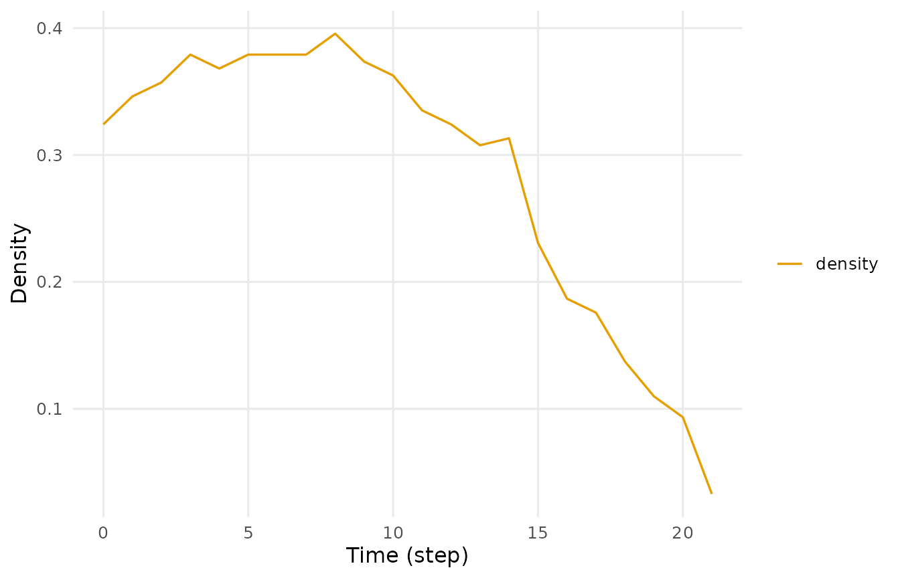
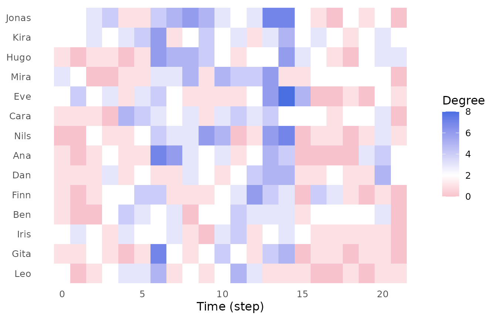

# Getting started with Dynet

Temporal network analysis studies relations together with the times at
which they occur. A face-to-face conversation has a beginning and an
end, a message has a timestamp, and a reply in a discussion thread
follows the post it answers. Such data come in two types: *contact
sequences*, in which each relation is an instantaneous event, and
*interval graphs*, in which each relation is active over a period of
time. Dynet stores both as **spells**. A spell is an ordered pair of
vertices together with the interval over which the tie between them is
active, and a temporal network is the set of all spells over an
observation period.

Aggregating the spells into one static graph discards three properties
of the data: how often a pair interacted, how long each interaction
lasted, and the order in which the interactions occurred. Order has the
largest consequences, because it constrains what can flow through the
network. A sequence of ties from A through B to C can carry information
from A to C only if the tie between B and C is active at or after the
time the tie between A and B is used. Such a sequence is a
**time-respecting path**. Every time-respecting path is a path of the
aggregated graph, but the converse does not hold, and reachability along
time-respecting paths is not transitive: A may reach B and B may reach C
while A cannot reach C. The timing of relationships can therefore leave
far fewer vertices reachable than the aggregated graph suggests, and
uneven timing of contacts slows spreading compared with the same
contacts shuffled in time.

Collaborative learning is a natural case for these methods. The order in
which students contribute is part of what is being studied, so a model
of who interacted with whom that ignores when they interacted discards
the object of study.

This vignette applies these ideas to one log of classroom contacts. The
analysis moves from the network as a whole, to individual vertices, to
paths between vertices, and finally to the spells themselves:

1.  Construct the temporal network and describe its size and time span.
2.  Measure density in successive windows, which gives a graph-level
    time series.
3.  Measure the degree of every vertex in every window, which gives one
    trajectory per vertex.
4.  Compute temporal closeness and temporal betweenness on
    time-respecting paths.
5.  Trace the time-respecting paths from one source, forward and
    backward in time, and represent them as routes and as a tree.
6.  Describe tie dynamics: formation and dissolution, duration and
    burstiness.

## Data

`school_contacts` is a simulated interval log of face-to-face contacts
among fourteen students over about three weeks. Each row is one contact.
`from` names the student who initiated the contact and `to` the student
who was addressed, so every contact has a direction. `start` and `end`
give the times at which the contact began and ended, in days since the
start of observation. Times are decimal, so a contact can begin and end
within one day.

To inspect the log, we call
[`head()`](https://rdrr.io/r/utils/head.html), which prints its first
six rows.

``` r

head(school_contacts)
#>    from   to start  end
#> 1 Jonas  Dan  0.00 1.10
#> 2  Gita  Ana  0.14 0.98
#> 3   Leo Mira  0.15 0.42
#> 4   Leo Iris  0.15 0.96
#> 5  Kira  Ben  0.33 0.69
#> 6   Leo Iris  0.38 0.50
```

## Building the network

[`dynet()`](https://pak.dynasite.org/Dynet/reference/dynet.md)
constructs a temporal network from a relational log. It recognises four
log formats (interval, contact, threaded and co-presence) from the
columns and arguments it receives. A log with both a `start` and an
`end` column is read as an interval log, which gives an interval graph.
Each spell is active on the half-open interval
$`[\text{start}, \text{end})`$: it includes its start time and excludes
its end time, so a spell that ends at time $`t`$ and a spell that begins
at $`t`$ are never active together.

To construct the network, we call
[`dynet()`](https://pak.dynasite.org/Dynet/reference/dynet.md) on the
log. The print method reports the format, the direction, the size and
the observed time span, followed by the first spells.
[`dynet()`](https://pak.dynasite.org/Dynet/reference/dynet.md) adds a
`duration` column, equal to `end` minus `start`, and a `weight` column.

``` r

dn <- dynet(school_contacts)
dn
#> # Temporal network (interval format, directed) | a cograph netobject
#> # 14 vertices | 240 edge spells | 110 distinct pairs
#> # observed from 0 to 21.52 step, binned every 1
#> 
#>   from   to start  end duration weight
#>  Jonas  Dan  0.00 1.10     1.10      1
#>   Gita  Ana  0.14 0.98     0.84      1
#>    Leo Mira  0.15 0.42     0.27      1
#>    Leo Iris  0.15 0.96     0.81      1
#>   Kira  Ben  0.33 0.69     0.36      1
#>    Leo Iris  0.38 0.50     0.12      1
#> # 234 more spells. summary() describes the network; plot() draws it.
```

The network has 14 vertices, 240 spells and 110 distinct ordered pairs,
and is observed from time 0 to 21.52. Times are stored as plain numbers
with the unit `step`; in this log one step is one day. The bin width of
1 sets the default resolution of every windowed measure below to one
day. Every spell has weight 1.

Because the network is directed, the pair (Ana, Cara) is distinct from
(Cara, Ana), and a time-respecting path traverses a spell only from its
`from` vertex to its `to` vertex. With $`n = 14`$ vertices there are
$`n(n - 1) = 182`$ possible ordered pairs, so 110 of 182 pairs, about
60%, were in contact at least once. The aggregated graph is therefore
dense. The rest of the vignette asks how much of that connectivity is
present at any one time, and how much is available along time-respecting
paths.

To obtain the same description as a table with one row per property, we
call [`summary()`](https://rdrr.io/r/base/summary.html). It adds the
number of time bins and the mean snapshot density, the average of the
daily densities computed in the next section.

``` r

summary(dn)
#>                 property        value
#> 1                 format     interval
#> 2               directed          yes
#> 3               vertices           14
#> 4            edge spells          240
#> 5         distinct pairs          110
#> 6              time unit         step
#> 7          observed from            0
#> 8            observed to        21.52
#> 9                   span        21.52
#> 10             bin width            1
#> 11             time bins           22
#> 12 mean snapshot density       0.0829
#> 13      temporal density not computed
#> 14              sessions         none
#> 15     vertex attributes         none
```

The observation period spans 22 daily bins, and the mean snapshot
density is 0.0829. On an average day about one ordered pair in twelve is
in contact, against 60% over the whole period. The gap between the two
figures is a first sign that the aggregated graph overstates the
connectivity present at any given time.

To see when spells form and dissolve over the observation period, we
call [`plot()`](https://rdrr.io/r/graphics/plot.default.html) with
`type = "activity"`. The activity plot places spell formation and
dissolution on a common time axis, which shows periods of high and low
turnover before any measure is computed.

``` r

plot(dn, type = "activity")
```


## Measuring in windows

A temporal network can be measured in two ways. The first divides the
observation period into windows, aggregates the spells in each window
into a static snapshot, and computes a static measure on every snapshot,
which gives a time series. The second computes measures directly on
time-respecting paths and is introduced in the section on temporal
centrality. This section and the next use the first.

Every Dynet function that returns a time series takes the same four
timing arguments. `start` and `end` set the first and last measurement
times and default to the observed range. `step` is the interval between
successive measurements and defaults to the bin width of the network.
`window` is the length of time each measurement covers, counted forward
from the measurement time, so the measurement at time $`t`$ uses the
spells active in $`[t, t + \text{window})`$. It defaults to `step`,
which divides the observation period into non-overlapping bins. The
window length is an analytic choice: a short window resolves change
finely but gives sparse snapshots, and a long window gives denser
snapshots at the cost of temporal resolution.

**Density** is the proportion of possible ties that are present. In a
directed network with $`n`$ vertices, the density of window $`w`$ is

``` math
D_w = \frac{m_w}{n(n-1)},
```

where $`m_w`$ is the number of ordered pairs with at least one spell
active at some time in the window. A pair counts once however many
spells it has in the window, so $`D_w`$ lies between 0 and 1.

To obtain daily density, we call
[`metrics()`](https://pak.dynasite.org/Dynet/reference/metrics.md) with
`measure = "density"`. The result has one row per window, with the
columns `time` (the start of the window), `measure` and `value`.

``` r

density <- metrics(dn, measure = "density")
density
#> # Density (graph-level)
#> # 22 time points, 1 per bin | time in step
#>  time measure      value
#>     0 density 0.05494505
#>     1 density 0.04395604
#>     2 density 0.05494505
#>     3 density 0.06593407
#>     4 density 0.07142857
#>     5 density 0.08791209
#>     6 density 0.15934066
#>     7 density 0.10439560
#>     8 density 0.09890110
#>     9 density 0.08791209
#>    10 density 0.10439560
#>    11 density 0.09890110
#> # 10 more rows. summary() aggregates them; plot() draws them.
```

On day 0 the density is 0.055: 10 of the 182 ordered pairs were in
contact at some time that day. On day 6 it rises to 0.159, or 29 pairs.
The final bin begins at day 21 and ends with the observation at day
21.52, so it covers about half a day, and its density is not comparable
with that of a full day.

To reduce the series to one row, we call
[`summary()`](https://rdrr.io/r/base/summary.html). The columns are the
number of windows `n`, the `mean`, standard deviation `sd`, `min` and
`max` of the values, and `peak_time`, the start of the window with the
largest value.

``` r

summary(density)
#>   measure  n       mean         sd        min       max peak_time
#> 1 density 22 0.08291708 0.03929021 0.03296703 0.1648352        14
```

Across the 22 bins the mean daily density is 0.083 (SD 0.039). The
maximum, 0.165, falls on day 14, when 30 of the 182 ordered pairs were
in contact. The minimum, 0.033, belongs to the truncated final bin;
among full days the lowest value is 0.038, on day 18.

Daily snapshots vary from one day to the next, partly because a contact
near a bin boundary falls on one side or the other of it. A rolling
window reduces this variation. Setting `window` larger than `step` makes
successive windows overlap: with `step = 1` and `window = 7`, a
measurement is taken every day and each covers the seven days
$`[t, t + 7)`$. A pair is present if it was in contact at any time in
those seven days, so the weekly density starting at time $`t`$ is never
lower than the daily density starting at $`t`$. Windows that start after
day 14.52 extend past the end of observation and cover fewer than seven
days, so the final values of the series rest on progressively shorter
windows.

To obtain the rolling weekly series and draw it, we call
[`metrics()`](https://pak.dynasite.org/Dynet/reference/metrics.md) with
`step = 1` and `window = 7`, and then
[`plot()`](https://rdrr.io/r/graphics/plot.default.html).

``` r

density_weekly <- metrics(dn, measure = "density", step = 1, window = 7)
plot(density_weekly)
```



## Vertex trajectories

Density describes the network as a whole. A **centrality** index
describes the position of one vertex.
[`dyn_centrality()`](https://pak.dynasite.org/Dynet/reference/dyn_centrality.md)
computes a centrality index for every vertex in every window and returns
one row per vertex per window, so each vertex has a trajectory over
time. `measure` selects the index, and `start`, `end`, `step` and
`window` work as in
[`metrics()`](https://pak.dynasite.org/Dynet/reference/metrics.md).

**Degree** counts the distinct partners of a vertex within a window. In
a directed network the default, `mode = "all"`, adds in-degree, the
number of distinct vertices with a spell to the vertex, and out-degree,
the number of distinct vertices the vertex has a spell to. Several
spells between the same ordered pair in one window count once.

To obtain daily degree, we call
[`dyn_centrality()`](https://pak.dynasite.org/Dynet/reference/dyn_centrality.md)
with `measure = "degree"`. The result has the columns `time`, `node`,
`measure` and `value`.

``` r

degree <- dyn_centrality(dn, measure = "degree")
degree
#> # Degree (node-level)
#> # 14 vertices | 22 time points, 1 per bin | time in step
#>  time  node measure value
#>     0   Ana  degree     1
#>     0   Ben  degree     1
#>     0  Cara  degree     1
#>     0   Dan  degree     1
#>     0   Eve  degree     2
#>     0  Finn  degree     1
#>     0  Gita  degree     1
#>     0  Hugo  degree     1
#>     0  Iris  degree     2
#>     0 Jonas  degree     2
#>     0  Kira  degree     2
#>     0   Leo  degree     2
#> # 296 more rows. summary() aggregates them; plot() draws them.
```

Each row is one vertex in one window, so 14 students over 22 days give
308 rows. In the twelve rows shown for day 0, five students have two
partners and the other seven one. The first day’s network is a scatter
of isolated contacts, not a connected structure.

To reduce each trajectory to one row per vertex, we call
[`summary()`](https://rdrr.io/r/base/summary.html). It reports the
number of windows `n`, the `mean`, `sd`, `min` and `max` of the vertex’s
daily degree, and `peak_time`, the start of the window in which that
degree was highest.

``` r

summary(degree)
#>     node measure  n     mean       sd min max peak_time
#> 1    Ana  degree 22 2.181818 2.015095   0   7         6
#> 2    Ben  degree 22 2.000000 1.234427   0   4         4
#> 3   Cara  degree 22 2.227273 1.342770   0   5         4
#> 4    Dan  degree 22 2.090909 1.444500   1   5        13
#> 5    Eve  degree 22 2.272727 2.051290   0   8        14
#> 6   Finn  degree 22 2.000000 1.661898   0   6        12
#> 7   Gita  degree 22 1.727273 1.777688   0   7         6
#> 8   Hugo  degree 22 2.318182 1.861550   0   6         6
#> 9   Iris  degree 22 1.772727 1.066004   0   4        11
#> 10 Jonas  degree 22 2.863636 2.076982   0   7        13
#> 11  Kira  degree 22 2.636364 1.255292   1   6         6
#> 12   Leo  degree 22 1.636364 1.432462   0   5         6
#> 13  Mira  degree 22 2.272727 1.695423   0   6        13
#> 14  Nils  degree 22 2.181818 2.174229   0   7        14
```

Mean daily degree varies little across the class, from 1.64 to 2.86
partners per day. Students differ more in how their contacts are
distributed over days than in how many contacts they have. The summary
shows two contrasting patterns of contact.

- **Steady contact.** The student has a partner on most days and never
  many at once. Two students have at least one partner on every day
  (`min` of 1), and the three smallest standard deviations, 1.07 to
  1.26, belong to students whose maximum is 4 to 6.
- **Episodic contact.** Days without any partner alternate with days of
  many partners. Five students reach a maximum of 7 or 8, and their
  standard deviations lie between 1.78 and 2.17. Their peaks fall on
  days 6, 13 and 14, the three densest days of the observation period.

Mean degree does not separate the two patterns, because the means of
both fall within the same narrow range. The patterns are the two ends of
a continuum, not discrete groups. They matter for anything that spreads
through contact: a steadily connected student can pass something on at
almost any time, while an episodically connected student can do so
mainly when the whole class is active.

To display all fourteen trajectories together, we call
[`plot()`](https://rdrr.io/r/graphics/plot.default.html) with
`type = "heatmap"`. It draws one tile per vertex and window, shaded by
degree.

``` r

plot(degree, type = "heatmap")
```



## Temporal centrality

Windowed degree treats each day as a separate static network. A contact
on one day and a contact on the next are never combined, so a windowed
measure cannot show whether something could pass from one student to
another through a third over several days. Temporal centrality indices
address this by computing distances along time-respecting paths over the
whole observation period. Setting `scope = "temporal"` in
[`dyn_centrality()`](https://pak.dynasite.org/Dynet/reference/dyn_centrality.md)
selects this approach and returns one value per vertex.

A time-respecting path can be optimal in three different senses. A
**foremost** path reaches its endpoint at the earliest possible time, a
**shortest** path uses the fewest hops, and a **fastest** path has the
smallest difference between arrival and departure. Dynet uses **shortest
foremost** paths: among the paths that arrive earliest, it keeps those
with the fewest hops. A path may wait at a vertex for any length of
time, and its hop times must not decrease, so two spells active at the
same instant can be chained.

The **latency** from a source $`s`$ to a vertex $`z`$ is $`a_z - o_s`$,
where $`a_z`$ is the earliest arrival time at $`z`$ and $`o_s`$ is the
time at which the search leaves $`s`$, here the start of observation.
Temporal closeness is built from these latencies. With $`R_s`$ the set
of vertices other than $`s`$ that are reachable from $`s`$, Dynet
computes

``` math
C(s) = \frac{|R_s|}{\sum_{z \in R_s} (a_z - o_s)},
```

the reciprocal of the mean latency to the reachable vertices, in inverse
days. A student whose contacts connect early to the rest of the class
has high temporal closeness, whatever that student’s degree on any
single day.

To obtain temporal closeness, we call
[`dyn_centrality()`](https://pak.dynasite.org/Dynet/reference/dyn_centrality.md)
with `measure = "closeness"` and `scope = "temporal"`.

``` r

closeness <- dyn_centrality(dn, measure = "closeness", scope = "temporal")
closeness
#> # Closeness (node-level)
#> # 14 vertices | time in step
#> # computed on time-respecting paths across the whole window
#>   node   measure     value
#>    Ana closeness 0.1313662
#>    Ben closeness 0.1815896
#>   Cara closeness 0.1931075
#>    Dan closeness 0.2230994
#>    Eve closeness 0.2616221
#>   Finn closeness 0.1644945
#>   Gita closeness 0.1404950
#>   Hugo closeness 0.1878341
#>   Iris closeness 0.2398082
#>  Jonas closeness 0.3674392
#>   Kira closeness 0.2107994
#>    Leo closeness 0.3747478
#> # 2 more rows. summary() aggregates them; plot() draws them.
```

Temporal closeness ranges from 0.131 to 0.375, a mean latency of 7.6
days at the low end and 2.7 days at the high end. The time a student
needs to reach the rest of the class therefore varies almost threefold,
while mean daily degree varies less than twofold. The ordering does not
follow contact volume. The two highest values, 0.375 and 0.367, belong
to the students with the lowest (1.64) and the highest (2.86) mean daily
degree. Closeness is set by timing. A student reaches the class quickly
when that student’s early contacts are with partners who are about to
meet others, however many contacts the student has.

**Temporal betweenness** measures how often a vertex lies on the optimal
paths between other vertices. For each ordered pair of a source $`s`$
and a target $`t`$ reachable from $`s`$, one unit of credit is divided
equally among the shortest foremost paths from $`s`$ to $`t`$. Each
intermediate vertex receives the share of those paths that pass through
it, and the source and target receive nothing. Summing over all ordered
pairs gives

``` math
B(v) = \sum_{s \neq v \neq t} \frac{\sigma_{st}(v)}{\sigma_{st}},
```

where $`\sigma_{st}`$ is the number of shortest foremost paths from
$`s`$ to $`t`$ and $`\sigma_{st}(v)`$ is the number of those paths that
pass through $`v`$. Dynet does not normalise the sum; with $`n = 14`$
vertices it lies between 0 and $`(n - 1)(n - 2) = 156`$.

To obtain temporal betweenness, we call
[`dyn_centrality()`](https://pak.dynasite.org/Dynet/reference/dyn_centrality.md)
with `measure = "betweenness"` and the same scope.

``` r

betweenness <- dyn_centrality(dn, measure = "betweenness", scope = "temporal")
betweenness
#> # Betweenness (node-level)
#> # 14 vertices | time in step
#> # computed on time-respecting paths across the whole window
#>   node     measure     value
#>    Ana betweenness 11.000000
#>    Ben betweenness 15.416667
#>   Cara betweenness 41.916667
#>    Dan betweenness  4.333333
#>    Eve betweenness 16.416667
#>   Finn betweenness 25.583333
#>   Gita betweenness 22.000000
#>   Hugo betweenness 12.333333
#>   Iris betweenness 16.833333
#>  Jonas betweenness  7.000000
#>   Kira betweenness 41.750000
#>    Leo betweenness 32.583333
#> # 2 more rows. summary() aggregates them; plot() draws them.
```

Temporal betweenness ranges from 4.3 to 41.9, almost tenfold, so it
separates the students far more than degree does. It measures a
different role from closeness:

- **Reach** (closeness): how soon a student’s own contacts connect that
  student to everyone else.
- **Relay** (betweenness): how often a student’s contacts fall after a
  path from one student has arrived and before it continues to another.

In these data the two roles are held mostly by different students. The
two highest betweenness values, 41.9 and 41.8, belong to students ranked
seventh and eighth of fourteen in closeness. The student with the
second-highest closeness, who also has the highest mean daily degree,
has the second-lowest betweenness, 7.0. Only one student holds both
roles, with the highest closeness and the third-highest betweenness
(32.6). Neither a large number of contacts nor fast reach makes a
student a relay. A student relays only when the timing of that student’s
contacts bridges the timing of other students’ contacts.

## Time-respecting paths

Temporal centralities summarise every source at once.
[`paths()`](https://pak.dynasite.org/Dynet/reference/paths.md) examines
one source: it returns the shortest foremost paths from the vertex named
in `from` to every other vertex. The search begins at the start of
observation unless `start` is set. The result has one row per vertex.
`reachable` records whether any time-respecting path from the source
reaches the vertex, and `arrival_time` the earliest time a path reaches
it. `attained` records whether a path arrives at exactly that time,
which matters for backward searches. `latency` is `arrival_time` minus
the search start, `n_hops` the number of spells on a shortest foremost
path, and `n_paths` the number of distinct shortest foremost paths.

To obtain the paths leaving Ana, we call
[`paths()`](https://pak.dynasite.org/Dynet/reference/paths.md) with
`from = "Ana"`.

``` r

from_ana <- paths(dn, from = "Ana")
from_ana
#> # Time-respecting paths from 'Ana', from t = 0
#> # reaches 13 of 13 other vertices | time in step
#>   node reachable arrival_time attained latency n_hops n_paths
#>    Ana      TRUE         0.00     TRUE    0.00      0       1
#>    Ben      TRUE         9.59     TRUE    9.59      3       3
#>   Cara      TRUE         6.67     TRUE    6.67      1       1
#>    Dan      TRUE         7.98     TRUE    7.98      4       1
#>    Eve      TRUE        11.66     TRUE   11.66      4       3
#>   Finn      TRUE         6.96     TRUE    6.96      2       1
#>   Gita      TRUE         6.36     TRUE    6.36      2       1
#>   Hugo      TRUE         7.98     TRUE    7.98      3       1
#>   Iris      TRUE        10.00     TRUE   10.00      3       1
#>  Jonas      TRUE         2.12     TRUE    2.12      1       1
#>   Kira      TRUE         6.12     TRUE    6.12      2       2
#>    Leo      TRUE         9.65     TRUE    9.65      3       1
#> # 2 more rows. summary() aggregates them; plot() draws the tree.
```

The search starts at day 0. The source reaches three students in one
hop, four in two, four in three and two in four. Hop count and arrival
time are only loosely related. A two-hop path arrives on day 6.12,
before two of the one-hop paths (days 6.36 and 6.67), and a four-hop
path arrives on day 7.98, two days before a three-hop path (day 10.00).
In a static graph the vertex fewer hops away is the nearer one. Along
time-respecting paths the nearer vertex is the one whose connecting
contacts happen sooner. Three destinations are reached by more than one
shortest foremost path, which the tree below shows as parallel branches.
The source’s temporal closeness of 0.131 can be recovered from this
table: 13 students reached, divided by the sum of their latencies, 98.96
days.

To summarise the reachable set, we call
[`summary()`](https://rdrr.io/r/base/summary.html). It reports the
number and share of vertices reached, and the median and maximum of
latency and of hops.

``` r

summary(from_ana)
#>          property   value
#> 1          source     Ana
#> 2       direction forward
#> 3       reachable      13
#> 4 reachable share       1
#> 5  median latency    7.51
#> 6     max latency   11.66
#> 7     median hops       2
#> 8        max hops       4
```

Ana reaches all 13 other students (reachable share 1). The median
latency is 7.51 days and the maximum 11.66 days; the median path uses 2
hops and the longest 4. On no single day are more than 16.5% of the
ordered pairs in contact (maximum daily density 0.165), yet contacts
chained across days connect Ana to every other student within twelve
days.

Reachability depends on when the search begins. A spell can extend a
path only if it is active at or after the time the path reaches its
`from` vertex, so spells that ended before the search start cannot be
used. To begin the search on day 18, we call
[`paths()`](https://pak.dynasite.org/Dynet/reference/paths.md) with
`start = 18`; only spells active during the last 3.52 days of
observation are then available.

``` r

from_ana_late <- paths(dn, from = "Ana", start = 18)
summary(from_ana_late)
#>          property   value
#> 1          source     Ana
#> 2       direction forward
#> 3       reachable       5
#> 4 reachable share   0.385
#> 5  median latency    2.43
#> 6     max latency    2.68
#> 7     median hops       2
#> 8        max hops       3
```

From day 18, Ana reaches 5 of the 13 other students (reachable share
0.385), with a maximum latency of 2.68 days and at most 3 hops. From day
0 the same source reaches every student. In a temporal network
reachability is a property of a vertex at a given time, not of the
vertex alone.

[`paths()`](https://pak.dynasite.org/Dynet/reference/paths.md) can also
search backward in time. With `direction = "backward"`, the search
starts at the end of observation, day 21.52, and finds for every other
vertex the latest time at which it could begin a time-respecting path
that still reaches Ana by the end. `arrival_time` then holds this latest
departure time, and `latency` is the end time minus it. The vertices
reached this way form the **source set** of Ana, the vertices from which
information could have reached Ana. A spell excludes its end time, so
when the latest departure time equals the end of a spell, no path can
depart at exactly that instant; the vertex is still reachable, and
`attained` is `FALSE`.

To obtain the backward search into Ana, we call
[`paths()`](https://pak.dynasite.org/Dynet/reference/paths.md) with
`direction = "backward"`.

``` r

into_ana <- paths(dn, from = "Ana", direction = "backward")
summary(into_ana)
#>          property    value
#> 1          source      Ana
#> 2       direction backward
#> 3       reachable       13
#> 4 reachable share        1
#> 5  median latency     4.27
#> 6     max latency      8.9
#> 7     median hops        2
#> 8        max hops        3
```

All 13 other students could have reached Ana by the end of observation.
The median backward latency is 4.27 days and the maximum 8.9 days.

## Routes

[`paths()`](https://pak.dynasite.org/Dynet/reference/paths.md) returns
one row per destination.
[`pathways()`](https://pak.dynasite.org/Dynet/reference/pathways.md)
returns one row per distinct **route**, the sequence of vertices that a
shortest foremost path visits. Routes are identified by their vertex
sequence alone, so paths that visit the same students through different
spells are combined into one row and their counts are added. The columns
are `route`, `endpoint`, `count` (the number of shortest foremost paths
that follow the route), `share` (the route’s fraction of all counted
paths), `n_hops` and `arrival_time`, with the most frequent route first.

To obtain the routes leaving Ana, we call
[`pathways()`](https://pak.dynasite.org/Dynet/reference/pathways.md)
with `from = "Ana"`.

``` r

pathways(dn, from = "Ana")
#> # Time-respecting pathways (5 distinct routes)
#> # 7 optimal routes counted
#>                               route endpoint count     share n_hops
#>  Ana -> Jonas -> Kira -> Ben -> Eve      Eve     3 0.4285714      4
#>                 Ana -> Mira -> Gita     Gita     1 0.1428571      2
#>         Ana -> Cara -> Finn -> Iris     Iris     1 0.1428571      3
#>          Ana -> Cara -> Finn -> Leo      Leo     1 0.1428571      3
#>  Ana -> Cara -> Nils -> Hugo -> Dan      Dan     1 0.1428571      4
#>  arrival_time
#>         11.66
#>          6.36
#>         10.00
#>          9.65
#>          7.98
```

Route use is concentrated. One route carries 3 of the 7 counted paths
(share 0.429) and ends at the last student reached, on day 11.66. The
other four routes carry one path each. The dominant route is a single
sequence of students used at three different times. It is a channel the
network reproduces, not a single chance chain of contacts. The seven
counted paths are the ones that end at a leaf of the tree drawn below. A
path that stops at an intermediate vertex is the beginning of a longer
route and is not listed on its own.

To draw the shortest foremost paths as a tree, we call
[`plot()`](https://rdrr.io/r/graphics/plot.default.html) on the
[`paths()`](https://pak.dynasite.org/Dynet/reference/paths.md) result.
The source is the root, and each level to the right adds one hop. Node
size and branch width show how many shortest foremost paths use the
branch, and each node is labelled with its vertex and path count. A tree
node is a vertex together with the time at which the path reached it, so
a vertex appears more than once when paths reach it at different times.
The arrival time matters because it determines which later spells the
path can still use.

``` r

plot(from_ana)
```


To obtain the tree as a table, we call
[`path_trajectories()`](https://pak.dynasite.org/Dynet/reference/path_trajectories.md)
on the [`paths()`](https://pak.dynasite.org/Dynet/reference/paths.md)
result. Each row is one node of the tree. `node` identifies the node by
its route, written as `vertex@time` steps joined by arrows. `parent` is
the node one hop shorter, `depth` the number of hops from the source,
and `count` the number of shortest foremost paths that pass through or
end at the node. `probability` is the node’s `count` divided by its
parent’s `count`, the proportion of the parent’s paths that continue
along this branch. `vertex` and `time` give the vertex and its arrival
time separately.

``` r

tree <- path_trajectories(from_ana)
tree
#> # Forward temporal trajectory tree from Ana
#> # 22 nodes, 4 hops deep, 19 routes
#>                                                         node
#> 1                                                      Ana@0
#> 2                                         Ana@0 -> Cara@6.67
#> 3                            Ana@0 -> Cara@6.67 -> Finn@6.96
#> 4                 Ana@0 -> Cara@6.67 -> Finn@6.96 -> Iris@10
#> 5                Ana@0 -> Cara@6.67 -> Finn@6.96 -> Leo@9.65
#> 6                            Ana@0 -> Cara@6.67 -> Nils@7.51
#> 7               Ana@0 -> Cara@6.67 -> Nils@7.51 -> Hugo@7.98
#> 8   Ana@0 -> Cara@6.67 -> Nils@7.51 -> Hugo@7.98 -> Dan@7.98
#> 9                                        Ana@0 -> Jonas@2.12
#> 10                          Ana@0 -> Jonas@2.12 -> Kira@6.12
#> 11              Ana@0 -> Jonas@2.12 -> Kira@6.12 -> Ben@9.59
#> 12 Ana@0 -> Jonas@2.12 -> Kira@6.12 -> Ben@9.59 -> Eve@11.66
#> 13                                       Ana@0 -> Jonas@3.43
#> 14                          Ana@0 -> Jonas@3.43 -> Kira@6.12
#> 15              Ana@0 -> Jonas@3.43 -> Kira@6.12 -> Ben@9.59
#> 16 Ana@0 -> Jonas@3.43 -> Kira@6.12 -> Ben@9.59 -> Eve@11.66
#> 17                                       Ana@0 -> Jonas@6.68
#> 18                          Ana@0 -> Jonas@6.68 -> Kira@6.68
#> 19              Ana@0 -> Jonas@6.68 -> Kira@6.68 -> Ben@9.59
#> 20 Ana@0 -> Jonas@6.68 -> Kira@6.68 -> Ben@9.59 -> Eve@11.66
#> 21                                        Ana@0 -> Mira@6.36
#> 22                           Ana@0 -> Mira@6.36 -> Gita@6.36
#>                                          parent depth count probability vertex
#> 1                                          <NA>     0    19          NA    Ana
#> 2                                         Ana@0     1     7   0.3684211   Cara
#> 3                            Ana@0 -> Cara@6.67     2     3   0.4285714   Finn
#> 4               Ana@0 -> Cara@6.67 -> Finn@6.96     3     1   0.3333333   Iris
#> 5               Ana@0 -> Cara@6.67 -> Finn@6.96     3     1   0.3333333    Leo
#> 6                            Ana@0 -> Cara@6.67     2     3   0.4285714   Nils
#> 7               Ana@0 -> Cara@6.67 -> Nils@7.51     3     2   0.6666667   Hugo
#> 8  Ana@0 -> Cara@6.67 -> Nils@7.51 -> Hugo@7.98     4     1   0.5000000    Dan
#> 9                                         Ana@0     1     4   0.2105263  Jonas
#> 10                          Ana@0 -> Jonas@2.12     2     3   0.7500000   Kira
#> 11             Ana@0 -> Jonas@2.12 -> Kira@6.12     3     2   0.6666667    Ben
#> 12 Ana@0 -> Jonas@2.12 -> Kira@6.12 -> Ben@9.59     4     1   0.5000000    Eve
#> 13                                        Ana@0     1     3   0.1578947  Jonas
#> 14                          Ana@0 -> Jonas@3.43     2     3   1.0000000   Kira
#> 15             Ana@0 -> Jonas@3.43 -> Kira@6.12     3     2   0.6666667    Ben
#> 16 Ana@0 -> Jonas@3.43 -> Kira@6.12 -> Ben@9.59     4     1   0.5000000    Eve
#> 17                                        Ana@0     1     2   0.1052632  Jonas
#> 18                          Ana@0 -> Jonas@6.68     2     2   1.0000000   Kira
#> 19             Ana@0 -> Jonas@6.68 -> Kira@6.68     3     2   1.0000000    Ben
#> 20 Ana@0 -> Jonas@6.68 -> Kira@6.68 -> Ben@9.59     4     1   0.5000000    Eve
#> 21                                        Ana@0     1     2   0.1052632   Mira
#> 22                           Ana@0 -> Mira@6.36     2     1   0.5000000   Gita
#>     time session branch
#> 1   0.00    <NA>   3.15
#> 2   6.67    <NA>   5.75
#> 3   6.96    <NA>   6.50
#> 4  10.00    <NA>   7.00
#> 5   9.65    <NA>   6.00
#> 6   7.51    <NA>   5.00
#> 7   7.98    <NA>   5.00
#> 8   7.98    <NA>   5.00
#> 9   2.12    <NA>   4.00
#> 10  6.12    <NA>   4.00
#> 11  9.59    <NA>   4.00
#> 12 11.66    <NA>   4.00
#> 13  3.43    <NA>   3.00
#> 14  6.12    <NA>   3.00
#> 15  9.59    <NA>   3.00
#> 16 11.66    <NA>   3.00
#> 17  6.68    <NA>   2.00
#> 18  6.68    <NA>   2.00
#> 19  9.59    <NA>   2.00
#> 20 11.66    <NA>   2.00
#> 21  6.36    <NA>   1.00
#> 22  6.36    <NA>   1.00
```

The tree has 22 nodes. The root, `Ana@0`, has a count of 19, one for
each shortest foremost path in the
[`paths()`](https://pak.dynasite.org/Dynet/reference/paths.md) result,
including the zero-hop path at the source. The first-hop branches take
two different forms.

- **Broad branch.** One contact of the source fans out. A single
  first-hop branch carries 7 of the 19 paths (probability 0.368) and
  spreads them over six further students along two sub-branches.
- **Repeated branch.** One chain is used again and again. The same
  first-hop student appears on three branches, reached on days 2.12,
  3.43 and 6.68. Together these branches carry 9 paths, and every one
  continues through the same three students. This is why two
  destinations have three shortest foremost paths each.

A broad branch spreads the source’s reach across the class. A repeated
branch gives several chances to reach the same few students, so reach
along it does not depend on any single contact.

The third repeated branch also shows a property with no static
counterpart. It reaches its second-hop vertex on day 6.68, later than
that vertex’s earliest arrival on day 6.12, yet still reaches the next
vertex on day 9.59, that vertex’s earliest arrival. In a static graph
every part of a shortest path is itself a shortest path. A shortest
foremost path does not have this property: it need not reach each
intermediate vertex at the earliest possible time.

## Tie dynamics

The analyses so far concern who can reach whom. A temporal network is
also described by the dynamics of its ties: when they begin and end, how
long they last, and how their occurrences are spaced in time.

[`events()`](https://pak.dynasite.org/Dynet/reference/events.md) counts,
for each window, the spells that begin in it (**formation**) and the
spells that end in it (**dissolution**). With the default `window` equal
to `step`, the windows do not overlap, so each spell’s formation and
dissolution are each counted once. To obtain both series and reduce each
to one row, we call
[`events()`](https://pak.dynasite.org/Dynet/reference/events.md) and
then [`summary()`](https://rdrr.io/r/base/summary.html).

``` r

turnover <- events(dn)
summary(turnover)
#>       measure  n     mean       sd min max peak_time
#> 1 dissolution 22 10.90909 6.132731   3  27        14
#> 2   formation 22 10.90909 6.689787   0  29        13
```

Both series average 10.91 spells per day, which is 240 spells divided by
22 bins: every spell begins and ends inside the observation period.
Formation peaks at 29 spells on day 13 and dissolution at 27 on day 14,
the day of highest density. At least one day has no new spell (minimum
formation 0), while at least 3 spells end on every day (minimum
dissolution 3).

Duration is what separates an interval graph from a contact sequence.
Two pairs with the same number of spells can differ in how long their
contacts last, and an aggregated graph weighted by spell counts gives
them the same weight.
[`durations()`](https://pak.dynasite.org/Dynet/reference/durations.md)
summarises the spell durations of each ordered pair, where the duration
of a spell is `end` minus `start`. `measure = "mean"` gives the mean
duration of the pair’s spells; `"events"` gives their number, `"total"`
their summed duration and `"median"` their median. The result has one
row per ordered pair that was ever in contact, with the columns `from`,
`to`, `measure` and `value`.

To obtain the mean spell duration of every pair, we call
[`durations()`](https://pak.dynasite.org/Dynet/reference/durations.md)
with `measure = "mean"`.

``` r

lengths <- durations(dn, measure = "mean")
lengths
#> # Relationship duration (edge-level)
#> # time in step
#> # durations in step
#>  from    to measure     value
#>   Ana  Cara    mean 0.1000000
#>   Ana   Dan    mean 0.3400000
#>   Ana  Gita    mean 0.4220000
#>   Ana  Iris    mean 0.5000000
#>   Ana Jonas    mean 0.5850000
#>   Ana  Kira    mean 0.1100000
#>   Ana   Leo    mean 1.1900000
#>   Ana  Mira    mean 0.3466667
#>   Ben   Eve    mean 0.6100000
#>   Ben  Finn    mean 0.2300000
#>   Ben  Gita    mean 0.3400000
#>   Ben  Hugo    mean 0.1475000
#> # 98 more rows. summary() aggregates them; plot() draws them.
```

The first rows are the pairs with Ana as the `from` student. They show
that durations vary widely even within one student’s ties. Mean spell
length runs from 0.10 to 1.19 days, a twelvefold difference that a graph
weighted by spell counts cannot show.

The same rows show a second distinction, between an **aggregated tie**
and a **usable tie**. The source has direct spells to eight students,
but only three of those ties are used by the shortest foremost paths in
the [`paths()`](https://pak.dynasite.org/Dynet/reference/paths.md)
table. The other five students are reached by relayed paths of two to
four hops, because every direct spell to them begins after the relayed
path has already arrived. A tie in the aggregated graph says nothing
about when that tie can be used.

**Burstiness** describes how the events of a vertex are distributed in
time. Here an event of a vertex is the start of a spell that involves
it, as the `from` or the `to` student. With $`\tau_1, \ldots, \tau_k`$
the gaps between consecutive events, $`\mu`$ their mean and $`\sigma`$
their population standard deviation,

``` math
B = \frac{\sigma - \mu}{\sigma + \mu}.
```

$`B`$ equals 0 when $`\sigma = \mu`$, which holds for the exponentially
distributed gaps of a Poisson process. It approaches 1 when a few long
gaps separate clusters of short gaps, and it equals −1 when all gaps are
equal. The **memory** coefficient $`M`$ is the Pearson correlation
between consecutive gaps, $`\tau_i`$ and $`\tau_{i+1}`$. A positive
$`M`$ means that short gaps tend to follow short gaps and long gaps tend
to follow long gaps. Burstiness matters for processes on the network:
bursty contact timing slows spreading compared with the same contacts
shuffled in time.

To obtain $`B`$, $`M`$ and the event count of every vertex, we call
[`burstiness()`](https://pak.dynasite.org/Dynet/reference/burstiness.md)
and then [`summary()`](https://rdrr.io/r/base/summary.html), which lists
one row per vertex and measure. Each row summarises a single value, so
`mean`, `min` and `max` coincide and `sd` is `NA`.

``` r

rhythm <- burstiness(dn)
summary(rhythm)
#>     node    measure n        mean sd         min         max
#> 1    Ana burstiness 1  0.24575324 NA  0.24575324  0.24575324
#> 2    Ana     events 1 36.00000000 NA 36.00000000 36.00000000
#> 3    Ana     memory 1 -0.03128243 NA -0.03128243 -0.03128243
#> 4    Ben burstiness 1  0.03288611 NA  0.03288611  0.03288611
#> 5    Ben     events 1 34.00000000 NA 34.00000000 34.00000000
#> 6    Ben     memory 1 -0.19926343 NA -0.19926343 -0.19926343
#> 7   Cara burstiness 1 -0.05610924 NA -0.05610924 -0.05610924
#> 8   Cara     events 1 35.00000000 NA 35.00000000 35.00000000
#> 9   Cara     memory 1  0.07458054 NA  0.07458054  0.07458054
#> 10   Dan burstiness 1 -0.05061772 NA -0.05061772 -0.05061772
#> 11   Dan     events 1 35.00000000 NA 35.00000000 35.00000000
#> 12   Dan     memory 1  0.21654310 NA  0.21654310  0.21654310
#> 13   Eve burstiness 1  0.09217906 NA  0.09217906  0.09217906
#> 14   Eve     events 1 34.00000000 NA 34.00000000 34.00000000
#> 15   Eve     memory 1  0.25882509 NA  0.25882509  0.25882509
#> 16  Finn burstiness 1  0.02938507 NA  0.02938507  0.02938507
#> 17  Finn     events 1 29.00000000 NA 29.00000000 29.00000000
#> 18  Finn     memory 1 -0.22653754 NA -0.22653754 -0.22653754
#> 19  Gita burstiness 1  0.06104200 NA  0.06104200  0.06104200
#> 20  Gita     events 1 31.00000000 NA 31.00000000 31.00000000
#> 21  Gita     memory 1  0.21165690 NA  0.21165690  0.21165690
#> 22  Hugo burstiness 1  0.09885443 NA  0.09885443  0.09885443
#> 23  Hugo     events 1 34.00000000 NA 34.00000000 34.00000000
#> 24  Hugo     memory 1  0.11283700 NA  0.11283700  0.11283700
#> 25  Iris burstiness 1 -0.05968068 NA -0.05968068 -0.05968068
#> 26  Iris     events 1 30.00000000 NA 30.00000000 30.00000000
#> 27  Iris     memory 1 -0.09356972 NA -0.09356972 -0.09356972
#> 28 Jonas burstiness 1 -0.02750549 NA -0.02750549 -0.02750549
#> 29 Jonas     events 1 46.00000000 NA 46.00000000 46.00000000
#> 30 Jonas     memory 1  0.23391957 NA  0.23391957  0.23391957
#> 31  Kira burstiness 1 -0.07048265 NA -0.07048265 -0.07048265
#> 32  Kira     events 1 38.00000000 NA 38.00000000 38.00000000
#> 33  Kira     memory 1 -0.14972726 NA -0.14972726 -0.14972726
#> 34   Leo burstiness 1 -0.01020265 NA -0.01020265 -0.01020265
#> 35   Leo     events 1 28.00000000 NA 28.00000000 28.00000000
#> 36   Leo     memory 1  0.48001912 NA  0.48001912  0.48001912
#> 37  Mira burstiness 1  0.09968547 NA  0.09968547  0.09968547
#> 38  Mira     events 1 36.00000000 NA 36.00000000 36.00000000
#> 39  Mira     memory 1  0.18691159 NA  0.18691159  0.18691159
#> 40  Nils burstiness 1  0.08408761 NA  0.08408761  0.08408761
#> 41  Nils     events 1 34.00000000 NA 34.00000000 34.00000000
#> 42  Nils     memory 1  0.22784733 NA  0.22784733  0.22784733
```

Burstiness lies between −0.070 and 0.246, so every student is within
0.25 of the Poisson reference of 0. Eight students have slightly
positive values, meaning mildly clustered contact, and six have slightly
negative values, meaning mildly regular contact. No student departs far
from random timing, so burstiness does not divide the class into bursty
and regular students. Memory varies more, from −0.227 to 0.480, and is
positive for nine of the fourteen students: for most students a short
gap between contacts tends to be followed by another short gap. Event
counts range from 28 to 46.

Two kinds of measure have described the students in this vignette.
**Volume** measures, the event count and mean daily degree, record how
much a student interacts. **Timing** measures, temporal closeness and
temporal betweenness, record where those interactions fall relative to
everyone else’s. In these data the two kinds disagree. The student with
the fewest events (28) and the lowest mean degree has the highest
closeness and the third-highest betweenness. The student with the most
events (46) and the highest mean degree has the second-lowest
betweenness. Volume also varies within a narrow band (mean degree 1.64
to 2.86), while betweenness varies almost tenfold (4.3 to 41.9). A
student’s temporal position is set by when that student’s contacts
occur, not by how many there are. This is the premise of temporal
network analysis.

## Next steps

[`vignette("building-networks")`](https://pak.dynasite.org/Dynet/articles/building-networks.md)
covers the other three log formats (contact, threaded and co-presence),
direction, loops, weights and vertex attributes, sessions, observation
windows and vertex activity spells.
[`vignette("ch17-temporal-networks")`](https://pak.dynasite.org/Dynet/articles/ch17-temporal-networks.md)
reproduces the analysis of a MOOC discussion forum with Dynet.
[`?metrics`](https://pak.dynasite.org/Dynet/reference/metrics.md) and
[`?dyn_centrality`](https://pak.dynasite.org/Dynet/reference/dyn_centrality.md)
list every available measure.
[`?paths`](https://pak.dynasite.org/Dynet/reference/paths.md) documents
the traversal rules, including `traversal_time` for a fixed duration per
hop and `as.data.frame(x, what = "steps")` for the step-by-step
reconstruction of each path.
