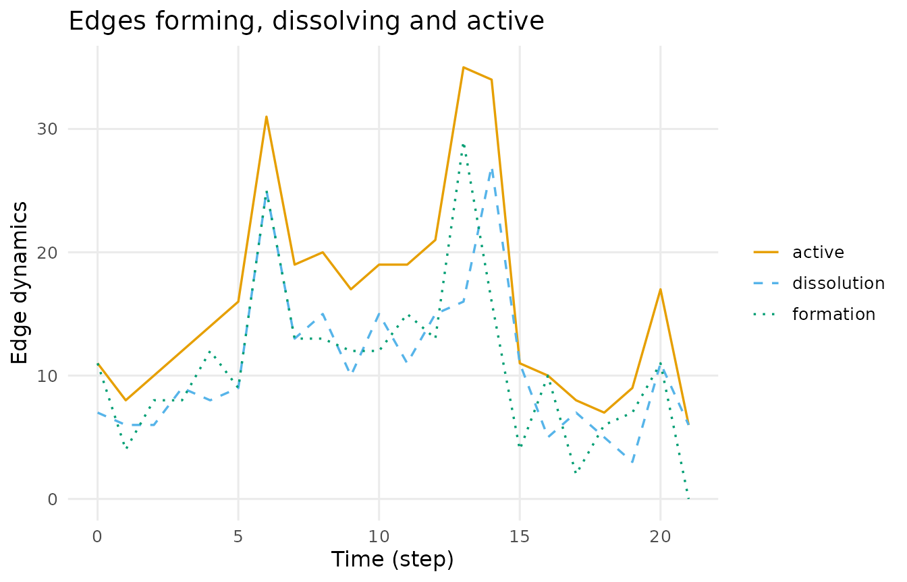
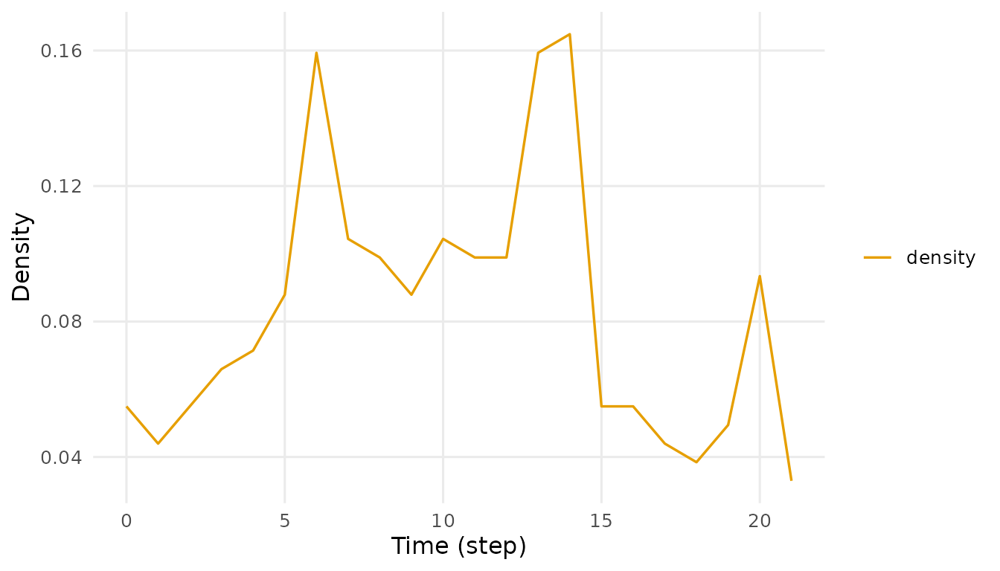
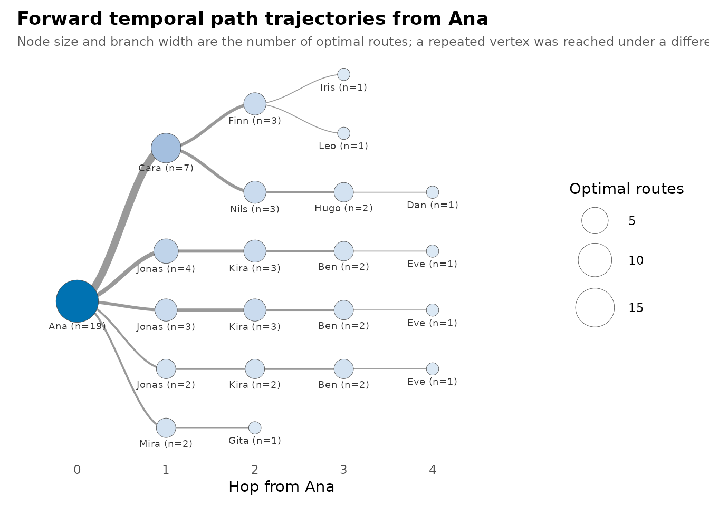
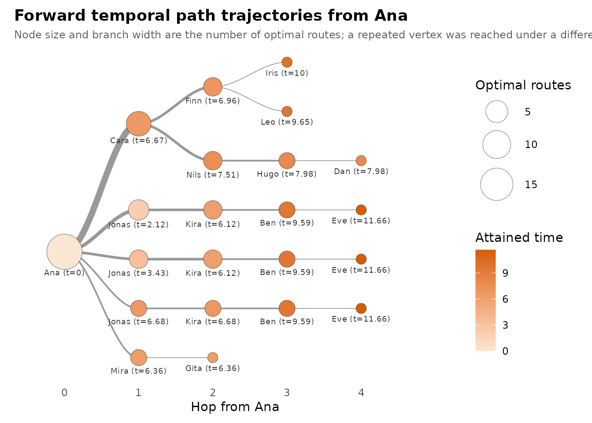

# Getting started with Dynet

## A network that knows what time it is

A static network says that two people are connected. A temporal network
says *when* they were connected, *for how long*, and — the part that
matters most — *in which order*.

That ordering is not decoration. If Ana talks to Jonas on Tuesday and
Jonas talks to Eve on Wednesday, something can travel Ana → Jonas → Eve.
If the same two conversations happen in the opposite order, nothing can.
A flattened network scores both situations identically: two edges, one
path of length two. Only one of them is real.

The usual workaround is to cut time into slices and analyse each slice
as a static network. That helps, but it throws away exactly the thing
that makes the data temporal: a snapshot cannot contain a chain that
spans snapshots. In the classroom data below, Ana and Eve never once
make contact, so no slice will ever link them — yet a time-respecting
path carries Ana to Eve in four hops. Aggregate instead and you make the
opposite mistake: every ordering becomes legal, and connectivity is
inflated.

Dynet keeps time in the object and in every result. This vignette is the
tour.

## Building a network in one line

The bundled `school_contacts` is an *interval log*: each row is one
contact, with its own start and end time.

``` r

dn <- dynet(school_contacts)
dn
#> # Temporal network (interval format, directed) | a cograph netobject
#> # 14 vertices | 240 edge spells | 110 distinct pairs
#> # observed from 0 to 21.52 step, binned every 1
#> 
#>   from   to start  end duration weight
#>  Jonas  Dan  0.00 1.10     1.10      1
#>   Gita  Ana  0.14 0.98     0.84      1
#>    Leo Mira  0.15 0.42     0.27      1
#>    Leo Iris  0.15 0.96     0.81      1
#>   Kira  Ben  0.33 0.69     0.36      1
#>    Leo Iris  0.38 0.50     0.12      1
#> # 234 more spells. summary() describes the network; plot() draws it.
```

[`dynet()`](https://mohsaqr.github.io/Dynet/reference/dynet.md) inferred
the format from the column names it found.
[`summary()`](https://rdrr.io/r/base/summary.html) describes what it
built.

``` r

summary(dn)
#>                 property    value
#> 1                 format interval
#> 2               directed      yes
#> 3               vertices       14
#> 4            edge spells      240
#> 5         distinct pairs      110
#> 6              time unit     step
#> 7          observed from        0
#> 8            observed to    21.52
#> 9                   span    21.52
#> 10             bin width        1
#> 11             time bins       22
#> 12 mean snapshot density   0.0829
#> 13      temporal density   0.0285
#> 14              sessions     none
#> 15     vertex attributes     none
```

Fourteen pupils, 240 contact spells over 110 distinct pairs, observed
across about 21.5 time steps. Note the last two rows of that table: the
*mean snapshot density* and the *temporal density* are not the same
number, and the gap between them is the subject of this vignette.

One constructor covers the four shapes relational logs actually arrive
in — interval logs, contact logs of instantaneous events, threaded logs
such as forum data, and co-presence logs where sharing a group creates a
tie. The companion vignette on building networks works through all four;
here we stay with the one line above.

``` r

plot(dn, type = "activity")
```



## Two commitments

Everything below rests on two promises the package makes.

**Vertices are named, never numbered.** You ask for `"Ana"`, not for
vertex 1. There is no index to look up first, and no result that hands
you an integer where you expected a person.

**Every verb returns a tidy data frame.** One row per observation, with
the columns you would expect. No matrices, no nested lists, nothing that
asks you to reach into an object with `$` or to subset a result before
it is readable.

Both are visible in a single call:

``` r

head(dyn_centrality(dn, measure = "degree"))
#> # Degree (node-level)
#> # 14 vertices | 22 time points, 1 per bin | time in step
#> # first 6 of 308 rows
#>  time node measure value
#>     0  Ana  degree     1
#>     0  Ben  degree     1
#>     0 Cara  degree     1
#>     0  Dan  degree     1
#>     0  Eve  degree     2
#>     0 Finn  degree     1
```

One row per node per time point, vertices named, a `value` column you
can plot directly. The printed header is a courtesy; the object
underneath is an ordinary data frame.

``` r

str(as.data.frame(metrics(dn, measure = "density")))
#> 'data.frame':    22 obs. of  3 variables:
#>  $ time   : num  0 1 2 3 4 5 6 7 8 9 ...
#>  $ measure: chr  "density" "density" "density" "density" ...
#>  $ value  : num  0.0549 0.044 0.0549 0.0659 0.0714 ...
```

Because results are already tidy, the tidying rituals you would normally
write by hand are arguments instead. `start`, `end`, `step`, `window`,
`sessions`, `measure`, `mode` — you narrow a result by asking the verb
for it, not by slicing what it returned.

## What a snapshot cannot see

Start with the graph-level view.
[`metrics()`](https://mohsaqr.github.io/Dynet/reference/metrics.md)
computes a structural measure once per time bin.

``` r

head(metrics(dn, measure = "density"))
#> # Density (graph-level)
#> # 22 time points, 1 per bin | time in step
#> # first 6 of 22 rows
#>  time measure      value
#>     0 density 0.05494505
#>     1 density 0.04395604
#>     2 density 0.05494505
#>     3 density 0.06593407
#>     4 density 0.07142857
#>     5 density 0.08791209
```

``` r

summary(metrics(dn, measure = "density"))
#>   measure  n       mean         sd        min       max peak_time
#> 1 density 22 0.08291708 0.03929021 0.03296703 0.1648352        14
```

The busiest single instant links about one pair in six; on average it is
closer to one in twelve. Plotted, the classroom breathes.

``` r

plot(metrics(dn, measure = "density"), palette = "okabe")
```



If those snapshots were all you had, you would conclude that this
classroom is sparse and fragmented. Now ask the temporal question
instead.

## Time-respecting paths

A time-respecting path may only use edges whose timing runs forward. It
can wait at a vertex, but it can never travel back in time.
[`paths()`](https://mohsaqr.github.io/Dynet/reference/paths.md) follows
every such path out of one named vertex.

``` r

paths(dn, from = "Ana")
#> # Time-respecting paths from 'Ana', from t = 0
#> # reaches 13 of 13 other vertices | time in step
#>   node reachable arrival_time attained latency n_hops n_paths
#>    Ana      TRUE         0.00     TRUE    0.00      0       1
#>    Ben      TRUE         9.59     TRUE    9.59      3       3
#>   Cara      TRUE         6.67     TRUE    6.67      1       1
#>    Dan      TRUE         7.98     TRUE    7.98      4       1
#>    Eve      TRUE        11.66     TRUE   11.66      4       3
#>   Finn      TRUE         6.96     TRUE    6.96      2       1
#>   Gita      TRUE         6.36     TRUE    6.36      2       1
#>   Hugo      TRUE         7.98     TRUE    7.98      3       1
#>   Iris      TRUE        10.00     TRUE   10.00      3       1
#>  Jonas      TRUE         2.12     TRUE    2.12      1       1
#>   Kira      TRUE         6.12     TRUE    6.12      2       2
#>    Leo      TRUE         9.65     TRUE    9.65      3       1
#> # 2 more rows. summary() aggregates them; plot() draws the tree.
```

Four columns carry the temporal content:

- **`arrival_time`** — the earliest clock time at which the journey can
  get there. It is a point on the network’s timeline, not a count of
  steps.
- **`latency`** — how long the journey took: `arrival_time` minus the
  time the source became available. Ana starts at 0 here, so the two
  coincide; start later and they part company.
- **`n_hops`** — how many edges the journey used. Dynet optimises
  *shortest foremost*: it minimises arrival time first, then hop count
  among the journeys that achieve it.
- **`n_paths`** — how many distinct optimal journeys there are. Two
  vertices can share an arrival time and hop count and still differ in
  how many ways the network gets you there.

[`summary()`](https://rdrr.io/r/base/summary.html) aggregates the whole
reachable set.

``` r

summary(paths(dn, from = "Ana"))
#>          property   value
#> 1          source     Ana
#> 2       direction forward
#> 3       reachable      13
#> 4 reachable share       1
#> 5  median latency    7.51
#> 6     max latency   11.66
#> 7     median hops       2
#> 8        max hops       4
```

So Ana reaches every one of the other thirteen pupils, in at most four
hops — in a network where no single snapshot ever connected more than a
sixth of the pairs. That is the information a snapshot-by-snapshot
analysis destroys.

The result is not a property of the network alone; it is a property of
the network *and when you start*. Ask the same question from late in the
window and most of those journeys no longer exist, because the contacts
that carried them have already happened.

``` r

paths(dn, from = "Ana", start = 18)
#> # Time-respecting paths from 'Ana', from t = 18
#> # reaches 5 of 13 other vertices | time in step
#>   node reachable arrival_time attained latency n_hops n_paths
#>    Ana      TRUE        18.00     TRUE    0.00      0       1
#>    Ben     FALSE           NA    FALSE      NA     NA       0
#>   Cara      TRUE        20.68     TRUE    2.68      3       1
#>    Dan      TRUE        19.91     TRUE    1.91      1       1
#>    Eve     FALSE           NA    FALSE      NA     NA       0
#>   Finn     FALSE           NA    FALSE      NA     NA       0
#>   Gita     FALSE           NA    FALSE      NA     NA       0
#>   Hugo     FALSE           NA    FALSE      NA     NA       0
#>   Iris     FALSE           NA    FALSE      NA     NA       0
#>  Jonas     FALSE           NA    FALSE      NA     NA       0
#>   Kira     FALSE           NA    FALSE      NA     NA       0
#>    Leo      TRUE        20.33     TRUE    2.33      1       1
#> # 2 more rows. summary() aggregates them; plot() draws the tree.
```

Reach also has a direction. `direction = "backward"` traces who could
have reached Ana rather than whom Ana can reach — the question you want
when you are tracing an exposure backwards rather than forwards.

``` r

summary(paths(dn, from = "Ana", direction = "backward"))
#>          property    value
#> 1          source      Ana
#> 2       direction backward
#> 3       reachable       13
#> 4 reachable share        1
#> 5  median latency     4.27
#> 6     max latency      8.9
#> 7     median hops       NA
#> 8        max hops       NA
```

## Seeing the journeys

[`plot()`](https://rdrr.io/r/graphics/plot.default.html) on a paths
result draws the whole family of optimal journeys as a trajectory tree.

``` r

journeys <- paths(dn, from = "Ana")
plot(journeys)
```



Read it outward from the root. The source sits at hop 0 on the left;
each step to the right is one more hop, so a vertex’s horizontal
position is the number of edges its journey used. Node size and branch
width both encode the number of optimal routes running through that
point, and each node is labelled with the vertex name and the time the
hop fires, so nothing is carried by size or colour alone.

The feature that has no static counterpart is this: **a vertex appears
more than once when it was reached under a different temporal history.**
`Jonas` shows up three times in this tree. Those are not three different
pupils and not three different places in the graph — they are the same
vertex entered at 2.12, at 3.43 and at 6.68. Each entry time leaves a
different set of onward contacts still in the future, so each one is
genuinely a different starting point for the rest of the journey. That
is why [`paths()`](https://mohsaqr.github.io/Dynet/reference/paths.md)
reported `n_paths = 3` for Ben earlier: the three optimal routes to Ben
share the vertex sequence Ana → Jonas → Kira → Ben and differ only in
when the hops fire. A flattened network would collapse all three into
one path and call the matter settled.

`measure` re-encodes the same tree. `"time"` weights it by arrival time
rather than route count, which turns the picture into a schedule of when
the reachable set fills up.

``` r

plot(journeys, measure = "time")
```



`orientation = "vertical"` turns the tree on its side for a tall, narrow
layout, `min_count` prunes branches carrying fewer than that many
routes, and `measure = "predictability"` shades each branch by how
strongly its parent commits to it.

The tree is data as well as a picture.
[`path_trajectories()`](https://mohsaqr.github.io/Dynet/reference/path_trajectories.md)
returns it tidily, one row per tree node, with the route as a readable
string, its `parent`, `depth`, the `count` of routes through it, the
branching `probability` given its parent, and the bare `vertex` and
`time`.

``` r

head(path_trajectories(journeys))
#> # Forward temporal trajectory tree from Ana
#> # 6 nodes, 3 hops deep, 19 routes
#>                                          node                          parent
#> 1                                       Ana@0                            <NA>
#> 2                          Ana@0 -> Cara@6.67                           Ana@0
#> 3             Ana@0 -> Cara@6.67 -> Finn@6.96              Ana@0 -> Cara@6.67
#> 4  Ana@0 -> Cara@6.67 -> Finn@6.96 -> Iris@10 Ana@0 -> Cara@6.67 -> Finn@6.96
#> 5 Ana@0 -> Cara@6.67 -> Finn@6.96 -> Leo@9.65 Ana@0 -> Cara@6.67 -> Finn@6.96
#> 6             Ana@0 -> Cara@6.67 -> Nils@7.51              Ana@0 -> Cara@6.67
#>   depth count probability vertex  time session branch
#> 1     0    19          NA    Ana  0.00    <NA>   3.15
#> 2     1     7   0.3684211   Cara  6.67    <NA>   5.75
#> 3     2     3   0.4285714   Finn  6.96    <NA>   6.50
#> 4     3     1   0.3333333   Iris 10.00    <NA>   7.00
#> 5     3     1   0.3333333    Leo  9.65    <NA>   6.00
#> 6     2     3   0.4285714   Nils  7.51    <NA>   5.00
```

## A tour of the measurement verbs

Every verb takes the network first and a `measure` (or an attribute) by
name. Every one returns a tidy frame keyed by time, by vertex, or by
both.

### `dyn_centrality()` — who matters, and when

At `scope = "snapshot"` a centrality is recomputed in every bin, so
[`summary()`](https://rdrr.io/r/base/summary.html) gives you each
pupil’s trajectory in one table, including when they peaked.

``` r

summary(dyn_centrality(dn, measure = "degree"))
#>     node measure  n     mean       sd min max peak_time
#> 1    Ana  degree 22 2.181818 2.015095   0   7         6
#> 2    Ben  degree 22 2.000000 1.234427   0   4         4
#> 3   Cara  degree 22 2.227273 1.342770   0   5         4
#> 4    Dan  degree 22 2.090909 1.444500   1   5        13
#> 5    Eve  degree 22 2.272727 2.051290   0   8        14
#> 6   Finn  degree 22 2.000000 1.661898   0   6        12
#> 7   Gita  degree 22 1.727273 1.777688   0   7         6
#> 8   Hugo  degree 22 2.318182 1.861550   0   6         6
#> 9   Iris  degree 22 1.772727 1.066004   0   4        11
#> 10 Jonas  degree 22 2.863636 2.076982   0   7        13
#> 11  Kira  degree 22 2.636364 1.255292   1   6         6
#> 12   Leo  degree 22 1.636364 1.432462   0   5         6
#> 13  Mira  degree 22 2.272727 1.695423   0   6        13
#> 14  Nils  degree 22 2.181818 2.174229   0   7        14
```

``` r

plot(dyn_centrality(dn, measure = "degree"), type = "heatmap", palette = "okabe")
```


At `scope = "temporal"` the measure is computed on time-respecting paths
across the whole window instead — one value per vertex, not one per bin.
Temporal closeness is the *inverse* of mean forward latency over the
vertices a person reaches, so a high score means “gets to the rest of
the class quickly” rather than “has many neighbours right now”.

``` r

head(dyn_centrality(dn, measure = "closeness", scope = "temporal"))
#> # Closeness (node-level)
#> # 14 vertices | time in step
#> # first 6 of 14 rows
#> # computed on time-respecting paths across the whole window
#>  node   measure     value
#>   Ana closeness 0.1313662
#>   Ben closeness 0.1815896
#>  Cara closeness 0.1931075
#>   Dan closeness 0.2230994
#>   Eve closeness 0.2616221
#>  Finn closeness 0.1644945
```

### `metrics()` — graph-level structure over time

Density is one of forty available measures. `temporal_density` is a
useful contrast: it discounts pairs that are adjacent in a snapshot but
never in a time-respecting order.

``` r

head(metrics(dn, measure = "temporal_density"))
#> # Temporal density (graph-level)
#> # 22 time points, 1 per bin | time in step
#> # first 6 of 22 rows
#>  time          measure      value
#>     0 temporal_density 0.02379121
#>     1 temporal_density 0.01307692
#>     2 temporal_density 0.01664835
#>     3 temporal_density 0.02785714
#>     4 temporal_density 0.01697802
#>     5 temporal_density 0.02357143
```

### `events()` — ties appearing and disappearing

Structure is a stock; formation and dissolution are the flows that
produce it.

``` r

head(events(dn, measure = "formation"))
#> # Edges formed (graph-level)
#> # 22 time points, 1 per bin | time in step
#> # first 6 of 22 rows
#>  time   measure value
#>     0 formation    11
#>     1 formation     4
#>     2 formation     8
#>     3 formation     8
#>     4 formation    12
#>     5 formation     9
```

``` r

head(events(dn, measure = "dissolution"))
#> # Edges dissolved (graph-level)
#> # 22 time points, 1 per bin | time in step
#> # first 6 of 22 rows
#>  time     measure value
#>     0 dissolution     7
#>     1 dissolution     6
#>     2 dissolution     6
#>     3 dissolution     9
#>     4 dissolution     8
#>     5 dissolution     9
```

### `burstiness()` — is contact regular or clumped?

Human contact is rarely Poisson. Burstiness compares the variability of
the gaps between a vertex’s events against the exponential reference:
`1` is the bursty limit, `0` is Poisson, `-1` is perfectly regular.

``` r

head(burstiness(dn))
#> # Burstiness (node-level)
#> # 14 vertices | time in step
#> # first 6 of 42 rows
#> # 1 is the bursty limit, 0 is the Poisson reference, -1 is regular
#>  node    measure       value
#>   Ana burstiness  0.24575324
#>   Ben burstiness  0.03288611
#>  Cara burstiness -0.05610924
#>   Dan burstiness -0.05061772
#>   Eve burstiness  0.09217906
#>  Finn burstiness  0.02938507
```

### `durations()` — how long ties actually last

By default
[`durations()`](https://mohsaqr.github.io/Dynet/reference/durations.md)
counts events per pair; `measure = "mean"` gives the average length of a
spell, and `unit` moves the question from pairs to spells or to vertex
activity.

``` r

head(durations(dn, measure = "mean"))
#> # Relationship duration (edge-level)
#> # time in step
#> # first 6 of 110 rows
#> # durations in step
#>  from    to measure value
#>   Ana  Cara    mean 0.100
#>   Ana   Dan    mean 0.340
#>   Ana  Gita    mean 0.422
#>   Ana  Iris    mean 0.500
#>   Ana Jonas    mean 0.585
#>   Ana  Kira    mean 0.110
```

### `mixing()` — who connects across which groups

Mixing needs vertex attributes, so this one uses the forum data, where
`forum_people` supplies a `role` for each participant. `forum_posts` is
a *threaded* log: a post keeps its tie alive until the thread falls
silent.

``` r

fn <- dynet(forum_posts, thread = "thread", nodes = forum_people)
fn
#> # Temporal network (threaded format, directed) | a cograph netobject
#> # 20 vertices | 241 edge spells | 172 distinct pairs
#> # observed from 0 to 54.96387 days, binned every 1
#> # vertex attributes: role, achievement
#> 
#>        from         to     start      end duration weight    thread
#>  student_14 student_05 0.0000000 2.296969 2.296969      1 thread_47
#>  student_10 student_05 0.7257216 2.296969 1.571247      1 thread_47
#>   teacher_A student_09 0.8559934 3.235993 2.380000      1 thread_11
#>  student_04 student_05 1.1715344 2.296969 1.125435      1 thread_47
#>  student_02 student_09 1.2382611 3.235993 1.997732      1 thread_11
#>  student_06  teacher_A 1.9797595 3.235993 1.256234      1 thread_11
#> # 235 more spells. summary() describes the network; plot() draws it.
```

``` r

mixing(fn, attribute = "role", step = 60)
#> # Mixing by role (graph-level)
#> # 1 time points, 60 per bin | time in days
#> # measures: Facilitator -> Facilitator, Student -> Facilitator, Teacher -> Facilitator, Facilitator -> Student, Student -> Student, Teacher -> Student, Facilitator -> Teacher, Student -> Teacher, Teacher -> Teacher
#> # active binary-dyad counts between vertex groups per time bin
#>  time                    measure value  from_group    to_group
#>     0 Facilitator -> Facilitator     0 Facilitator Facilitator
#>     0     Student -> Facilitator     3     Student Facilitator
#>     0     Teacher -> Facilitator     0     Teacher Facilitator
#>     0     Facilitator -> Student     4 Facilitator     Student
#>     0         Student -> Student   136     Student     Student
#>     0         Teacher -> Student    12     Teacher     Student
#>     0     Facilitator -> Teacher     1 Facilitator     Teacher
#>     0         Student -> Teacher    16     Student     Teacher
#>     0         Teacher -> Teacher     0     Teacher     Teacher
```

A `step` wider than the observation window collapses the counts into a
single bin; leave it out and you get the same table once per bin, which
is what you want when you are asking whether cross-role contact changes
over the term.

## Where to go next

- [`vignette("building-networks", package = "Dynet")`](https://mohsaqr.github.io/Dynet/articles/building-networks.md)
  — the four log formats in detail, node attributes, observation
  windows, sessions, and the editing verbs
  ([`add_ties()`](https://mohsaqr.github.io/Dynet/reference/add_ties.md),
  [`set_observations()`](https://mohsaqr.github.io/Dynet/reference/set_observations.md),
  [`induce_subgraph()`](https://mohsaqr.github.io/Dynet/reference/induce_subgraph.md)
  and friends).
- **[`?paths`](https://mohsaqr.github.io/Dynet/reference/paths.md)** and
  **[`?plot_path_trajectories`](https://mohsaqr.github.io/Dynet/reference/plot_path_trajectories.md)**
  — the full traversal semantics: `traversal_time` for a cost charged
  per hop, session-bounded search, `as.data.frame(x, what = "steps")`
  for the reconstructed routes themselves, and the remaining
  trajectory-tree controls.
- **[`?dyn_centrality`](https://mohsaqr.github.io/Dynet/reference/dyn_centrality.md)**
  and
  **[`?metrics`](https://mohsaqr.github.io/Dynet/reference/metrics.md)**
  — the complete measure catalogues. Passing a measure that does not
  exist prints the list of ones that do.
- [`projection()`](https://mohsaqr.github.io/Dynet/reference/projection.md),
  [`pshifts()`](https://mohsaqr.github.io/Dynet/reference/pshifts.md),
  [`snapshots()`](https://mohsaqr.github.io/Dynet/reference/snapshots.md)
  and
  [`collapse_network()`](https://mohsaqr.github.io/Dynet/reference/collapse_network.md)
  cover two-mode projection, participation shifts, per-bin edge lists
  and static aggregation.

`browseVignettes("Dynet")` lists everything installed alongside this
one.
