# Temporal networks of interactions in course discussions

This vignette demonstrates temporal network analysis of coded
contributions to asynchronous course discussions. The `thought_chains`
dataset provides reply relationships in tidy format, with contributions
classified into categories such as inquiring, arguing, and approving.
Contribution categories constitute the vertices, and directed ties
connect the category of a reply to the category of the message it
addresses.

The analysis examines how relationships among contribution categories
evolve over time, which categories receive replies, and how categories
are connected through time-respecting paths. Network measures,
centrality indices, relational durations, and temporal paths describe
the structure, timing, and reachability of these relationships.

## Data

The dataset is synthetic and based on the original data analysed by
[Saqr, López-Pernas, and Törmänen
(2026)](https://doi.org/10.1007/s11412-025-09464-5). It is used to
demonstrate temporal network construction, measurement, and
visualisation. Results reported in this vignette describe the supplied
dataset and should not be interpreted as empirical findings from the
original study.

The synthetic dataset contains 23,017 reply links among nine
contribution categories, spanning 1,169 discussions in 29 groups across
five courses. The relational endpoints are `from`, the category assigned
to the reply, and `to`, the category assigned to the message it
addresses. The variable `time` records when the reply was posted;
`discussion`, `course`, and `group` identify the discussion thread,
course, and course group, respectively. The dataset includes 9,452
self-links, where the reply and the message it addresses share the same
category.

``` r

library(Dynet)
head(thought_chains)
```

    ##           from           to                time participant discussion group
    ## 1 Coordinating Coordinating 2006-09-23 18:06:29        P028          1  A_01
    ## 2 Coordinating Coordinating 2006-09-23 18:06:29        P028          1  A_01
    ## 3 Coordinating Coordinating 2006-09-23 18:06:29        P028          1  A_01
    ## 4 Coordinating Coordinating 2006-09-23 18:06:29        P028          1  A_01
    ## 5 Coordinating Coordinating 2006-09-23 18:06:29        P028          1  A_01
    ## 6 Coordinating Coordinating 2006-09-23 18:06:29        P028          1  A_01
    ##   course
    ## 1      A
    ## 2      A
    ## 3      A
    ## 4      A
    ## 5      A
    ## 6      A

## The network

Each reply is represented as a relational spell with onset at the time
of posting and termination at the end of its discussion. This
specification treats the relationship as active for the remaining
duration of the discussion.

The call to
[`dynet()`](https://pak.dynasite.org/Dynet/reference/dynet.md)
explicitly identifies `discussion` as the thread variable through
`thread = "discussion"`. Setting `thread_clock = "relative"` expresses
time in days since the first recorded reply in each discussion, while
`loops = TRUE` retains self-links and `observation_end = 4` specifies a
four-day observation period. The constructor automatically recognises
`course` as the session variable.

``` r

dn <- dynet(thought_chains, thread = "discussion", thread_clock = "relative",
            loops = TRUE, observation_end = 4)
```

    ## Keeping 9452 self-loop event(s); each adds two to its vertex's degree.

``` r

dn
```

    ## # Temporal network (threaded format, directed) | a cograph netobject
    ## # 9 vertices | 23017 edge spells | 80 distinct pairs
    ## # observed from 0 to 4 days, binned every 1
    ## # 5 sessions: A, B, C, D, E
    ## 
    ##       from         to start end duration weight session thread participant
    ##  Approving  Approving     0   0        0      1       B    282        P181
    ##  Approving   Drafting     0   0        0      1       B    300        P189
    ##  Approving  Inquiring     0   0        0      1       D    839        P063
    ##  Approving Resourcing     0   0        0      1       A     62        P006
    ##  Approving Resourcing     0   0        0      1       A    187        P232
    ##  Approving Resourcing     0   0        0      1       A    187        P232
    ##  group
    ##   B_02
    ##   B_03
    ##   D_02
    ##   A_05
    ##   A_04
    ##   A_04
    ## # 23011 more spells. summary() describes the network; plot() draws it.

``` r

summary(dn)
```

    ##                 property        value
    ## 1                 format     threaded
    ## 2               directed          yes
    ## 3               vertices            9
    ## 4            edge spells        23017
    ## 5         distinct pairs           80
    ## 6              time unit         days
    ## 7          observed from            0
    ## 8            observed to            4
    ## 9                   span            4
    ## 10             bin width            1
    ## 11             time bins            4
    ## 12 mean snapshot density       0.8958
    ## 13      temporal density not computed
    ## 14              sessions            5
    ## 15     vertex attributes         none

Ties are directed from the category of a reply to the category of the
message it addresses. Paths following these ties therefore represent
directed reply relationships between contribution categories. They do
not, by themselves, establish the forward dissemination of ideas or the
transmission of particular content.

Setting `thread_clock = "relative"` aligns each discussion to its first
recorded reply. Temporal overlap consequently represents comparable
elapsed times within discussions, rather than simultaneous activity on a
shared calendar. The constructor recognises `course` as the session
variable. With the default `sessions = "bounded"`, each temporal path
remains within a single course, although it may combine ties from
different discussions or groups within that course. These paths describe
category-level reachability under the specified alignment and session
boundaries.

The resulting temporal network contains nine vertices and 23,017
relational spells distributed across 80 of the 81 possible ordered
pairs, including self-pairs. The mean snapshot density is 0.8958. This
high density reflects the specification that relational spells remain
active until their discussions terminate.

## Ties over time

[`events()`](https://pak.dynasite.org/Dynet/reference/events.md)
computes relational spell onset and termination counts over successive
half-day intervals. Setting both `step` and `window` to 0.5 produces
non-overlapping intervals.

``` r

tie_events <- events(dn, measure = c("formation", "dissolution"),
                     step = 0.5, window = 0.5)
tie_events
```

    ## # Edge dynamics (graph-level)
    ## # 8 time points, 0.5 per bin | time in days
    ## # measures: formation, dissolution
    ##  time     measure value
    ##   0.0   formation 13094
    ##   0.0 dissolution  3842
    ##   0.5   formation  4435
    ##   0.5 dissolution  2960
    ##   1.0   formation  2442
    ##   1.0 dissolution  5348
    ##   1.5   formation  1457
    ##   1.5 dissolution  2819
    ##   2.0   formation  1021
    ##   2.0 dissolution  3675
    ##   2.5   formation   377
    ##   2.5 dissolution  1996
    ## # 4 more rows. summary() aggregates them; plot() draws them.

The first three intervals contain 13,094, 4,435, and 2,442 onsets,
respectively, compared with 10 in the final interval. Terminations peak
in the third interval, with 5,348 spells ending. Relational spell onsets
are therefore concentrated early in the observation period.

The timeline displays relational activity for the 40 ordered pairs with
the most spells, using an hourly grid. Colour represents the proportion
of each interval during which the pair was active, counting overlapping
spells once.

``` r

plot(dn, type = "timeline", step = 1 / 24)
```

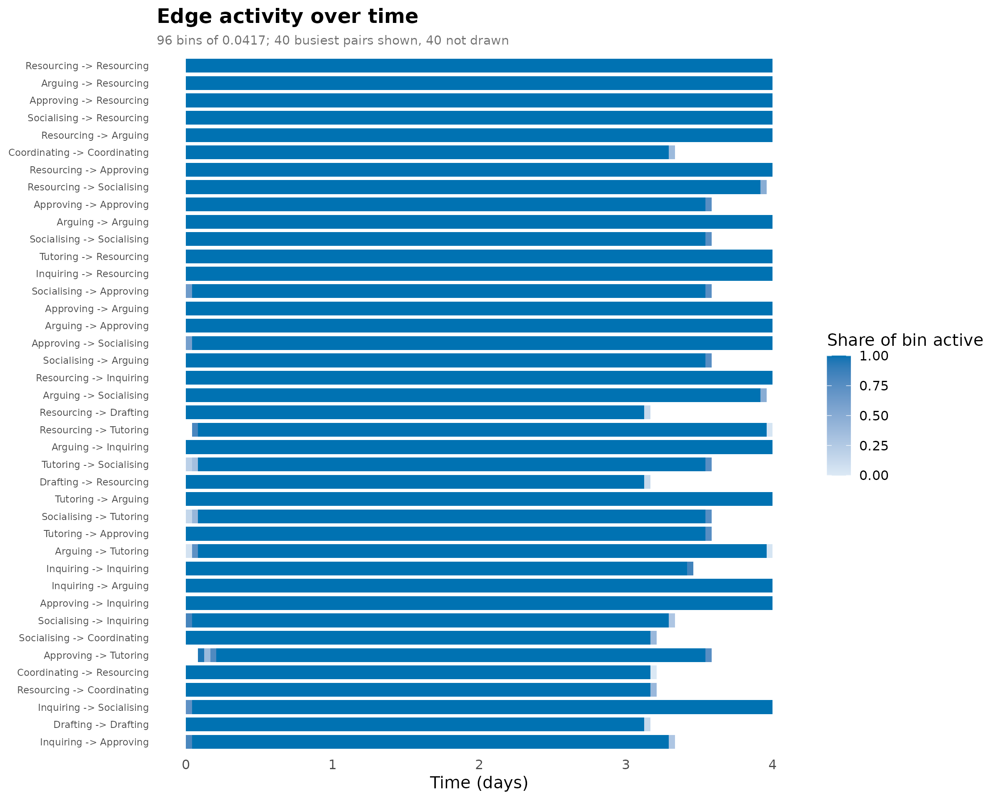

The activity plot displays onset and termination counts alongside the
number of active relational spells over time.

``` r

plot(dn, type = "activity")
```


## Drawing the network

Setting `type = "network"` displays the union of ties active during the
observation period. The network is drawn using cograph, to which the
`layout` argument is passed.

``` r

plot(dn, type = "network", layout = "oval")
```


The binary union records whether each ordered pair was connected at any
time during the observation period. To account for duration,
[`collapse_network()`](https://pak.dynasite.org/Dynet/reference/collapse_network.md)
with `weight = "union_duration"` weights each pair by the total duration
for which at least one relational spell was active, counting overlapping
spells once.

``` r

collapsed <- collapse_network(dn, weight = "union_duration")
plot(collapsed, layout = "oval")
```

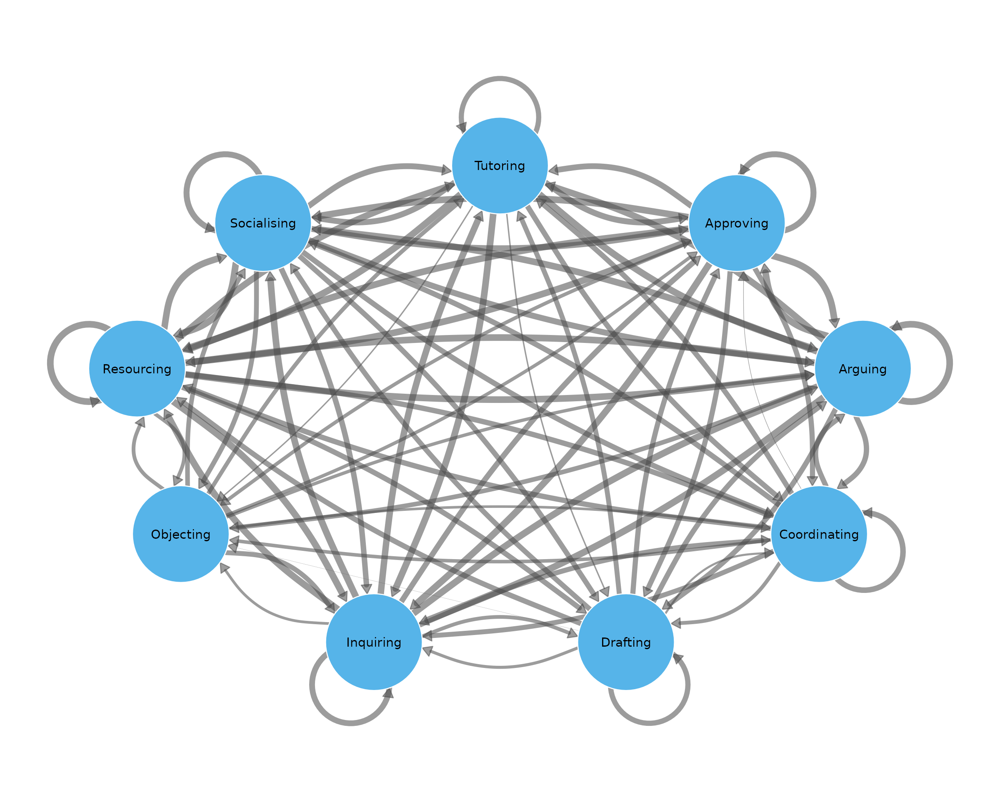

Setting `type = "snapshots"` displays the network at nine equally spaced
time points using a common layout.

``` r

plot(dn, type = "snapshots", panels = 9)
```

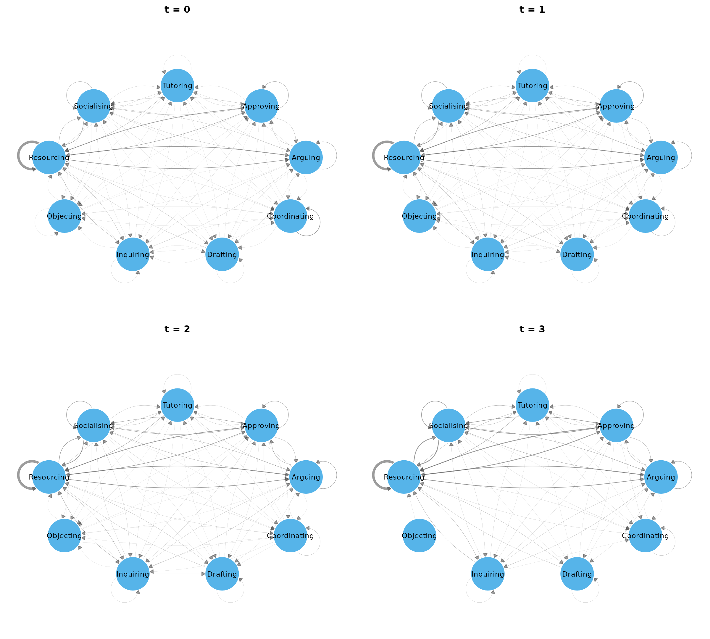

The proximity timeline represents changes in the relationships among
contribution categories. Network distances are computed within
overlapping temporal slices and reduced to a single coordinate for each
category. Lines connect these coordinates across slices, with proximity
indicating shorter network distances within a slice. Line thickness
represents degree by default. The following call specifies 80 slices and
five accompanying phase networks.

``` r

plot(dn, type = "proximity", phases = 5, slices = 80)
```

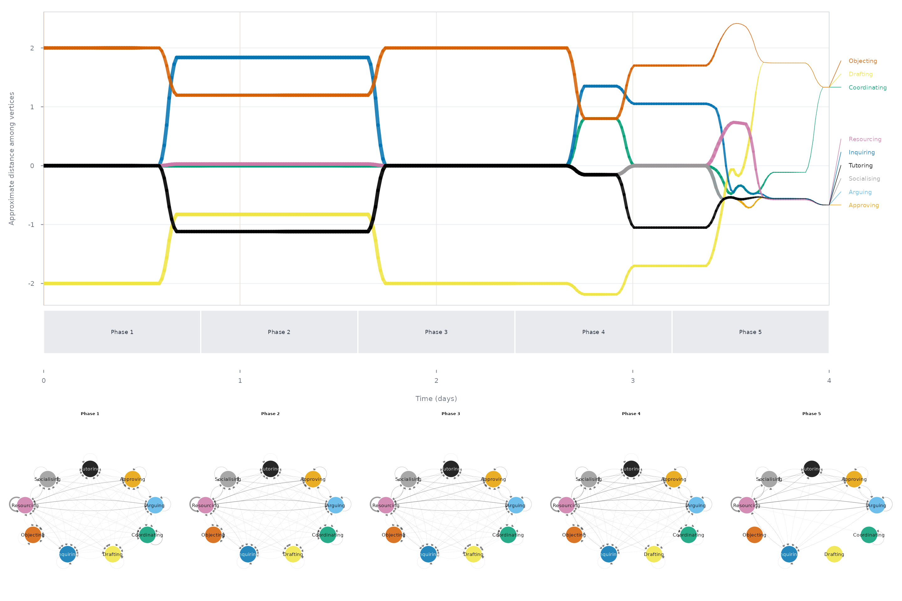

Setting `measure = "betweenness"` maps line thickness to betweenness
centrality, while `networks = FALSE` omits the phase networks.

``` r

plot(dn, type = "proximity", measure = "betweenness",
     networks = FALSE, slices = 80)
```

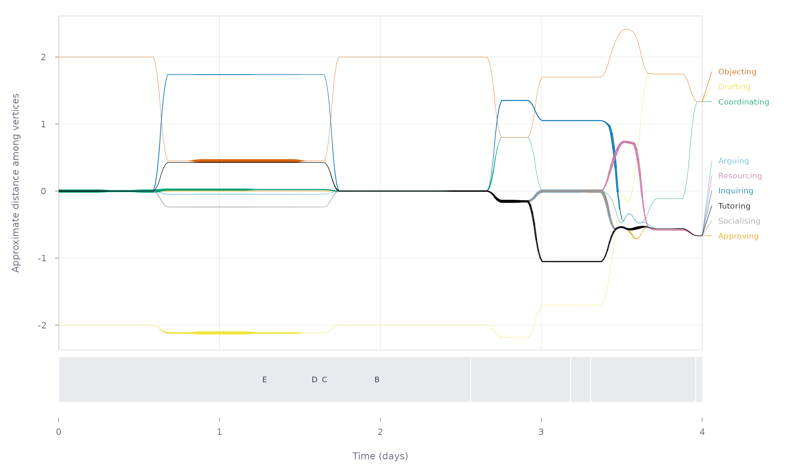

Layered visualisations represent successive temporal slices as separate
network layers. Setting `type = "layers"` and `step = 4 / 3` displays
three slices as planes.

``` r

plot(dn, type = "layers", step = 4 / 3, layout = "circle")
```

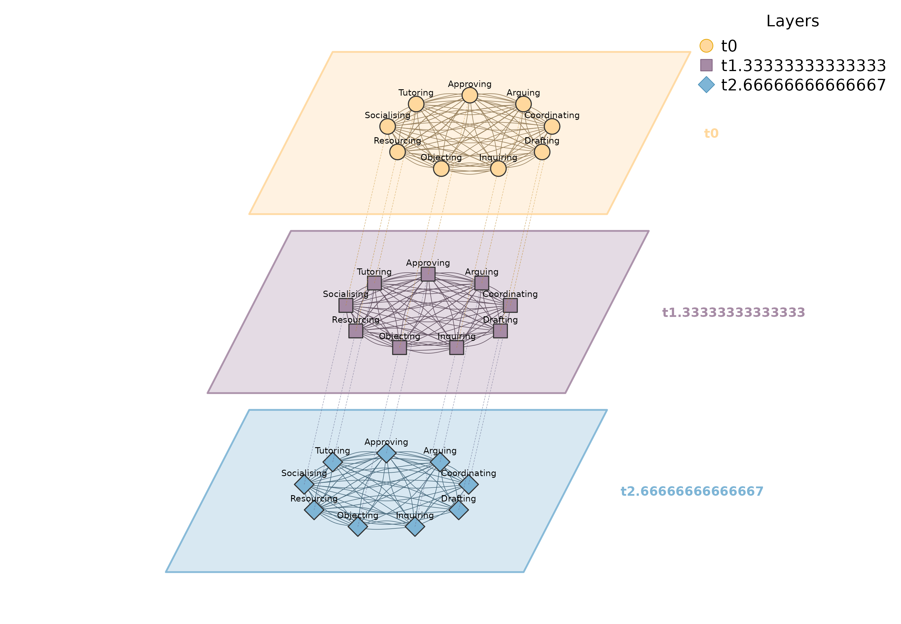

Setting `type = "stack"` and `cumulative = TRUE` produces a cumulative
projection in which each plane includes all ties active up to that
slice.

``` r

plot(dn, type = "stack", step = 4 / 3, cumulative = TRUE)
```

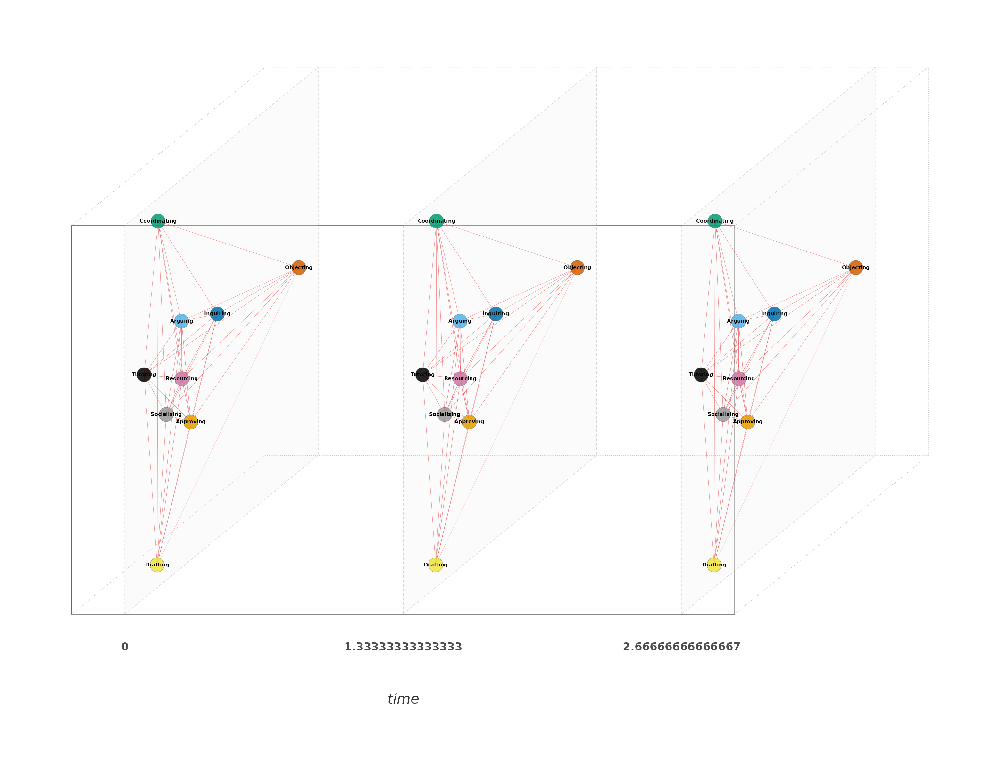

## Structure over time

Dynet computes both graph-level and vertex-level metrics for temporal
networks. Graph-level metrics characterise the network as a whole,
describing properties such as density, reciprocity, and connectivity.
Vertex-level metrics characterise the structural position of individual
vertices through measures such as degree, closeness, and betweenness. In
this vignette, vertices represent contribution categories, so
vertex-level metrics describe the positions of these categories within
the discussion network. Both levels can be examined over successive
temporal intervals to quantify changes in network structure and vertex
position.

[`metrics()`](https://pak.dynasite.org/Dynet/reference/metrics.md)
computes graph-level measures over specified temporal intervals. Setting
both `step` and `window` to `1 / 24` produces successive,
non-overlapping hourly intervals. Density measures the proportion of
possible directed ties present, while reciprocity measures the
proportion of directed ties whose reverse is also present. Efficiency
and connectedness are two of Krackhardt’s (1994) indices for
characterising departures from an out-tree structure. The number of
edges and mean degree provide additional descriptions of network
connectivity.

``` r

structure <- metrics(dn,
                     measure = c("density", "reciprocity", "efficiency",
                                 "connectedness", "edges", "mean_degree"),
                     step = 1 / 24, window = 1 / 24)
structure
```

    ## # Graph structure (graph-level)
    ## # 96 time points, 0.04166667 per bin | time in days
    ## # measures: density, reciprocity, efficiency, connectedness, edges, mean_degree
    ##        time       measure      value
    ##  0.00000000       density  0.7916667
    ##  0.00000000   reciprocity  0.9122807
    ##  0.00000000    efficiency  0.2343750
    ##  0.00000000 connectedness  1.0000000
    ##  0.00000000         edges 57.0000000
    ##  0.00000000   mean_degree  6.3333333
    ##  0.04166667       density  0.8194444
    ##  0.04166667   reciprocity  0.9152542
    ##  0.04166667    efficiency  0.2031250
    ##  0.04166667 connectedness  1.0000000
    ##  0.04166667         edges 59.0000000
    ##  0.04166667   mean_degree  6.5555556
    ## # 564 more rows. summary() aggregates them; plot() draws them.

``` r

plot(structure, type = "ridge")
```


Setting `type = "ridge"` displays a separate panel for each measure. In
the first hour, the network contains 57 directed ties and has a density
of 0.79. Connectedness is 1, indicating that all contribution categories
belong to a single weakly connected component; this does not imply that
every category is directly connected to every other category.
Reciprocity is 0.91, indicating that most directed ties have a
corresponding reverse tie within the interval. Density increases to 0.82
in the second hour.

The dyad census (Holland and Leinhardt, 1976) classifies unordered pairs
of distinct vertices as mutual, asymmetric, or null, depending on
whether both, one, or neither of the possible directed ties are present.
The corresponding counts are requested through `measure`.

``` r

dyads <- metrics(dn, measure = c("mutual", "asymmetric", "null"),
                 step = 1 / 24, window = 1 / 24)
dyads
```

    ## # Graph structure (graph-level)
    ## # 96 time points, 0.04166667 per bin | time in days
    ## # measures: mutual, asymmetric, null
    ##        time    measure value
    ##  0.00000000     mutual    26
    ##  0.00000000 asymmetric     5
    ##  0.00000000       null     5
    ##  0.04166667     mutual    27
    ##  0.04166667 asymmetric     5
    ##  0.04166667       null     4
    ##  0.08333333     mutual    28
    ##  0.08333333 asymmetric     4
    ##  0.08333333       null     4
    ##  0.12500000     mutual    28
    ##  0.12500000 asymmetric     5
    ##  0.12500000       null     3
    ## # 276 more rows. summary() aggregates them; plot() draws them.

``` r

plot(dyads)
```


In the first hour, the 36 unordered pairs comprise 26 mutual, five
asymmetric, and five null dyads. These counts describe connectivity
between distinct contribution categories and exclude self-links.

Setting `measure = "triads"` computes the sixteen-class directed triad
census, which classifies sets of three distinct vertices according to
their directed ties. The heatmap displays changes in the frequency of
each triad class across hourly intervals.

``` r

triads <- metrics(dn, measure = "triads", step = 1 / 24, window = 1 / 24)
triads
```

    ## # Triad census (graph-level)
    ## # 96 time points, 0.04166667 per bin | time in days
    ## # measures: triad_003, triad_012, triad_102, triad_021D, triad_021U, triad_021C, triad_111D, triad_111U, triad_030T, triad_030C, triad_201, triad_120D, triad_120U, triad_120C, triad_210, triad_300
    ##  time    measure value
    ##     0  triad_003     0
    ##     0  triad_012     1
    ##     0  triad_102     9
    ##     0 triad_021D     0
    ##     0 triad_021U     0
    ##     0 triad_021C     0
    ##     0 triad_111D     0
    ##     0 triad_111U     8
    ##     0 triad_030T     0
    ##     0 triad_030C     0
    ##     0  triad_201     7
    ##     0 triad_120D     3
    ## # 1524 more rows. summary() aggregates them; plot() draws them.

``` r

plot(triads, type = "heatmap")
```


Additional graph-level statistics describe local configurations of
directed ties. These include two-stars, two-paths, triangles, and sums
of indegrees and outdegrees raised to the power 1.5. Such statistics are
also used as terms in exponential-family random graph models (Morris,
Handcock and Hunter, 2008).

``` r

local <- metrics(dn,
                 measure = c("indegree_1_5", "outdegree_1_5", "triangles",
                             "in_2stars", "out_2stars", "two_paths"),
                 step = 1 / 24, window = 1 / 24)
local
```

    ## # Graph structure (graph-level)
    ## # 96 time points, 0.04166667 per bin | time in days
    ## # measures: indegree_1_5, outdegree_1_5, triangles, in_2stars, out_2stars, two_paths
    ##        time       measure    value
    ##  0.00000000  indegree_1_5 146.3021
    ##  0.00000000 outdegree_1_5 148.0187
    ##  0.00000000     triangles 376.0000
    ##  0.00000000     in_2stars 161.0000
    ##  0.00000000    out_2stars 166.0000
    ##  0.00000000     two_paths 325.0000
    ##  0.04166667  indegree_1_5 155.0977
    ##  0.04166667 outdegree_1_5 155.3815
    ##  0.04166667     triangles 436.0000
    ##  0.04166667     in_2stars 176.0000
    ##  0.04166667    out_2stars 177.0000
    ##  0.04166667     two_paths 356.0000
    ## # 564 more rows. summary() aggregates them; plot() draws them.

``` r

plot(local, type = "ridge")
```


The first hourly interval contains 376 directed triangles and 325
two-paths; the corresponding counts in the second interval are 436 and
356.

## Vertex-level metrics

[`centrality_series()`](https://pak.dynasite.org/Dynet/reference/centrality_series.md)
computes centrality measures for each contribution category over
specified temporal intervals. The following call requests degree,
closeness, and betweenness (Freeman, 1979), eigenvector centrality, flow
betweenness (Freeman, Borgatti and White, 1991), and diffusion degree
(Kundu, Murthy and Pal, 2011). These measures characterise the positions
of categories within each hourly network. Paths used in these
interval-specific calculations are evaluated within the corresponding
network; temporal centrality based on time-respecting paths is
considered separately below.

``` r

centrality <- centrality_series(dn,
                                measure = c("degree", "closeness", "betweenness",
                                            "eigenvector", "flow_betweenness",
                                            "diffusion"),
                                step = 1 / 24, window = 1 / 24)
centrality
```

    ## # Centrality (node-level)
    ## # 9 vertices | 96 time points, 0.04166667 per bin | time in days
    ## # measures: degree, closeness, betweenness, eigenvector, flow_betweenness, diffusion
    ##  time         node   measure      value
    ##     0    Approving    degree 14.0000000
    ##     0      Arguing    degree 17.0000000
    ##     0 Coordinating    degree 15.0000000
    ##     0     Drafting    degree 15.0000000
    ##     0    Inquiring    degree 15.0000000
    ##     0    Objecting    degree  7.0000000
    ##     0   Resourcing    degree 16.0000000
    ##     0  Socialising    degree 18.0000000
    ##     0     Tutoring    degree 15.0000000
    ##     0    Approving closeness  0.8888889
    ##     0      Arguing closeness  1.0000000
    ##     0 Coordinating closeness  0.8888889
    ## # 5172 more rows. summary() aggregates them; plot() draws them.

``` r

plot(centrality, type = "heatmap")
```

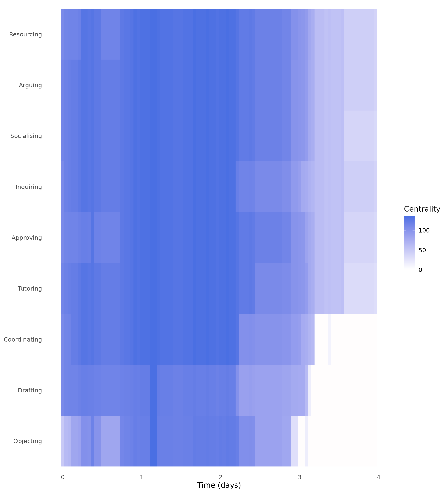

Setting `type = "heatmap"` displays centrality values by category and
hourly interval. Setting `type = "ridge"` displays their trajectories
over the observation period.

``` r

plot(centrality, type = "ridge")
```


In the first hour, `Socialising` has the highest degree (18), and
`Objecting` has the lowest (7). `Arguing` has a closeness centrality of
1, indicating that it reaches every other category in one step under the
specified calculation. Across the 96 hourly intervals, `Objecting` has
the lowest mean degree, closeness, and betweenness.

For directed networks, `mode` specifies the direction used to calculate
degree. Because ties are directed from the reply category to the
category being addressed, `mode = "in"` measures incoming connections
from replying categories, whereas `mode = "out"` measures outgoing
connections to addressed categories.

``` r

in_degree <- centrality_series(dn, measure = "degree", mode = "in",
                               step = 1 / 24, window = 1 / 24)
out_degree <- centrality_series(dn, measure = "degree", mode = "out",
                                step = 1 / 24, window = 1 / 24)
plot(in_degree, type = "heatmap")
```

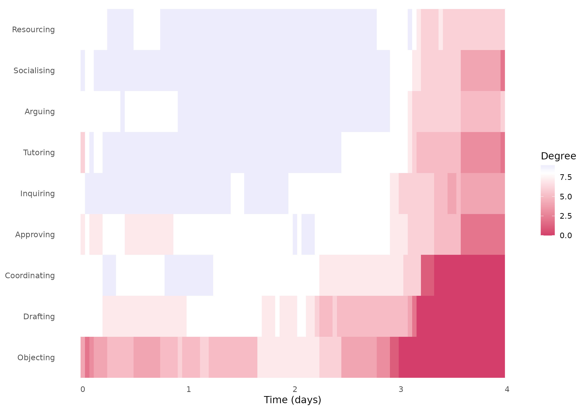

``` r

plot(out_degree, type = "heatmap")
```

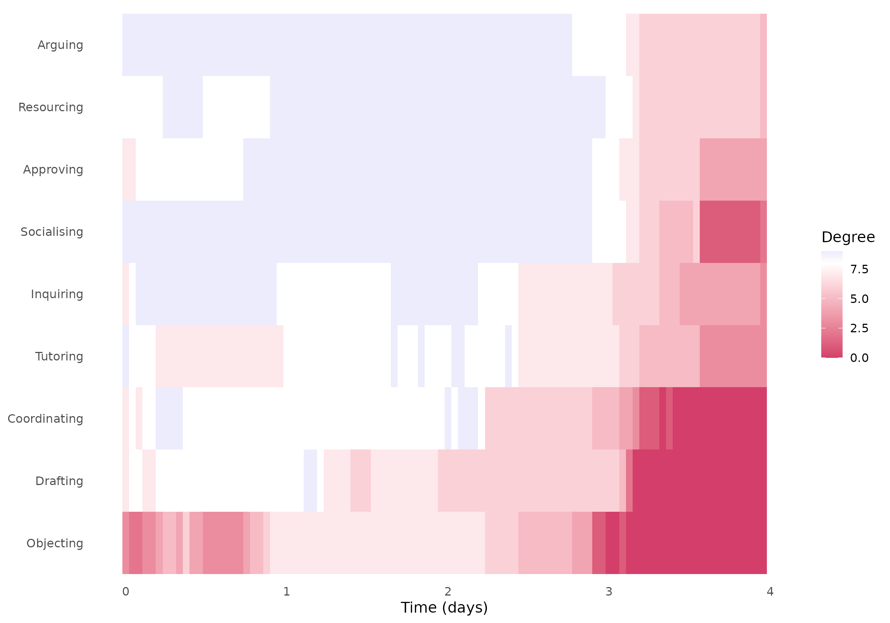

Prestige indices characterise a vertex through its incoming
relationships (Wasserman and Faust, 1994). Indegree prestige measures
direct incoming connections. Domain proximity prestige incorporates
indirect connections by dividing the proportion of other vertices that
can reach the focal vertex by their mean directed distance to it.
Setting `measure = "prestige"` requests prestige, with the variant
specified through `prestige`.

``` r

prestige_indegree <- centrality_series(dn, measure = "prestige",
                                       prestige = "indegree",
                                       step = 1 / 24, window = 1 / 24)
prestige_proximity <- centrality_series(dn, measure = "prestige",
                                        prestige = "domain.proximity",
                                        step = 1 / 24, window = 1 / 24)
plot(prestige_indegree, type = "heatmap")
```

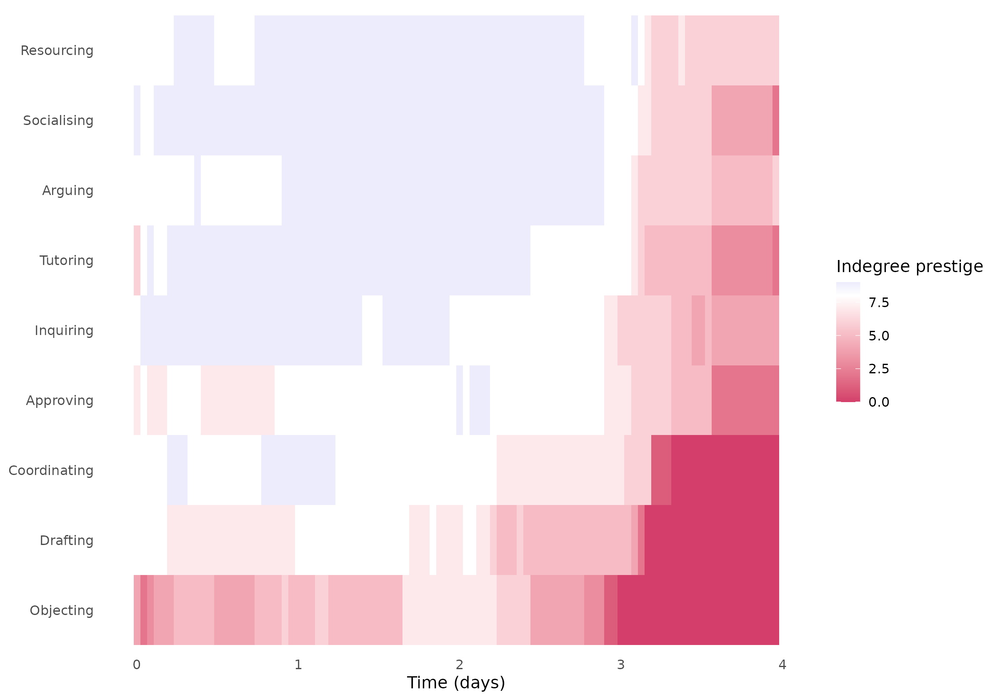

``` r

plot(prestige_proximity, type = "heatmap")
```

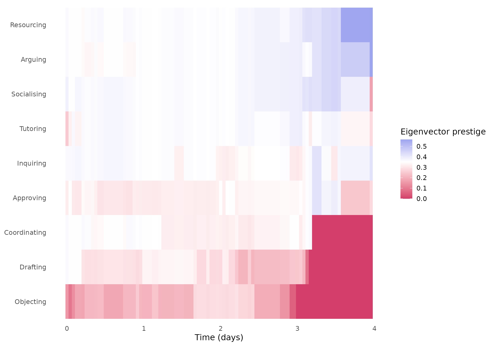

## Flows between codes

[`mixing()`](https://pak.dynasite.org/Dynet/reference/mixing.md)
summarises directed relationships between categories of a vertex
attribute within each temporal interval. Setting `attribute = "name"`
uses the vertex names, which represent contribution categories in this
network. The result contains counts of distinct active ordered vertex
pairs for each hourly interval and pair of categories. Repeated spells
and their weights do not multiply these counts. Setting
`type = "heatmap"` displays all 81 ordered pairs, including self-pairs.

``` r

flows <- mixing(dn, attribute = "name", step = 1 / 24, window = 1 / 24)
flows
```

    ## # Mixing by name (graph-level)
    ## # 96 time points, 0.04166667 per bin | time in days
    ## # measures: Approving -> Approving, Arguing -> Approving, Coordinating -> Approving, Drafting -> Approving, Inquiring -> Approving, Objecting -> Approving, Resourcing -> Approving, Socialising -> Approving, Tutoring -> Approving, Approving -> Arguing, Arguing -> Arguing, Coordinating -> Arguing, Drafting -> Arguing, Inquiring -> Arguing, Objecting -> Arguing, Resourcing -> Arguing, Socialising -> Arguing, Tutoring -> Arguing, Approving -> Coordinating, Arguing -> Coordinating, Coordinating -> Coordinating, Drafting -> Coordinating, Inquiring -> Coordinating, Objecting -> Coordinating, Resourcing -> Coordinating, Socialising -> Coordinating, Tutoring -> Coordinating, Approving -> Drafting, Arguing -> Drafting, Coordinating -> Drafting, Drafting -> Drafting, Inquiring -> Drafting, Objecting -> Drafting, Resourcing -> Drafting, Socialising -> Drafting, Tutoring -> Drafting, Approving -> Inquiring, Arguing -> Inquiring, Coordinating -> Inquiring, Drafting -> Inquiring, Inquiring -> Inquiring, Objecting -> Inquiring, Resourcing -> Inquiring, Socialising -> Inquiring, Tutoring -> Inquiring, Approving -> Objecting, Arguing -> Objecting, Coordinating -> Objecting, Drafting -> Objecting, Inquiring -> Objecting, Objecting -> Objecting, Resourcing -> Objecting, Socialising -> Objecting, Tutoring -> Objecting, Approving -> Resourcing, Arguing -> Resourcing, Coordinating -> Resourcing, Drafting -> Resourcing, Inquiring -> Resourcing, Objecting -> Resourcing, Resourcing -> Resourcing, Socialising -> Resourcing, Tutoring -> Resourcing, Approving -> Socialising, Arguing -> Socialising, Coordinating -> Socialising, Drafting -> Socialising, Inquiring -> Socialising, Objecting -> Socialising, Resourcing -> Socialising, Socialising -> Socialising, Tutoring -> Socialising, Approving -> Tutoring, Arguing -> Tutoring, Coordinating -> Tutoring, Drafting -> Tutoring, Inquiring -> Tutoring, Objecting -> Tutoring, Resourcing -> Tutoring, Socialising -> Tutoring, Tutoring -> Tutoring
    ## # active binary-dyad counts between vertex groups per time bin
    ##  time                   measure value   from_group  to_group
    ##     0    Approving -> Approving     1    Approving Approving
    ##     0      Arguing -> Approving     1      Arguing Approving
    ##     0 Coordinating -> Approving     0 Coordinating Approving
    ##     0     Drafting -> Approving     1     Drafting Approving
    ##     0    Inquiring -> Approving     1    Inquiring Approving
    ##     0    Objecting -> Approving     0    Objecting Approving
    ##     0   Resourcing -> Approving     1   Resourcing Approving
    ##     0  Socialising -> Approving     1  Socialising Approving
    ##     0     Tutoring -> Approving     1     Tutoring Approving
    ##     0      Approving -> Arguing     1    Approving   Arguing
    ##     0        Arguing -> Arguing     1      Arguing   Arguing
    ##     0   Coordinating -> Arguing     1 Coordinating   Arguing
    ## # 7764 more rows. summary() aggregates them; plot() draws them.

``` r

plot(flows, type = "heatmap")
```

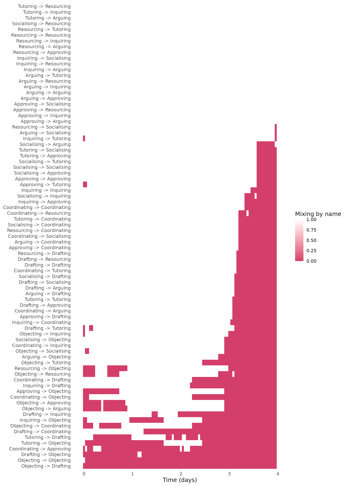

The `highlight` argument selects a category for visual emphasis. The
following plot displays incoming and outgoing relationships involving
`Coordinating` in colour and the remaining relationships in grey.

``` r

plot(flows, highlight = "Coordinating")
```


## Duration

[`durations()`](https://pak.dynasite.org/Dynet/reference/durations.md)
summarises relational spells and their durations over the observation
period. Setting `unit = "node_ties"` groups spells by their incident
vertex, while `mode = "all"` includes both incoming and outgoing
incidences. The requested measures are the incident spell count
(`"events"`), summed incident duration (`"total"`), and union duration
(`"union"`). A self-link contributes twice to the additive counts and
durations, once for each endpoint. Summed duration includes overlapping
spells separately, whereas union duration counts each period of activity
once.

``` r

node_ties <- durations(dn, unit = "node_ties", mode = "all",
                       measure = c("events", "total", "union"))
node_ties
```

    ## # Incident tie duration (node-level)
    ## # 9 vertices | mode all | time in days
    ## # measures: events, total, union
    ## # durations in days
    ##          node measure     value
    ##     Approving  events  5825.000
    ##       Arguing  events  6174.000
    ##  Coordinating  events  2713.000
    ##      Drafting  events   779.000
    ##     Inquiring  events  1892.000
    ##     Objecting  events   109.000
    ##    Resourcing  events 20999.000
    ##   Socialising  events  5493.000
    ##      Tutoring  events  2034.000
    ##     Approving   total  5355.039
    ##       Arguing   total  5539.510
    ##  Coordinating   total  1389.779
    ## # 15 more rows. summary() aggregates them; plot() draws them.

``` r

plot(node_ties)
```

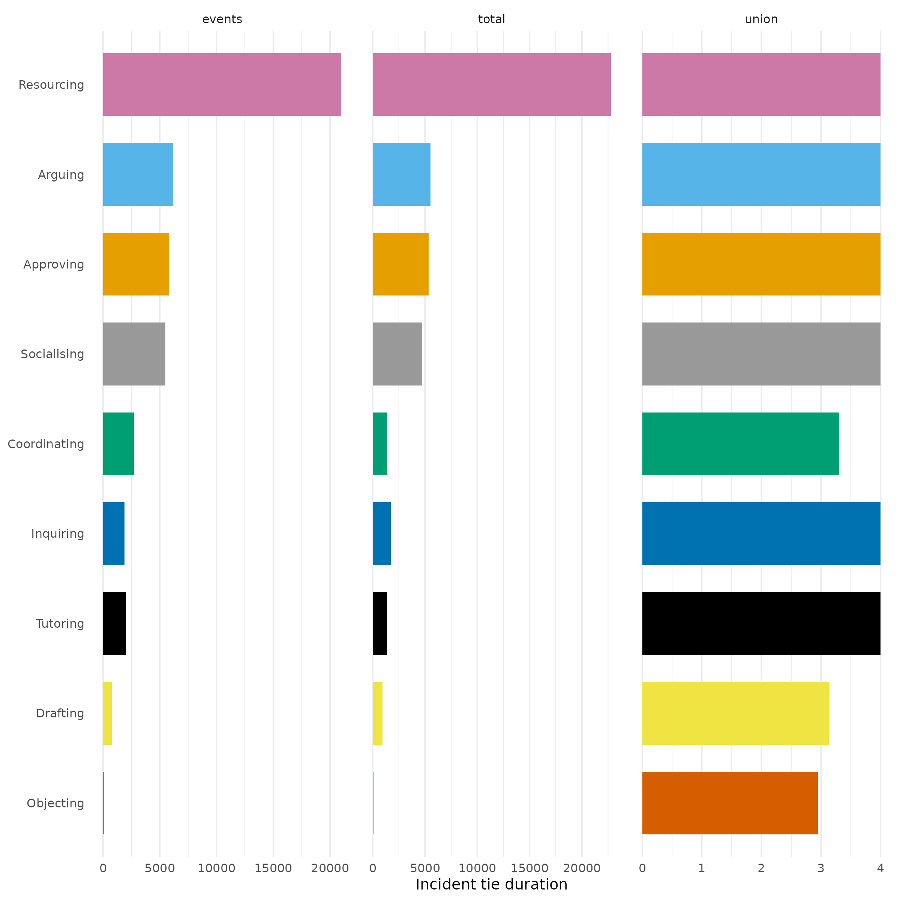

`Resourcing` has 20,999 incident spell counts with a summed duration of
22,781 days, compared with 109 and 71 days for `Objecting`. These summed
durations accumulate time across spell incidences and can therefore
exceed the observation period. Union duration is bounded by the four-day
observation period; six of the nine categories have at least one
incident spell active throughout this period.

Setting `unit = "pair"` computes the same summaries for each ordered
pair of contribution categories. Including `"mean"` additionally returns
the mean spell duration.

``` r

pair_duration <- durations(dn, unit = "pair",
                           measure = c("events", "total", "union", "mean"))
pair_duration
```

    ## # Relationship duration (edge-level)
    ## # time in days
    ## # measures: events, mean, total, union
    ## # durations in days
    ##       from           to measure value
    ##  Approving    Approving  events   719
    ##  Approving      Arguing  events   417
    ##  Approving Coordinating  events    30
    ##  Approving     Drafting  events    30
    ##  Approving    Inquiring  events   110
    ##  Approving    Objecting  events     4
    ##  Approving   Resourcing  events  1353
    ##  Approving  Socialising  events   385
    ##  Approving     Tutoring  events   100
    ##    Arguing    Approving  events   415
    ##    Arguing      Arguing  events   670
    ##    Arguing Coordinating  events    44
    ## # 308 more rows. summary() aggregates them; plot() draws them.

``` r

plot(pair_duration)
```


Spell counts vary substantially across ordered pairs. For example, 1,353
spells connect `Approving` to `Resourcing`, compared with four
connecting `Approving` to `Objecting`.

## Reachability and temporal centrality

Temporal reachability describes whether vertices can be connected
through time-respecting paths, whose successive traversals follow
chronological order and respect tie availability (Kempe, Kleinberg and
Kumar, 2002).
[`reachability()`](https://pak.dynasite.org/Dynet/reference/reachability.md)
computes the proportion (`"reach"`) and number (`"reach_count"`) of
other vertices reachable along these paths. Setting `direction = "both"`
requests both forward reachability and backward reachability: which
categories a focal category can reach and which can reach it.

``` r

reach <- reachability(dn, direction = "both",
                      measure = c("reach", "reach_count"))
reach
```

    ## # Reachability (node-level)
    ## # 9 vertices | time in days
    ## # measures: forward_reach, forward_reach_count, backward_reach, backward_reach_count
    ## # count and share of other vertices joined by a time-respecting path
    ##          node             measure value
    ##     Approving       forward_reach     1
    ##       Arguing       forward_reach     1
    ##  Coordinating       forward_reach     1
    ##      Drafting       forward_reach     1
    ##     Inquiring       forward_reach     1
    ##     Objecting       forward_reach     1
    ##    Resourcing       forward_reach     1
    ##   Socialising       forward_reach     1
    ##      Tutoring       forward_reach     1
    ##     Approving forward_reach_count     8
    ##       Arguing forward_reach_count     8
    ##  Coordinating forward_reach_count     8
    ## # 24 more rows. summary() aggregates them; plot() draws them.

``` r

plot(reach)
```

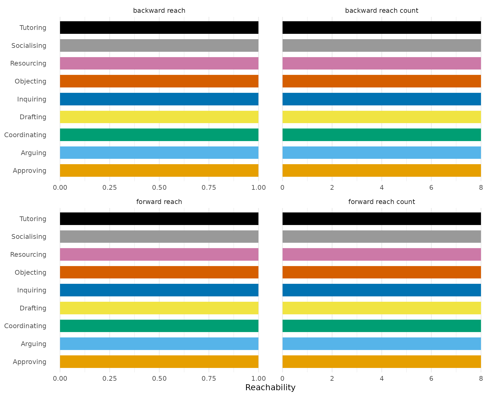

Every category can reach all eight other categories and can be reached
from all eight. Under the specified spell durations and observation
period, reachability therefore does not differentiate the categories.
Temporal centrality and path analysis provide further information about
arrival times and the routes connecting them.

Temporal closeness measures how quickly a vertex can reach other
vertices, whereas temporal betweenness measures its contribution to
earliest-arrival paths between other vertices (Pan and Saramäki, 2011).
These measures are requested through
[`path_centrality()`](https://pak.dynasite.org/Dynet/reference/path_centrality.md).

When traversal has zero duration, paths composed of ties active at time
zero can arrive immediately, yielding zero latency and potentially
unbounded temporal closeness. Setting `traversal_time = 0.1` imposes a
traversal duration of one tenth of a day per tie. This is an analytical
assumption rather than an observed response time.

``` r

temporal <- path_centrality(dn, measure = c("closeness", "betweenness"),
                            traversal_time = 0.1)
temporal
```

    ## # Temporal centrality (node-level)
    ## # 9 vertices | traversal 0.1 days per hop | time in days
    ## # measures: closeness, betweenness
    ## # computed on time-respecting paths across the whole window
    ##          node     measure     value
    ##     Approving   closeness  7.710069
    ##       Arguing   closeness  9.301324
    ##  Coordinating   closeness  8.269624
    ##      Drafting   closeness  7.010284
    ##     Inquiring   closeness  8.375948
    ##     Objecting   closeness  5.512050
    ##    Resourcing   closeness  8.577492
    ##   Socialising   closeness  9.731100
    ##      Tutoring   closeness 10.000000
    ##     Approving betweenness  0.000000
    ##       Arguing betweenness  2.885714
    ##  Coordinating betweenness  0.400000
    ## # 6 more rows. summary() aggregates them; plot() draws them.

``` r

plot(temporal)
```

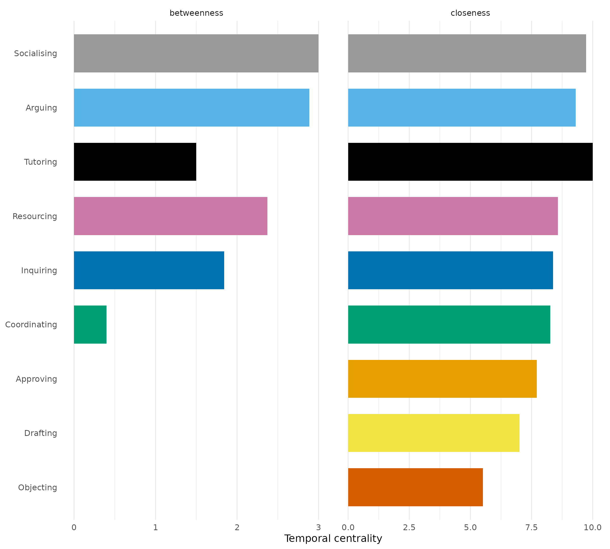

`Tutoring` has the highest temporal closeness (10), corresponding to the
reciprocal of the specified traversal duration: it reaches every other
category directly without waiting. `Objecting` has the lowest temporal
closeness (5.5). Temporal betweenness is concentrated in `Socialising`,
`Arguing`, and `Resourcing`, whereas `Approving`, `Drafting`, and
`Objecting` are not intermediate vertices on any earliest-arrival path
between other categories.

## Paths

[`paths()`](https://pak.dynasite.org/Dynet/reference/paths.md)
identifies earliest-arrival paths from the category specified by `from`,
minimising hop count among paths with the same earliest arrival. The
following call uses the same traversal duration as the temporal
centrality analysis. In the result, `arrival_time` records the earliest
arrival at each destination, `n_hops` records the number of traversed
ties, and `n_paths` records the number of optimal paths. When the
optimal session is unique, `path_session` identifies the course
containing the ties that achieve that arrival time. The plot displays
the resulting paths as a tree.

``` r

from_inquiring <- paths(dn, from = "Inquiring", traversal_time = 0.1)
from_inquiring
```

    ## # Time-respecting paths from 'Inquiring', from t = 0
    ## # reaches 8 of 8 other vertices | time in days
    ## # routes are endpoint-specific session-integral optima, not one predecessor tree
    ## # traversal 0.1 days per hop
    ##          node reachable arrival_time attained   latency n_hops n_paths
    ##     Approving      TRUE    0.1077083     TRUE 0.1077083      1       1
    ##       Arguing      TRUE    0.1000000     TRUE 0.1000000      1       5
    ##  Coordinating      TRUE    0.1052199     TRUE 0.1052199      1       1
    ##      Drafting      TRUE    0.1000000     TRUE 0.1000000      1       2
    ##     Inquiring      TRUE    0.0000000     TRUE 0.0000000      0       1
    ##     Objecting      TRUE    0.1891667     TRUE 0.1891667      1       1
    ##    Resourcing      TRUE    0.1000000     TRUE 0.1000000      1       9
    ##   Socialising      TRUE    0.1000000     TRUE 0.1000000      1       2
    ##      Tutoring      TRUE    0.1530208     TRUE 0.1530208      1       1
    ##  path_session n_best_sessions
    ##             C               1
    ##          <NA>               4
    ##             D               1
    ##          <NA>               2
    ##          <NA>               0
    ##             C               1
    ##          <NA>               5
    ##          <NA>               2
    ##             A               1

``` r

plot(from_inquiring)
```


From `Inquiring`, every category is reachable in one hop. Arrival at
`Arguing`, `Drafting`, `Resourcing`, and `Socialising` occurs at day
0.1, requiring only the specified traversal duration. `Objecting` is
reached last, at day 0.189. Nine equally early paths reach `Resourcing`.

Backward path analysis identifies the latest departure times that permit
arrival at a focal category by a specified deadline. Setting
`direction = "backward"` makes `from` the focal destination, while
`start` and `end` delimit the observation period. In this result,
`arrival_time` contains the supremum of feasible departure times, and
`latency` is the difference between the deadline and that value. An
excluded interval endpoint may yield a supremum that cannot itself be
attained; this is indicated by `attained = FALSE`.

``` r

into_approving <- paths(dn, from = "Approving", direction = "backward",
                        start = 0, end = 4, traversal_time = 0.1)
into_approving
```

    ## # Time-respecting paths into 'Approving', from t = 4
    ## # reaches 8 of 8 other vertices | time in days
    ## # routes are endpoint-specific session-integral optima, not one predecessor tree
    ## # traversal 0.1 days per hop
    ##          node reachable arrival_time attained   latency n_hops n_paths
    ##     Approving      TRUE     4.000000     TRUE 0.0000000      0       1
    ##       Arguing      TRUE     3.900000     TRUE 0.1000000      1       1
    ##  Coordinating      TRUE     3.409097     TRUE 0.5909028      2       1
    ##      Drafting      TRUE     3.030394     TRUE 0.9696065      2       3
    ##     Inquiring      TRUE     3.800000     TRUE 0.2000000      2       2
    ##     Objecting      TRUE     2.828785     TRUE 1.1712153      2       2
    ##    Resourcing      TRUE     3.900000     TRUE 0.1000000      1       1
    ##   Socialising      TRUE     3.800000     TRUE 0.2000000      2       1
    ##      Tutoring      TRUE     3.800000     TRUE 0.2000000      2       2
    ##  path_session n_best_sessions
    ##          <NA>               0
    ##             A               1
    ##             B               1
    ##             A               1
    ##             A               1
    ##             B               1
    ##             A               1
    ##             A               1
    ##             A               1

``` r

plot(into_approving)
```

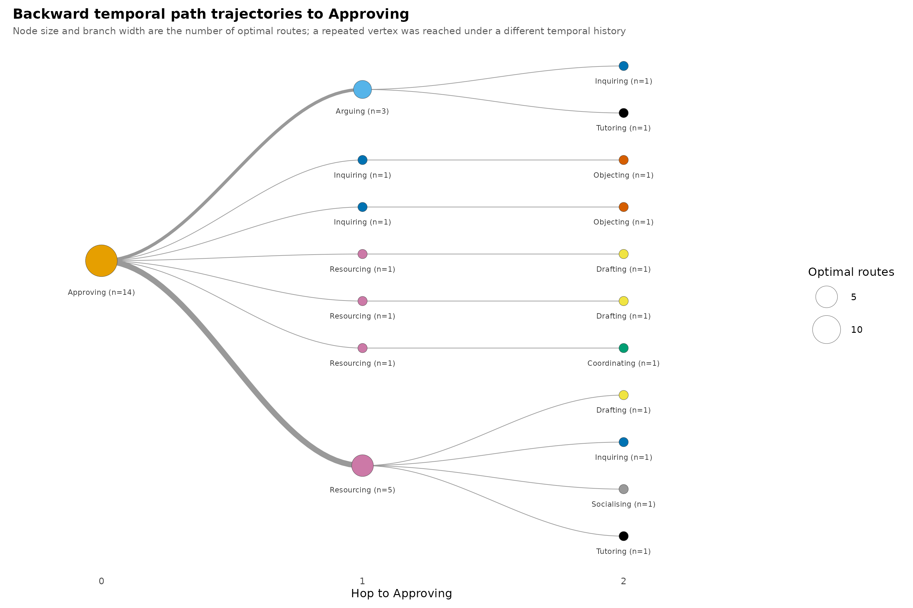

`Arguing` and `Resourcing` can depart at day 3.9 and reach `Approving`
by day 4. In contrast, the latest feasible departure from `Objecting` is
day 2.83, corresponding to a latency of 1.17 days. This difference
reflects the availability of ties towards the end of the observation
period.

[`pathways()`](https://pak.dynasite.org/Dynet/reference/pathways.md)
ranks routes across source vertices, with `top` specifying the number
returned. Counts represent optimal paths grouped by vertex sequence,
rather than observed frequencies of message sequences. The plot
represents each category along a route at its arrival time. This call
uses the default zero traversal duration.

``` r

top_routes <- pathways(dn, top = 12)
top_routes
```

    ## # Time-respecting pathways (69 distinct routes, showing 12)
    ## # 208 optimal routes counted, pooled over 9 source vertices
    ##         from                                            route     endpoint
    ##  Socialising           Socialising -> Resourcing -> Inquiring    Inquiring
    ##    Inquiring             Inquiring -> Resourcing -> Approving    Approving
    ##   Resourcing                           Resourcing -> Drafting     Drafting
    ##  Socialising           Socialising -> Resourcing -> Approving    Approving
    ##   Resourcing                            Resourcing -> Arguing      Arguing
    ##   Resourcing                          Resourcing -> Inquiring    Inquiring
    ##     Tutoring                           Tutoring -> Resourcing   Resourcing
    ##  Socialising              Socialising -> Arguing -> Inquiring    Inquiring
    ##      Arguing Arguing -> Resourcing -> Socialising -> Tutoring     Tutoring
    ##   Resourcing                          Resourcing -> Approving    Approving
    ##    Approving          Approving -> Resourcing -> Coordinating Coordinating
    ##      Arguing            Arguing -> Resourcing -> Coordinating Coordinating
    ##  count      share n_hops arrival_time
    ##     14 0.06730769      2            0
    ##     10 0.04807692      2            0
    ##      9 0.04326923      1            0
    ##      9 0.04326923      2            0
    ##      8 0.03846154      1            0
    ##      8 0.03846154      1            0
    ##      6 0.02884615      1            0
    ##      6 0.02884615      2            0
    ##      6 0.02884615      3            0
    ##      5 0.02403846      1            0
    ##      5 0.02403846      2            0
    ##      5 0.02403846      2            0

``` r

plot(top_routes)
```

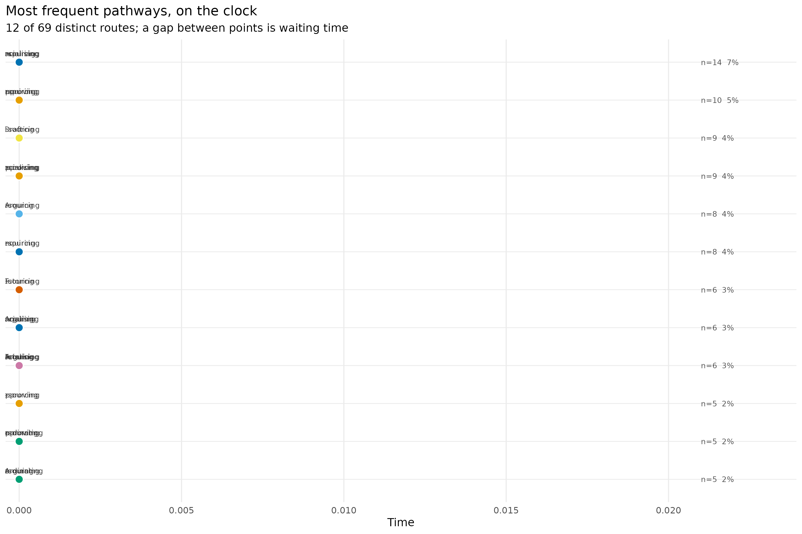

## Timing

[`similarity()`](https://pak.dynasite.org/Dynet/reference/similarity.md)
compares network structure across temporal intervals. Setting both
`step` and `window` to 0.5 produces non-overlapping half-day intervals.
The default Jaccard coefficient measures similarity between their tie
sets, and the plot displays the pairwise comparisons as a heatmap.

``` r

bin_similarity <- similarity(dn, step = 0.5, window = 0.5)
plot(bin_similarity)
```

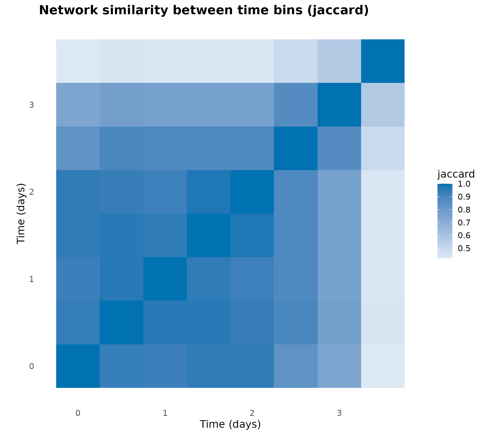

[`pshifts()`](https://pak.dynasite.org/Dynet/reference/pshifts.md)
classifies consecutive directed interactions using Gibson’s (2003)
thirteen participation shifts. These distinguish whether an interaction
from A to B is followed by an interaction initiated by B, by A again, or
by another vertex X. Here, vertices represent contribution categories,
so the classifications describe changes in category-level relational
endpoints.

``` r

shifts <- pshifts(dn)
shifts
```

    ## # Participation shifts (Gibson 2003, 13 types)
    ## # 3423 classified turn transitions across 4 families
    ##  shift          family count
    ##  AB-BA  turn_receiving   391
    ##  AB-B0  turn_receiving    51
    ##  AB-BY  turn_receiving   101
    ##  A0-X0   turn_claiming   592
    ##  A0-XA   turn_claiming   105
    ##  A0-XY   turn_claiming   559
    ##  AB-X0   turn_usurping   426
    ##  AB-XA   turn_usurping   135
    ##  AB-XB   turn_usurping   642
    ##  AB-XY   turn_usurping   170
    ##  A0-AY turn_continuing    94
    ##  AB-A0 turn_continuing    52
    ##  AB-AY turn_continuing   105

``` r

plot(shifts)
```


Of the 3,423 classified transitions, the largest family is turn
usurping, in which a third category becomes the source of the next
interaction. The most frequent individual shift is AB-XB, with 642
occurrences: a different source category addresses the same target
category.

[`burstiness()`](https://pak.dynasite.org/Dynet/reference/burstiness.md)
characterises the temporal distribution of activity using inter-event
intervals. The burstiness coefficient approaches 1 for highly
heterogeneous intervals, is 0 for an exponential inter-event
distribution, and is −1 for equal intervals (Goh and Barabási, 2008).

``` r

bursts <- burstiness(dn)
summary(bursts)
```

    ##            node    measure n          mean sd           min           max
    ## 1     Approving burstiness 1  6.582692e-01 NA  6.582692e-01  6.582692e-01
    ## 2     Approving     events 1  5.106000e+03 NA  5.106000e+03  5.106000e+03
    ## 3     Approving     memory 1  8.283281e-02 NA  8.283281e-02  8.283281e-02
    ## 4       Arguing burstiness 1  6.671291e-01 NA  6.671291e-01  6.671291e-01
    ## 5       Arguing     events 1  5.504000e+03 NA  5.504000e+03  5.504000e+03
    ## 6       Arguing     memory 1  1.645164e-01 NA  1.645164e-01  1.645164e-01
    ## 7  Coordinating burstiness 1  7.184227e-01 NA  7.184227e-01  7.184227e-01
    ## 8  Coordinating     events 1  1.654000e+03 NA  1.654000e+03  1.654000e+03
    ## 9  Coordinating     memory 1  1.756259e-02 NA  1.756259e-02  1.756259e-02
    ## 10     Drafting burstiness 1  6.355224e-01 NA  6.355224e-01  6.355224e-01
    ## 11     Drafting     events 1  6.960000e+02 NA  6.960000e+02  6.960000e+02
    ## 12     Drafting     memory 1 -8.726877e-03 NA -8.726877e-03 -8.726877e-03
    ## 13    Inquiring burstiness 1  6.284927e-01 NA  6.284927e-01  6.284927e-01
    ## 14    Inquiring     events 1  1.763000e+03 NA  1.763000e+03  1.763000e+03
    ## 15    Inquiring     memory 1  8.068968e-02 NA  8.068968e-02  8.068968e-02
    ## 16    Objecting burstiness 1  4.260920e-01 NA  4.260920e-01  4.260920e-01
    ## 17    Objecting     events 1  1.080000e+02 NA  1.080000e+02  1.080000e+02
    ## 18    Objecting     memory 1  8.584296e-02 NA  8.584296e-02  8.584296e-02
    ## 19   Resourcing burstiness 1  7.367974e-01 NA  7.367974e-01  7.367974e-01
    ## 20   Resourcing     events 1  1.495000e+04 NA  1.495000e+04  1.495000e+04
    ## 21   Resourcing     memory 1  1.111763e-01 NA  1.111763e-01  1.111763e-01
    ## 22  Socialising burstiness 1  6.260914e-01 NA  6.260914e-01  6.260914e-01
    ## 23  Socialising     events 1  4.829000e+03 NA  4.829000e+03  4.829000e+03
    ## 24  Socialising     memory 1  5.303993e-02 NA  5.303993e-02  5.303993e-02
    ## 25     Tutoring burstiness 1  5.623661e-01 NA  5.623661e-01  5.623661e-01
    ## 26     Tutoring     events 1  1.956000e+03 NA  1.956000e+03  1.956000e+03
    ## 27     Tutoring     memory 1 -1.894700e-02 NA -1.894700e-02 -1.894700e-02

``` r

plot(bursts)
```

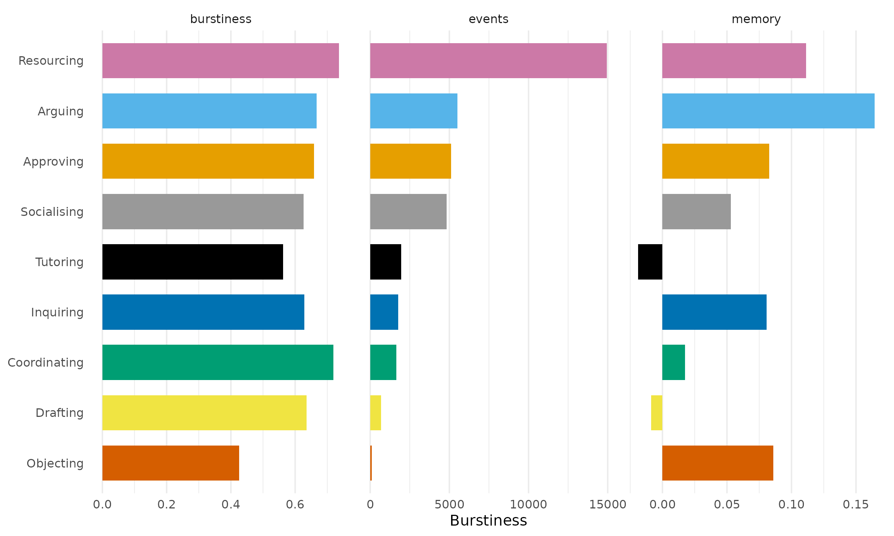

All categories have positive burstiness coefficients, ranging from 0.43
for `Objecting` to 0.74 for `Resourcing`. The memory coefficients are
close to zero, indicating little correlation between successive
inter-event intervals.

## One course group

The `group` variable is retained as a spell attribute during network
construction. A course group can therefore be selected by filtering the
existing temporal network.
[`induce_subgraph()`](https://pak.dynasite.org/Dynet/reference/induce_subgraph.md)
with `ties = group == "A_01"` retains spells associated with group
`A_01`.

``` r

one_group <- induce_subgraph(dn, ties = group == "A_01")
summary(one_group)
```

    ##                 property        value
    ## 1                 format     threaded
    ## 2               directed          yes
    ## 3               vertices            9
    ## 4            edge spells         2425
    ## 5         distinct pairs           53
    ## 6              time unit         days
    ## 7          observed from            0
    ## 8            observed to            4
    ## 9                   span            4
    ## 10             bin width            1
    ## 11             time bins            4
    ## 12 mean snapshot density        0.559
    ## 13      temporal density not computed
    ## 14              sessions            1
    ## 15     vertex attributes         none

The resulting subnetwork contains 2,425 spells across 53 of the 81
possible ordered pairs, with a mean snapshot density of 0.559 and one
session.

Setting `type = "events"` displays reply events with contribution
categories on the vertical axis. Specifying `time = "clock"` positions
events at their recorded times, while `blend = TRUE` interpolates link
colours between their source and target categories.

``` r

plot(one_group, type = "events")
```


``` r

plot(one_group, type = "events", time = "clock", blend = TRUE)
```

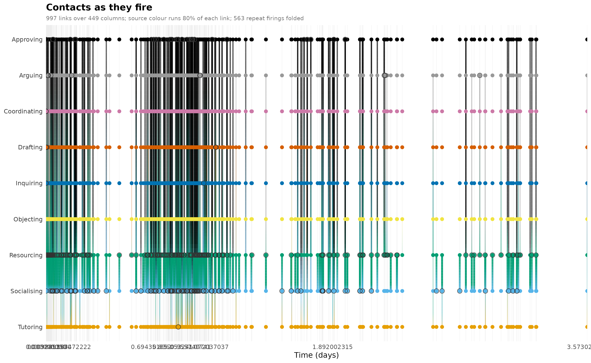

Graph-level metrics can be computed for the subnetwork using the same
hourly intervals as the full network.

``` r

group_structure <- metrics(one_group,
                           measure = c("density", "edges", "reciprocity",
                                       "connectedness"),
                           step = 1 / 24, window = 1 / 24)
plot(group_structure, type = "ridge")
```


## Interpretation

In this synthetic example, `Resourcing` is incident to the largest
number of reply links and is frequently reachable through multiple
equally early paths. Together with `Socialising` and `Arguing`, it
accounts for much of the temporal betweenness. `Objecting` has
comparatively few incident replies, the lowest temporal closeness, and
no temporal betweenness.

Under the specified construction, relational spells remain active until
discussion termination, and every category is temporally reachable from
every other category. Differences in arrival times and intermediate
categories provide additional distinctions that reachability alone does
not capture. These results illustrate the analytical methods applied to
the synthetic dataset and do not constitute empirical findings about the
original study.

## Limitations

Maintaining each relational spell until discussion termination is a
modelling assumption that increases tie availability and contributes to
high network density and complete reachability. Shorter spell durations
could produce sparser networks, longer waiting times, or unreachable
destinations. The four-day observation period also truncates longer
discussions for measurement, without modifying their raw spell
endpoints.

Vertices represent contribution categories rather than individual
participants; consequently, the analysis characterises relationships
among categories and does not identify interpersonal interaction
patterns. Replies assigned multiple categories may contribute multiple
ties, affecting spell counts and accumulated durations. Temporal path
results additionally depend on the specified traversal duration.

The dataset is synthetic and based on the original study data. Its
results serve to demonstrate package functionality; correspondence with
empirical patterns in the original data requires separate assessment.

## References

Freeman, L. C. (1979). Centrality in social networks: conceptual
clarification. *Social Networks*, 1(3), 215–239.

Freeman, L. C., Borgatti, S. P., & White, D. R. (1991). Centrality in
valued graphs: a measure of betweenness based on network flow. *Social
Networks*, 13(2), 141–154.

Gibson, D. R. (2003). Participation shifts: order and differentiation in
group conversation. *Social Forces*, 81(4), 1335–1380.

Goh, K.-I., & Barabási, A.-L. (2008). Burstiness and memory in complex
systems. *EPL (Europhysics Letters)*, 81(4), 48002.

Holland, P. W., & Leinhardt, S. (1976). Local structure in social
networks. *Sociological Methodology*, 7, 1–45.

Kempe, D., Kleinberg, J., & Kumar, A. (2002). Connectivity and inference
problems for temporal networks. *Journal of Computer and System
Sciences*, 64(4), 820–842.

Krackhardt, D. (1994). Graph theoretical dimensions of informal
organizations. In K. M. Carley & M. J. Prietula (Eds.), *Computational
organization theory* (pp. 89–111). Lawrence Erlbaum.

Kundu, S., Murthy, C. A., & Pal, S. K. (2011). A new centrality measure
for influence maximization in social networks. In *Pattern Recognition
and Machine Intelligence* (Lecture Notes in Computer Science 6744,
pp. 242–247). Springer.

Morris, M., Handcock, M. S., & Hunter, D. R. (2008). Specification of
exponential-family random graph models: terms and computational aspects.
*Journal of Statistical Software*, 24(4).

Pan, R. K., & Saramäki, J. (2011). Path lengths, correlations, and
centrality in temporal networks. *Physical Review E*, 84(1), 016105.

Saqr, M., López-Pernas, S., & Törmänen, T. (2026). A temporal network
approach to reveal the longitudinal dynamics of CSCL group regulation
and productive collaboration. *International Journal of
Computer-Supported Collaborative Learning*, 21, 237–270.
<https://doi.org/10.1007/s11412-025-09464-5>

Saqr, M., & Nouri, J. (2020). High resolution temporal network analysis
to understand and improve collaborative learning. In *Proceedings of the
Tenth International Conference on Learning Analytics & Knowledge*
(pp. 314–319). ACM.

Wasserman, S., & Faust, K. (1994). *Social network analysis: methods and
applications*. Cambridge University Press.
