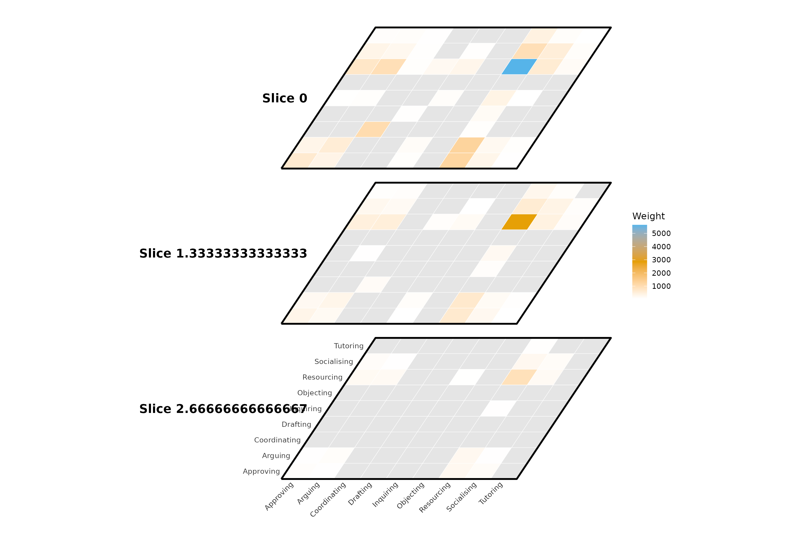

# Case study: How kinds of contribution follow one another in course discussions

In this article we analyse the reply table of the *Trees of Thought*
study, which coded the messages of asynchronous course discussions into
kinds of contribution such as inquiring, arguing or approving. The unit
of analysis is the code rather than the student: a tie runs from the
code of a reply to the code of the message it answers. We ask which
kinds of contribution the discussions return to, how quickly a
contribution of one kind can lead to any other, and which kinds sit on
the routes between the rest.

## Data

`thought_chains` is the study’s reply table, anonymised: 23,017 reply
links among nine codes, from 1,169 discussions in 29 groups across five
courses. Each row is one reply. `from` is the code of the reply, `to`
the code of the message it answers, `time` the moment of the reply,
`discussion` the thread it belongs to, and `course` and `group` the
course and course group. A code that answers itself is a self-link;
there are 9,452 of them.

``` r

library(Dynet)
head(thought_chains)
```

    ##           from           to                time participant discussion group
    ## 1 Coordinating Coordinating 2006-09-23 18:06:29        P028          1  A_01
    ## 2 Coordinating Coordinating 2006-09-23 18:06:29        P028          1  A_01
    ## 3 Coordinating Coordinating 2006-09-23 18:06:29        P028          1  A_01
    ## 4 Coordinating Coordinating 2006-09-23 18:06:29        P028          1  A_01
    ## 5 Coordinating Coordinating 2006-09-23 18:06:29        P028          1  A_01
    ## 6 Coordinating Coordinating 2006-09-23 18:06:29        P028          1  A_01
    ##   course
    ## 1      A
    ## 2      A
    ## 3      A
    ## 4      A
    ## 5      A
    ## 6      A

## The network

A reply is a contribution to a conversation that is still open, so,
following Saqr and Nouri (2020), it becomes a tie that opens when the
reply is posted and closes when its discussion ends. To build the
network, we call
[`dynet()`](https://pak.dynasite.org/Dynet/reference/dynet.md) with
`thread` for the discussion column, `thread_clock = "relative"` so that
time is counted in days from the first post of each discussion,
`loops = TRUE` to keep self-links, and `observation_end = 4` for a
four-day observation window. The `course` column is recognised as the
session column.

``` r

dn <- dynet(thought_chains, thread = "discussion", thread_clock = "relative",
            loops = TRUE, observation_end = 4)
```

    ## Keeping 9452 self-loop event(s); each adds two to its vertex's degree.

``` r

dn
```

    ## # Temporal network (threaded format, directed) | a cograph netobject
    ## # 9 vertices | 23017 edge spells | 80 distinct pairs
    ## # observed from 0 to 4 days, binned every 1
    ## # 5 sessions: A, B, C, D, E
    ## 
    ##       from         to start end duration weight session thread participant
    ##  Approving  Approving     0   0        0      1       B    282        P181
    ##  Approving   Drafting     0   0        0      1       B    300        P189
    ##  Approving  Inquiring     0   0        0      1       D    839        P063
    ##  Approving Resourcing     0   0        0      1       A     62        P006
    ##  Approving Resourcing     0   0        0      1       A    187        P232
    ##  Approving Resourcing     0   0        0      1       A    187        P232
    ##  group
    ##   B_02
    ##   B_03
    ##   D_02
    ##   A_05
    ##   A_04
    ##   A_04
    ## # 23011 more spells. summary() describes the network; plot() draws it.

``` r

summary(dn)
```

    ##                 property        value
    ## 1                 format     threaded
    ## 2               directed          yes
    ## 3               vertices            9
    ## 4            edge spells        23017
    ## 5         distinct pairs           80
    ## 6              time unit         days
    ## 7          observed from            0
    ## 8            observed to            4
    ## 9                   span            4
    ## 10             bin width            1
    ## 11             time bins            4
    ## 12 mean snapshot density       0.8958
    ## 13      temporal density not computed
    ## 14              sessions            5
    ## 15     vertex attributes         none

The network has nine vertices and 23,017 spells on 80 of the 81 possible
ordered pairs of codes. Time is in days, and on an average day nine of
every ten ordered pairs are connected (mean snapshot density 0.8958).
The network is dense because a tie stays open for the life of its
discussion.

## Ties over time

To count the ties that open and close in each half day, we call
[`events()`](https://pak.dynasite.org/Dynet/reference/events.md) with
`step` and `window` of 0.5.

``` r

tie_events <- events(dn, measure = c("formation", "dissolution"),
                     step = 0.5, window = 0.5)
tie_events
```

    ## # Edge dynamics (graph-level)
    ## # 8 time points, 0.5 per bin | time in days
    ## # measures: formation, dissolution
    ##  time     measure value
    ##   0.0   formation 13094
    ##   0.0 dissolution  3842
    ##   0.5   formation  4435
    ##   0.5 dissolution  2960
    ##   1.0   formation  2442
    ##   1.0 dissolution  5348
    ##   1.5   formation  1457
    ##   1.5 dissolution  2819
    ##   2.0   formation  1021
    ##   2.0 dissolution  3675
    ##   2.5   formation   377
    ##   2.5 dissolution  1996
    ## # 4 more rows. summary() aggregates them; plot() draws them.

13,094 ties open in the first half day, 4,435 in the second and 2,442 in
the third; only 10 open in the last. Closures peak in the third half
day, at 5,348, when the shorter discussions end. Most of the network is
therefore in place from the start, and the analysis below asks what
happens within it.

To draw the spells over time, we call
[`plot()`](https://rdrr.io/r/graphics/plot.default.html) with
`type = "timeline"`; each bar is one spell, on an hourly grid, and the
forty busiest pairs are drawn.

``` r

plot(dn, type = "timeline", step = 1 / 24)
```


To draw the counts of opening and closing ties with the stock of active
ties beneath them, we set `type` to `"activity"`.

``` r

plot(dn, type = "activity")
```


## Drawing the network

To draw the union of every tie active in the window, we set `type` to
`"network"`; the drawing is cograph’s and `layout` is passed to it.

``` r

plot(dn, type = "network", layout = "oval")
```


The binary union treats a tie active for an hour like one active for
four days. To weight each pair by the time it was active, counting
overlapping spells once, we call
[`collapse_network()`](https://pak.dynasite.org/Dynet/reference/collapse_network.md)
with `weight = "union_duration"` and draw the static network it returns.

``` r

collapsed <- collapse_network(dn, weight = "union_duration")
plot(collapsed, layout = "oval")
```


To draw the network at nine equally spaced cross-sections with a shared
layout, we set `type` to `"snapshots"`.

``` r

plot(dn, type = "snapshots", panels = 9)
```


The proximity timeline follows each code through time: the window is
measured in overlapping slices, the distances in each slice are reduced
to one dimension, and each code is a line whose height follows that
coordinate, so codes that interact sit close together. Line thickness
follows degree. To draw it with 80 slices and five phase networks, we
set `type` to `"proximity"`.

``` r

plot(dn, type = "proximity", phases = 5, slices = 80)
```


To let thickness follow betweenness and omit the phase networks, we set
`measure` and `networks`.

``` r

plot(dn, type = "proximity", measure = "betweenness",
     networks = FALSE, slices = 80)
```


Cutting the window into slices and treating each slice as one layer of a
multilayer network shows structure and time together. To draw three
slices as planes, we set `type` to `"layers"` and `step` to `4 / 3`; to
draw them as matrices keeping only cells with at least 50 active dyads,
we set `type` to `"heatmap"` and `threshold` to 50; to draw them as a
projection in which each plane carries every tie active up to it, we set
`type` to `"stack"` and `cumulative` to `TRUE`.

``` r

plot(dn, type = "layers", step = 4 / 3, layout = "circle")
```


``` r

plot(dn, type = "heatmap", step = 4 / 3, threshold = 50)
```



``` r

plot(dn, type = "stack", step = 4 / 3, cumulative = TRUE)
```


## Structure over time

To measure the network in each hour, we call
[`metrics()`](https://pak.dynasite.org/Dynet/reference/metrics.md) with
`step` and `window` of `1 / 24`. Density is the share of ordered pairs
connected in the hour, reciprocity the share of arcs whose reverse is
also present, and efficiency and connectedness two of Krackhardt’s
(1994) indices of how far a directed network departs from an out-tree.
To draw one panel per measure, we call
[`plot()`](https://rdrr.io/r/graphics/plot.default.html) with
`type = "ridge"`.

``` r

structure <- metrics(dn,
                     measure = c("density", "reciprocity", "efficiency",
                                 "connectedness", "edges", "mean_degree"),
                     step = 1 / 24, window = 1 / 24)
structure
```

    ## # Graph structure (graph-level)
    ## # 96 time points, 0.04166667 per bin | time in days
    ## # measures: density, reciprocity, efficiency, connectedness, edges, mean_degree
    ##        time       measure      value
    ##  0.00000000       density  0.7916667
    ##  0.00000000   reciprocity  0.9122807
    ##  0.00000000    efficiency  0.2343750
    ##  0.00000000 connectedness  1.0000000
    ##  0.00000000         edges 57.0000000
    ##  0.00000000   mean_degree  6.3333333
    ##  0.04166667       density  0.8194444
    ##  0.04166667   reciprocity  0.9152542
    ##  0.04166667    efficiency  0.2031250
    ##  0.04166667 connectedness  1.0000000
    ##  0.04166667         edges 59.0000000
    ##  0.04166667   mean_degree  6.5555556
    ## # 564 more rows. summary() aggregates them; plot() draws them.

``` r

plot(structure, type = "ridge")
```


In the first hour, 57 arcs give a density of 0.79, connectedness is 1,
so every code is joined to every other, and reciprocity is 0.91: almost
every transition between two codes occurs in both directions within the
same hour. An hour later the density is 0.82.

To obtain the dyad census (Holland and Leinhardt, 1976), we name the
mutual, asymmetric and null counts in `measure`; to obtain the
sixteen-class triad census, we set `measure` to `"triads"`.

``` r

dyads <- metrics(dn, measure = c("mutual", "asymmetric", "null"),
                 step = 1 / 24, window = 1 / 24)
dyads
```

    ## # Graph structure (graph-level)
    ## # 96 time points, 0.04166667 per bin | time in days
    ## # measures: mutual, asymmetric, null
    ##        time    measure value
    ##  0.00000000     mutual    26
    ##  0.00000000 asymmetric     5
    ##  0.00000000       null     5
    ##  0.04166667     mutual    27
    ##  0.04166667 asymmetric     5
    ##  0.04166667       null     4
    ##  0.08333333     mutual    28
    ##  0.08333333 asymmetric     4
    ##  0.08333333       null     4
    ##  0.12500000     mutual    28
    ##  0.12500000 asymmetric     5
    ##  0.12500000       null     3
    ## # 276 more rows. summary() aggregates them; plot() draws them.

``` r

plot(dyads)
```


``` r

triads <- metrics(dn, measure = "triads", step = 1 / 24, window = 1 / 24)
triads
```

    ## # Triad census (graph-level)
    ## # 96 time points, 0.04166667 per bin | time in days
    ## # measures: triad_003, triad_012, triad_102, triad_021D, triad_021U, triad_021C, triad_111D, triad_111U, triad_030T, triad_030C, triad_201, triad_120D, triad_120U, triad_120C, triad_210, triad_300
    ##  time    measure value
    ##     0  triad_003     0
    ##     0  triad_012     1
    ##     0  triad_102     9
    ##     0 triad_021D     0
    ##     0 triad_021U     0
    ##     0 triad_021C     0
    ##     0 triad_111D     0
    ##     0 triad_111U     8
    ##     0 triad_030T     0
    ##     0 triad_030C     0
    ##     0  triad_201     7
    ##     0 triad_120D     3
    ## # 1524 more rows. summary() aggregates them; plot() draws them.

``` r

plot(triads, type = "heatmap")
```


Of the 36 unordered pairs of codes, 26 are mutual in the first hour, 5
asymmetric and 5 null. No triad is empty; nine are of class 102, one
mutual dyad with two null dyads, eight of class 111U and seven of class
201.

To obtain the two-star, two-path and triangle counts and the degree sums
raised to 1.5 used as terms in exponential-family random graph models
(Morris, Handcock and Hunter, 2008), we name them in `measure`.

``` r

local <- metrics(dn,
                 measure = c("indegree_1_5", "outdegree_1_5", "triangles",
                             "in_2stars", "out_2stars", "two_paths"),
                 step = 1 / 24, window = 1 / 24)
local
```

    ## # Graph structure (graph-level)
    ## # 96 time points, 0.04166667 per bin | time in days
    ## # measures: indegree_1_5, outdegree_1_5, triangles, in_2stars, out_2stars, two_paths
    ##        time       measure    value
    ##  0.00000000  indegree_1_5 146.3021
    ##  0.00000000 outdegree_1_5 148.0187
    ##  0.00000000     triangles 376.0000
    ##  0.00000000     in_2stars 161.0000
    ##  0.00000000    out_2stars 166.0000
    ##  0.00000000     two_paths 325.0000
    ##  0.04166667  indegree_1_5 155.0977
    ##  0.04166667 outdegree_1_5 155.3815
    ##  0.04166667     triangles 436.0000
    ##  0.04166667     in_2stars 176.0000
    ##  0.04166667    out_2stars 177.0000
    ##  0.04166667     two_paths 356.0000
    ## # 564 more rows. summary() aggregates them; plot() draws them.

``` r

plot(local, type = "ridge")
```


The first hour holds 376 directed triangles and 325 two-paths; the
second, 436 and 356.

## Codes

To measure each code in each hour, we call
[`dyn_centrality()`](https://pak.dynasite.org/Dynet/reference/dyn_centrality.md)
with the indices in `measure`: degree, closeness and betweenness
(Freeman, 1979), eigenvector centrality, flow betweenness (Freeman,
Borgatti and White, 1991) and diffusion degree (Kundu, Murthy and Pal,
2011). [`plot()`](https://rdrr.io/r/graphics/plot.default.html) with
`type = "heatmap"` draws one tile per code and hour, and
`type = "ridge"` draws the trajectories as lines.

``` r

centrality <- dyn_centrality(dn,
                             measure = c("degree", "closeness", "betweenness",
                                         "eigenvector", "flow_betweenness",
                                         "diffusion"),
                             step = 1 / 24, window = 1 / 24)
centrality
```

    ## # Centrality (node-level)
    ## # 9 vertices | 96 time points, 0.04166667 per bin | time in days
    ## # measures: degree, closeness, betweenness, eigenvector, flow_betweenness, diffusion
    ##  time         node   measure      value
    ##     0    Approving    degree 14.0000000
    ##     0      Arguing    degree 17.0000000
    ##     0 Coordinating    degree 15.0000000
    ##     0     Drafting    degree 15.0000000
    ##     0    Inquiring    degree 15.0000000
    ##     0    Objecting    degree  7.0000000
    ##     0   Resourcing    degree 16.0000000
    ##     0  Socialising    degree 18.0000000
    ##     0     Tutoring    degree 15.0000000
    ##     0    Approving closeness  0.8888889
    ##     0      Arguing closeness  1.0000000
    ##     0 Coordinating closeness  0.8888889
    ## # 5172 more rows. summary() aggregates them; plot() draws them.

``` r

plot(centrality, type = "heatmap")
```


``` r

plot(centrality, type = "ridge")
```


In the first hour `Socialising` has the highest degree, 18, and
`Objecting` the lowest, 7; `Arguing` has a closeness of 1, so it reaches
every other code in one step. `Objecting` stays at the margin
throughout: it has the lowest mean degree, closeness and betweenness
over the 96 hours.

On a directed network the direction of degree is the `mode` argument.

``` r

in_degree <- dyn_centrality(dn, measure = "degree", mode = "in",
                            step = 1 / 24, window = 1 / 24)
out_degree <- dyn_centrality(dn, measure = "degree", mode = "out",
                             step = 1 / 24, window = 1 / 24)
plot(in_degree, type = "heatmap")
```


``` r

plot(out_degree, type = "heatmap")
```


Prestige indices describe a code by the ties it receives (Wasserman and
Faust, 1994). Indegree prestige counts the distinct codes with a tie
into a code; domain proximity prestige discounts the share of codes with
a directed path into it by their mean distance. To obtain them, we set
`measure` to `"prestige"` and name the variant in `prestige`.

``` r

prestige_indegree <- dyn_centrality(dn, measure = "prestige",
                                    prestige = "indegree",
                                    step = 1 / 24, window = 1 / 24)
prestige_proximity <- dyn_centrality(dn, measure = "prestige",
                                     prestige = "domain.proximity",
                                     step = 1 / 24, window = 1 / 24)
plot(prestige_indegree, type = "heatmap")
```


``` r

plot(prestige_proximity, type = "heatmap")
```


## Flows between codes

To count the active dyads from each code to each other code in each
hour, we call
[`mixing()`](https://pak.dynasite.org/Dynet/reference/mixing.md) with
`attribute = "name"`. Each row is one hour and one ordered pair of
codes, and [`plot()`](https://rdrr.io/r/graphics/plot.default.html) with
`type = "heatmap"` draws all 81 pairs.

``` r

flows <- mixing(dn, attribute = "name", step = 1 / 24, window = 1 / 24)
flows
```

    ## # Mixing by name (graph-level)
    ## # 96 time points, 0.04166667 per bin | time in days
    ## # measures: Approving -> Approving, Arguing -> Approving, Coordinating -> Approving, Drafting -> Approving, Inquiring -> Approving, Objecting -> Approving, Resourcing -> Approving, Socialising -> Approving, Tutoring -> Approving, Approving -> Arguing, Arguing -> Arguing, Coordinating -> Arguing, Drafting -> Arguing, Inquiring -> Arguing, Objecting -> Arguing, Resourcing -> Arguing, Socialising -> Arguing, Tutoring -> Arguing, Approving -> Coordinating, Arguing -> Coordinating, Coordinating -> Coordinating, Drafting -> Coordinating, Inquiring -> Coordinating, Objecting -> Coordinating, Resourcing -> Coordinating, Socialising -> Coordinating, Tutoring -> Coordinating, Approving -> Drafting, Arguing -> Drafting, Coordinating -> Drafting, Drafting -> Drafting, Inquiring -> Drafting, Objecting -> Drafting, Resourcing -> Drafting, Socialising -> Drafting, Tutoring -> Drafting, Approving -> Inquiring, Arguing -> Inquiring, Coordinating -> Inquiring, Drafting -> Inquiring, Inquiring -> Inquiring, Objecting -> Inquiring, Resourcing -> Inquiring, Socialising -> Inquiring, Tutoring -> Inquiring, Approving -> Objecting, Arguing -> Objecting, Coordinating -> Objecting, Drafting -> Objecting, Inquiring -> Objecting, Objecting -> Objecting, Resourcing -> Objecting, Socialising -> Objecting, Tutoring -> Objecting, Approving -> Resourcing, Arguing -> Resourcing, Coordinating -> Resourcing, Drafting -> Resourcing, Inquiring -> Resourcing, Objecting -> Resourcing, Resourcing -> Resourcing, Socialising -> Resourcing, Tutoring -> Resourcing, Approving -> Socialising, Arguing -> Socialising, Coordinating -> Socialising, Drafting -> Socialising, Inquiring -> Socialising, Objecting -> Socialising, Resourcing -> Socialising, Socialising -> Socialising, Tutoring -> Socialising, Approving -> Tutoring, Arguing -> Tutoring, Coordinating -> Tutoring, Drafting -> Tutoring, Inquiring -> Tutoring, Objecting -> Tutoring, Resourcing -> Tutoring, Socialising -> Tutoring, Tutoring -> Tutoring
    ## # active binary-dyad counts between vertex groups per time bin
    ##  time                   measure value   from_group  to_group
    ##     0    Approving -> Approving     1    Approving Approving
    ##     0      Arguing -> Approving     1      Arguing Approving
    ##     0 Coordinating -> Approving     0 Coordinating Approving
    ##     0     Drafting -> Approving     1     Drafting Approving
    ##     0    Inquiring -> Approving     1    Inquiring Approving
    ##     0    Objecting -> Approving     0    Objecting Approving
    ##     0   Resourcing -> Approving     1   Resourcing Approving
    ##     0  Socialising -> Approving     1  Socialising Approving
    ##     0     Tutoring -> Approving     1     Tutoring Approving
    ##     0      Approving -> Arguing     1    Approving   Arguing
    ##     0        Arguing -> Arguing     1      Arguing   Arguing
    ##     0   Coordinating -> Arguing     1 Coordinating   Arguing
    ## # 7764 more rows. summary() aggregates them; plot() draws them.

``` r

plot(flows, type = "heatmap")
```


To follow one code’s flows against the rest, we call
[`plot()`](https://rdrr.io/r/graphics/plot.default.html) with
`highlight` naming the code. The flows into and out of `Coordinating`
are drawn in colour and the others in grey.

``` r

plot(flows, highlight = "Coordinating")
```


## Duration

To measure how much tie time each code carries, we call
[`durations()`](https://pak.dynasite.org/Dynet/reference/durations.md)
with `unit = "node_ties"`, `mode = "all"` for ties in either direction,
and `measure` for the number of spells, their summed duration and the
union of their active time, which counts overlapping spells once.

``` r

node_ties <- durations(dn, unit = "node_ties", mode = "all",
                       measure = c("events", "total", "union"))
node_ties
```

    ## # Incident tie duration (node-level)
    ## # 9 vertices | mode all | time in days
    ## # measures: events, total, union
    ## # durations in days
    ##          node measure     value
    ##     Approving  events  5825.000
    ##       Arguing  events  6174.000
    ##  Coordinating  events  2713.000
    ##      Drafting  events   779.000
    ##     Inquiring  events  1892.000
    ##     Objecting  events   109.000
    ##    Resourcing  events 20999.000
    ##   Socialising  events  5493.000
    ##      Tutoring  events  2034.000
    ##     Approving   total  5355.039
    ##       Arguing   total  5539.510
    ##  Coordinating   total  1389.779
    ## # 15 more rows. summary() aggregates them; plot() draws them.

``` r

plot(node_ties)
```


`Resourcing` is incident to 20,999 spells with a summed duration of
22,781 days, against 109 spells and 71 days for `Objecting`. The union
column shows the ceiling: no code is in contact for more than the four
days of the window, and six of the nine are in contact for all of it.

To obtain the same accounting per ordered pair of codes, with the mean
spell length added, we set `unit` to `"pair"`.

``` r

pair_duration <- durations(dn, unit = "pair",
                           measure = c("events", "total", "union", "mean"))
pair_duration
```

    ## # Relationship duration (edge-level)
    ## # time in days
    ## # measures: events, mean, total, union
    ## # durations in days
    ##       from           to measure value
    ##  Approving    Approving  events   719
    ##  Approving      Arguing  events   417
    ##  Approving Coordinating  events    30
    ##  Approving     Drafting  events    30
    ##  Approving    Inquiring  events   110
    ##  Approving    Objecting  events     4
    ##  Approving   Resourcing  events  1353
    ##  Approving  Socialising  events   385
    ##  Approving     Tutoring  events   100
    ##    Arguing    Approving  events   415
    ##    Arguing      Arguing  events   670
    ##    Arguing Coordinating  events    44
    ## # 308 more rows. summary() aggregates them; plot() draws them.

``` r

plot(pair_duration)
```


The pairs differ by three orders of magnitude: 1,353 spells run from
`Approving` to `Resourcing` and 4 from `Approving` to `Objecting`.

## Reachability and temporal centrality

A time-respecting path may only use ties in chronological order (Kempe,
Kleinberg and Kumar, 2002). To obtain the share and the number of other
codes each code can reach, and be reached from, along such paths, we
call
[`dyn_reachability()`](https://pak.dynasite.org/Dynet/reference/dyn_reachability.md)
with `direction = "both"`.

``` r

reachability <- dyn_reachability(dn, direction = "both",
                                 measure = c("reach", "reach_count"))
reachability
```

    ## # Reachability (node-level)
    ## # 9 vertices | time in days
    ## # measures: forward_reach, forward_reach_count, backward_reach, backward_reach_count
    ## # count and share of other vertices joined by a time-respecting path
    ##          node             measure value
    ##     Approving       forward_reach     1
    ##       Arguing       forward_reach     1
    ##  Coordinating       forward_reach     1
    ##      Drafting       forward_reach     1
    ##     Inquiring       forward_reach     1
    ##     Objecting       forward_reach     1
    ##    Resourcing       forward_reach     1
    ##   Socialising       forward_reach     1
    ##      Tutoring       forward_reach     1
    ##     Approving forward_reach_count     8
    ##       Arguing forward_reach_count     8
    ##  Coordinating forward_reach_count     8
    ## # 24 more rows. summary() aggregates them; plot() draws them.

``` r

plot(reachability)
```


Every code reaches all eight others and is reached by all eight. With so
many ties open from the start this is expected, and the informative
quantities are how quickly and by how many routes.

Temporal closeness is the inverse of the mean time a code needs to reach
the others, and temporal betweenness the share of earliest routes
between other codes that pass through a code (Pan and Saramäki, 2011).
Because the ties that carry the routes are open at time 0, a hop that
costs nothing arrives at once and closeness is unbounded;
`traversal_time = 0.1` charges a tenth of a day per hop so that the
indices separate. To obtain them, we call
[`dyn_centrality()`](https://pak.dynasite.org/Dynet/reference/dyn_centrality.md)
with `scope = "temporal"`.

``` r

temporal <- dyn_centrality(dn, measure = c("closeness", "betweenness"),
                           scope = "temporal", traversal_time = 0.1)
temporal
```

    ## # Temporal centrality (node-level)
    ## # 9 vertices | traversal 0.1 days per hop | time in days
    ## # measures: closeness, betweenness
    ## # computed on time-respecting paths across the whole window
    ##          node     measure     value
    ##     Approving   closeness  7.710069
    ##       Arguing   closeness  9.301324
    ##  Coordinating   closeness  8.269624
    ##      Drafting   closeness  7.010284
    ##     Inquiring   closeness  8.375948
    ##     Objecting   closeness  5.512050
    ##    Resourcing   closeness  8.577492
    ##   Socialising   closeness  9.731100
    ##      Tutoring   closeness 10.000000
    ##     Approving betweenness  0.000000
    ##       Arguing betweenness  2.885714
    ##  Coordinating betweenness  0.400000
    ## # 6 more rows. summary() aggregates them; plot() draws them.

``` r

plot(temporal)
```


`Tutoring` has the highest temporal closeness, 10, the reciprocal of the
traversal cost: it reaches every other code in one hop without waiting.
`Objecting` has the lowest, 5.5. Betweenness is concentrated in
`Socialising`, `Arguing` and `Resourcing`, while `Approving`, `Drafting`
and `Objecting` relay no earliest route at all.

## Paths

To obtain the earliest route from one code to every other, we call
[`paths()`](https://pak.dynasite.org/Dynet/reference/paths.md) with
`from` for the source and the same traversal cost. `arrival_time` is the
earliest moment a code can be reached, `n_hops` the length of the
earliest route and `n_paths` the number of routes that arrive equally
early; `path_session` names the course whose ties achieve the optimum
when it is unique. To draw the routes as a tree, we call
[`plot()`](https://rdrr.io/r/graphics/plot.default.html) on the result.

``` r

from_inquiring <- paths(dn, from = "Inquiring", traversal_time = 0.1)
from_inquiring
```

    ## # Time-respecting paths from 'Inquiring', from t = 0
    ## # reaches 8 of 8 other vertices | time in days
    ## # routes are endpoint-specific session-integral optima, not one predecessor tree
    ## # traversal 0.1 days per hop
    ##          node reachable arrival_time attained   latency n_hops n_paths
    ##     Approving      TRUE    0.1077083     TRUE 0.1077083      1       1
    ##       Arguing      TRUE    0.1000000     TRUE 0.1000000      1       5
    ##  Coordinating      TRUE    0.1052199     TRUE 0.1052199      1       1
    ##      Drafting      TRUE    0.1000000     TRUE 0.1000000      1       2
    ##     Inquiring      TRUE    0.0000000     TRUE 0.0000000      0       1
    ##     Objecting      TRUE    0.1891667     TRUE 0.1891667      1       1
    ##    Resourcing      TRUE    0.1000000     TRUE 0.1000000      1       9
    ##   Socialising      TRUE    0.1000000     TRUE 0.1000000      1       2
    ##      Tutoring      TRUE    0.1530208     TRUE 0.1530208      1       1
    ##  path_session n_best_sessions
    ##             C               1
    ##          <NA>               4
    ##             D               1
    ##          <NA>               2
    ##          <NA>               0
    ##             C               1
    ##          <NA>               5
    ##          <NA>               2
    ##             A               1

``` r

plot(from_inquiring)
```


From `Inquiring` every code is reached in one hop. `Arguing`,
`Drafting`, `Resourcing` and `Socialising` are reached at exactly 0.1
days, the traversal cost with no waiting, and `Objecting` last, at 0.189
days. `Resourcing` is reached by nine equally early routes.

To ask which codes could have fed into a code, leaving as late as
possible and still arriving by the end of the window, we set `direction`
to `"backward"` with `start` and `end` as the window. `arrival_time`
then holds the latest moment a sender could depart, and `latency` the
deadline minus that moment.

``` r

into_approving <- paths(dn, from = "Approving", direction = "backward",
                        start = 0, end = 4, traversal_time = 0.1)
into_approving
```

    ## # Time-respecting paths into 'Approving', from t = 4
    ## # reaches 8 of 8 other vertices | time in days
    ## # routes are endpoint-specific session-integral optima, not one predecessor tree
    ## # traversal 0.1 days per hop
    ##          node reachable arrival_time attained   latency n_hops n_paths
    ##     Approving      TRUE     4.000000     TRUE 0.0000000      0       1
    ##       Arguing      TRUE     3.900000     TRUE 0.1000000      1       1
    ##  Coordinating      TRUE     3.409097     TRUE 0.5909028      2       1
    ##      Drafting      TRUE     3.030394     TRUE 0.9696065      2       3
    ##     Inquiring      TRUE     3.800000     TRUE 0.2000000      2       2
    ##     Objecting      TRUE     2.828785     TRUE 1.1712153      2       2
    ##    Resourcing      TRUE     3.900000     TRUE 0.1000000      1       1
    ##   Socialising      TRUE     3.800000     TRUE 0.2000000      2       1
    ##      Tutoring      TRUE     3.800000     TRUE 0.2000000      2       2
    ##  path_session n_best_sessions
    ##          <NA>               0
    ##             A               1
    ##             B               1
    ##             A               1
    ##             A               1
    ##             B               1
    ##             A               1
    ##             A               1
    ##             A               1

``` r

plot(into_approving)
```


`Arguing` and `Resourcing` can depart as late as day 3.9 and still reach
`Approving` by the deadline, while `Objecting` must depart by day 2.83,
a latency of 1.17 days, because the network thins towards the end of the
window.

To rank whole routes by how often they are used across every source, we
call
[`pathways()`](https://pak.dynasite.org/Dynet/reference/pathways.md)
with `top` for the number of routes. The plot places a point per code at
the moment the route reaches it.

``` r

top_routes <- pathways(dn, top = 12)
top_routes
```

    ## # Time-respecting pathways (69 distinct routes, showing 12)
    ## # 208 optimal routes counted, pooled over 9 source vertices
    ##         from                                            route     endpoint
    ##  Socialising           Socialising -> Resourcing -> Inquiring    Inquiring
    ##    Inquiring             Inquiring -> Resourcing -> Approving    Approving
    ##   Resourcing                           Resourcing -> Drafting     Drafting
    ##  Socialising           Socialising -> Resourcing -> Approving    Approving
    ##   Resourcing                            Resourcing -> Arguing      Arguing
    ##   Resourcing                          Resourcing -> Inquiring    Inquiring
    ##     Tutoring                           Tutoring -> Resourcing   Resourcing
    ##  Socialising              Socialising -> Arguing -> Inquiring    Inquiring
    ##      Arguing Arguing -> Resourcing -> Socialising -> Tutoring     Tutoring
    ##   Resourcing                          Resourcing -> Approving    Approving
    ##    Approving          Approving -> Resourcing -> Coordinating Coordinating
    ##      Arguing            Arguing -> Resourcing -> Coordinating Coordinating
    ##  count      share n_hops arrival_time
    ##     14 0.06730769      2            0
    ##     10 0.04807692      2            0
    ##      9 0.04326923      1            0
    ##      9 0.04326923      2            0
    ##      8 0.03846154      1            0
    ##      8 0.03846154      1            0
    ##      6 0.02884615      1            0
    ##      6 0.02884615      2            0
    ##      6 0.02884615      3            0
    ##      5 0.02403846      1            0
    ##      5 0.02403846      2            0
    ##      5 0.02403846      2            0

``` r

plot(top_routes)
```


## Timing

To compare the network across half-day bins, we call
[`similarity()`](https://pak.dynasite.org/Dynet/reference/similarity.md)
with `step` and `window` of 0.5. The default coefficient is Jaccard, and
the plot is a heatmap of bins against bins.

``` r

bin_similarity <- similarity(dn, step = 0.5, window = 0.5)
plot(bin_similarity)
```


To classify how one turn follows another, we call
[`pshifts()`](https://pak.dynasite.org/Dynet/reference/pshifts.md). It
counts Gibson’s (2003) thirteen participation shifts, in which A
addresses B and the next turn is taken by B, by A again, or by a third
party X.

``` r

shifts <- pshifts(dn)
shifts
```

    ## # Participation shifts (Gibson 2003, 13 types)
    ## # 3423 classified turn transitions across 4 families
    ##  shift          family count
    ##  AB-BA  turn_receiving   391
    ##  AB-B0  turn_receiving    51
    ##  AB-BY  turn_receiving   101
    ##  A0-X0   turn_claiming   592
    ##  A0-XA   turn_claiming   105
    ##  A0-XY   turn_claiming   559
    ##  AB-X0   turn_usurping   426
    ##  AB-XA   turn_usurping   135
    ##  AB-XB   turn_usurping   642
    ##  AB-XY   turn_usurping   170
    ##  A0-AY turn_continuing    94
    ##  AB-A0 turn_continuing    52
    ##  AB-AY turn_continuing   105

``` r

plot(shifts)
```


Of the 3,423 classified transitions, the largest family is turn
usurping, in which a third code takes the turn. The single most frequent
shift is AB-XB, 642 cases: a new code addresses the code that was just
addressed.

To measure whether each code’s activity is clustered in time, we call
[`burstiness()`](https://pak.dynasite.org/Dynet/reference/burstiness.md).
Burstiness compares the gaps between a code’s replies with the
exponential reference: 1 is the bursty limit, 0 the Poisson reference
and -1 regular activity (Goh and Barabási, 2008).

``` r

bursts <- burstiness(dn)
summary(bursts)
```

    ##            node    measure n          mean sd           min           max
    ## 1     Approving burstiness 1  6.582692e-01 NA  6.582692e-01  6.582692e-01
    ## 2     Approving     events 1  5.106000e+03 NA  5.106000e+03  5.106000e+03
    ## 3     Approving     memory 1  8.283281e-02 NA  8.283281e-02  8.283281e-02
    ## 4       Arguing burstiness 1  6.671291e-01 NA  6.671291e-01  6.671291e-01
    ## 5       Arguing     events 1  5.504000e+03 NA  5.504000e+03  5.504000e+03
    ## 6       Arguing     memory 1  1.645164e-01 NA  1.645164e-01  1.645164e-01
    ## 7  Coordinating burstiness 1  7.184227e-01 NA  7.184227e-01  7.184227e-01
    ## 8  Coordinating     events 1  1.654000e+03 NA  1.654000e+03  1.654000e+03
    ## 9  Coordinating     memory 1  1.756259e-02 NA  1.756259e-02  1.756259e-02
    ## 10     Drafting burstiness 1  6.355224e-01 NA  6.355224e-01  6.355224e-01
    ## 11     Drafting     events 1  6.960000e+02 NA  6.960000e+02  6.960000e+02
    ## 12     Drafting     memory 1 -8.726877e-03 NA -8.726877e-03 -8.726877e-03
    ## 13    Inquiring burstiness 1  6.284927e-01 NA  6.284927e-01  6.284927e-01
    ## 14    Inquiring     events 1  1.763000e+03 NA  1.763000e+03  1.763000e+03
    ## 15    Inquiring     memory 1  8.068968e-02 NA  8.068968e-02  8.068968e-02
    ## 16    Objecting burstiness 1  4.260920e-01 NA  4.260920e-01  4.260920e-01
    ## 17    Objecting     events 1  1.080000e+02 NA  1.080000e+02  1.080000e+02
    ## 18    Objecting     memory 1  8.584296e-02 NA  8.584296e-02  8.584296e-02
    ## 19   Resourcing burstiness 1  7.367974e-01 NA  7.367974e-01  7.367974e-01
    ## 20   Resourcing     events 1  1.495000e+04 NA  1.495000e+04  1.495000e+04
    ## 21   Resourcing     memory 1  1.111763e-01 NA  1.111763e-01  1.111763e-01
    ## 22  Socialising burstiness 1  6.260914e-01 NA  6.260914e-01  6.260914e-01
    ## 23  Socialising     events 1  4.829000e+03 NA  4.829000e+03  4.829000e+03
    ## 24  Socialising     memory 1  5.303993e-02 NA  5.303993e-02  5.303993e-02
    ## 25     Tutoring burstiness 1  5.623661e-01 NA  5.623661e-01  5.623661e-01
    ## 26     Tutoring     events 1  1.956000e+03 NA  1.956000e+03  1.956000e+03
    ## 27     Tutoring     memory 1 -1.894700e-02 NA -1.894700e-02 -1.894700e-02

``` r

plot(bursts)
```


Every code is bursty, from 0.43 for `Objecting` to 0.74 for
`Resourcing`, and memory is close to zero throughout: replies arrive in
clusters whose lengths do not predict one another.

## One course group

The `group` column travels with every spell, so a course group is a
selection over the network rather than a second construction. To select
group `A_01`, we call
[`induce_subgraph()`](https://pak.dynasite.org/Dynet/reference/induce_subgraph.md)
with `ties` set to a condition on the spell table.

``` r

one_group <- induce_subgraph(dn, ties = group == "A_01")
summary(one_group)
```

    ##                 property        value
    ## 1                 format     threaded
    ## 2               directed          yes
    ## 3               vertices            9
    ## 4            edge spells         2425
    ## 5         distinct pairs           53
    ## 6              time unit         days
    ## 7          observed from            0
    ## 8            observed to            4
    ## 9                   span            4
    ## 10             bin width            1
    ## 11             time bins            4
    ## 12 mean snapshot density        0.559
    ## 13      temporal density not computed
    ## 14              sessions            1
    ## 15     vertex attributes         none

The group has 2,425 spells on 53 of the 81 ordered pairs, a mean
snapshot density of 0.559 and one session, and it is small enough for
every reply to be read. To draw each reply at the moment it fires, with
codes on the vertical axis and each link leaving in its source’s colour
and arriving in its target’s, we set `type` to `"events"`;
`time = "clock"` places each reply at its exact time and `blend = TRUE`
blends the two colours along the link.

``` r

plot(one_group, type = "events")
```


``` r

plot(one_group, type = "events", time = "clock", blend = TRUE)
```


To measure the group on the same hourly grid, we call
[`metrics()`](https://pak.dynasite.org/Dynet/reference/metrics.md) on
the subnetwork and draw the result.

``` r

group_structure <- metrics(one_group,
                           measure = c("density", "edges", "reciprocity",
                                       "connectedness"),
                           step = 1 / 24, window = 1 / 24)
plot(group_structure, type = "ridge")
```


## Interpretation

The discussions return to `Resourcing` more than to any other kind of
contribution: it is incident to the most replies, it is the code most
often reached by several equally early routes, and it is one of the
three codes that relay most of the earliest routes between the others,
with `Socialising` and `Arguing`. `Objecting` is the opposite case,
rarely addressed, slowest to reach and never a relay. Because ties stay
open for the life of a discussion, every code can reach every other;
what separates the codes is how quickly and through whom, which is what
the temporal measures report.

## Limitations

A tie that stays open until its discussion ends is a modelling choice
that makes the network dense and reachability near-total; a shorter tie
life would give sparser snapshots and longer latencies. The vertices are
codes, not students, so the network says nothing about who talked to
whom. The four-day window truncates the longest discussions. The table
is the study’s, trimmed and anonymised as described in
[`?thought_chains`](https://pak.dynasite.org/Dynet/reference/thought_chains.md),
and repeated rows for a reply carrying two codes are counted as separate
ties.

## References

Freeman, L. C. (1979). Centrality in social networks: conceptual
clarification. *Social Networks*, 1(3), 215–239.

Freeman, L. C., Borgatti, S. P., & White, D. R. (1991). Centrality in
valued graphs: a measure of betweenness based on network flow. *Social
Networks*, 13(2), 141–154.

Gibson, D. R. (2003). Participation shifts: order and differentiation in
group conversation. *Social Forces*, 81(4), 1335–1380.

Goh, K.-I., & Barabási, A.-L. (2008). Burstiness and memory in complex
systems. *EPL (Europhysics Letters)*, 81(4), 48002.

Holland, P. W., & Leinhardt, S. (1976). Local structure in social
networks. *Sociological Methodology*, 7, 1–45.

Kempe, D., Kleinberg, J., & Kumar, A. (2002). Connectivity and inference
problems for temporal networks. *Journal of Computer and System
Sciences*, 64(4), 820–842.

Krackhardt, D. (1994). Graph theoretical dimensions of informal
organizations. In K. M. Carley & M. J. Prietula (Eds.), *Computational
organization theory* (pp. 89–111). Lawrence Erlbaum.

Kundu, S., Murthy, C. A., & Pal, S. K. (2011). A new centrality measure
for influence maximization in social networks. In *Pattern Recognition
and Machine Intelligence* (Lecture Notes in Computer Science 6744,
pp. 242–247). Springer.

Morris, M., Handcock, M. S., & Hunter, D. R. (2008). Specification of
exponential-family random graph models: terms and computational aspects.
*Journal of Statistical Software*, 24(4).

Pan, R. K., & Saramäki, J. (2011). Path lengths, correlations, and
centrality in temporal networks. *Physical Review E*, 84(1), 016105.

Saqr, M., & Nouri, J. (2020). High resolution temporal network analysis
to understand and improve collaborative learning. In *Proceedings of the
Tenth International Conference on Learning Analytics & Knowledge*
(pp. 314–319). ACM.

Wasserman, S., & Faust, K. (1994). *Social network analysis: methods and
applications*. Cambridge University Press.
