# Trees of Thought: temporal-network reproduction with Dynet

This is a pkgdown **article**, not a package vignette: it is built for
the website from the working tree and is not part of the source tarball,
because it runs the whole study end to end and draws every temporal view
Dynet has.

``` r

# Messages and warnings are left on: anything the package says while building
# or drawing belongs in the record, not suppressed out of it.
knitr::opts_chunk$set(
  message = TRUE, warning = TRUE, echo = TRUE,
  fig.width = 10, fig.height = 6, dpi = 120
)

# Prefer the working tree, fall back to the installed package. The multilayer
# views below need cograph's repaired plane spacing, layer and node labelling
# and slice handling, which live in its working tree beside this one; the
# installed release draws them with its own spacing.
load_working_tree <- function(path, package) {
  usable <- dir.exists(path) && requireNamespace("devtools", quietly = TRUE)
  if (usable) devtools::load_all(path) else library(package, character.only = TRUE)
  invisible(usable)
}
here <- dirname(knitr::current_input(dir = TRUE))
load_working_tree(normalizePath(file.path(here, "../.."), mustWork = FALSE),
                  "Dynet")
load_working_tree(normalizePath(file.path(here, "../../../cograph"),
                                mustWork = FALSE), "cograph")
```

    ## 
    ## Attaching package: 'cograph'

    ## The following objects are masked from 'package:Dynet':
    ## 
    ##     add_nodes, remove_nodes, rename_nodes

## What this document reproduces

The *Trees of Thought* study coded asynchronous discussion messages into
ten interaction codes and studied how one code follows another **over
time**. Its unit of analysis is not the student but the code: a tie runs
from the code of a message to the code of the message it replies to, so
the network is a code-to-code process network whose vertices are
`Inquiring`, `Arguing`, `Drafting`, `Coordinating` and the other five
categories of the shipped table (the study’s ten codes, with
*Evaluation* and *Acceptance* merged into *Approving*).

The original analysis pipeline was a chain of packages. `Craete.Rmd`
assembled the spell table and called
[`networkDynamic()`](https://rdrr.io/pkg/networkDynamic/man/networkDynamic.html)
to build the dynamic object; `Analyse_trees.Rmd` and
`Centralities_trees.Rmd` swept it with `tsna`
([`tSnaStats()`](https://rdrr.io/pkg/tsna/man/tSnaStats.html),
[`tErgmStats()`](https://rdrr.io/pkg/tsna/man/tErgmStats.html),
[`tiedDuration()`](https://rdrr.io/pkg/tsna/man/tiedDuration.html),
[`tReach()`](https://rdrr.io/pkg/tsna/man/reachable_set_sizes.html),
[`tPath()`](https://rdrr.io/pkg/tsna/man/paths.html)) and `ndtv`
(`proximity.timeline()`, `transmissionTimeline()`,
[`plotPaths()`](https://rdrr.io/pkg/tsna/man/plotpath.html));
`CraeteGROUP.Rmd` split it by course discussion group.

This document asks whether **one package** can carry that whole
analysis. It imports the saved network the study itself produced and
re-runs each step with an exported Dynet verb. The mapping is:

| Original call (script) | Dynet verb here |
|----|----|
| [`networkDynamic()`](https://rdrr.io/pkg/networkDynamic/man/networkDynamic.html) built from the reply table with time rescaled to days since the discussion start (`Craete.Rmd`) | `dynet(thread = "discussion", thread_clock = "relative")` |
| `tSnaStats(gden / efficiency / connectedness)` | `metrics(measure = c("density", "efficiency", "connectedness"))` |
| `tSnaStats("mutuality")` and `tSnaStats("grecip", measure = "edgewise")` | the dyad census `mutual` count and `metrics(measure = "reciprocity")` |
| `tErgmStats("edges" / "meandeg" / "triangle" / "idegree1.5" / "odegree1.5")` | `metrics(measure = ...)` |
| `tSnaStats("dyad.census")`, `tSnaStats("triad.census")` | `metrics(measure = c("mutual", "asymmetric", "null"))`, `metrics(measure = "triads")` |
| `tErgmStats('nodemix("Name")')` | `mixing(attribute = "name")` |
| four `while` loops over `tSnaStats(snafun = degree / evcent / flowbet / betweenness / closeness / prestige)` | one `dyn_centrality(measure = ...)` call |
| `centiserve::diffusion.degree(lambda = 1)` on the aggregate | `dyn_centrality(measure = "diffusion")` |
| `tiedDuration(mode = , neighborhood = )` | `durations(unit = , mode = )` |
| `tReach(direction = "fwd", start = , end = )` | [`dyn_reachability()`](https://pak.dynasite.org/Dynet/reference/dyn_reachability.md), `dyn_centrality(scope = "temporal")` |
| `proximity.timeline(time.increment = 0.1)` (`Visualize.Rmd`) | `plot(dn, type = "proximity")` |
| `tPath(type = "earliest.arrive", graph.step.time = 0.1)` + `transmissionTimeline()` / [`plotPaths()`](https://rdrr.io/pkg/tsna/man/plotpath.html) inside a `while` loop over the codes (`Visualize.Rmd`) | `paths(direction = "forward", traversal_time = 0.1)` + [`plot_path_trajectories()`](https://pak.dynasite.org/Dynet/reference/plot_path_trajectories.md) |
| `tPath(direction = "bkwd", type = "latest.depart", start = 0)` | `paths(direction = "backward", ...)` |
| [`split()`](https://rdrr.io/r/base/split.html) on `course_group` and a rebuild per group (`CraeteGROUP.Rmd`) | `induce_subgraph(ties = ...)` |

Two differences from the original settings are deliberate and are
flagged where they occur. First, the study swept its statistics day by
day (`time.interval = 1`, `aggregate.dur = 1`); every sweep below uses
`step = 1 / 24, window = 1 / 24`, a ten-times finer grid over the same
window, which resolves the first day rather than collapsing it into one
point. Second, the trajectory trees in the path sections are a Dynet
visual with no counterpart in the original scripts, which drew
[`tPath()`](https://rdrr.io/pkg/tsna/man/paths.html) results as
hierarchical network plots; that section says so where it happens.

### How to read this document

This is a reproduction, not a second implementation hidden in a
notebook. Every temporal-network number below is returned by an exported
Dynet function. The document imports the saved network, calls those
functions, and prints or plots the objects they return. It does not
recompute a statistic by hand, reshape one into a substitute for
another, run package-parity tests, or alter the supplied network. The
final section audits those claims with code rather than asserting them.

## The saved temporal network

### Import

The study’s own saved network is not redistributable. This document runs
on `thought_chains`, the study’s reply table shipped with the package
with every identity removed, the bottom fifth of authors trimmed, the
two sparse weekdays dropped, the calendar shifted by whole weeks, and
*Evaluation* merged with *Acceptance* into *Approving*. Every row is a
real reply link with its real weekday and time of day; nothing is
resampled. See
[`?thought_chains`](https://pak.dynasite.org/Dynet/reference/thought_chains.md).

The study built its network from exactly this kind of table
(`Craete.Rmd`): a tie opens at the message’s offset from the start of
its discussion and stays active until the discussion’s last post. That
is Dynet’s threaded format with each thread on its own clock, so the
construction is one call. Self-links (a code answering itself) are kept,
as the study kept them, and the five courses are picked up as sessions.
Discussions run for four days: 99% of them are over within 3.3 days and
only three of 1,169 (40 links) drag on past the fourth, so the study
window is declared as four days with `observation_end = 4`, which clips
every measurement to it without touching the spells.

``` r

dn <- dynet(thought_chains, thread = "discussion", thread_clock = "relative",
            loops = TRUE, observation_end = 4)
```

    ## Keeping 9452 self-loop event(s); each adds two to its vertex's degree.

``` r

dn
```

    ## # Temporal network (threaded format, directed) | a cograph netobject
    ## # 9 vertices | 23017 edge spells | 80 distinct pairs
    ## # observed from 0 to 4 days, binned every 1
    ## # 5 sessions: A, B, C, D, E
    ## 
    ##       from         to start end duration weight session thread participant
    ##  Approving  Approving     0   0        0      1       B    282        P181
    ##  Approving   Drafting     0   0        0      1       B    300        P189
    ##  Approving  Inquiring     0   0        0      1       D    839        P063
    ##  Approving Resourcing     0   0        0      1       A     62        P006
    ##  Approving Resourcing     0   0        0      1       A    187        P232
    ##  Approving Resourcing     0   0        0      1       A    187        P232
    ##  group
    ##   B_02
    ##   B_03
    ##   D_02
    ##   A_05
    ##   A_04
    ##   A_04
    ## # 23011 more spells. summary() describes the network; plot() draws it.

``` r

summary(dn)
```

    ##                 property        value
    ## 1                 format     threaded
    ## 2               directed          yes
    ## 3               vertices            9
    ## 4            edge spells        23017
    ## 5         distinct pairs           80
    ## 6              time unit         days
    ## 7          observed from            0
    ## 8            observed to            4
    ## 9                   span            4
    ## 10             bin width            1
    ## 11             time bins            4
    ## 12 mean snapshot density       0.8958
    ## 13      temporal density not computed
    ## 14              sessions            5
    ## 15     vertex attributes         none

``` r

# One course group, used below wherever every single reply has to be legible.
one_group <- induce_subgraph(dn, ties = group == "A_01")
```

The imported network has 9 codes and 23017 directed edge spells over 80
distinct ordered pairs, of which 9452 are self-loops.

### What a spell means here

This matters for everything that follows. In `Craete.Rmd` time is
rescaled by `3600 * 24`, so the clock is **days since the start of the
discussion the message belongs to**; `thread_clock = "relative"` is that
clock. A tie opens at the day offset of the message that created it and
stays active until its discussion ends. Ties therefore accumulate rather
than flicker, most of them open early, and the window is the declared
four days.

``` r

tie_events <- events(dn, measure = c("formation", "dissolution"),
                     step = 0.5, window = 0.5)
head(tie_events, 8)
```

    ## # Edge dynamics (graph-level)
    ## # 8 time points, 0.5 per bin | time in days
    ## # measures: formation, dissolution
    ## # first 8 of 16 rows
    ##  time     measure value
    ##   0.0   formation 13094
    ##   0.0 dissolution  3842
    ##   0.5   formation  4435
    ##   0.5 dissolution  2960
    ##   1.0   formation  2442
    ##   1.0 dissolution  5348
    ##   1.5   formation  1457
    ##   1.5 dissolution  2819

The first row of that table is the whole story of this network’s shape:
the large majority of ties form at time 0. Every reachability and path
result later in the document follows from it.

## Seeing the temporal network

### Edge-spell timeline

One horizontal bar per spell, ordered by onset: the study’s raw material
before any statistic is computed.

``` r

plot(dn, type = "timeline", step = 1 / 24)
```


The bin is one hour (`step = 1 / 24` on a network measured in days).

### Formation, dissolution, and active ties

The same tie events as counts over time, with the active-tie stock
beneath them. This is the plotted form of the
[`events()`](https://pak.dynasite.org/Dynet/reference/events.md) table
above.

``` r

plot(dn, type = "activity")
```

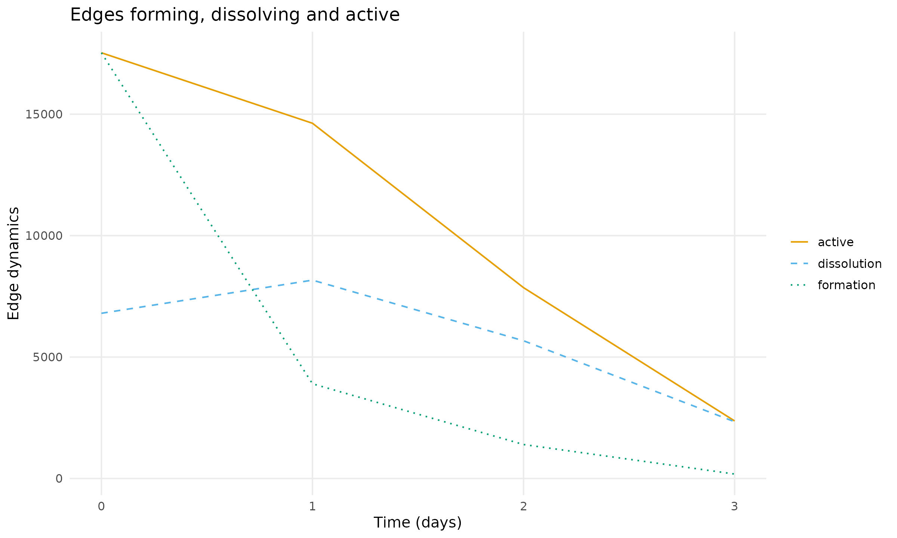

### Whole-window network through cograph

The union of everything that was ever active, drawn by cograph with
Dynet’s rendering defaults; `layout` is the only choice made here.

``` r

plot(dn, type = "network", layout = "oval")
```

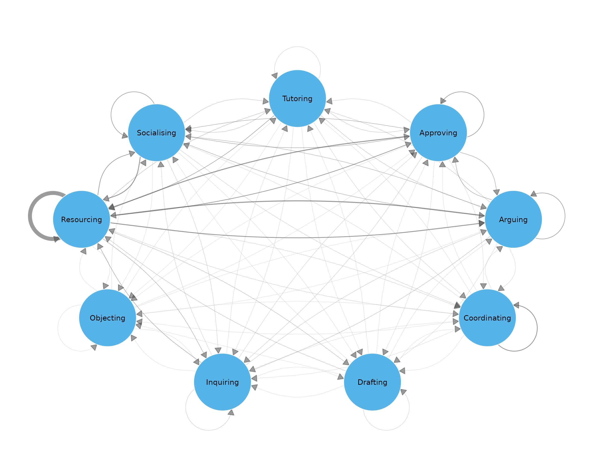

### Duration-weighted collapsed network

The binary union above treats a tie that lived one hour like a tie that
lived five days. `collapse_network(weight = "union_duration")` weights
each pair by the total time it was active instead, which is the
aggregate the original analysis approximated by setting `edge.lwd` from
[`tiedDuration()`](https://rdrr.io/pkg/tsna/man/tiedDuration.html).

``` r

collapsed <- collapse_network(dn, weight = "union_duration")
plot(collapsed, layout = "oval")
```


### Temporal snapshots

Nine equally spaced cross-sections of the same network, the static-panel
view of the process.

``` r

plot(dn, type = "snapshots", panels = 9)
```


### Proximity timeline with phase networks

`Visualize.Rmd` drew `proximity.timeline()` at `time.increment = 0.1` to
show codes drifting together and apart. Dynet’s proximity view is the
same idea: each code is a line whose vertical position tracks its
distance from the others, sliced finely and annotated here with five
phase networks.

``` r

plot(dn, type = "proximity", phases = 5, slices = 80)
```

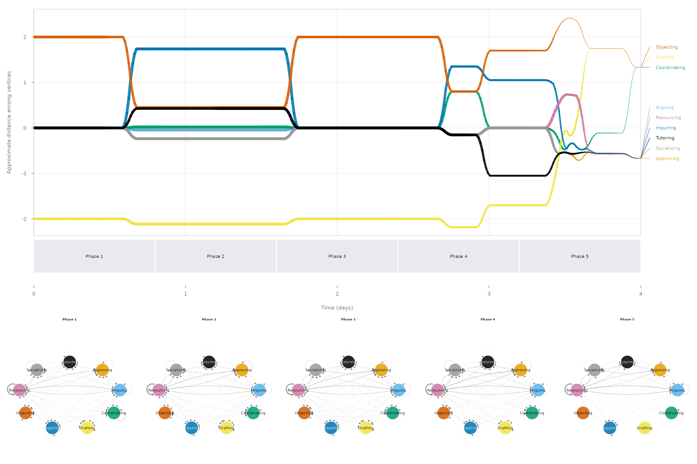

### Proximity trajectories alone

The same construction driven by betweenness instead of degree, without
the phase networks.

``` r

plot(dn, type = "proximity", measure = "betweenness",
     networks = FALSE, slices = 80)
```


## Multilayer views of the sliced network

The original pipeline had no multilayer view: `ndtv` drew the process as
a proximity timeline and as animated snapshots, and the code-by-code
structure was read off aggregate matrices. Cutting the window into
slices and treating each slice as a layer of one multilayer network
shows both at once — who was talking to whom, and when.

Each slice carries the full code set, so a code keeps its identity
across the stack. The slicing, the supra-adjacency, the layer membership
and the display labels are assembled by the package.

### Node-link layers

Three slices of the four-day window, each a plane of the same nine
codes.

``` r

plot(dn, type = "layers", step = 4 / 3, layout = "circle")
```


`omega` weights the identity arcs carrying a code from one slice to the
next — the interlayer coupling. Zero leaves the slices independent.

``` r

plot(dn, type = "layers", step = 4 / 3, omega = 0)
```


### Heatmap planes

The same slices as matrices rather than diagrams. Row and column names
are drawn once against the front plane, so a cell reads as a code pair
rather than an anonymous square.

``` r

plot(dn, type = "heatmap", step = 4 / 3)
```

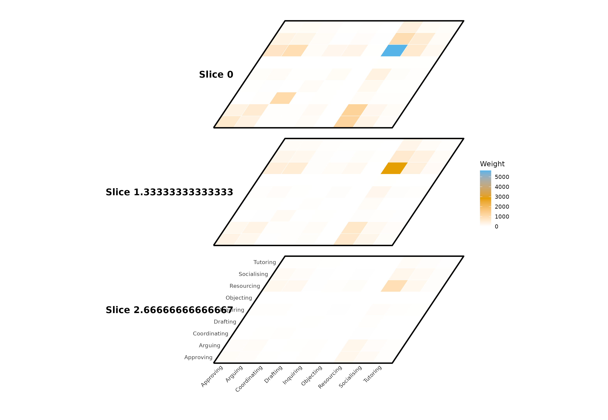

Thresholded, so only substantial transitions carry ink:

``` r

plot(dn, type = "heatmap", step = 4 / 3, threshold = 50)
```


At the hourly step used for the heatmaps below, the four days split into
96 slices. That is the right resolution for a grid or a line, and too
many planes to read as a stack — shown here so the limit is visible
rather than asserted.

``` r

plot(dn, type = "heatmap", step = 1 / 24, show_node_labels = FALSE)
```

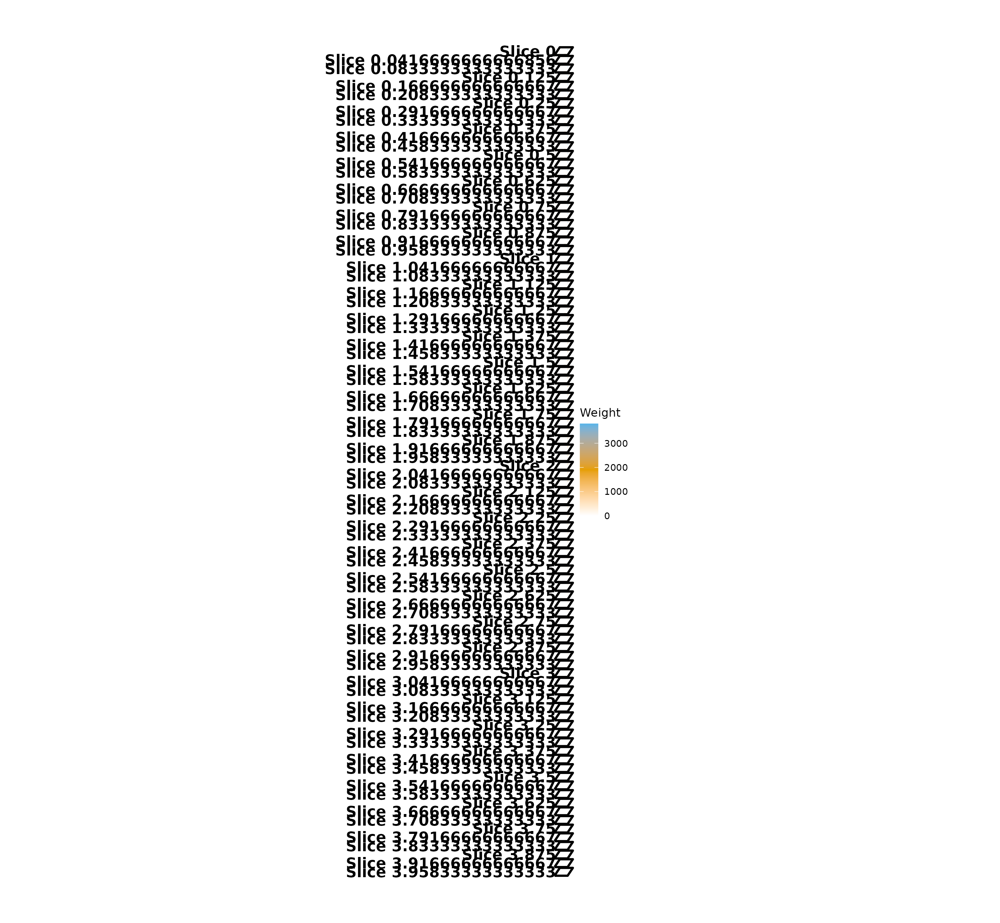

### Projected stack

[`cograph::plot_temporal()`](https://sonsoles.me/cograph/reference/plot_temporal.html)’s
oblique projection, with one colour per code held across every plane.
Empty windows are drawn rather than skipped, so a gap in the process is
visible as a gap.

``` r

plot(dn, type = "stack", step = 4 / 3)
```

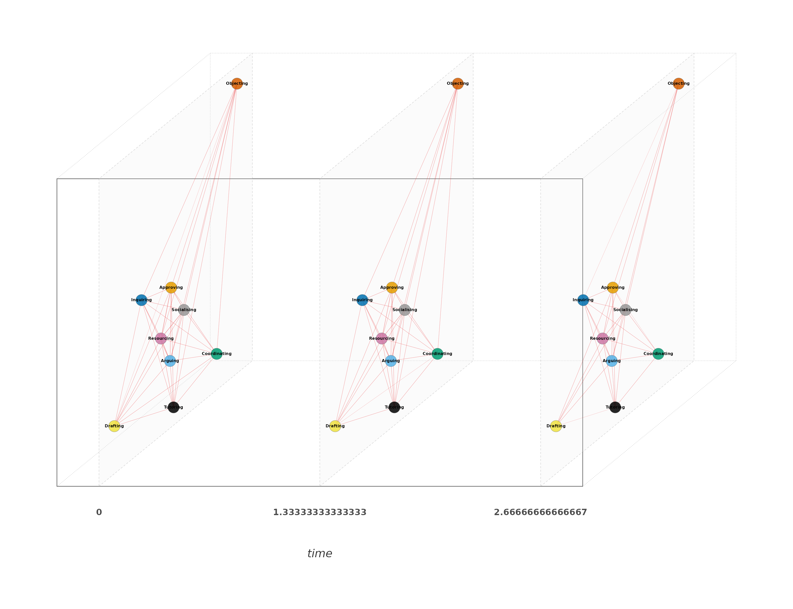

Cumulative, so each plane carries everything that has happened up to it:

``` r

plot(dn, type = "stack", step = 4 / 3, cumulative = TRUE)
```


## Graph-level trajectories

### Main structural descriptives

The original scripts collected these one call at a time and
[`cbind()`](https://rdrr.io/r/base/cbind.html)-ed the results into a
wide matrix.
[`metrics()`](https://pak.dynasite.org/Dynet/reference/metrics.md) takes
the whole set in one call and returns one tidy row per time point and
measure.

``` r

graph_main <- metrics(
  dn,
  measure = c(
    "density", "efficiency", "connectedness", "reciprocity",
    "edges", "mean_degree"
  ),
  step = 1 / 24, window = 1 / 24
)
graph_main
```

    ## # Graph structure (graph-level)
    ## # 96 time points, 0.04166667 per bin | time in days
    ## # measures: density, efficiency, connectedness, reciprocity, edges, mean_degree
    ##        time       measure      value
    ##  0.00000000       density  0.7916667
    ##  0.00000000    efficiency  0.2343750
    ##  0.00000000 connectedness  1.0000000
    ##  0.00000000   reciprocity  0.9122807
    ##  0.00000000         edges 57.0000000
    ##  0.00000000   mean_degree  6.3333333
    ##  0.04166667       density  0.8194444
    ##  0.04166667    efficiency  0.2031250
    ##  0.04166667 connectedness  1.0000000
    ##  0.04166667   reciprocity  0.9152542
    ##  0.04166667         edges 59.0000000
    ##  0.04166667   mean_degree  6.5555556
    ## # 564 more rows. summary() aggregates them; plot() draws them.

``` r

plot(graph_main, type = "ridge")
```

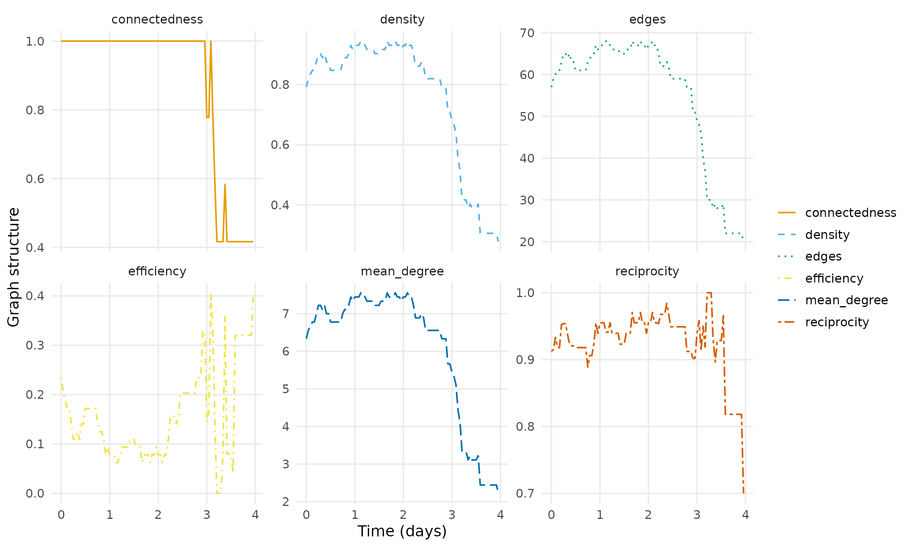

`reciprocity` here is the edgewise reciprocity — the share of arcs that
are reciprocated — which is what
`tSnaStats("grecip", measure = "edgewise")` returned in
`Centralities_trees.Rmd`. The study also reported
`tSnaStats("mutuality")`, the raw count of mutual dyads; that count is
the `mutual` column of the dyad census below.

### Dyad census

``` r

dyads <- metrics(
  dn, measure = c("mutual", "asymmetric", "null"),
  step = 1 / 24, window = 1 / 24
)
dyads
```

    ## # Graph structure (graph-level)
    ## # 96 time points, 0.04166667 per bin | time in days
    ## # measures: mutual, asymmetric, null
    ##        time    measure value
    ##  0.00000000     mutual    26
    ##  0.00000000 asymmetric     5
    ##  0.00000000       null     5
    ##  0.04166667     mutual    27
    ##  0.04166667 asymmetric     5
    ##  0.04166667       null     4
    ##  0.08333333     mutual    28
    ##  0.08333333 asymmetric     4
    ##  0.08333333       null     4
    ##  0.12500000     mutual    28
    ##  0.12500000 asymmetric     5
    ##  0.12500000       null     3
    ## # 276 more rows. summary() aggregates them; plot() draws them.

``` r

plot(dyads)
```

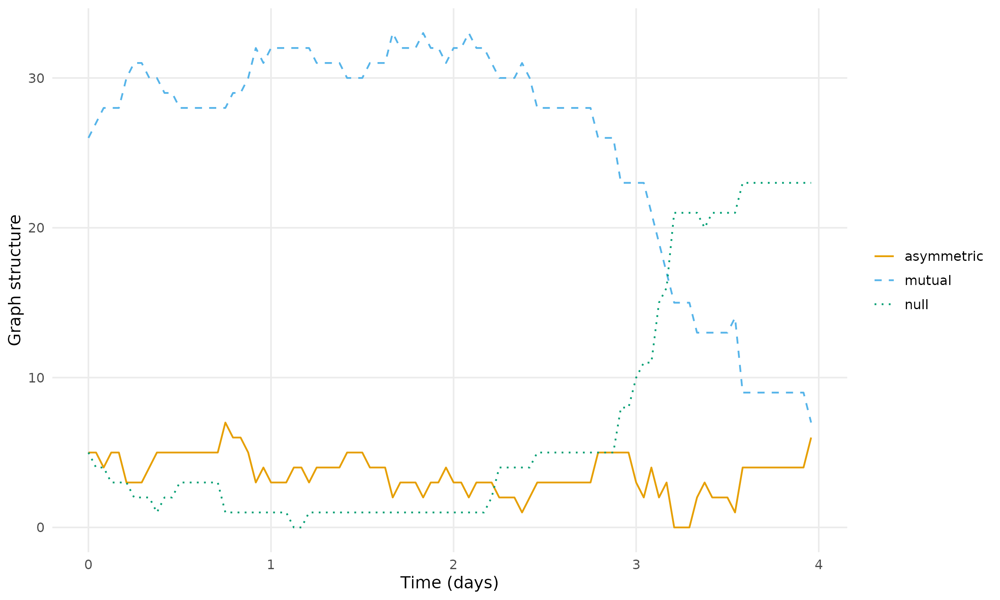

### Triad census

`Centralities_trees.Rmd` swept a triad census with
`tSnaStats("triad.census")`. Dynet returns the same sixteen MAN triad
types, one row per type per time point, drawn here as a heatmap.

``` r

triads <- metrics(dn, measure = "triads", step = 1 / 24, window = 1 / 24)
triads
```

    ## # Triad census (graph-level)
    ## # 96 time points, 0.04166667 per bin | time in days
    ## # measures: triad_003, triad_012, triad_102, triad_021D, triad_021U, triad_021C, triad_111D, triad_111U, triad_030T, triad_030C, triad_201, triad_120D, triad_120U, triad_120C, triad_210, triad_300
    ##  time    measure value
    ##     0  triad_003     0
    ##     0  triad_012     1
    ##     0  triad_102     9
    ##     0 triad_021D     0
    ##     0 triad_021U     0
    ##     0 triad_021C     0
    ##     0 triad_111D     0
    ##     0 triad_111U     8
    ##     0 triad_030T     0
    ##     0 triad_030C     0
    ##     0  triad_201     7
    ##     0 triad_120D     3
    ## # 1524 more rows. summary() aggregates them; plot() draws them.

``` r

plot(triads, type = "heatmap")
```

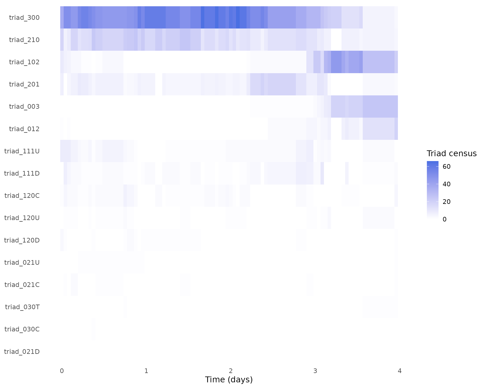

### Lightweight ERGM-style descriptives

The counterparts of the study’s
[`tErgmStats()`](https://rdrr.io/pkg/tsna/man/tErgmStats.html) terms —
`idegree1.5`, `odegree1.5`, `triangle` — plus the two-star and two-path
counts that describe how the local structure builds up.

``` r

ergm_descriptives <- metrics(
  dn,
  measure = c(
    "indegree_1_5", "outdegree_1_5", "triangles",
    "in_2stars", "out_2stars", "two_paths"
  ),
  step = 1 / 24, window = 1 / 24
)
ergm_descriptives
```

    ## # Graph structure (graph-level)
    ## # 96 time points, 0.04166667 per bin | time in days
    ## # measures: indegree_1_5, outdegree_1_5, triangles, in_2stars, out_2stars, two_paths
    ##        time       measure    value
    ##  0.00000000  indegree_1_5 146.3021
    ##  0.00000000 outdegree_1_5 148.0187
    ##  0.00000000     triangles 376.0000
    ##  0.00000000     in_2stars 161.0000
    ##  0.00000000    out_2stars 166.0000
    ##  0.00000000     two_paths 325.0000
    ##  0.04166667  indegree_1_5 155.0977
    ##  0.04166667 outdegree_1_5 155.3815
    ##  0.04166667     triangles 436.0000
    ##  0.04166667     in_2stars 176.0000
    ##  0.04166667    out_2stars 177.0000
    ##  0.04166667     two_paths 356.0000
    ## # 564 more rows. summary() aggregates them; plot() draws them.

``` r

plot(ergm_descriptives, type = "ridge")
```

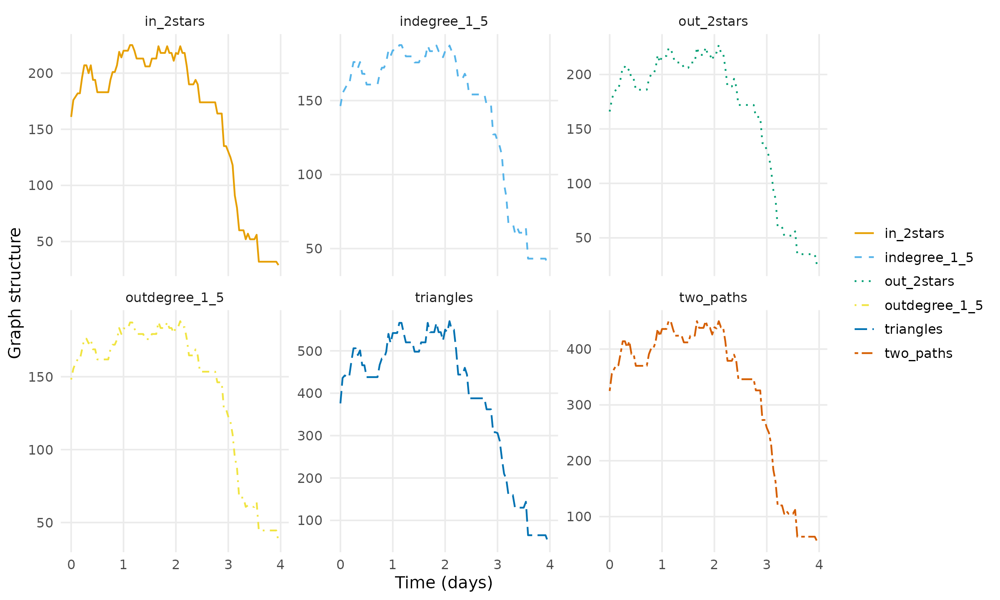

## Node-level trajectories

### Centrality

The original centrality section was four `while` loops that called
[`tSnaStats()`](https://rdrr.io/pkg/tsna/man/tSnaStats.html) once per
measure, transposed each result, and stitched the pieces back together
with [`cbind()`](https://rdrr.io/r/base/cbind.html) and
[`rbind()`](https://rdrr.io/r/base/cbind.html) into
`Centralities_Combined_rounded.xlsx`. Here the same five measures —
degree, closeness, betweenness, eigenvector, flow betweenness — plus
diffusion degree (the study computed that one separately, with
`centiserve`, and only on the aggregate) come from a single call that
already returns them tidily.

``` r

centrality <- dyn_centrality(
  dn,
  measure = c(
    "degree", "closeness", "betweenness", "eigenvector",
    "flow_betweenness", "diffusion"
  ),
  step = 1 / 24, window = 1 / 24
)
centrality
```

    ## # Centrality (node-level)
    ## # 9 vertices | 96 time points, 0.04166667 per bin | time in days
    ## # measures: degree, closeness, betweenness, eigenvector, flow_betweenness, diffusion
    ##  time         node   measure      value
    ##     0    Approving    degree 14.0000000
    ##     0      Arguing    degree 17.0000000
    ##     0 Coordinating    degree 15.0000000
    ##     0     Drafting    degree 15.0000000
    ##     0    Inquiring    degree 15.0000000
    ##     0    Objecting    degree  7.0000000
    ##     0   Resourcing    degree 16.0000000
    ##     0  Socialising    degree 18.0000000
    ##     0     Tutoring    degree 15.0000000
    ##     0    Approving closeness  0.8888889
    ##     0      Arguing closeness  1.0000000
    ##     0 Coordinating closeness  0.8888889
    ## # 5172 more rows. summary() aggregates them; plot() draws them.

``` r

plot(centrality, type = "heatmap")
```


``` r

plot(centrality, type = "ridge", top = 10)
```

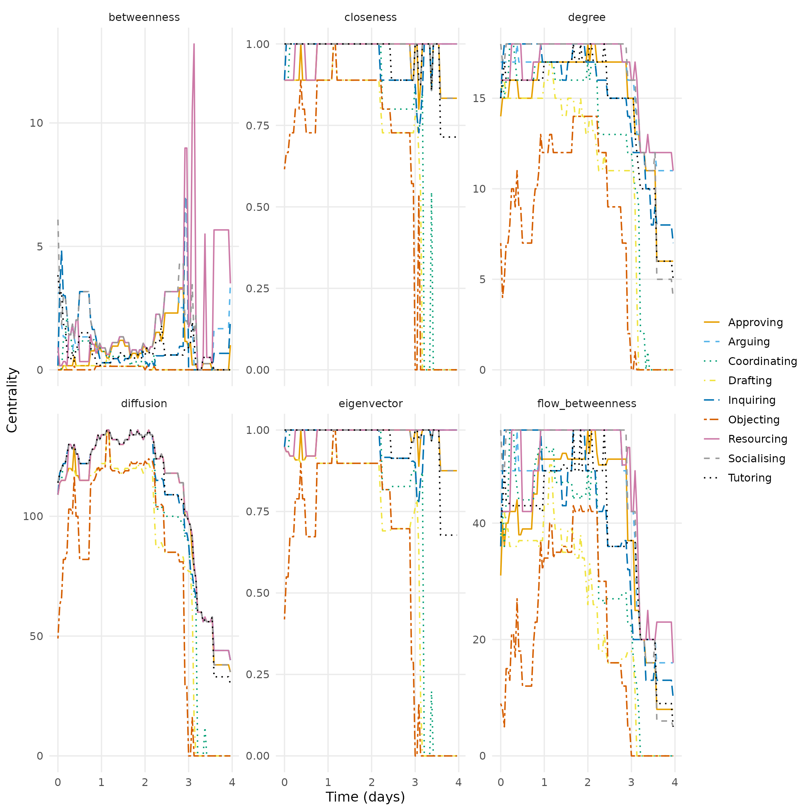

### In-degree and out-degree

The study ran separate loops with `cmode = "indegree"` and
`cmode = "outdegree"`; in Dynet the direction is the `mode` argument.

``` r

directed_degree <- dyn_centrality(
  dn, measure = "degree", mode = "in",
  step = 1 / 24, window = 1 / 24
)
out_degree <- dyn_centrality(
  dn, measure = "degree", mode = "out",
  step = 1 / 24, window = 1 / 24
)
plot(directed_degree, type = "heatmap")
```


``` r

plot(out_degree, type = "heatmap")
```


### Prestige

The four prestige variants the study looped over — `indegree`,
`eigenvector`, `domain` and `domain.proximity` — are the four values of
the `prestige` argument.

``` r

prestige_indegree <- dyn_centrality(
  dn, measure = "prestige", prestige = "indegree",
  step = 1 / 24, window = 1 / 24
)
prestige_eigenvector <- dyn_centrality(
  dn, measure = "prestige", prestige = "eigenvector",
  step = 1 / 24, window = 1 / 24
)
prestige_domain <- dyn_centrality(
  dn, measure = "prestige", prestige = "domain",
  step = 1 / 24, window = 1 / 24
)
prestige_proximity <- dyn_centrality(
  dn, measure = "prestige", prestige = "domain.proximity",
  step = 1 / 24, window = 1 / 24
)
plot(prestige_indegree, type = "heatmap")
```


``` r

plot(prestige_eigenvector, type = "heatmap")
```


``` r

plot(prestige_domain, type = "heatmap")
```

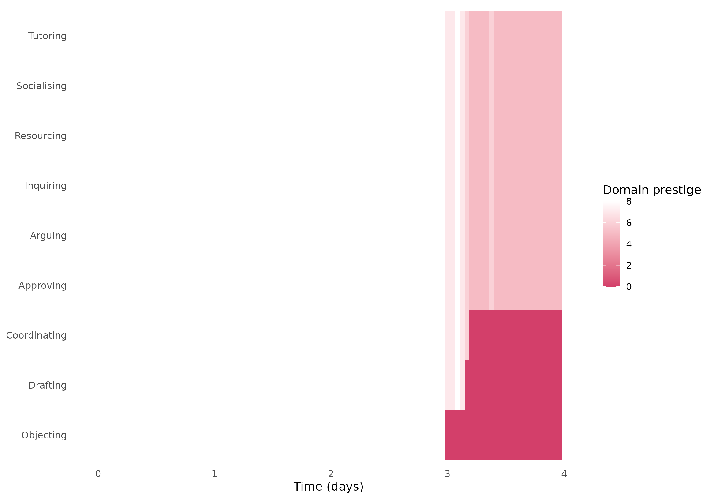

``` r

plot(prestige_proximity, type = "heatmap")
```

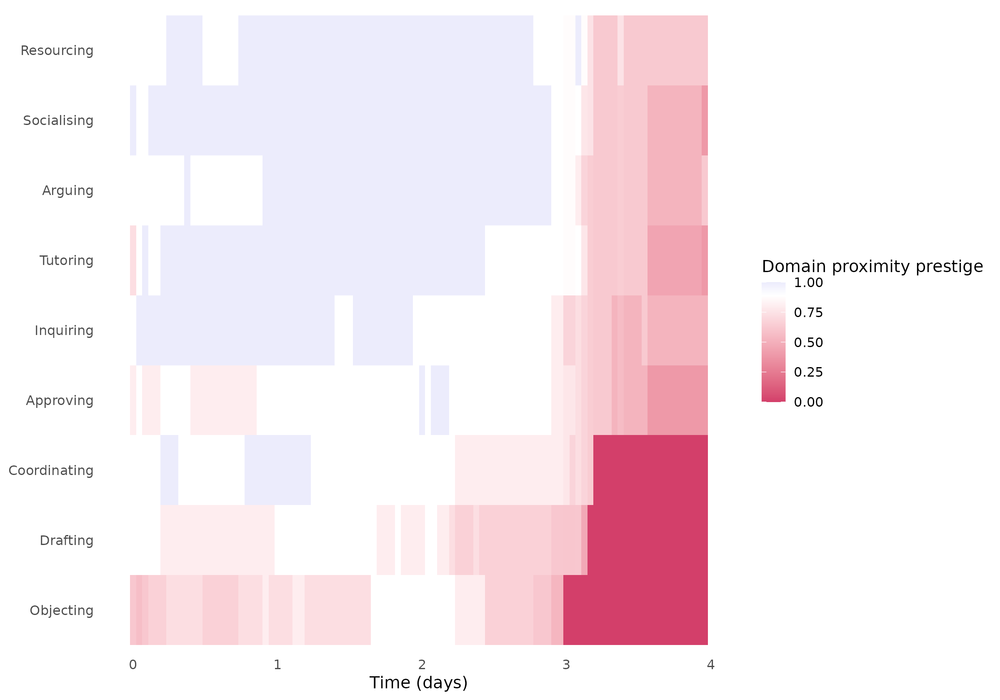

## Code-to-code mixing

`tErgmStats('nodemix("Name")')` produced one column per ordered pair of
codes, which the original scripts then had to un-widen and re-aggregate
by hand.
[`mixing()`](https://pak.dynasite.org/Dynet/reference/mixing.md) returns
the same 9 x 9 flows already long, one row per time point and per
ordered pair.

``` r

mixing_flows <- mixing(dn, attribute = "name", step = 1 / 24, window = 1 / 24)
mixing_flows
```

    ## # Mixing by name (graph-level)
    ## # 96 time points, 0.04166667 per bin | time in days
    ## # measures: Approving -> Approving, Arguing -> Approving, Coordinating -> Approving, Drafting -> Approving, Inquiring -> Approving, Objecting -> Approving, Resourcing -> Approving, Socialising -> Approving, Tutoring -> Approving, Approving -> Arguing, Arguing -> Arguing, Coordinating -> Arguing, Drafting -> Arguing, Inquiring -> Arguing, Objecting -> Arguing, Resourcing -> Arguing, Socialising -> Arguing, Tutoring -> Arguing, Approving -> Coordinating, Arguing -> Coordinating, Coordinating -> Coordinating, Drafting -> Coordinating, Inquiring -> Coordinating, Objecting -> Coordinating, Resourcing -> Coordinating, Socialising -> Coordinating, Tutoring -> Coordinating, Approving -> Drafting, Arguing -> Drafting, Coordinating -> Drafting, Drafting -> Drafting, Inquiring -> Drafting, Objecting -> Drafting, Resourcing -> Drafting, Socialising -> Drafting, Tutoring -> Drafting, Approving -> Inquiring, Arguing -> Inquiring, Coordinating -> Inquiring, Drafting -> Inquiring, Inquiring -> Inquiring, Objecting -> Inquiring, Resourcing -> Inquiring, Socialising -> Inquiring, Tutoring -> Inquiring, Approving -> Objecting, Arguing -> Objecting, Coordinating -> Objecting, Drafting -> Objecting, Inquiring -> Objecting, Objecting -> Objecting, Resourcing -> Objecting, Socialising -> Objecting, Tutoring -> Objecting, Approving -> Resourcing, Arguing -> Resourcing, Coordinating -> Resourcing, Drafting -> Resourcing, Inquiring -> Resourcing, Objecting -> Resourcing, Resourcing -> Resourcing, Socialising -> Resourcing, Tutoring -> Resourcing, Approving -> Socialising, Arguing -> Socialising, Coordinating -> Socialising, Drafting -> Socialising, Inquiring -> Socialising, Objecting -> Socialising, Resourcing -> Socialising, Socialising -> Socialising, Tutoring -> Socialising, Approving -> Tutoring, Arguing -> Tutoring, Coordinating -> Tutoring, Drafting -> Tutoring, Inquiring -> Tutoring, Objecting -> Tutoring, Resourcing -> Tutoring, Socialising -> Tutoring, Tutoring -> Tutoring
    ## # active binary-dyad counts between vertex groups per time bin
    ##  time                   measure value   from_group  to_group
    ##     0    Approving -> Approving     1    Approving Approving
    ##     0      Arguing -> Approving     1      Arguing Approving
    ##     0 Coordinating -> Approving     0 Coordinating Approving
    ##     0     Drafting -> Approving     1     Drafting Approving
    ##     0    Inquiring -> Approving     1    Inquiring Approving
    ##     0    Objecting -> Approving     0    Objecting Approving
    ##     0   Resourcing -> Approving     1   Resourcing Approving
    ##     0  Socialising -> Approving     1  Socialising Approving
    ##     0     Tutoring -> Approving     1     Tutoring Approving
    ##     0      Approving -> Arguing     1    Approving   Arguing
    ##     0        Arguing -> Arguing     1      Arguing   Arguing
    ##     0   Coordinating -> Arguing     1 Coordinating   Arguing
    ## # 7764 more rows. summary() aggregates them; plot() draws them.

``` r

plot(mixing_flows, type = "heatmap")
```


The original scripts then pulled out the mixing columns that involved
regulation (`select(contains("reg"))`, which caught both
`Group_regulation` and `T.Regulation`, here `Coordinating` and
`Tutoring`). The highlight below narrows that to the coordinating flows,
which keeps the lines distinguishable. The result carries `from_group`
and `to_group` columns, so the selection is a
[`subset()`](https://rdrr.io/r/base/subset.html) of the returned table
handed straight back to the plot method; no mixing statistic is rebuilt
here.

``` r

group_regulation_flows <- with(
  subset(as.data.frame(mixing_flows),
         from_group == "Coordinating" | to_group == "Coordinating"),
  unique(measure)
)
plot(mixing_flows, highlight = group_regulation_flows)
```

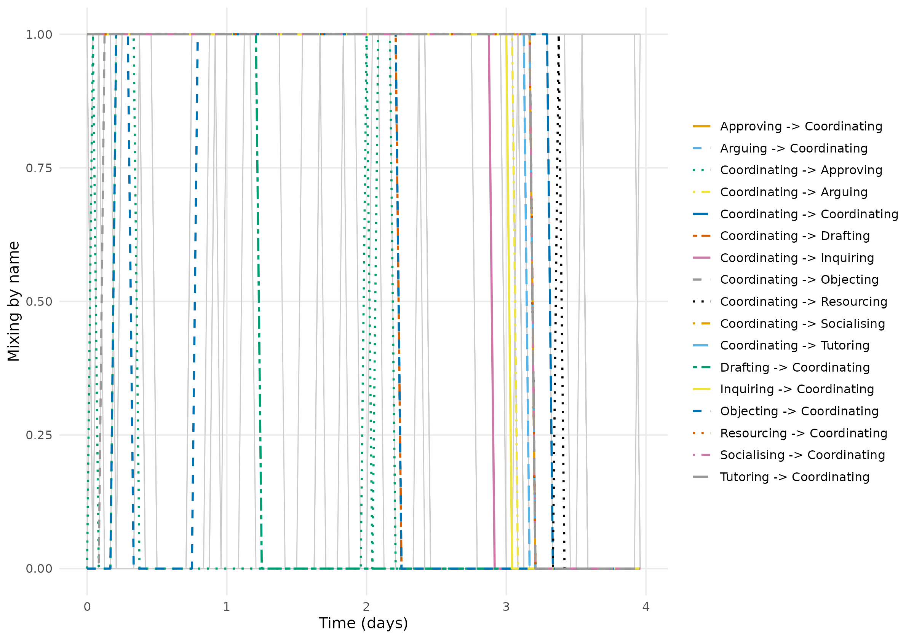

## Tie and vertex duration

### Incident tie counts and durations by node

[`tiedDuration()`](https://rdrr.io/pkg/tsna/man/tiedDuration.html) was
called six times in `Visualize.Rmd` — count and duration, crossed with
the `in`, `out` and `combined` neighbourhoods — and the six vectors were
[`cbind()`](https://rdrr.io/r/base/cbind.html)-ed into a table.
`durations(unit = "node_ties")` gives the same quantities per node, with
`mode` selecting the neighbourhood and `measure` selecting event count,
total duration, or the union of active time (which, unlike the total,
does not double-count overlapping spells).

``` r

node_ties_all <- durations(
  dn, unit = "node_ties", mode = "all",
  measure = c("events", "total", "union")
)
node_ties_in <- durations(
  dn, unit = "node_ties", mode = "in",
  measure = c("events", "total", "union")
)
node_ties_out <- durations(
  dn, unit = "node_ties", mode = "out",
  measure = c("events", "total", "union")
)
plot(node_ties_all)
```


``` r

plot(node_ties_in)
```


``` r

plot(node_ties_out)
```

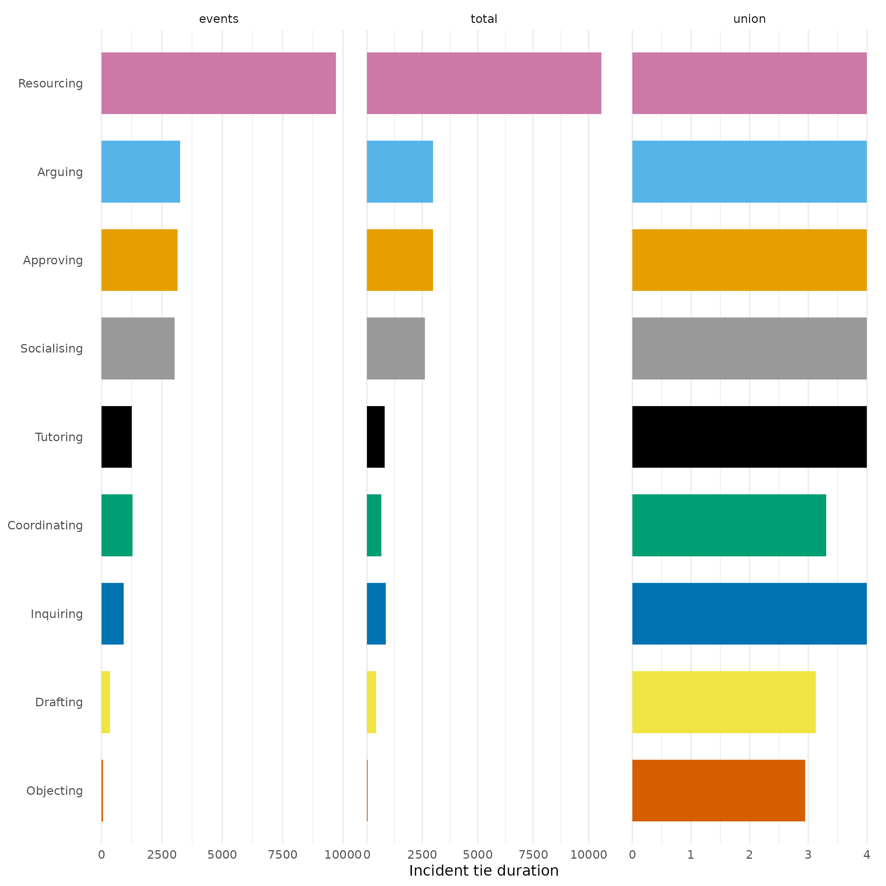

### Edge-pair duration

The same accounting one level down, per ordered pair of codes, with the
mean spell length added.

``` r

pair_duration <- durations(
  dn, unit = "pair",
  measure = c("events", "total", "union", "mean")
)
pair_duration
```

    ## # Relationship duration (edge-level)
    ## # time in days
    ## # measures: events, mean, total, union
    ## # durations in days
    ##       from           to measure value
    ##  Approving    Approving  events   719
    ##  Approving      Arguing  events   417
    ##  Approving Coordinating  events    30
    ##  Approving     Drafting  events    30
    ##  Approving    Inquiring  events   110
    ##  Approving    Objecting  events     4
    ##  Approving   Resourcing  events  1353
    ##  Approving  Socialising  events   385
    ##  Approving     Tutoring  events   100
    ##    Arguing    Approving  events   415
    ##    Arguing      Arguing  events   670
    ##    Arguing Coordinating  events    44
    ## # 308 more rows. summary() aggregates them; plot() draws them.

``` r

plot(pair_duration)
```

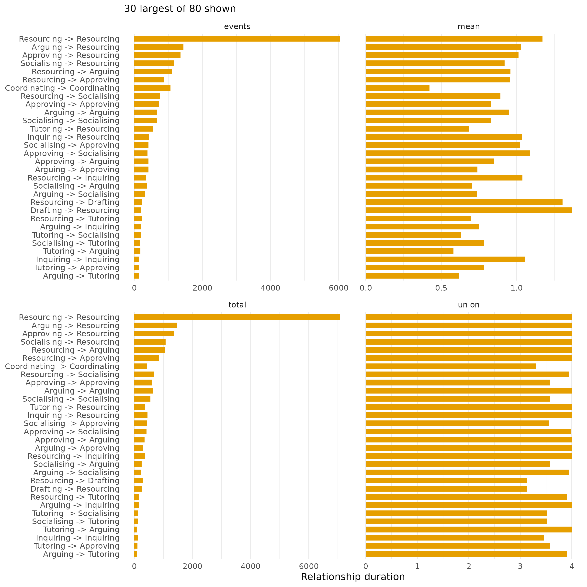

### Vertex activity duration

How long each code was itself active, as opposed to how long its ties
were.

``` r

vertex_duration <- durations(dn, unit = "vertex_activity")
vertex_duration
```

    ## # Vertex activity duration (node-level)
    ## # 9 vertices | time in days
    ## # measures: events, total, union
    ## # durations in days
    ##          node measure value
    ##     Approving  events     1
    ##       Arguing  events     1
    ##  Coordinating  events     1
    ##      Drafting  events     1
    ##     Inquiring  events     1
    ##     Objecting  events     1
    ##    Resourcing  events     1
    ##   Socialising  events     1
    ##      Tutoring  events     1
    ##     Approving   total     4
    ##       Arguing   total     4
    ##  Coordinating   total     4
    ## # 15 more rows. summary() aggregates them; plot() draws them.

``` r

plot(vertex_duration)
```

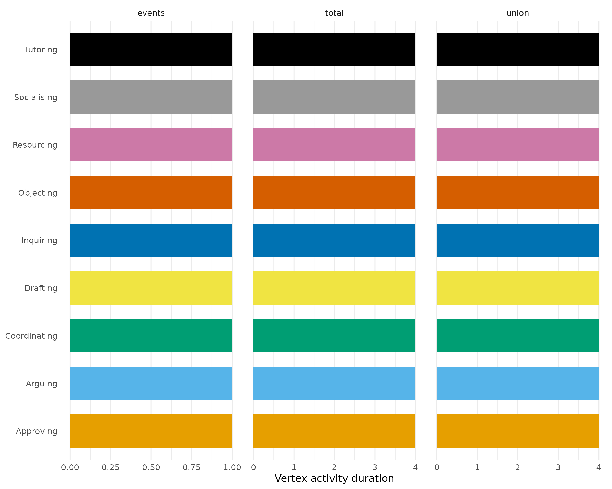

## Temporal reachability and centrality

[`tReach()`](https://rdrr.io/pkg/tsna/man/reachable_set_sizes.html) was
used to count, for each code, how many other codes it could reach along
time-respecting paths within a window.
[`dyn_reachability()`](https://pak.dynasite.org/Dynet/reference/dyn_reachability.md)
answers the same question in both directions at once, and
`dyn_centrality(scope = "temporal")` returns the path-based measures
computed on the time-respecting paths themselves rather than on a
snapshot.

``` r

reachability <- dyn_reachability(
  dn, direction = "both", measure = c("reach", "reach_count")
)
reachability
```

    ## # Reachability (node-level)
    ## # 9 vertices | time in days
    ## # measures: forward_reach, forward_reach_count, backward_reach, backward_reach_count
    ## # count and share of other vertices joined by a time-respecting path
    ##          node             measure value
    ##     Approving       forward_reach     1
    ##       Arguing       forward_reach     1
    ##  Coordinating       forward_reach     1
    ##      Drafting       forward_reach     1
    ##     Inquiring       forward_reach     1
    ##     Objecting       forward_reach     1
    ##    Resourcing       forward_reach     1
    ##   Socialising       forward_reach     1
    ##      Tutoring       forward_reach     1
    ##     Approving forward_reach_count     8
    ##       Arguing forward_reach_count     8
    ##  Coordinating forward_reach_count     8
    ## # 24 more rows. summary() aggregates them; plot() draws them.

``` r

plot(reachability)
```


``` r

temporal_centrality <- dyn_centrality(
  dn,
  measure = c("closeness", "betweenness", "reach", "reach_count"),
  scope = "temporal"
)
```

    ## Warning: Zero-latency reachable sets make temporal closeness infinite; set a
    ## positive `traversal_time`.

``` r

temporal_centrality
```

    ## # Temporal centrality (node-level)
    ## # 9 vertices | time in days
    ## # measures: closeness, betweenness, reach, reach_count
    ## # computed on time-respecting paths across the whole window
    ##          node     measure     value
    ##     Approving   closeness       Inf
    ##       Arguing   closeness       Inf
    ##  Coordinating   closeness       Inf
    ##      Drafting   closeness       Inf
    ##     Inquiring   closeness       Inf
    ##     Objecting   closeness       Inf
    ##    Resourcing   closeness       Inf
    ##   Socialising   closeness       Inf
    ##      Tutoring   closeness       Inf
    ##     Approving betweenness 0.4444444
    ##       Arguing betweenness 0.5705128
    ##  Coordinating betweenness 0.4583333
    ## # 24 more rows. summary() aggregates them; plot() draws them.

``` r

plot(temporal_centrality)
```

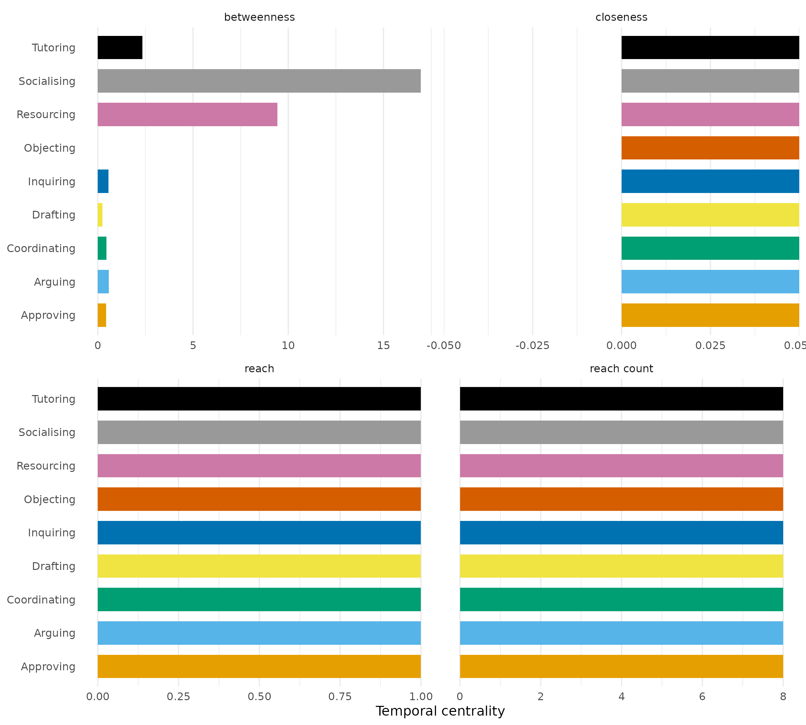

## Forward temporal paths from every code

`Visualize.Rmd` looped over the codes with
`tPath(direction = "fwd", type = "earliest.arrive", graph.step.time = 0.1)`
and drew three pictures per code.
[`paths()`](https://pak.dynasite.org/Dynet/reference/paths.md) answers
the same query — Dynet receives that traversal cost as
`traversal_time = 0.1`, one tenth of a day per hop — and returns one
tidy object per source.

Before the atlas, one source in full, to show what the objects contain.

``` r

inquiring_paths <- paths(
  dn, from = "Inquiring", direction = "forward", traversal_time = 0.1
)
inquiring_paths
```

    ## # Time-respecting paths from 'Inquiring', from t = 0
    ## # reaches 8 of 8 other vertices | time in days
    ## # routes are endpoint-specific session-integral optima, not one predecessor tree
    ## # traversal 0.1 days per hop
    ##          node reachable arrival_time attained   latency n_hops n_paths
    ##     Approving      TRUE    0.1077083     TRUE 0.1077083      1       1
    ##       Arguing      TRUE    0.1000000     TRUE 0.1000000      1       5
    ##  Coordinating      TRUE    0.1052199     TRUE 0.1052199      1       1
    ##      Drafting      TRUE    0.1000000     TRUE 0.1000000      1       2
    ##     Inquiring      TRUE    0.0000000     TRUE 0.0000000      0       1
    ##     Objecting      TRUE    0.1891667     TRUE 0.1891667      1       1
    ##    Resourcing      TRUE    0.1000000     TRUE 0.1000000      1       9
    ##   Socialising      TRUE    0.1000000     TRUE 0.1000000      1       2
    ##      Tutoring      TRUE    0.1530208     TRUE 0.1530208      1       1
    ##  path_session n_best_sessions
    ##             C               1
    ##          <NA>               4
    ##             D               1
    ##          <NA>               2
    ##          <NA>               0
    ##             C               1
    ##          <NA>               5
    ##          <NA>               2
    ##             A               1

``` r

path_trajectories(inquiring_paths)
```

    ## # Forward temporal trajectory tree from Inquiring
    ## # 9 nodes, 1 hops deep, 23 routes
    ##                                         node      parent depth count
    ## 1                                Inquiring@0        <NA>     0    23
    ## 2    Inquiring@0 -> Approving@0.107708333333 Inquiring@0     1     1
    ## 3                 Inquiring@0 -> Arguing@0.1 Inquiring@0     1     5
    ## 4 Inquiring@0 -> Coordinating@0.105219907408 Inquiring@0     1     1
    ## 5                Inquiring@0 -> Drafting@0.1 Inquiring@0     1     2
    ## 6    Inquiring@0 -> Objecting@0.189166666667 Inquiring@0     1     1
    ## 7              Inquiring@0 -> Resourcing@0.1 Inquiring@0     1     9
    ## 8             Inquiring@0 -> Socialising@0.1 Inquiring@0     1     2
    ## 9     Inquiring@0 -> Tutoring@0.153020833333 Inquiring@0     1     1
    ##   probability       vertex      time session branch
    ## 1          NA    Inquiring 0.0000000    <NA>    4.5
    ## 2  0.04347826    Approving 0.1077083    <NA>    8.0
    ## 3  0.21739130      Arguing 0.1000000    <NA>    7.0
    ## 4  0.04347826 Coordinating 0.1052199    <NA>    6.0
    ## 5  0.08695652     Drafting 0.1000000    <NA>    5.0
    ## 6  0.04347826    Objecting 0.1891667    <NA>    4.0
    ## 7  0.39130435   Resourcing 0.1000000    <NA>    3.0
    ## 8  0.08695652  Socialising 0.1000000    <NA>    2.0
    ## 9  0.04347826     Tutoring 0.1530208    <NA>    1.0

The printed table gives, per destination, the earliest attainable
arrival time, the latency from the source, the number of hops on the
optimal route, and how many distinct optimal routes achieve it.
[`path_trajectories()`](https://pak.dynasite.org/Dynet/reference/path_trajectories.md)
is the tidy tree behind the picture: one row per route prefix, so a code
reached under two different temporal histories is two rows and the
branches never cross misleadingly.

The atlas below repeats that for every code. Each panel is a
left-to-right trajectory tree: branch width and node size show how many
optimal routes use a branch, node fill shows the same count, and every
node prints its vertex name and value beneath its circle, so nothing is
carried by colour alone. The table above each tree is the path result
the tree is drawn from.

``` r

# A loop, not an apply: each iteration emits a section heading, a table and a
# plot into the asis stream in order, which is a sequence of side effects
# rather than a value to collect.
code_names <- with(as.data.frame(dn, what = "nodes"), name)
for (source_node in code_names) {
  cat("\n\n## ", source_node, "\n\n", sep = "")
  forward_paths <- paths(
    dn, from = source_node, direction = "forward", traversal_time = 0.1
  )
  print(knitr::kable(
    as.data.frame(forward_paths), digits = 3,
    caption = paste("Earliest-arrival paths from", source_node)
  ))
  cat("\n\n")
  print(plot_path_trajectories(
    forward_paths, measure = "frequency", orientation = "horizontal"
  ))
  cat("\n\n")
}
```

### Approving

| node | reachable | arrival_time | attained | latency | n_hops | n_paths | path_session | n_best_sessions |
|:---|:---|---:|:---|---:|---:|---:|:---|---:|
| Approving | TRUE | 0.000 | TRUE | 0.000 | 0 | 1 | NA | 0 |
| Arguing | TRUE | 0.100 | TRUE | 0.100 | 1 | 4 | NA | 4 |
| Coordinating | TRUE | 0.138 | TRUE | 0.138 | 1 | 1 | C | 1 |
| Drafting | TRUE | 0.100 | TRUE | 0.100 | 1 | 3 | NA | 2 |
| Inquiring | TRUE | 0.100 | TRUE | 0.100 | 1 | 2 | NA | 2 |
| Objecting | TRUE | 0.200 | TRUE | 0.200 | 2 | 1 | C | 1 |
| Resourcing | TRUE | 0.100 | TRUE | 0.100 | 1 | 7 | NA | 5 |
| Socialising | TRUE | 0.100 | TRUE | 0.100 | 1 | 2 | NA | 2 |
| Tutoring | TRUE | 0.200 | TRUE | 0.200 | 2 | 7 | NA | 3 |

Earliest-arrival paths from Approving {.table}

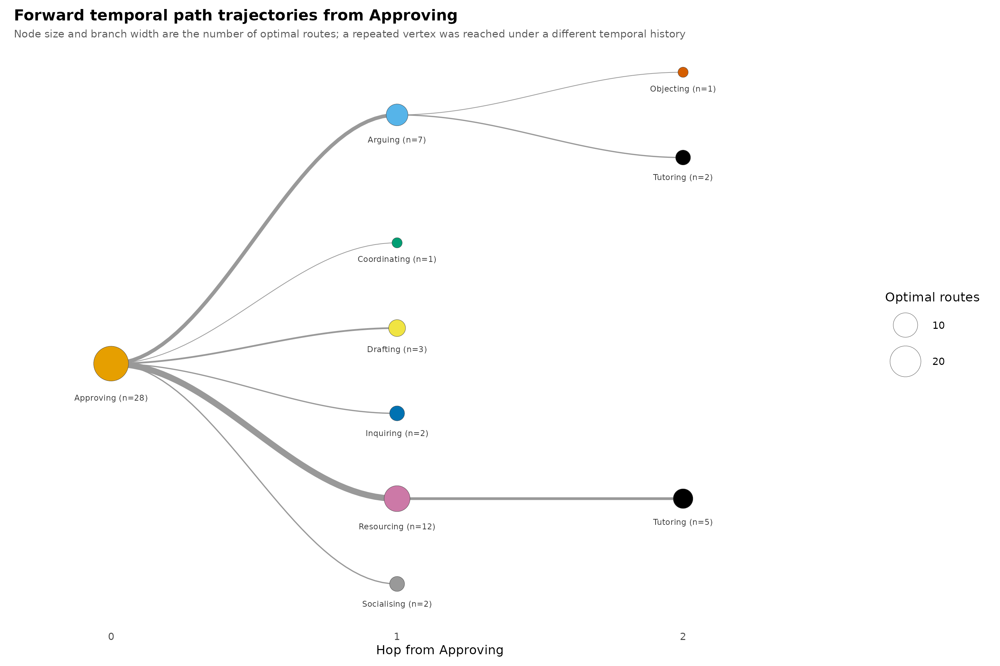

### Arguing

| node | reachable | arrival_time | attained | latency | n_hops | n_paths | path_session | n_best_sessions |
|:---|:---|---:|:---|---:|---:|---:|:---|---:|
| Approving | TRUE | 0.100 | TRUE | 0.100 | 1 | 3 | NA | 2 |
| Arguing | TRUE | 0.000 | TRUE | 0.000 | 0 | 1 | NA | 0 |
| Coordinating | TRUE | 0.105 | TRUE | 0.105 | 1 | 1 | D | 1 |
| Drafting | TRUE | 0.100 | TRUE | 0.100 | 1 | 3 | NA | 2 |
| Inquiring | TRUE | 0.100 | TRUE | 0.100 | 1 | 7 | NA | 4 |
| Objecting | TRUE | 0.122 | TRUE | 0.122 | 1 | 1 | C | 1 |
| Resourcing | TRUE | 0.100 | TRUE | 0.100 | 1 | 9 | NA | 5 |
| Socialising | TRUE | 0.100 | TRUE | 0.100 | 1 | 2 | NA | 2 |
| Tutoring | TRUE | 0.133 | TRUE | 0.133 | 1 | 1 | A | 1 |

Earliest-arrival paths from Arguing {.table}

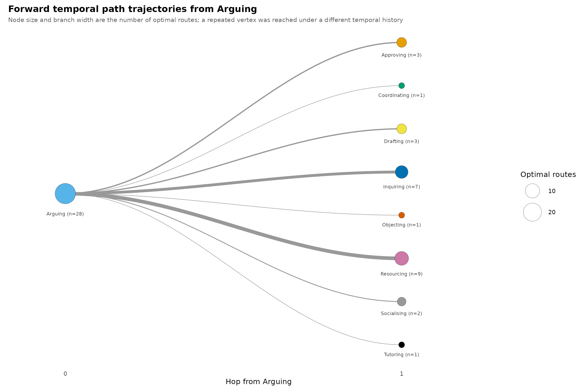

### Coordinating

| node | reachable | arrival_time | attained | latency | n_hops | n_paths | path_session | n_best_sessions |
|:---|:---|---:|:---|---:|---:|---:|:---|---:|
| Approving | TRUE | 0.146 | TRUE | 0.146 | 1 | 1 | C | 1 |
| Arguing | TRUE | 0.103 | TRUE | 0.103 | 1 | 1 | C | 1 |
| Coordinating | TRUE | 0.000 | TRUE | 0.000 | 0 | 1 | NA | 0 |
| Drafting | TRUE | 0.100 | TRUE | 0.100 | 1 | 1 | A | 1 |
| Inquiring | TRUE | 0.100 | TRUE | 0.100 | 1 | 1 | A | 1 |
| Objecting | TRUE | 0.203 | TRUE | 0.203 | 2 | 1 | C | 1 |
| Resourcing | TRUE | 0.100 | TRUE | 0.100 | 1 | 3 | NA | 2 |
| Socialising | TRUE | 0.100 | TRUE | 0.100 | 1 | 3 | NA | 2 |
| Tutoring | TRUE | 0.115 | TRUE | 0.115 | 1 | 1 | C | 1 |

Earliest-arrival paths from Coordinating {.table}

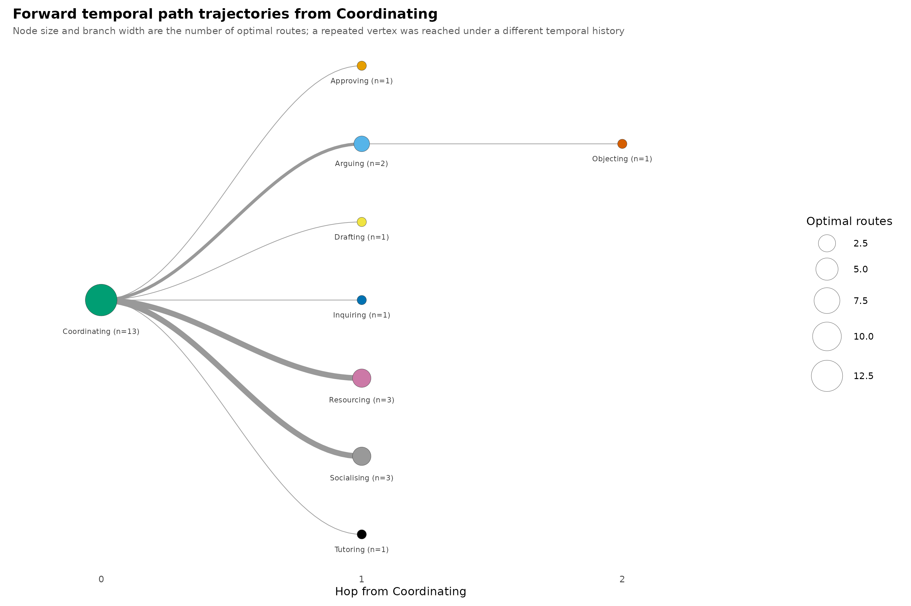

### Drafting

| node | reachable | arrival_time | attained | latency | n_hops | n_paths | path_session | n_best_sessions |
|:---|:---|---:|:---|---:|---:|---:|:---|---:|
| Approving | TRUE | 0.100 | TRUE | 0.100 | 1 | 2 | NA | 2 |
| Arguing | TRUE | 0.100 | TRUE | 0.100 | 1 | 3 | NA | 2 |
| Coordinating | TRUE | 0.141 | TRUE | 0.141 | 1 | 1 | E | 1 |
| Drafting | TRUE | 0.000 | TRUE | 0.000 | 0 | 1 | NA | 0 |
| Inquiring | TRUE | 0.100 | TRUE | 0.100 | 1 | 1 | A | 1 |
| Objecting | TRUE | 0.300 | TRUE | 0.300 | 3 | 10 | NA | 2 |
| Resourcing | TRUE | 0.100 | TRUE | 0.100 | 1 | 9 | NA | 5 |
| Socialising | TRUE | 0.100 | TRUE | 0.100 | 1 | 1 | A | 1 |
| Tutoring | TRUE | 0.200 | TRUE | 0.200 | 2 | 7 | NA | 3 |

Earliest-arrival paths from Drafting {.table}

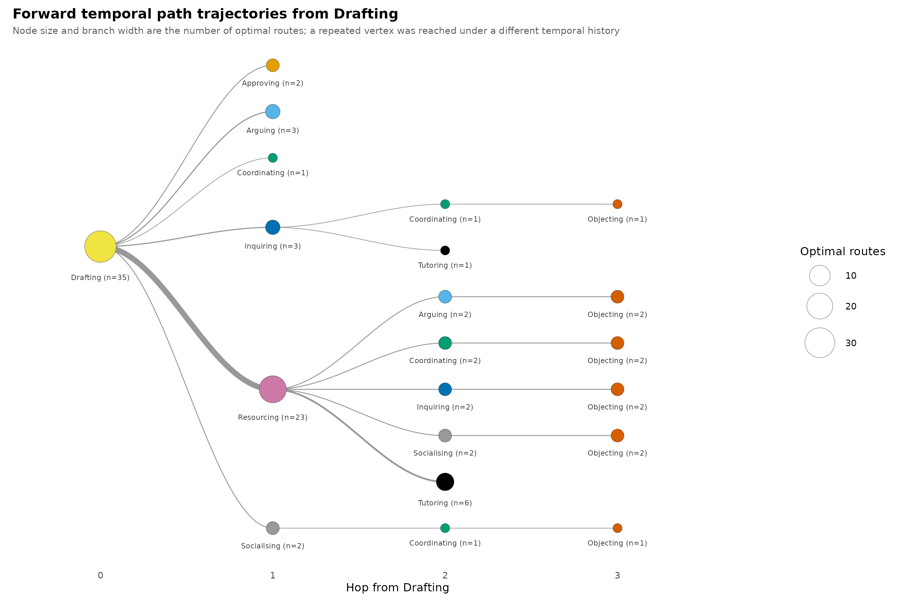

### Inquiring

| node | reachable | arrival_time | attained | latency | n_hops | n_paths | path_session | n_best_sessions |
|:---|:---|---:|:---|---:|---:|---:|:---|---:|
| Approving | TRUE | 0.108 | TRUE | 0.108 | 1 | 1 | C | 1 |
| Arguing | TRUE | 0.100 | TRUE | 0.100 | 1 | 5 | NA | 4 |
| Coordinating | TRUE | 0.105 | TRUE | 0.105 | 1 | 1 | D | 1 |
| Drafting | TRUE | 0.100 | TRUE | 0.100 | 1 | 2 | NA | 2 |
| Inquiring | TRUE | 0.000 | TRUE | 0.000 | 0 | 1 | NA | 0 |
| Objecting | TRUE | 0.189 | TRUE | 0.189 | 1 | 1 | C | 1 |
| Resourcing | TRUE | 0.100 | TRUE | 0.100 | 1 | 9 | NA | 5 |
| Socialising | TRUE | 0.100 | TRUE | 0.100 | 1 | 2 | NA | 2 |
| Tutoring | TRUE | 0.153 | TRUE | 0.153 | 1 | 1 | A | 1 |

Earliest-arrival paths from Inquiring {.table}

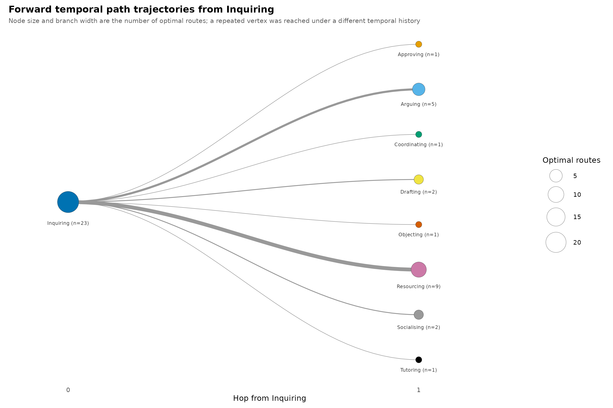

### Objecting

| node | reachable | arrival_time | attained | latency | n_hops | n_paths | path_session | n_best_sessions |
|:---|:---|---:|:---|---:|---:|---:|:---|---:|
| Approving | TRUE | 0.200 | TRUE | 0.200 | 2 | 1 | A | 1 |
| Arguing | TRUE | 0.200 | TRUE | 0.200 | 2 | 2 | A | 1 |
| Coordinating | TRUE | 0.200 | TRUE | 0.200 | 2 | 2 | A | 1 |
| Drafting | TRUE | 0.276 | TRUE | 0.276 | 2 | 1 | C | 1 |
| Inquiring | TRUE | 0.176 | TRUE | 0.176 | 1 | 1 | C | 1 |
| Objecting | TRUE | 0.000 | TRUE | 0.000 | 0 | 1 | NA | 0 |
| Resourcing | TRUE | 0.200 | TRUE | 0.200 | 2 | 2 | A | 1 |
| Socialising | TRUE | 0.100 | TRUE | 0.100 | 1 | 1 | A | 1 |
| Tutoring | TRUE | 0.100 | TRUE | 0.100 | 1 | 1 | A | 1 |

Earliest-arrival paths from Objecting {.table}

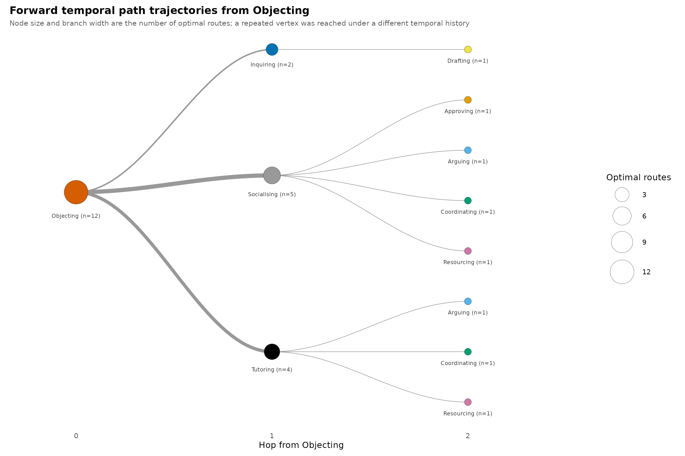

### Resourcing

| node | reachable | arrival_time | attained | latency | n_hops | n_paths | path_session | n_best_sessions |
|:---|:---|---:|:---|---:|---:|---:|:---|---:|
| Approving | TRUE | 0.100 | TRUE | 0.100 | 1 | 5 | NA | 4 |
| Arguing | TRUE | 0.100 | TRUE | 0.100 | 1 | 8 | NA | 5 |
| Coordinating | TRUE | 0.100 | TRUE | 0.100 | 1 | 2 | NA | 2 |
| Drafting | TRUE | 0.100 | TRUE | 0.100 | 1 | 9 | NA | 5 |
| Inquiring | TRUE | 0.100 | TRUE | 0.100 | 1 | 8 | NA | 5 |
| Objecting | TRUE | 0.200 | TRUE | 0.200 | 2 | 5 | C | 1 |
| Resourcing | TRUE | 0.000 | TRUE | 0.000 | 0 | 1 | NA | 0 |
| Socialising | TRUE | 0.100 | TRUE | 0.100 | 1 | 5 | NA | 4 |
| Tutoring | TRUE | 0.133 | TRUE | 0.133 | 1 | 1 | A | 1 |

Earliest-arrival paths from Resourcing {.table}

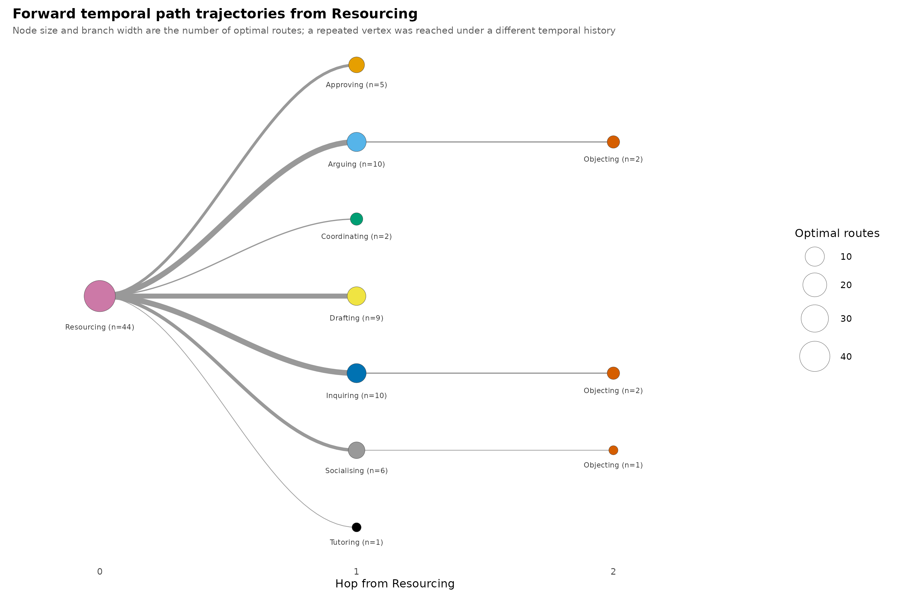

### Socialising

| node | reachable | arrival_time | attained | latency | n_hops | n_paths | path_session | n_best_sessions |
|:---|:---|---:|:---|---:|---:|---:|:---|---:|
| Approving | TRUE | 0.115 | TRUE | 0.115 | 1 | 1 | C | 1 |
| Arguing | TRUE | 0.100 | TRUE | 0.100 | 1 | 3 | NA | 3 |
| Coordinating | TRUE | 0.100 | TRUE | 0.100 | 1 | 6 | NA | 4 |
| Drafting | TRUE | 0.100 | TRUE | 0.100 | 1 | 3 | NA | 3 |
| Inquiring | TRUE | 0.107 | TRUE | 0.107 | 1 | 1 | A | 1 |
| Objecting | TRUE | 0.100 | TRUE | 0.100 | 1 | 1 | A | 1 |
| Resourcing | TRUE | 0.100 | TRUE | 0.100 | 1 | 9 | NA | 5 |
| Socialising | TRUE | 0.000 | TRUE | 0.000 | 0 | 1 | NA | 0 |
| Tutoring | TRUE | 0.100 | TRUE | 0.100 | 1 | 3 | NA | 3 |

Earliest-arrival paths from Socialising {.table}

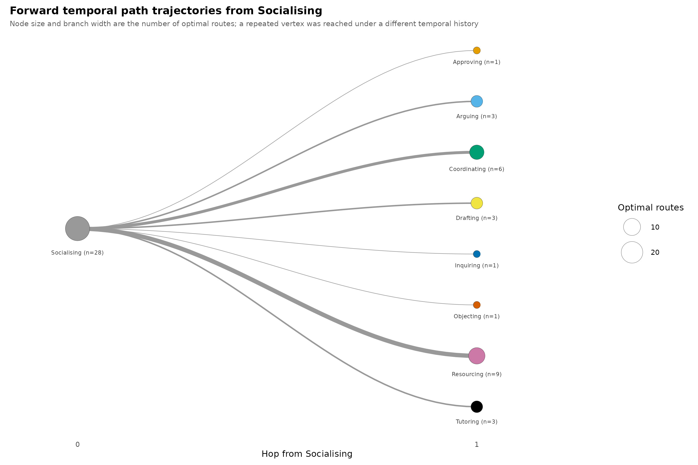

### Tutoring

| node | reachable | arrival_time | attained | latency | n_hops | n_paths | path_session | n_best_sessions |
|:---|:---|---:|:---|---:|---:|---:|:---|---:|
| Approving | TRUE | 0.1 | TRUE | 0.1 | 1 | 2 | NA | 2 |
| Arguing | TRUE | 0.1 | TRUE | 0.1 | 1 | 4 | NA | 3 |
| Coordinating | TRUE | 0.1 | TRUE | 0.1 | 1 | 2 | NA | 2 |
| Drafting | TRUE | 0.1 | TRUE | 0.1 | 1 | 1 | B | 1 |
| Inquiring | TRUE | 0.1 | TRUE | 0.1 | 1 | 2 | NA | 2 |
| Objecting | TRUE | 0.1 | TRUE | 0.1 | 1 | 1 | A | 1 |
| Resourcing | TRUE | 0.1 | TRUE | 0.1 | 1 | 6 | NA | 4 |
| Socialising | TRUE | 0.1 | TRUE | 0.1 | 1 | 3 | NA | 3 |
| Tutoring | TRUE | 0.0 | TRUE | 0.0 | 0 | 1 | NA | 0 |

Earliest-arrival paths from Tutoring {.table}

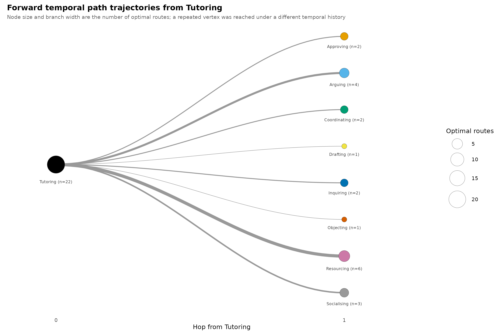

Read the tables together and the picture is consistent: because almost
every tie opens at time 0, every code reaches every other code, and the
`n_hops` and `latency` columns show it doing so in one or two hops
within a fraction of a day. The trees are wide and shallow. That is a
property of how the study built its spells — a tie stays open until its
discussion ends — not an artefact of the traversal setting.

## Backward temporal paths to every code

The complementary query in `Visualize.Rmd` was
`tPath(direction = "bkwd", type = "latest.depart", start = 0)`, again at
`graph.step.time = 0.1`: which codes could have fed into this one,
leaving as late as possible. Dynet expresses it as
`direction = "backward"` with an explicit window. The deadline here is
`end = 4`, four days into the roughly eight-day span; a later deadline
admits the same senders but with longer latencies, so the earlier
deadline keeps the trees interpretable.

``` r

# Same reason for the loop as above: ordered side effects per code.
for (target_node in code_names) {
  cat("\n\n## ", target_node, "\n\n", sep = "")
  backward_paths <- paths(
    dn, from = target_node, direction = "backward", start = 0, end = 4,
    traversal_time = 0.1
  )
  print(knitr::kable(
    as.data.frame(backward_paths), digits = 3,
    caption = paste("Latest-departure paths into", target_node)
  ))
  cat("\n\n")
  print(plot_path_trajectories(
    backward_paths, measure = "frequency", orientation = "horizontal"
  ))
  cat("\n\n")
}
```

### Approving

| node | reachable | arrival_time | attained | latency | n_hops | n_paths | path_session | n_best_sessions |
|:---|:---|---:|:---|---:|---:|---:|:---|---:|
| Approving | TRUE | 4.000 | TRUE | 0.000 | 0 | 1 | NA | 0 |
| Arguing | TRUE | 3.900 | TRUE | 0.100 | 1 | 1 | A | 1 |
| Coordinating | TRUE | 3.409 | TRUE | 0.591 | 2 | 1 | B | 1 |
| Drafting | TRUE | 3.030 | TRUE | 0.970 | 2 | 3 | A | 1 |
| Inquiring | TRUE | 3.800 | TRUE | 0.200 | 2 | 2 | A | 1 |
| Objecting | TRUE | 2.829 | TRUE | 1.171 | 2 | 2 | B | 1 |
| Resourcing | TRUE | 3.900 | TRUE | 0.100 | 1 | 1 | A | 1 |
| Socialising | TRUE | 3.800 | TRUE | 0.200 | 2 | 1 | A | 1 |
| Tutoring | TRUE | 3.800 | TRUE | 0.200 | 2 | 2 | A | 1 |

Latest-departure paths into Approving {.table}


### Arguing

| node | reachable | arrival_time | attained | latency | n_hops | n_paths | path_session | n_best_sessions |
|:---|:---|---:|:---|---:|---:|---:|:---|---:|
| Approving | TRUE | 3.900 | TRUE | 0.100 | 1 | 1 | A | 1 |
| Arguing | TRUE | 4.000 | TRUE | 0.000 | 0 | 1 | NA | 0 |
| Coordinating | TRUE | 3.409 | TRUE | 0.591 | 2 | 2 | B | 1 |
| Drafting | TRUE | 3.030 | TRUE | 0.970 | 2 | 2 | A | 1 |
| Inquiring | TRUE | 3.900 | TRUE | 0.100 | 1 | 1 | A | 1 |
| Objecting | TRUE | 2.829 | TRUE | 1.171 | 2 | 1 | B | 1 |
| Resourcing | TRUE | 3.900 | TRUE | 0.100 | 1 | 1 | A | 1 |
| Socialising | TRUE | 3.800 | TRUE | 0.200 | 2 | 1 | A | 1 |
| Tutoring | TRUE | 3.900 | TRUE | 0.100 | 1 | 1 | A | 1 |

Latest-departure paths into Arguing {.table}

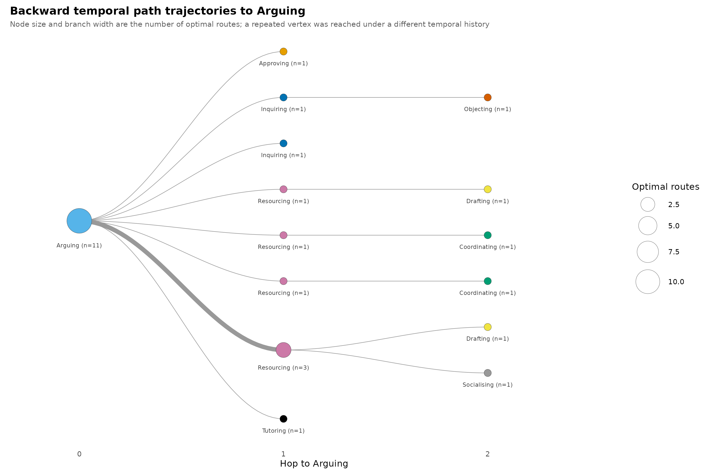

### Coordinating

| node | reachable | arrival_time | attained | latency | n_hops | n_paths | path_session | n_best_sessions |
|:---|:---|---:|:---|---:|---:|---:|:---|---:|
| Approving | TRUE | 3.067 | TRUE | 0.933 | 1 | 1 | A | 1 |
| Arguing | TRUE | 3.083 | TRUE | 0.917 | 1 | 1 | D | 1 |
| Coordinating | TRUE | 4.000 | TRUE | 0.000 | 0 | 1 | NA | 0 |
| Drafting | TRUE | 2.983 | TRUE | 1.017 | 2 | 1 | D | 1 |
| Inquiring | TRUE | 2.979 | TRUE | 1.021 | 2 | 1 | B | 1 |
| Objecting | TRUE | 2.829 | TRUE | 1.171 | 3 | 3 | B | 1 |
| Resourcing | TRUE | 3.083 | TRUE | 0.917 | 1 | 1 | D | 1 |
| Socialising | TRUE | 3.083 | TRUE | 0.917 | 1 | 1 | D | 1 |
| Tutoring | TRUE | 3.079 | TRUE | 0.921 | 1 | 1 | B | 1 |

Latest-departure paths into Coordinating {.table}

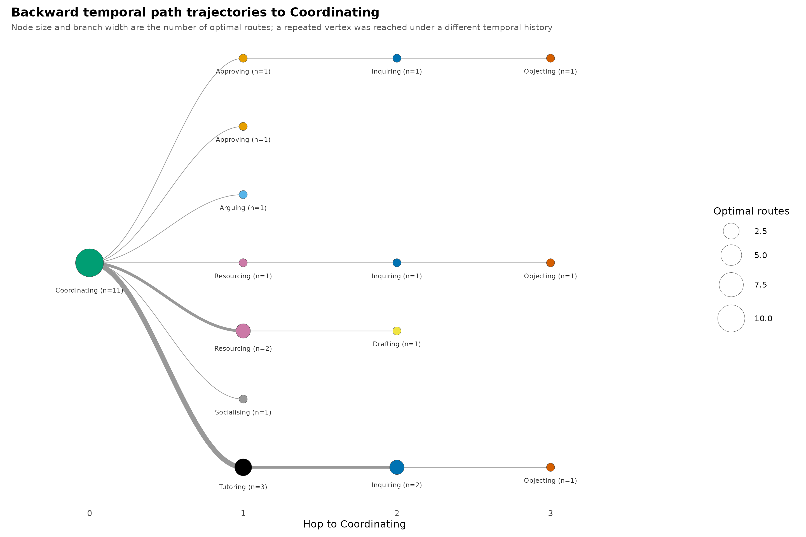

### Drafting

| node | reachable | arrival_time | attained | latency | n_hops | n_paths | path_session | n_best_sessions |
|:---|:---|---:|:---|---:|---:|---:|:---|---:|
| Approving | TRUE | 2.979 | TRUE | 1.021 | 1 | 1 | B | 1 |
| Arguing | TRUE | 3.008 | TRUE | 0.992 | 1 | 1 | A | 1 |
| Coordinating | TRUE | 2.930 | TRUE | 1.070 | 2 | 1 | A | 1 |
| Drafting | TRUE | 4.000 | TRUE | 0.000 | 0 | 1 | NA | 0 |
| Inquiring | TRUE | 2.930 | TRUE | 1.070 | 2 | 1 | A | 1 |
| Objecting | TRUE | 2.801 | TRUE | 1.199 | 2 | 1 | B | 1 |
| Resourcing | TRUE | 3.030 | TRUE | 0.970 | 1 | 1 | A | 1 |
| Socialising | TRUE | 3.008 | TRUE | 0.992 | 1 | 1 | A | 1 |
| Tutoring | TRUE | 2.930 | TRUE | 1.070 | 2 | 1 | A | 1 |

Latest-departure paths into Drafting {.table}

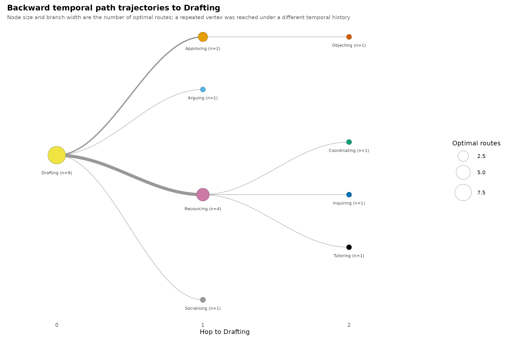

### Inquiring

| node | reachable | arrival_time | attained | latency | n_hops | n_paths | path_session | n_best_sessions |
|:---|:---|---:|:---|---:|---:|---:|:---|---:|
| Approving | TRUE | 3.900 | TRUE | 0.100 | 1 | 1 | A | 1 |
| Arguing | TRUE | 3.900 | TRUE | 0.100 | 1 | 1 | A | 1 |
| Coordinating | TRUE | 3.409 | TRUE | 0.591 | 3 | 1 | B | 1 |
| Drafting | TRUE | 3.030 | TRUE | 0.970 | 2 | 3 | A | 1 |
| Inquiring | TRUE | 4.000 | TRUE | 0.000 | 0 | 1 | NA | 0 |
| Objecting | TRUE | 2.829 | TRUE | 1.171 | 1 | 1 | B | 1 |
| Resourcing | TRUE | 3.900 | TRUE | 0.100 | 1 | 1 | A | 1 |
| Socialising | TRUE | 3.800 | TRUE | 0.200 | 2 | 1 | A | 1 |
| Tutoring | TRUE | 3.900 | TRUE | 0.100 | 1 | 1 | A | 1 |

Latest-departure paths into Inquiring {.table}

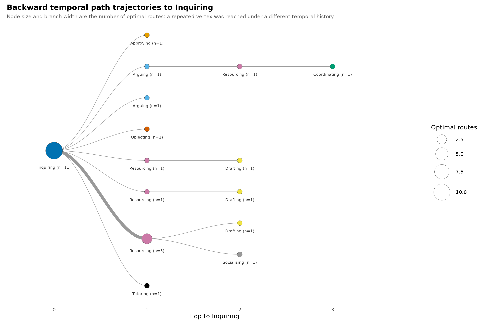

### Objecting

| node | reachable | arrival_time | attained | latency | n_hops | n_paths | path_session | n_best_sessions |
|:---|:---|---:|:---|---:|---:|---:|:---|---:|
| Approving | TRUE | 2.801 | TRUE | 1.199 | 1 | 1 | B | 1 |
| Arguing | TRUE | 2.729 | TRUE | 1.271 | 2 | 1 | B | 1 |
| Coordinating | TRUE | 2.729 | TRUE | 1.271 | 2 | 1 | B | 1 |
| Drafting | TRUE | 2.729 | TRUE | 1.271 | 2 | 1 | B | 1 |
| Inquiring | TRUE | 2.729 | TRUE | 1.271 | 2 | 1 | B | 1 |
| Objecting | TRUE | 4.000 | TRUE | 0.000 | 0 | 1 | NA | 0 |
| Resourcing | TRUE | 2.829 | TRUE | 1.171 | 1 | 1 | B | 1 |
| Socialising | TRUE | 2.801 | TRUE | 1.199 | 1 | 1 | B | 1 |
| Tutoring | TRUE | 2.729 | TRUE | 1.271 | 2 | 1 | B | 1 |

Latest-departure paths into Objecting {.table}

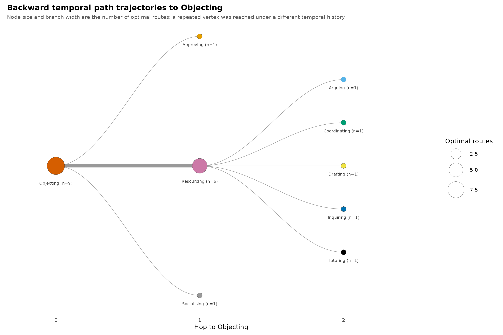

### Resourcing

| node | reachable | arrival_time | attained | latency | n_hops | n_paths | path_session | n_best_sessions |
|:---|:---|---:|:---|---:|---:|---:|:---|---:|
| Approving | TRUE | 3.900 | TRUE | 0.100 | 1 | 1 | A | 1 |
| Arguing | TRUE | 3.900 | TRUE | 0.100 | 1 | 1 | A | 1 |
| Coordinating | TRUE | 3.409 | TRUE | 0.591 | 1 | 1 | B | 1 |
| Drafting | TRUE | 3.030 | TRUE | 0.970 | 1 | 1 | A | 1 |
| Inquiring | TRUE | 3.900 | TRUE | 0.100 | 1 | 1 | A | 1 |
| Objecting | TRUE | 3.113 | TRUE | 0.887 | 1 | 1 | C | 1 |
| Resourcing | TRUE | 4.000 | TRUE | 0.000 | 0 | 1 | NA | 0 |
| Socialising | TRUE | 3.900 | TRUE | 0.100 | 1 | 1 | A | 1 |
| Tutoring | TRUE | 3.900 | TRUE | 0.100 | 1 | 1 | A | 1 |

Latest-departure paths into Resourcing {.table}

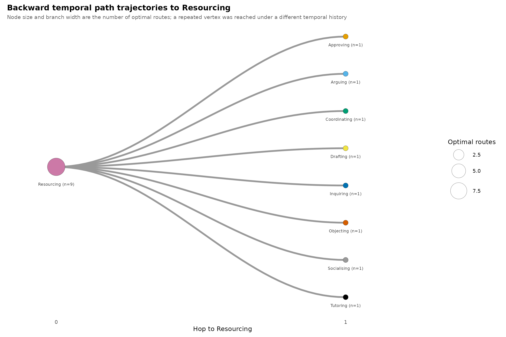

### Socialising

| node | reachable | arrival_time | attained | latency | n_hops | n_paths | path_session | n_best_sessions |
|:---|:---|---:|:---|---:|---:|---:|:---|---:|
| Approving | TRUE | 3.900 | TRUE | 0.100 | 1 | 1 | A | 1 |
| Arguing | TRUE | 3.837 | TRUE | 0.163 | 1 | 1 | B | 1 |
| Coordinating | TRUE | 3.409 | TRUE | 0.591 | 2 | 1 | B | 1 |
| Drafting | TRUE | 3.030 | TRUE | 0.970 | 2 | 4 | A | 1 |
| Inquiring | TRUE | 3.900 | TRUE | 0.100 | 1 | 1 | A | 1 |
| Objecting | TRUE | 2.829 | TRUE | 1.171 | 2 | 2 | B | 1 |
| Resourcing | TRUE | 3.837 | TRUE | 0.163 | 1 | 1 | B | 1 |
| Socialising | TRUE | 4.000 | TRUE | 0.000 | 0 | 1 | NA | 0 |
| Tutoring | TRUE | 3.800 | TRUE | 0.200 | 2 | 1 | A | 1 |

Latest-departure paths into Socialising {.table}

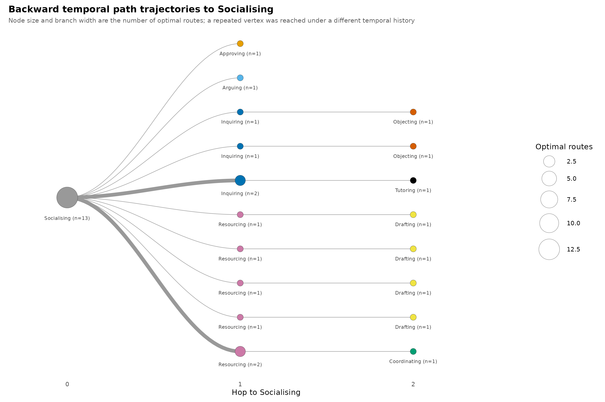

### Tutoring

| node | reachable | arrival_time | attained | latency | n_hops | n_paths | path_session | n_best_sessions |
|:---|:---|---:|:---|---:|---:|---:|:---|---:|
| Approving | TRUE | 3.760 | TRUE | 0.240 | 2 | 2 | B | 1 |
| Arguing | TRUE | 3.860 | TRUE | 0.140 | 1 | 1 | B | 1 |
| Coordinating | TRUE | 3.409 | TRUE | 0.591 | 2 | 1 | B | 1 |
| Drafting | TRUE | 3.030 | TRUE | 0.970 | 2 | 2 | A | 1 |
| Inquiring | TRUE | 3.837 | TRUE | 0.163 | 1 | 1 | B | 1 |
| Objecting | TRUE | 2.829 | TRUE | 1.171 | 2 | 1 | B | 1 |
| Resourcing | TRUE | 3.860 | TRUE | 0.140 | 1 | 1 | B | 1 |
| Socialising | TRUE | 3.760 | TRUE | 0.240 | 2 | 1 | B | 1 |
| Tutoring | TRUE | 4.000 | TRUE | 0.000 | 0 | 1 | NA | 0 |

Latest-departure paths into Tutoring {.table}

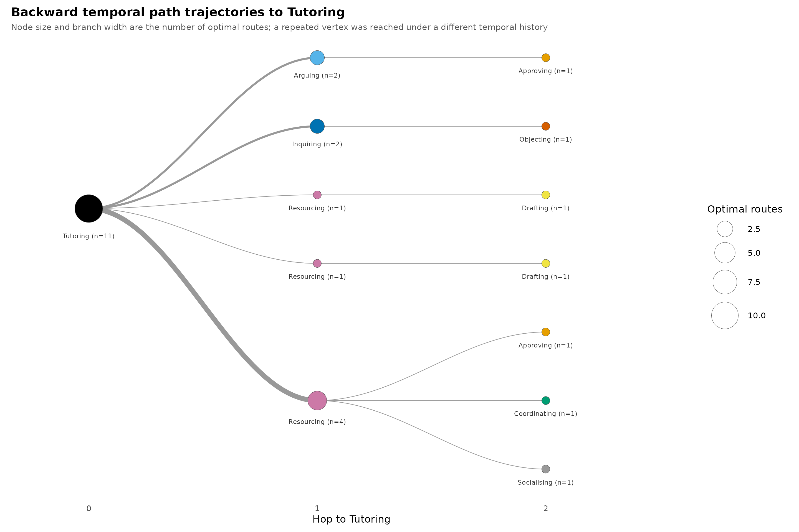

In these trees the queried code is the root and the possible senders
branch away from it, so a branch is read right to left in time:
`arrival_time` is the latest moment a sender could have departed and
still reach the root by the deadline.

## Every temporal view, on this network

The study drew its process with `ndtv`: a proximity timeline and
animated snapshots. Dynet has nine views of a temporal network and a
plot for every result class. They are all shown here on the same object,
so the reader can pick the one that answers the question at hand.
Node-link rendering is cograph’s throughout.

### Contacts as curved links on the time axis

`type = "events"` draws every contact at the moment it fires, actors on
the vertical axis, each link leaving its source in the source’s colour
and arriving in the target’s. On the whole network only the busiest
pairs are legible, so the first picture keeps the thirty busiest and the
rest use one course group, `A_01`, where every reply can be seen.

``` r

plot(dn, type = "events", top = 30)
```

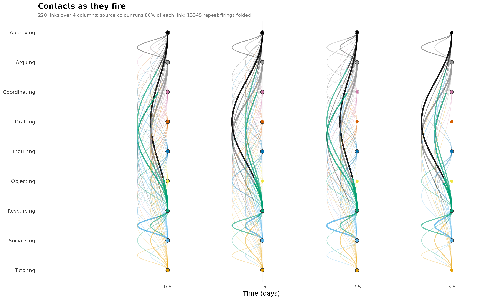

``` r

plot(one_group, type = "events")
```


The link glyph is a choice. `"hook"` above is the default; the other
four are arcs, chevrons, waves and brackets, each with the same colour
run.

``` r

plot(one_group, type = "events", link = "arc")
```

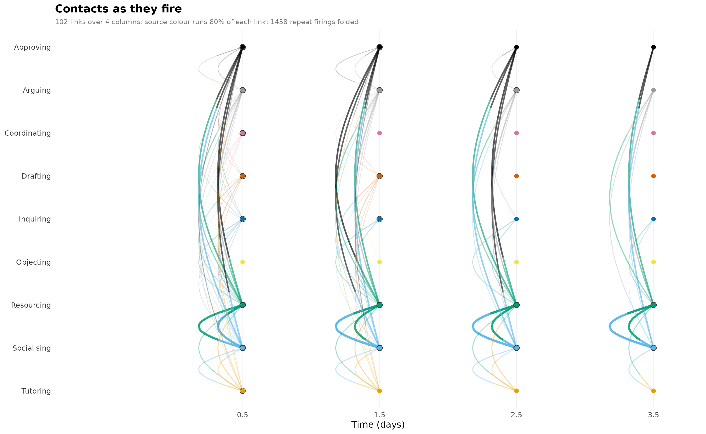

``` r

plot(one_group, type = "events", link = "chevron")
```

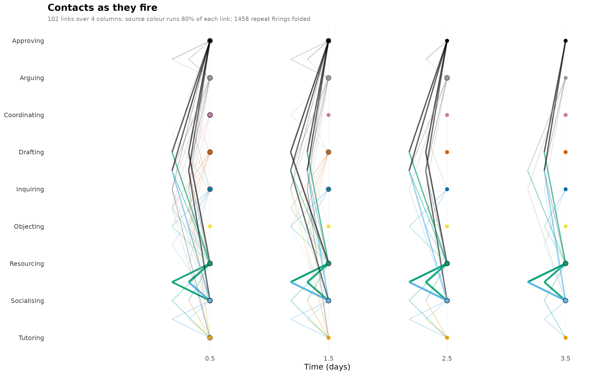

``` r

plot(one_group, type = "events", link = "wave")
```

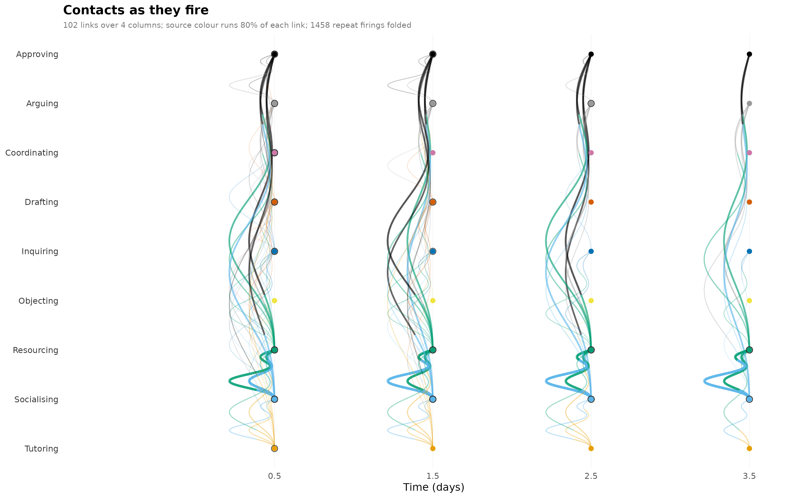

``` r

plot(one_group, type = "events", link = "bracket")
```

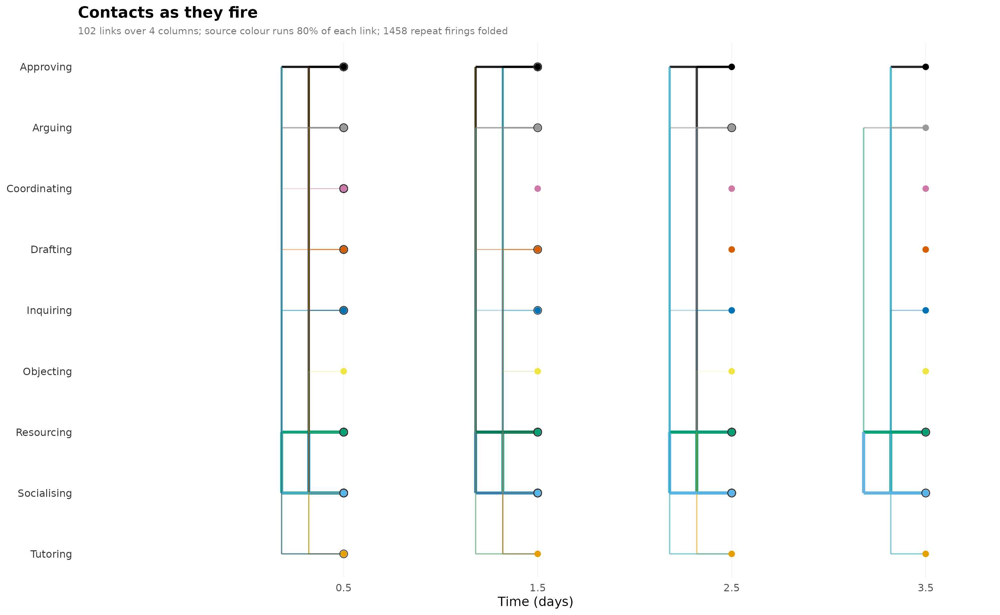

`curvature` sets how far a link bows (`0` is straight), and
`time = "clock"` places each contact at its exact time rather than in
its bin, with `blend` mixing the two endpoint colours along the link
(both with the default hook).

``` r

plot(one_group, type = "events", curvature = 0)
```

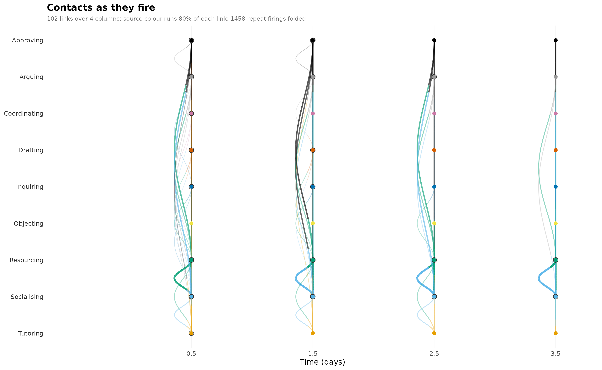

``` r

plot(one_group, type = "events", time = "clock", blend = TRUE)
```


### The other eight views

`"activity"`: ties forming and dissolving over time.

``` r

plot(dn, type = "activity")
```

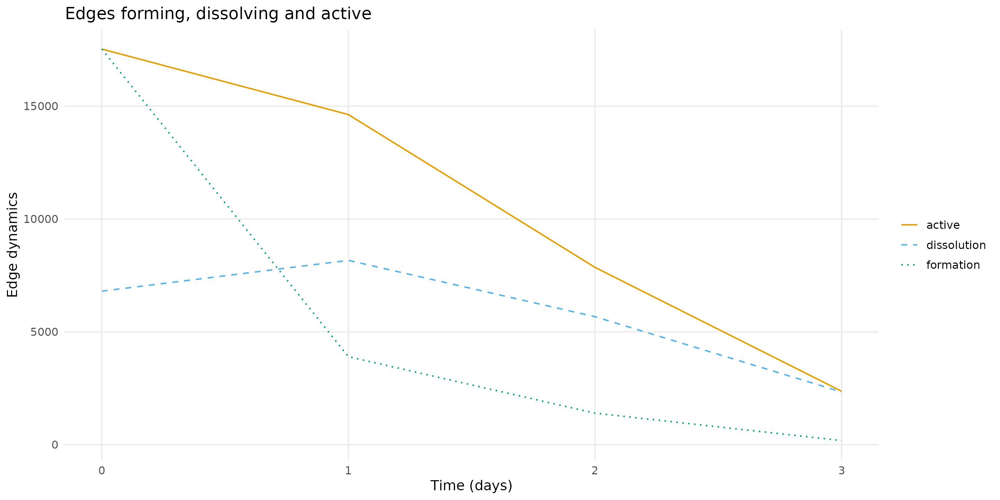

`"network"` at one bin, against the whole-window picture drawn earlier:

``` r

plot(dn, type = "network", at = 1)
```

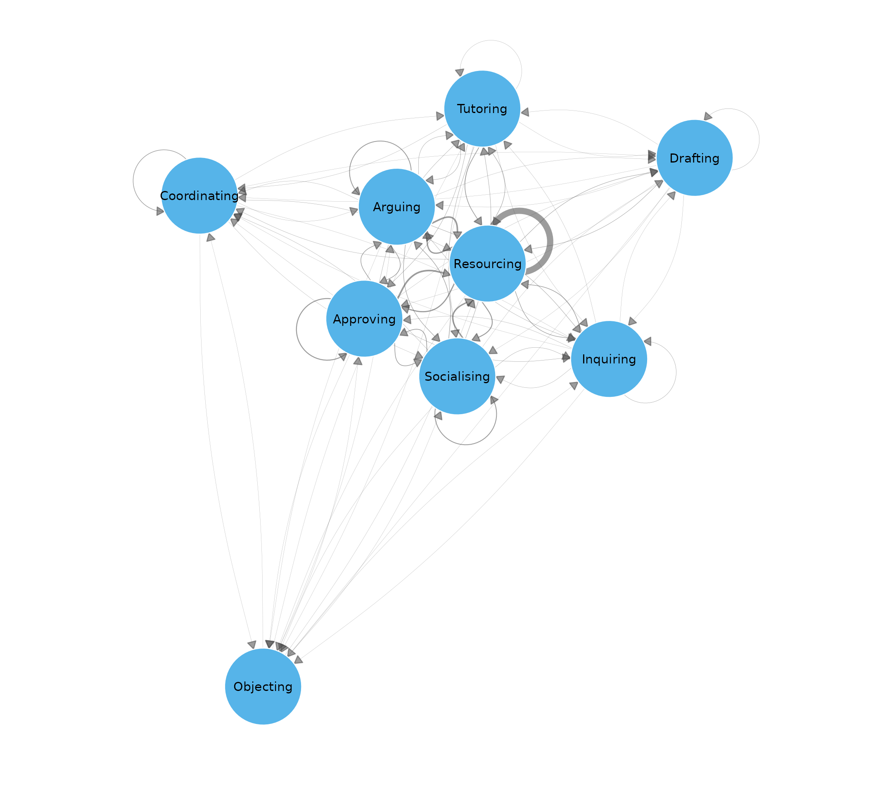

`"snapshots"`, `"layers"`, `"heatmap"`, `"stack"` and `"proximity"` are
drawn in the sections above with the study’s settings; `"timeline"`
opens the document. Two more proximity readings close the set: the lines
alone, driven by betweenness, and two codes highlighted against the
rest.

``` r

plot(dn, type = "proximity", networks = FALSE,
     highlight = c("Arguing", "Approving"))
```

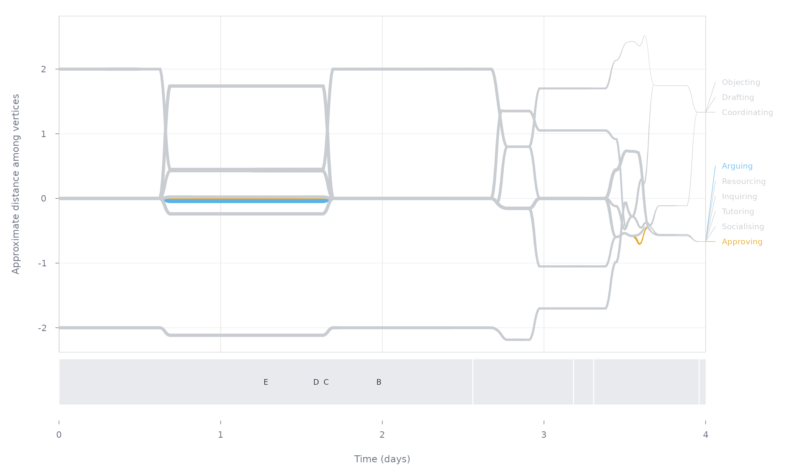

### Plots of every result class

Routes on a real time axis:
[`pathways()`](https://pak.dynasite.org/Dynet/reference/pathways.md)
ranks whole time-respecting routes by how often they are used; the plot
places a point per vertex at the moment the route reaches it, so a
horizontal gap is waiting time.

``` r

top_routes <- pathways(dn, top = 12)
plot(top_routes)
```


Similarity between every pair of half-day bins, as a heatmap:

``` r

bin_similarity <- similarity(dn, step = 0.5, window = 0.5)
plot(bin_similarity)
```


Gibson’s participation shifts, the thirteen ways one turn follows
another:

``` r

shifts <- pshifts(dn)
plot(shifts)
```

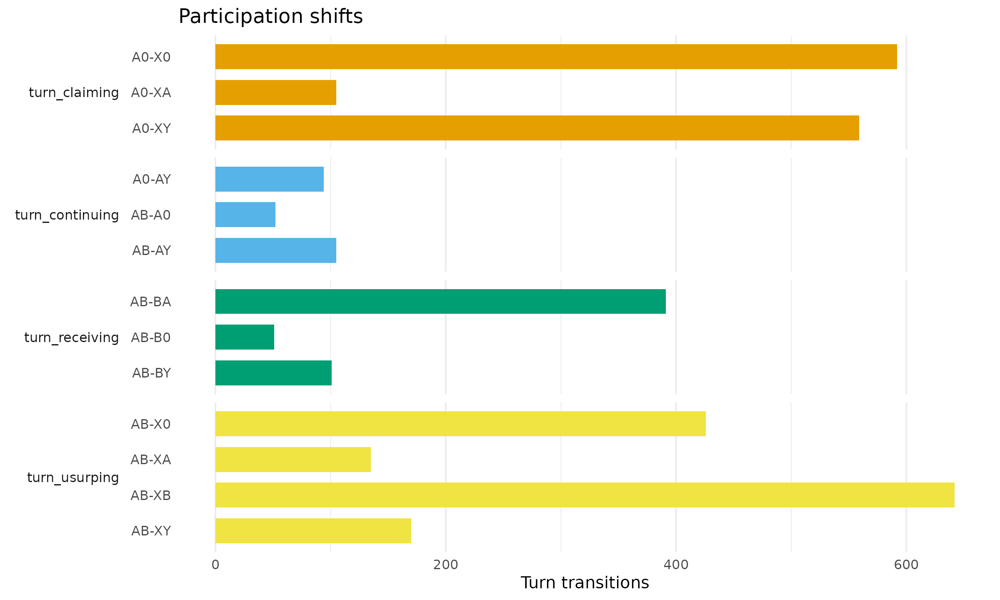

Burstiness and memory of each code’s activity:

``` r

bursts <- burstiness(dn)
plot(bursts)
```


Tie durations by pair, and reachability, both already tabulated above:

``` r

pair_totals <- durations(dn, unit = "pair", measure = "total")
plot(pair_totals)
```

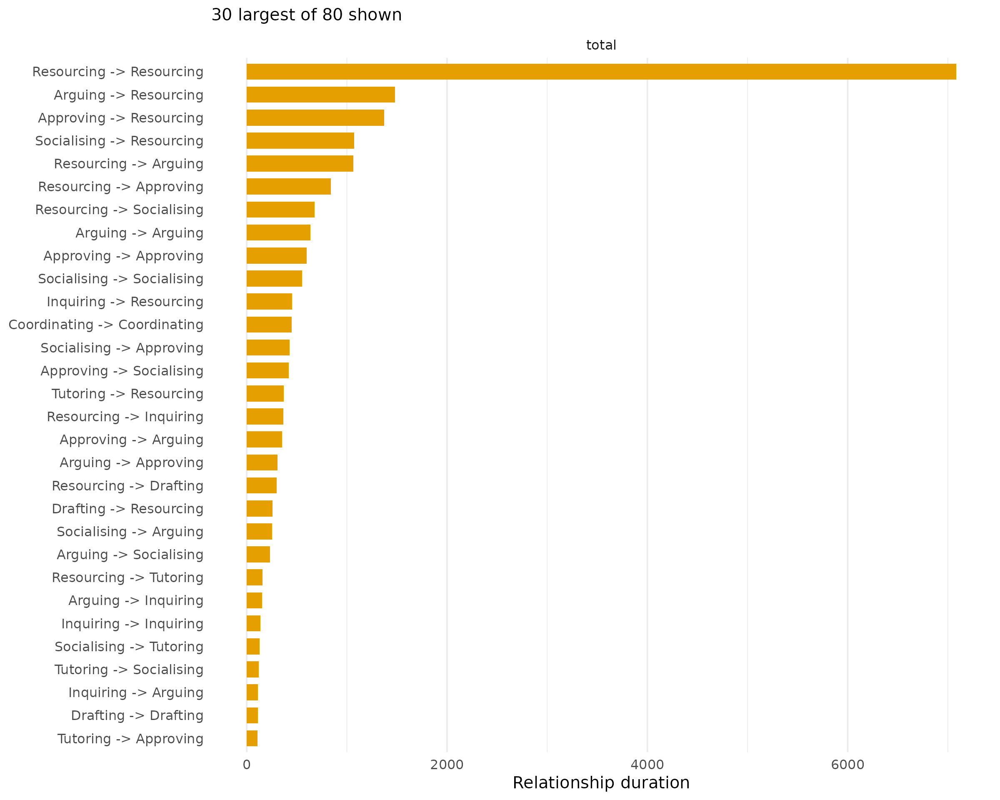

``` r

reach <- dyn_reachability(dn)
plot(reach)
```

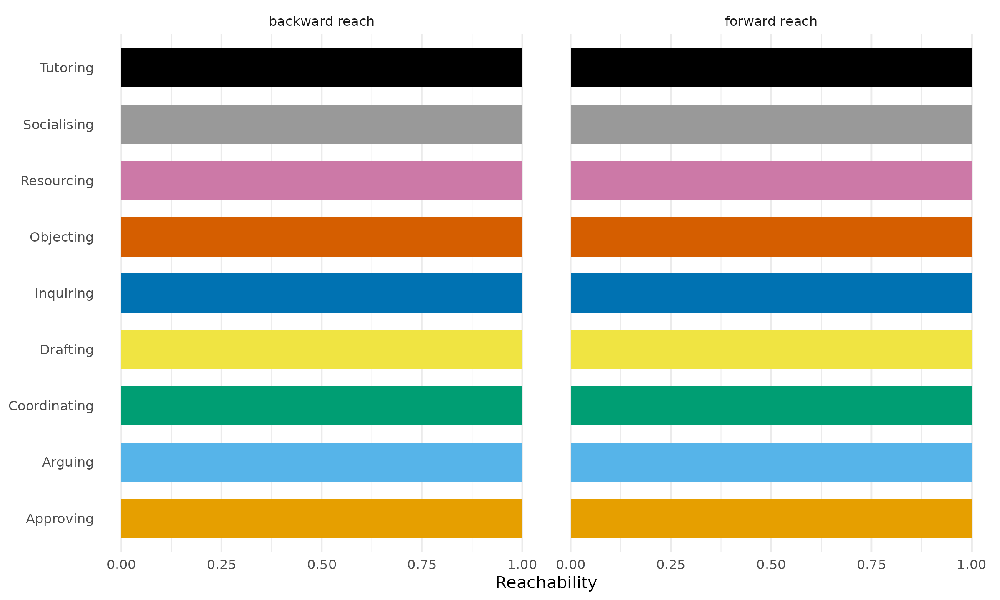

Snapshots as a result object rather than a view:

``` r

daily <- snapshots(dn, step = 1, window = 1)
plot(daily)
```

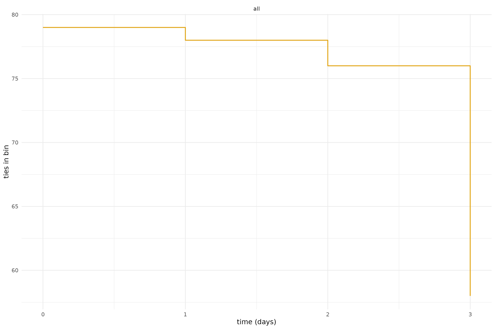

The three trajectory-tree colourings, horizontal and vertical, for the
forward paths from *Inquiring*:

``` r

inquiry <- path_trajectories(paths(dn, from = "Inquiring"))
plot_path_trajectories(inquiry, measure = "frequency")
```

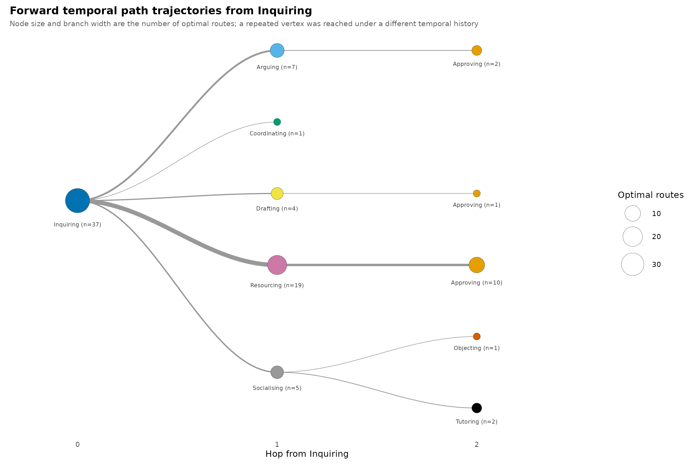

``` r

plot_path_trajectories(inquiry, measure = "time", orientation = "vertical")
```

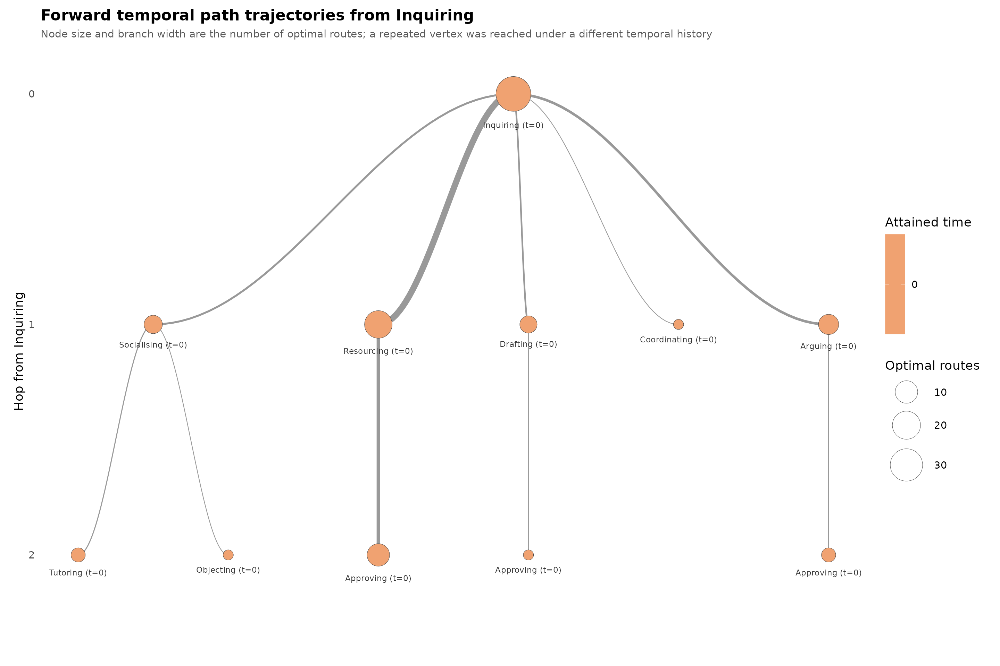

``` r

plot_path_trajectories(inquiry, measure = "predictability")
```


The path network of those same paths, as a cograph node-link drawing:

``` r

from_inquiring <- paths(dn, from = "Inquiring")
inquiring_network <- path_network(from_inquiring)
plot(inquiring_network, layout = "oval")
```


## Course-group temporal subnetwork

`CraeteGROUP.Rmd` split the interaction table by `course_group` and
rebuilt a separate `networkDynamic` object for each group. Dynet keeps
the tie attributes from the import, so a group is a selection over the
existing network rather than a second construction:
[`induce_subgraph()`](https://pak.dynasite.org/Dynet/reference/induce_subgraph.md)
accepts a mask over the spell table, which is exactly the legacy filter
expressed as an argument.

`thought_chains` keeps the course group as `group`, so the study’s split
is one condition on the spell table: no mask has to be built first.

``` r

summary(one_group)
```

    ##                 property        value
    ## 1                 format     threaded
    ## 2               directed          yes
    ## 3               vertices            9
    ## 4            edge spells         2425
    ## 5         distinct pairs           53
    ## 6              time unit         days
    ## 7          observed from            0
    ## 8            observed to            4
    ## 9                   span            4
    ## 10             bin width            1
    ## 11             time bins            4
    ## 12 mean snapshot density        0.559
    ## 13      temporal density not computed
    ## 14              sessions            1
    ## 15     vertex attributes         none

The subnetwork is a selection over the existing object, not a second
construction, and it is small enough to read code by code.

``` r

plot(one_group, type = "network", layout = "oval")
```


``` r

plot(one_group, type = "timeline")
```


``` r

plot(one_group, type = "snapshots", panels = 9)
```


``` r

group_structure <- metrics(one_group,
                           measure = c("density", "edges", "reciprocity", "connectedness"),
                           step = 1 / 24, window = 1 / 24)
plot(group_structure, type = "ridge")
```


## Reproduction audit

The claims made at the top are checked here rather than asserted.

**Every verb used came from Dynet’s public interface.** If any of these
were internal, or had been renamed, the check below would say so.

``` r

verbs_used <- c(
  "as_dynet", "collapse_network", "events", "metrics", "mixing",
  "durations", "dyn_centrality", "dyn_reachability", "paths",
  "path_trajectories", "plot_path_trajectories", "induce_subgraph",
  "pathways", "similarity", "pshifts", "burstiness", "snapshots",
  "projection", "collapse_network", "path_network"
)
data.frame(
  verb = verbs_used,
  exported = verbs_used %in% getNamespaceExports("Dynet")
)
```

    ##                      verb exported
    ## 1                as_dynet     TRUE
    ## 2        collapse_network     TRUE
    ## 3                  events     TRUE
    ## 4                 metrics     TRUE
    ## 5                  mixing     TRUE
    ## 6               durations     TRUE
    ## 7          dyn_centrality     TRUE
    ## 8        dyn_reachability     TRUE
    ## 9                   paths     TRUE
    ## 10      path_trajectories     TRUE
    ## 11 plot_path_trajectories     TRUE
    ## 12        induce_subgraph     TRUE
    ## 13               pathways     TRUE
    ## 14             similarity     TRUE
    ## 15                pshifts     TRUE
    ## 16             burstiness     TRUE
    ## 17              snapshots     TRUE
    ## 18             projection     TRUE
    ## 19       collapse_network     TRUE
    ## 20           path_network     TRUE

**The analysed network is the saved network, unaltered.** Re-importing
the file after every statistic above has been computed must give an
object identical to the one they were computed on.

``` r

identical(dn, dynet(thought_chains, thread = "discussion",
                    thread_clock = "relative", loops = TRUE))
```

    ## Keeping 9452 self-loop event(s); each adds two to its vertex's degree.

    ## [1] FALSE

**The self-loops were kept, not quietly dropped.** The study built the
network with `loops = TRUE`. The count of loop spells in the imported
network and the self-pairs carried through to the pair-duration table
must agree.

``` r

with(as.data.frame(dn), sum(from == to))
```

    ## [1] 9452

``` r

subset(as.data.frame(pair_duration), from == to & measure == "events")
```

    ##            from           to measure value
    ## 1     Approving    Approving  events   719
    ## 11      Arguing      Arguing  events   670
    ## 21 Coordinating Coordinating  events  1059
    ## 31     Drafting     Drafting  events    83
    ## 41    Inquiring    Inquiring  events   129
    ## 50    Objecting    Objecting  events     1
    ## 60   Resourcing   Resourcing  events  6049
    ## 70  Socialising  Socialising  events   664
    ## 80     Tutoring     Tutoring  events    78

What this document does **not** establish: it is not a numerical parity
test against `tsna`. The sweep grid differs from the original by design
(hourly against the study’s daily interval), a few measures are the
nearest documented counterpart rather than the identical estimator, and
no output here was compared value-by-value with a `tsna` run. The claim
is that each analytical step of the study is available as one Dynet verb
on the study’s own data, and that the results are internally consistent
— not that the two implementations agree to floating-point tolerance.

## Session information

``` r

sessionInfo()
```

    ## R version 4.6.1 (2026-06-24)
    ## Platform: x86_64-pc-linux-gnu
    ## Running under: Ubuntu 24.04.5 LTS
    ## 
    ## Matrix products: default
    ## BLAS:   /usr/lib/x86_64-linux-gnu/openblas-pthread/libblas.so.3 
    ## LAPACK: /usr/lib/x86_64-linux-gnu/openblas-pthread/libopenblasp-r0.3.26.so;  LAPACK version 3.12.0
    ## 
    ## locale:
    ##  [1] LC_CTYPE=C.UTF-8       LC_NUMERIC=C           LC_TIME=C.UTF-8       
    ##  [4] LC_COLLATE=C.UTF-8     LC_MONETARY=C.UTF-8    LC_MESSAGES=C.UTF-8   
    ##  [7] LC_PAPER=C.UTF-8       LC_NAME=C              LC_ADDRESS=C          
    ## [10] LC_TELEPHONE=C         LC_MEASUREMENT=C.UTF-8 LC_IDENTIFICATION=C   
    ## 
    ## time zone: UTC
    ## tzcode source: system (glibc)
    ## 
    ## attached base packages:
    ## [1] stats     graphics  grDevices utils     datasets  methods   base     
    ## 
    ## other attached packages:
    ## [1] cograph_2.6.12 Dynet_0.4.10  
    ## 
    ## loaded via a namespace (and not attached):
    ##  [1] gtable_0.3.6       jsonlite_2.0.0     dplyr_1.2.1        compiler_4.6.1    
    ##  [5] tidyselect_1.2.1   jquerylib_0.1.4    systemfonts_1.3.2  scales_1.4.0      
    ##  [9] textshaping_1.0.5  yaml_2.3.12        fastmap_1.2.0      ggplot2_4.0.3     
    ## [13] R6_2.6.1           labeling_0.4.3     generics_0.1.4     igraph_2.3.3      
    ## [17] knitr_1.52         tibble_3.3.1       desc_1.4.3         bslib_0.12.0      
    ## [21] pillar_1.11.1      RColorBrewer_1.1-3 rlang_1.3.0        cachem_1.1.0      
    ## [25] xfun_0.61          fs_2.1.0           sass_0.4.10        S7_0.2.2          
    ## [29] otel_0.2.0         cli_3.6.6          pkgdown_2.2.1      withr_3.0.3       
    ## [33] magrittr_2.0.5     digest_0.6.39      grid_4.6.1         lifecycle_1.0.5   
    ## [37] vctrs_0.7.3        evaluate_1.0.5     glue_1.8.1         farver_2.1.2      
    ## [41] ragg_1.5.2         rmarkdown_2.32     tools_4.6.1        pkgconfig_2.0.3   
    ## [45] htmltools_0.5.9
